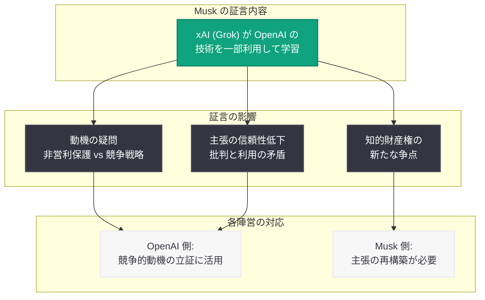
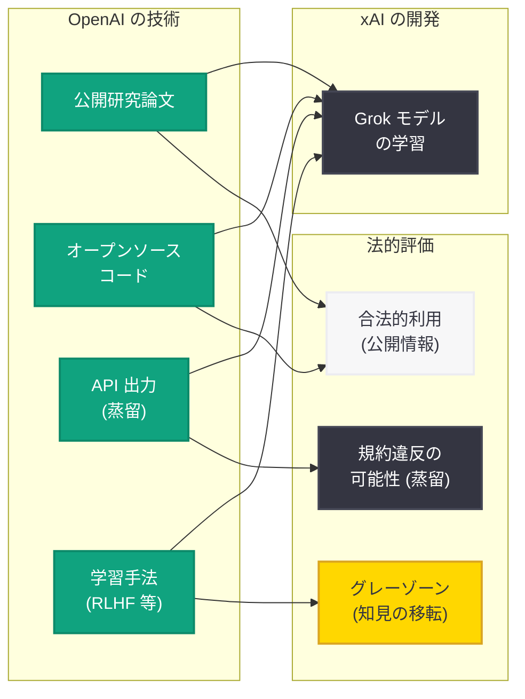
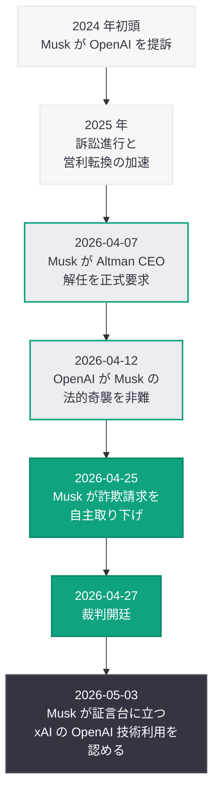

# Musk が証言台で xAI モデルが OpenAI 技術を一部利用して学習されたことを認める

## メタデータ

| 項目 | 内容 |
|------|------|
| 発表日 | 2026-05-03 |
| ソース | OpenAI News (Third-party coverage: Mashable, MSN, Investing.com) |
| カテゴリ | 法務 / 企業ニュース |
| 公式リンク | [Mashable](https://mashable.com/), [MSN](https://www.msn.com/) |

## 概要

2026 年 5 月 3 日、Elon Musk が OpenAI 対 Musk 裁判の証言台に立ち、自身が率いる xAI のモデル (Grok) が OpenAI の技術を一部利用して学習されたことを認めた。この証言は、Musk が OpenAI の営利転換を「人類全体の利益に対する裏切り」と批判しながら、同時に自社の AI モデル開発において OpenAI の技術に依拠していたことを示すものであり、裁判における Musk 側の主張の信頼性に重大な影響を与える可能性がある。

MSN は「Elon Musk says his xAI startup's models were partially trained on OpenAI's tech」と報じ、Mashable は「Elon Musk on the witness stand: here's what he said about OpenAI」として証言の詳細を伝えた。この証言は、4 月 27 日に開廷した $1800 億超の裁判において最も注目を集める展開の一つとなっている。

## 主な内容

### Musk の証言台での発言

Musk は証言台において、xAI が開発する Grok モデルの学習過程で OpenAI の技術が一部利用されたことを認めた。具体的にどの技術がどの程度利用されたかの詳細は裁判の非公開部分で審議されているが、この証言は公開法廷で行われ、複数のメディアによって報道された。

Mashable の報道によれば、Musk は証言台で OpenAI に関する複数の質問に応じており、xAI と OpenAI の技術的関係に関する質問に対して、部分的な利用を認める証言を行った。この証言は、OpenAI 側の弁護団による反対尋問の中で引き出されたものと見られる。

### 証言の法的意義

この証言が持つ法的意義は極めて大きい。Musk は OpenAI の営利転換を批判し、OpenAI が「人類全体の利益のための AI 開発」という非営利ミッションを放棄したと主張している。しかし、Musk 自身が xAI において OpenAI の技術を利用していたという事実は、以下の点で Musk 側の主張を弱体化させる可能性がある。

1. **動機の疑問:** Musk の訴訟動機が非営利ミッションの保護ではなく、競合企業の弱体化にある可能性を裏付ける
2. **清廉性の毀損:** OpenAI の技術を批判しながら自社で利用していたことは、Musk の主張の誠実さに疑問を投げかける
3. **知的財産権の問題:** xAI が OpenAI の技術を利用したことが知的財産権の観点で適法であったかどうかという新たな争点が浮上する

### OpenAI 側の反論における活用

OpenAI 側は、Musk の証言を以下の反論に活用すると見られる。

- **競争的動機の立証:** Musk が xAI の CEO として OpenAI と直接競合している事実に加え、OpenAI の技術を利用して競合モデルを開発していたことは、訴訟の動機が競争的なものであることを強く示唆する
- **xAI の利益相反:** Musk は OpenAI の非営利ミッション保護を訴えながら、自身の営利企業 xAI のために OpenAI の技術的成果を利用していた矛盾を指摘
- **裁判の正当性への疑問:** OpenAI の営利転換を問題視する Musk が、自社の営利活動のために OpenAI の技術を利用していたことは、訴訟全体の正当性に疑問を呈する

### Musk 側の立場

Musk 側としては、xAI が OpenAI の技術を利用したことについて、以下のような弁明を行う可能性がある。

- OpenAI の技術の一部はオープンソースとして公開されており、その利用は合法的かつ正当である
- xAI による利用は限定的であり、Grok モデルの核心的な技術は独自に開発されたものである
- OpenAI が非営利ミッションの下で公開した技術を利用すること自体は、OpenAI の設立理念に沿うものである

しかし、これらの弁明は、OpenAI の営利転換を問題視する Musk の主張との整合性を保つことが困難であり、裁判における説得力は限定的であると見られる。

## 技術的な詳細

### xAI と OpenAI の技術的関係

xAI は 2023 年に Musk が設立した AI 企業であり、Grok と呼ばれる大規模言語モデルを開発している。xAI のチームには OpenAI の元研究者が複数在籍しており、技術的な知見の移転が行われてきたことは公知の事実である。

今回の証言で明らかになったのは、人材の移動に伴う知見の移転にとどまらず、OpenAI の技術そのものが xAI のモデル学習に一部利用されていたという点である。具体的な技術の範囲は以下の可能性が考えられる。

- **学習データ:** OpenAI が公開または生成したデータセットの利用
- **モデルアーキテクチャ:** OpenAI が公開した研究成果に基づく設計
- **学習手法:** RLHF (Reinforcement Learning from Human Feedback) などの手法の援用
- **API 出力:** OpenAI の API 出力を学習データとして利用 (蒸留)

### モデル蒸留の可能性

特に注目すべきは、OpenAI の API 出力を xAI のモデル学習に利用した「モデル蒸留 (model distillation)」の可能性である。これは OpenAI の利用規約で明確に禁止されている行為であり、仮にこの手法が用いられていた場合、Musk 側にとっては利用規約違反という追加のリスクが生じる。

## 裁判の経緯タイムライン

## 開発者への影響

この証言は直接的に開発者の日常業務に影響するものではないが、以下の点で間接的な影響が考えられる。

- **API 利用規約の厳格化:** xAI による OpenAI 技術利用の発覚を受け、OpenAI が API 利用規約における蒸留禁止条項をさらに厳格化する可能性がある
- **AI モデルの知的財産保護:** 大規模言語モデルの出力を競合モデルの学習に利用する行為に関する法的判例が形成される可能性があり、開発者が利用する AI サービスの利用条件に影響を及ぼしうる
- **マルチプロバイダー戦略の再考:** OpenAI と xAI (Grok) の技術的関係が明らかになったことで、モデル選定において両者の独立性や差別化要因を再評価する必要性が生じる
- **裁判結果への注視継続:** 裁判の結果が OpenAI の企業構造や API サービスの継続性に影響する可能性が引き続き存在するため、開発者はマルチプロバイダー戦略を維持することが推奨される

## 関連リンク

- [MSN: Elon Musk says his xAI startup's models were partially trained on OpenAI's tech](https://www.msn.com/)
- [Mashable: Elon Musk on the witness stand: here's what he said about OpenAI](https://mashable.com/)
- [Mashable: Elon Musk vs. Sam Altman: What to know as OpenAI trial opens](https://mashable.com/)
- [MSN: Musk and Altman head to trial in feud over future of OpenAI](https://www.msn.com/)
- [前回のレポート: Musk 対 Altman/OpenAI 裁判が開廷](2026-04-27-musk-altman-openai-trial-begins.md)
- [関連レポート: Musk が詐欺請求を自主取り下げ](2026-04-25-musk-drops-fraud-claims-openai-trial.md)
- [関連レポート: OpenAI、Musk の「法的奇襲」を非難](2026-04-12-musk-legal-ambush-openai-trial.md)

## まとめ

2026 年 5 月 3 日、Elon Musk が OpenAI 裁判の証言台で xAI のモデル (Grok) が OpenAI の技術を一部利用して学習されたことを認めた。この証言は、OpenAI の営利転換を「人類全体の利益に対する裏切り」と批判してきた Musk が、自身の営利企業 xAI において OpenAI の技術に依拠していたという矛盾を明らかにするものであり、裁判における Musk 側の主張の信頼性に重大な打撃を与える可能性がある。OpenAI 側は、この証言を Musk の訴訟動機が非営利ミッションの保護ではなく競争戦略であることの証拠として活用すると見られる。4 月 27 日の開廷から 1 週間、$1800 億超の企業価値が争われるこの裁判は、Musk の証言によって新たな局面を迎えた。裁判の今後の展開と判決が、OpenAI のみならず AI 業界全体のガバナンスと知的財産保護のあり方に先例を示すことになる。
