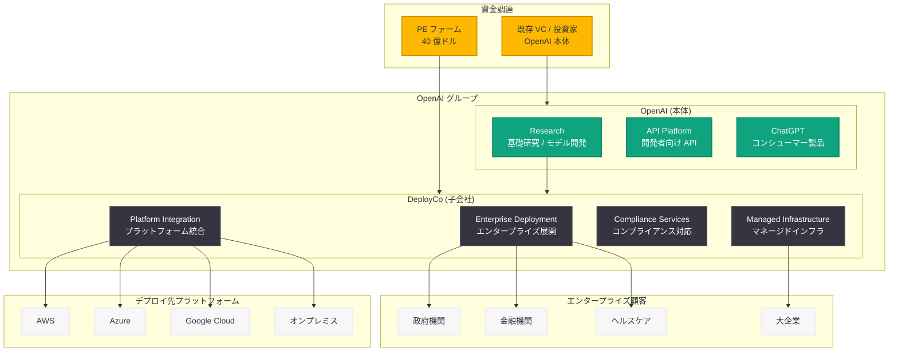

# OpenAI の子会社「DeployCo」が大手 PE ファームから 40 億ドルの資金調達に成功

## メタデータ

| 項目 | 内容 |
|------|------|
| 発表日 | 2026-05-03 |
| ソース | OpenAI News (Third-party coverage: Financial Times, pe-insights.com) |
| カテゴリ | 企業 / 資金調達 |
| 公式リンク | [pe-insights.com](https://pe-insights.com) |

## 概要

2026 年 5 月 3 日、Financial Times の報道によると、OpenAI のエンタープライズ AI デプロイメント子会社「DeployCo」が大手プライベートエクイティ (PE) ファームから 40 億ドル (約 6,000 億円) の資金調達を獲得した。

DeployCo は OpenAI 本体とは別の法人格を持つ子会社であり、企業向け AI デプロイメントおよびインフラストラクチャに特化した事業を展開するものと見られる。OpenAI が IPO および組織再編を進める中で、エンタープライズ向けデプロイメント事業を独立した事業体として切り出し、PE ファームからの大規模資金を確保したことは、OpenAI グループ全体の企業戦略における重要な転換点となる。

## 主な内容

### DeployCo の位置づけ

DeployCo は OpenAI のエンタープライズ AI デプロイメントに特化した子会社として設立されたと報じられている。OpenAI が近年推進してきた以下のエンタープライズ戦略を事業化・収益化するための専門組織と考えられる。

- **エンタープライズ AI インフラ:** 大規模企業向けの AI 基盤構築、デプロイメント支援
- **マネージドサービス:** API だけでなく、オンプレミス・プライベートクラウド環境での AI モデル展開
- **コンプライアンス対応:** FedRAMP 認証取得 (2026 年 3 月) に代表される政府・規制産業向けの展開
- **マルチクラウドデプロイメント:** AWS、Azure、Databricks など複数プラットフォームへのモデル配信

### 40 億ドルの資金調達の意義

今回の PE ファームからの 40 億ドル調達は、以下の観点で重要である。

| 観点 | 詳細 |
|------|------|
| 規模 | 40 億ドルは PE ファームによるテクノロジー企業への投資として大規模 |
| 資金源 | VC ではなく PE ファームからの調達であり、事業の成熟度と収益性を示唆 |
| 独立性 | OpenAI 本体の株式希薄化を回避しつつ、成長資金を確保 |
| 事業分離 | デプロイメント事業を独立した収益体として確立する戦略的判断 |

### OpenAI の企業再編戦略との関連

DeployCo の設立と資金調達は、OpenAI が進めている組織再編の一環と位置づけられる。

1. **営利法人化:** OpenAI は非営利組織から営利法人への転換を進めており、DeployCo はその構造の中でエンタープライズ事業を担う
2. **IPO 準備:** OpenAI 本体の IPO に先立ち、事業セグメントを明確化し、各セグメントの価値を最大化する狙い
3. **投資家向けの明確な事業構造:** PE ファームが投資判断を下せる程度に DeployCo の事業モデルと収益性が確立されていることを示す

### PE ファームが投資する背景

大手 PE ファームが DeployCo に 40 億ドルを投じた背景には、エンタープライズ AI デプロイメント市場の急成長がある。

- **市場規模の拡大:** エンタープライズ AI 市場は 2026 年時点で急速に拡大しており、デプロイメント・インテグレーション領域は特に高成長
- **安定した収益モデル:** エンタープライズ向けサービスは SaaS 型の定期収入が見込め、PE ファームの投資基準に合致
- **OpenAI ブランドの価値:** GPT-5.5、Codex 等の最先端モデルへのアクセスを持つデプロイメント企業としての競争優位性
- **既存顧客基盤:** OpenAI のエンタープライズ顧客ネットワークを活用可能

## 技術的な詳細

### DeployCo が担うと推定されるサービス領域

Financial Times の報道内容および OpenAI の既存エンタープライズ施策から、DeployCo が以下の技術サービスを提供すると推定される。

#### エンタープライズデプロイメントサービス

- **プライベートデプロイメント:** 企業のプライベートクラウドやオンプレミス環境への AI モデルの展開
- **カスタムモデルチューニング:** 企業データを使用したモデルのファインチューニングとデプロイ
- **マルチリージョン対応:** データレジデンシー要件に準拠したグローバル展開

#### インフラストラクチャサービス

- **GPU インフラ管理:** Stargate プロジェクト等の大規模コンピュート基盤の運用
- **推論最適化:** エンタープライズワークロード向けの推論パフォーマンス最適化
- **スケーリング:** 需要変動に対応した自動スケーリングインフラ

#### セキュリティ・コンプライアンス

- **FedRAMP 対応:** 米国政府機関向けのセキュリティ認証準拠環境
- **HIPAA / SOC 2 準拠:** 規制産業向けのコンプライアンス対応
- **データ暗号化:** エンドツーエンドのデータ暗号化とアクセス制御

### アーキテクチャ

## 開発者への影響

### エンタープライズ環境での AI 活用の加速

DeployCo の設立と大規模資金調達により、企業内での OpenAI モデル活用環境が大幅に改善される可能性がある。

- **デプロイメントの簡素化:** エンタープライズ向けの標準的なデプロイメントパターンやツールキットの提供が期待される
- **オンプレミス対応:** セキュリティ要件が厳しい企業でも OpenAI モデルを活用できる環境の整備
- **SLA の強化:** 専門組織によるエンタープライズグレードの SLA 提供

### 開発者エコシステムへの波及効果

- **新たな API・ツールの可能性:** DeployCo 経由でのエンタープライズ向け API やデプロイメントツールの提供
- **パートナーエコシステムの拡大:** SI 企業やコンサルティングファームとの連携強化による導入支援の充実
- **認定プログラム:** エンタープライズデプロイメントに関する開発者認定制度の可能性

### 注意点

- **現時点では詳細は限定的:** Financial Times の報道ベースであり、DeployCo のサービス詳細やリリーススケジュールは未公開
- **OpenAI 公式の発表待ち:** 正式な事業内容・サービスラインナップは OpenAI からの公式発表を待つ必要がある
- **既存 API への影響:** 現行の OpenAI API プラットフォームとの関係性 (統合・分離) は未確定

## 関連リンク

- [pe-insights.com 報道](https://pe-insights.com)
- [Financial Times](https://www.ft.com)
- [OpenAI 公式サイト](https://openai.com)
- [OpenAI エンタープライズ](https://openai.com/enterprise)
- [OpenAI API プラットフォーム](https://platform.openai.com)

### 関連レポート

- [Stargate コンピュートインフラストラクチャ](2026-04-29-stargate-compute-infrastructure.md) -- 大規模コンピュート基盤プロジェクト
- [OpenAI モデル、Codex、Managed Agents が AWS に到来](2026-04-28-openai-models-codex-managed-agents-aws.md) -- マルチクラウド展開の実例
- [GPT-5.5 と Codex が Databricks 上で利用可能に](2026-05-01-gpt-5-5-codex-on-databricks.md) -- プラットフォーム統合の実例
- [エンタープライズ AI の次なるフェーズ](2026-04-08-next-phase-of-enterprise-ai.md) -- OpenAI のエンタープライズ戦略

## まとめ

OpenAI の子会社 DeployCo が大手 PE ファームから 40 億ドルの資金を調達したことは、OpenAI のエンタープライズ戦略が新たなフェーズに入ったことを示す重要なシグナルである。

この動きは以下の 3 点で注目に値する。

1. **事業構造の明確化:** エンタープライズデプロイメント事業を独立した子会社として切り出すことで、事業セグメントの透明性と専門性が向上する
2. **PE ファームの参入:** VC ではなく PE ファームからの投資は、DeployCo の事業モデルが安定した収益を生み出す段階に達していることを市場が認識していることを意味する
3. **マルチクラウド・エンタープライズ展開の加速:** 40 億ドルの資金により、AWS、Azure、Databricks に続くプラットフォーム統合や、政府・規制産業向けのデプロイメント能力が大幅に強化される見通しである

開発者にとっては、エンタープライズ環境での OpenAI モデル活用がより身近になる可能性がある一方、具体的なサービス内容については OpenAI からの公式発表を待つ必要がある。OpenAI の IPO 計画との関連も含め、今後の続報に注目すべき事案である。
