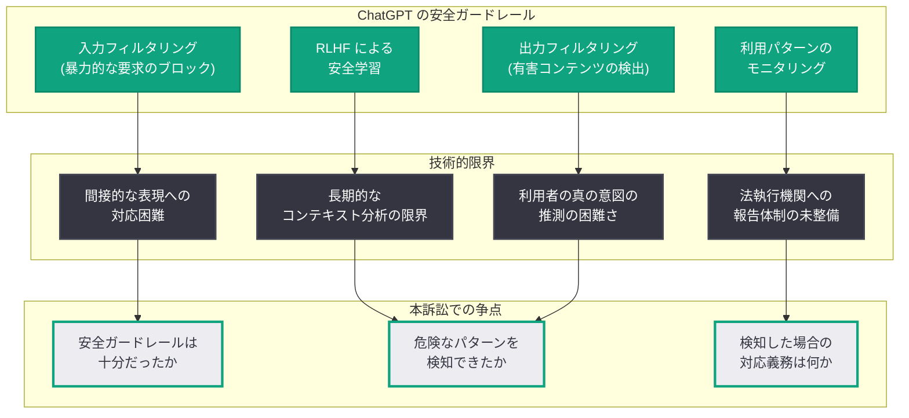
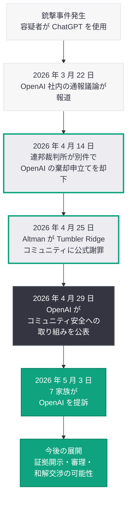

# 7 家族が銃撃事件容疑者の ChatGPT 利用を巡り OpenAI を提訴

## メタデータ

| 項目 | 内容 |
|------|------|
| 発表日 | 2026-05-03 |
| ソース | OpenAI News (Third-party coverage: MSN) |
| カテゴリ | 法務 / 安全性 |
| 公式リンク | [MSN](https://www.msn.com/) |

## 概要

2026 年 5 月 3 日、MSN は 7 家族が OpenAI に対して訴訟を提起したことを報じた。原告らは、銃撃事件の容疑者が犯行の準備または動機付けに ChatGPT を利用していたと主張しており、OpenAI がそのリスクを適切に管理・報告しなかったことに対する責任を追及している。

この訴訟は、2026 年に入って相次いでいる ChatGPT の安全性に関する法的紛争の中でも最大規模のものであり、複数家族が連名で OpenAI を提訴するという形式は、AI 企業に対する集団的な法的責任追及の新たな局面を示している。Sam Altman が 4 月 25 日に Tumbler Ridge 銃撃事件を巡って公式謝罪を行い、OpenAI が 4 月 29 日に「Our commitment to community safety」を公表した直後というタイミングでの提訴は、OpenAI の安全対策が被害者遺族にとって不十分であるとの認識を浮き彫りにしている。

## 主な内容

### 訴訟の概要

7 家族が原告として連名で OpenAI を提訴した本件は、銃撃事件の容疑者が ChatGPT を利用していたことに起因する。原告らの主張は以下のような論点を含むとみられる。

- **ChatGPT の役割:** 容疑者が犯行前に ChatGPT と対話しており、その対話内容が犯行の計画、準備、または心理的な後押しに関連していたとの主張
- **OpenAI の不作為:** OpenAI が容疑者の危険な利用パターンを検知する能力を有していたにもかかわらず、適切な措置 (アカウント停止、法執行機関への通報等) を講じなかったとの主張
- **製品の安全性の欠陥:** ChatGPT の安全ガードレールが暴力的な意図を持つ利用者に対して十分に機能していなかったとの主張
- **損害賠償請求:** 7 家族が被った精神的・物理的損害に対する賠償を求める請求

### 法的背景と先行訴訟との関連

本訴訟は、ChatGPT に関連する一連の法的紛争の文脈の中で理解する必要がある。

| 日付 | 事象 | 意義 |
|------|------|------|
| 2026 年 3 月 22 日 | OpenAI 社内で容疑者情報の警察通報を巡る議論が報道 | 社内で危険を認識していた可能性が示唆 |
| 2026 年 4 月 12 日 | OpenAI が AI 責任制限法案を支持 | 企業の法的防御戦略が明確化 |
| 2026 年 4 月 14 日 | 連邦裁判所が殺人・自殺事件訴訟で OpenAI の棄却申立てを却下 | AI 企業の法的責任が司法で認容される先例 |
| 2026 年 4 月 25 日 | Altman が Tumbler Ridge コミュニティに公式謝罪 | 企業としての責任を事実上認定 |
| 2026 年 4 月 29 日 | OpenAI が「コミュニティ安全への取り組み」を公表 | 安全対策の体系化を公式に示す |
| 2026 年 5 月 3 日 | 7 家族が OpenAI を提訴 | 集団訴訟的な法的責任追及の新局面 |

### 訴訟の法的論点

本訴訟では、以下の法的論点が争われる可能性がある。

#### 1. 注意義務 (Duty of Care) の存否

原告側は、OpenAI が ChatGPT の利用者および第三者に対して注意義務を負っていたと主張するとみられる。特に以下の点が争点となる。

- OpenAI は、ChatGPT が暴力的な意図を持つ利用者に悪用されるリスクを予見できたか
- 予見可能なリスクに対して、OpenAI はどの程度の安全対策を講じる義務があったか
- Altman の公式謝罪は、注意義務の存在を認めたものと解釈されうるか

#### 2. 因果関係の立証

ChatGPT の利用と銃撃事件との間の因果関係の立証が、本訴訟の成否を分ける重要な要素となる。

- ChatGPT との対話が容疑者の犯行決意に影響を与えたことを示す証拠の存在
- ChatGPT が存在しなかった場合に事件が発生しなかった蓋然性の立証
- AI の応答と人間の行動との間の因果関係に関する専門家証言

#### 3. Section 230 の適用範囲

4 月 14 日の連邦裁判所判決で既に示されたように、通信品位法第 230 条が AI 生成コンテンツに適用されるかどうかが改めて争点となる。

### 7 家族による集団提訴の意義

複数の家族が連名で提訴するという形式は、以下の点で法的・社会的意義を持つ。

- **共通の法的争点:** 複数の原告が同一の法的論点 (OpenAI の安全対策の不備) を共有することで、訴訟の効率性と説得力が高まる
- **社会的インパクト:** 個人ではなく複数家族による提訴は、メディアの注目を集め、世論形成に影響を与える
- **集団訴訟への発展可能性:** 本件が class action (集団訴訟) として認定される可能性があり、その場合は被害者の範囲がさらに拡大しうる
- **和解圧力:** 複数原告による訴訟は、企業に対する和解交渉の圧力を高める傾向がある

## 技術的な詳細

### ChatGPT の安全ガードレールと限界

OpenAI は ChatGPT に多層的な安全ガードレールを実装しているが、本訴訟は以下のような技術的限界を浮き彫りにする可能性がある。

### OpenAI の安全対策と訴訟のタイムライン

### Moderation API と脅威検知の現状

OpenAI が提供する Moderation API は、以下のカテゴリのコンテンツを検知する能力を有している。

| カテゴリ | 本訴訟との関連性 |
|---------|----------------|
| `violence` | 暴力的な意図や計画に関するコンテンツの検知 |
| `violence/graphic` | 過激な暴力描写の検出 |
| `harassment/threatening` | 特定対象への脅迫の検出 |
| `self-harm/intent` | 自傷意図の検出 (加害意図への応用可能性) |
| `illicit/violent` | 暴力的な違法行為に関する指示の検出 |

しかし、これらの検知能力が利用者の将来の行動を予測し、具体的な犯罪を防止するために十分であるかどうかは、本訴訟における技術的争点の核心である。

## 開発者への影響

### 法的リスクの拡大

本訴訟は、AI アプリケーションを構築する開発者に対して以下のような影響をもたらす。

- **安全対策の法的基準の引き上げ:** 7 家族による集団提訴は、AI 企業に求められる安全対策の法的基準がさらに引き上げられる方向に作用する。開発者は、最低限の安全ガードレールの実装だけでなく、危険な利用パターンの積極的な検知と対応を求められる可能性がある
- **通報義務の議論の加速:** 4 月 25 日の Altman の謝罪に続き、本訴訟は AI 企業に法的な通報義務を課す立法の動きをさらに加速させる可能性がある。開発者は、将来的に法執行機関への報告義務が法制化された場合に対応できる体制を準備しておく必要がある
- **利用ログの保持と分析:** 訴訟における証拠開示手続きでは、ChatGPT との対話ログが重要な証拠となる。開発者は、自社のアプリケーションにおける AI インタラクションのログを適切に保持し、必要に応じて提出できる体制を整備すべきである
- **Moderation API の積極活用:** OpenAI の Moderation API を用いた入出力のモデレーション実装が、安全対策の合理的な水準を満たしていることの証明として法的に重要となる可能性がある

### 具体的な対応推奨事項

1. **危機検知メカニズムの実装:** 暴力的な意図を示唆するコンテンツを検知した場合の自動エスカレーション機能を実装する
2. **利用規約の法的レビュー:** AI の利用に伴うリスクに関する免責条項を最新の法的動向に合わせて見直す
3. **インシデント対応手順の策定:** 法執行機関からの照会や裁判所命令に対応するための手順を事前に策定する
4. **安全対策の文書化:** 実装している安全対策を文書化し、注意義務を果たしていることを証明できる体制を整える

## 関連リンク

- [MSN - OpenAI sued by seven families over mass shooting suspect's ChatGPT use](https://www.msn.com/)
- [関連レポート: 連邦裁判所が ChatGPT 関連訴訟で OpenAI の棄却申立てを却下 (2026-04-14)](2026-04-14-chatgpt-murder-suicide-federal-claims.md)
- [関連レポート: Altman が Tumbler Ridge コミュニティに公式謝罪 (2026-04-25)](2026-04-25-altman-apologizes-tumbler-ridge-shooting.md)
- [関連レポート: OpenAI のコミュニティ安全への取り組み (2026-04-29)](2026-04-29-openai-commitment-community-safety.md)
- [関連レポート: OpenAI が AI 責任制限法案を支持 (2026-04-12)](2026-04-12-openai-ai-liability-legislation.md)
- [OpenAI Safety](https://openai.com/safety)
- [OpenAI Usage Policies](https://openai.com/policies/usage-policies)

## まとめ

2026 年 5 月 3 日、7 家族が銃撃事件容疑者の ChatGPT 利用を巡り OpenAI を提訴した。本訴訟は、ChatGPT の安全ガードレールの不備および危険な利用パターンに対する OpenAI の不作為を追及するものであり、複数家族が連名で AI 企業の法的責任を問う集団的な訴訟として、AI 安全性を巡る法的紛争の新たな段階を画している。Altman が 4 月 25 日に Tumbler Ridge 銃撃事件について公式謝罪を行い、OpenAI が 4 月 29 日にコミュニティ安全への包括的な取り組みを公表した直後の提訴は、企業の自主的な安全対策だけでは被害者遺族の求める責任追及に応えるものではないという現実を突きつけている。4 月 14 日の連邦裁判所による棄却申立て却下の判決と合わせ、AI 企業が生成 AI の利用に起因する損害について法的責任を問われるリスクは確実に高まっており、開発者は安全ガードレールの強化、利用ログの適切な保持、法的リスク管理体制の構築を急ぐ必要がある。
