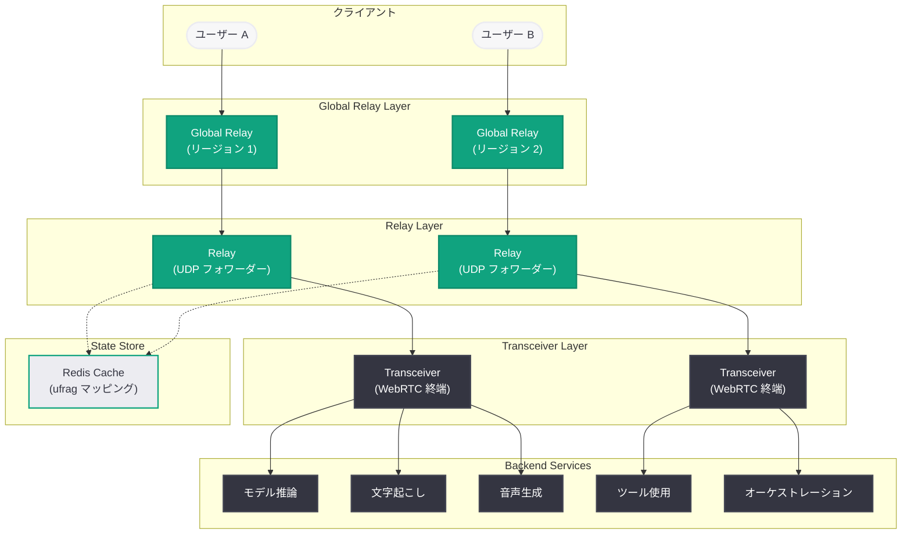

# OpenAI が低レイテンシ音声 AI をスケールで実現する方法: WebRTC アーキテクチャの再設計

## メタデータ

| 項目 | 内容 |
|------|------|
| 発表日 | 2026-05-04 |
| ソース | OpenAI News/Blog (Engineering) |
| カテゴリ | エンジニアリング |
| 著者 | Yi Zhang, William McDonald (Members of Technical Staff) |
| 公式リンク | [Delivering low-latency voice AI at scale](https://openai.com/index/delivering-low-latency-voice-ai-at-scale) |

## 概要

OpenAI のエンジニアリングチームは、週間 9 億人以上のアクティブユーザーに対して自然な音声 AI 体験を提供するために、WebRTC スタックを根本的に再設計した。音声 AI が自然に感じられるためには会話が発話速度で進む必要があり、ネットワーク遅延は不自然な間、途切れ、バージイン遅延として即座にユーザーに知覚される。

本記事では、OpenAI が WebRTC と Kubernetes 環境の制約を同時に解決するために採用した「Relay + Transceiver」アーキテクチャについて詳述している。従来の SFU (Selective Forwarding Unit) モデルではなく、ステートレスな UDP フォワーディング層とステートフルな WebRTC 終端を分離する独自の「Transceiver」モデルを採用し、ポート枯渇問題の解消、セキュリティ表面積の最小化、グローバルな低レイテンシルーティングを実現した。

## 主な内容

### スケールにおける 3 つの要件

OpenAI の音声 AI インフラストラクチャには、以下の 3 つの具体的要件が存在する。

1. **グローバルリーチ:** 週間 9 億人以上のアクティブユーザーへのサービス提供
2. **高速接続セットアップ:** セッション開始直後にユーザーが発話を開始できること
3. **低く安定したメディア往復時間:** 低ジッター、低パケットロスによるクリスプなターンテイキング

### スケールで衝突する 3 つの制約

WebRTC スタックの再設計は、以下の 3 つの制約が大規模環境で衝突する問題に対処するために行われた。

1. **1 セッション 1 ポートのメディア終端:** OpenAI インフラストラクチャとの適合性が低い
2. **ステートフルな ICE/DTLS セッション:** 安定した所有権が必要
3. **グローバルルーティング:** ファーストホップレイテンシを低く保つ必要性

### Transceiver モデルの採用

OpenAI は SFU ではなく「Transceiver」モデルを選択した。Transceiver は WebRTC エッジサービスとして機能し、クライアント接続を終端してメディアとイベントを内部のシンプルなプロトコルに変換する。変換後のデータはモデル推論、文字起こし、音声生成、ツール使用、オーケストレーションの各サービスに送信される。

### 初期実装の課題

最初の実装は Pion ライブラリを使用した単一の Go サービスだった。

- ChatGPT Voice、Realtime API の WebRTC エンドポイント、研究プロジェクトを稼働
- 1 セッション 1 ポートモデルが高同時接続でポート枯渇を引き起こす
- 大きな UDP ポート範囲はセキュリティ確保が困難
- Kubernetes でのオートスケーリングとの相性が悪い

### Relay + Transceiver アーキテクチャ

パケットルーティングとプロトコル終端を分離する設計を採用した。

**Relay (リレー):**
- 軽量な UDP フォワーディング層
- 小さなパブリックフットプリント
- 暗号化解除、ICE ステートマシン、コーデックネゴシエーションは行わない
- Go で実装、ユーザースペースで動作
- カーネルバイパス不要

**Transceiver (トランシーバー):**
- Relay の背後に配置されるステートフルな WebRTC エンドポイント
- 全プロトコル状態を所有
- 共有 UDP ソケットでリッスン (セッションごとのソケットではない)

### ICE クレデンシャルによるルーティング

ルーティングメカニズムの核心は ICE username fragment (ufrag) をルーティングフックとして活用する点にある。

1. サーバー側 ufrag にルーティングメタデータを格納
2. Relay が最初の STUN パケットをパースしてサーバー ufrag を読み取り
3. ルーティングヒントをデコードして宛先クラスタを推定
4. 所有する Transceiver にフォワード
5. Redis キャッシュがマッピングを保持し、高速リカバリを実現

### Global Relay

- 地理的に分散された Relay インフレスポイントのフリート
- クライアントから OpenAI への最初のホップを短縮
- シグナリングに Cloudflare の geo/proximity ステアリングを使用
- SDP Answer が Global Relay アドレスを提供し、ufrag にルーティング情報を含む

### Relay 実装の最適化

Go で実装された Relay は以下の最適化を含む。

- **SO_REUSEPORT:** 同一ポートで複数ワーカーを実行
- **runtime.LockOSThread:** CPU アフィニティの確保
- **事前割り当てバッファ:** メモリアロケーションの最小化
- **エフェメラルステート:** クライアントアドレスから Transceiver 宛先への小さなインメモリマップ
- **水平スケーラブル:** ロードバランサーの背後で水平拡張可能

## 技術的な詳細

### アプローチ比較

| アプローチ | 利点 | 欠点 |
|-----------|------|------|
| セッションごとにユニーク IP:port | 直接パス、フォワーディング不要 | ポート枯渇、セキュリティ確保困難 |
| サーバーごとにユニーク IP:port | 小さなフットプリント | フリート全体での決定的ステアリングが必要 |
| TURN リレー | クライアントはリレーアドレスのみ必要 | セットアップ往復追加、アロケーションリカバリ困難 |
| ステートレスフォワーダー + ステートフルターミネーター (OpenAI 方式) | 小さな UDP フットプリント、完全な WebRTC 所有権 | 1 ホップのフォワーディング、カスタム連携が必要 |

### 成果

- Kubernetes 上で数千の UDP ポートを公開せずに WebRTC メディアを運用
- 小さく固定された UDP サーフェスによるセキュリティとロードバランシングの容易化
- クライアント側の標準 WebRTC 動作を維持
- ポイントツーポイント、レイテンシセンシティブなワークロードに対して SFU レス設計が適切であることを確認

## アーキテクチャ

### Relay + Transceiver アーキテクチャ全体図



### ICE ufrag ルーティングフロー

```mermaid
sequenceDiagram
    participant Client as クライアント
    participant CF as Cloudflare<br/>(Geo Steering)
    participant GR as Global Relay
    participant Relay as Relay
    participant Redis as Redis Cache
    participant TX as Transceiver

    Client->>CF: シグナリングリクエスト
    CF->>TX: 最寄りクラスタへルーティング
    TX->>Client: SDP Answer<br/>(Global Relay アドレス + ufrag)

    Note over Client,TX: ufrag にルーティングメタデータを埋め込み

    Client->>GR: STUN Binding Request<br/>(ICE ufrag 含む)
    GR->>GR: ufrag パース<br/>ルーティングヒントデコード
    GR->>Relay: UDP パケット転送<br/>(宛先クラスタ特定)
    Relay->>Redis: ufrag マッピング確認
    Redis-->>Relay: Transceiver アドレス返却
    Relay->>TX: パケット転送
    TX->>TX: ICE/DTLS/SRTP 処理
    TX-->>Relay: メディアレスポンス
    Relay-->>GR: UDP 転送
    GR-->>Client: メディアレスポンス

    Note over Client,TX: 以降のパケットはキャッシュされた<br/>ルーティングで直接転送

    classDef openai fill:#10A37F,stroke:#0D8A6A,stroke-width:2px,color:white
    classDef dark fill:#343541,stroke:#444654,stroke-width:2px,color:white
```

## 開発者への影響

- **Realtime API WebRTC エンドポイントの信頼性向上:** 本アーキテクチャにより、Realtime API を使用する開発者はより安定した低レイテンシ接続を期待できる。ポート枯渇によるセッション確立失敗やメディア断が軽減される

- **標準 WebRTC クライアントとの互換性維持:** OpenAI 独自のインフラ変更にもかかわらず、クライアント側では標準的な WebRTC 実装がそのまま利用可能。既存のアプリケーションコードの変更は不要

- **グローバル展開時のレイテンシ改善:** Global Relay による地理的分散により、世界各地のユーザーに対するファーストホップレイテンシが改善。音声 AI アプリケーションのグローバル展開がより実用的になる

- **WebRTC + Kubernetes パターンの参考事例:** 大規模 WebRTC サービスを Kubernetes 上で運用する際の設計パターンとして、Relay + Transceiver の分離アーキテクチャは業界全体の参考事例となる

- **ICE ufrag を活用したルーティングの知見:** ICE クレデンシャルにルーティングメタデータを埋め込む手法は、WebRTC インフラストラクチャを構築する開発者にとって応用可能な設計パターンを提供する

## 関連リンク

- [OpenAI 公式記事: Delivering low-latency voice AI at scale](https://openai.com/index/delivering-low-latency-voice-ai-at-scale)
- [OpenAI Realtime API ドキュメント](https://platform.openai.com/docs/guides/realtime)
- [Pion WebRTC (Go 実装)](https://github.com/pion/webrtc)
- [WebRTC 仕様 (W3C)](https://www.w3.org/TR/webrtc/)
- [RFC 8445: ICE (Interactive Connectivity Establishment)](https://datatracker.ietf.org/doc/html/rfc8445)
- [OpenAI News](https://openai.com/news)

## まとめ

OpenAI は週間 9 億人以上のアクティブユーザーに対して自然な音声 AI 体験を提供するため、WebRTC スタックを「Relay + Transceiver」アーキテクチャへ再設計した。ステートレスな UDP フォワーディング層 (Relay) とステートフルな WebRTC プロトコル終端 (Transceiver) を分離することで、Kubernetes 環境におけるポート枯渇問題、セキュリティ表面積の肥大化、オートスケーリングとの非互換を同時に解決した。ICE username fragment にルーティングメタデータを埋め込む独自手法により、追加のセットアップ往復なしに正確なルーティングを実現し、地理的に分散した Global Relay フリートがファーストホップレイテンシを最小化する。SFU を使用しないポイントツーポイント設計は、レイテンシセンシティブな音声 AI ワークロードに最適であることが確認され、標準 WebRTC クライアントとの互換性も維持されている。
