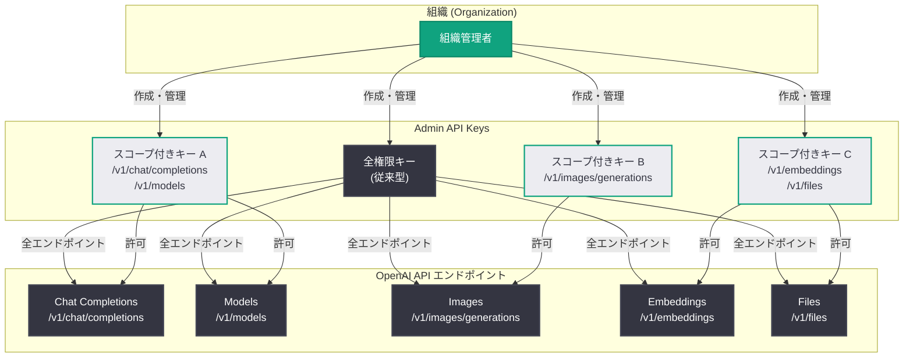
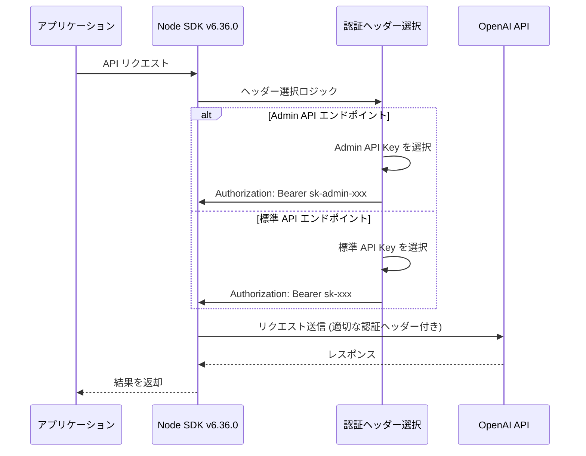
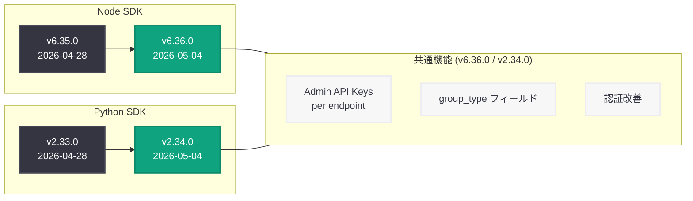

# OpenAI Node SDK v6.36.0 リリース: Admin API Keys のエンドポイント単位スコープと認証強化

## メタデータ

| 項目 | 内容 |
|------|------|
| 発表日 | 2026-05-04 |
| ソース | OpenAI API Changelog (GitHub Release) |
| カテゴリ | API 更新 |
| 公式リンク | [Node SDK v6.36.0](https://github.com/openai/openai-node/releases/tag/v6.36.0) |

## 概要

OpenAI は 2026 年 5 月 4 日、Node.js/TypeScript 向け公式 SDK の v6.36.0 をリリースした。本リリースの主要な変更点は、Admin API Keys のエンドポイント単位スコープ (per endpoint) サポートの追加である。これにより、組織は単一の全権限を持つ管理キーではなく、特定の API エンドポイントに限定されたきめ細かな権限を持つ Admin API Key を作成できるようになった。

本リリースは Python SDK v2.34.0 との協調リリースであり、両 SDK が同日に同一の Admin API 改善を受けている。加えて、`group_type` および `user` メタデータフィールドの追加、認証ヘッダー選択ロジックの厳格化など、管理リソース全般にわたる型と認証の改善が含まれている。前バージョン v6.35.0 (2026 年 4 月 28 日リリース) から 6 日間隔でのリリースとなる。

## 主な内容

### Admin API Keys のエンドポイント単位スコープ

v6.36.0 の最も重要な変更は、Admin API Keys をエンドポイント単位で作成・管理できるようになったことである (コミット `770d187`)。従来の Admin API Key は組織全体に対する管理権限を持っていたが、本リリースにより、特定のエンドポイントのみにアクセスを許可するスコープ付きキーを発行できるようになった。

**セキュリティ上の利点:**

- 最小権限の原則 (Principle of Least Privilege) に準拠したキー管理が可能
- キー漏洩時の影響範囲を最小化
- チームやサービスごとに必要な権限のみを付与

### group_type / user メタデータフィールドの追加

コミット `cc52f97` により、Admin リソース全般で `group_type` と `user` メタデータフィールドが追加された。これにより、管理リソースの分類やユーザーとの関連付けがより柔軟に行えるようになった。

**主な型の更新:**

- `group_type`: リソースグループの種類を示すフィールド
- `user` メタデータ: Admin リソースに関連付けられたユーザー情報

### 認証ヘッダー選択の厳格化

2 件のバグ修正により、Admin API の認証処理が改善された。

- **Admin API Key 認証のサポート** (コミット `e3862a3`): Admin API エンドポイントで Admin API Key を使用した認証が正しく動作するようになった
- **認証ヘッダー選択の厳格化** (コミット `f1203bd`): リクエスト時に適切な認証ヘッダーが選択されるよう、ヘッダー選択ロジックが改善された

### Admin API の全般的な更新

コミット `ee2bd2d` による Admin API 全般の更新と、2 件の手動更新 (コミット `6af2b6d`、`f2dceda`) が含まれている。これらは OpenAI の管理機能の進化に伴う型定義とインターフェースの更新である。

## 技術的な詳細

### コードサンプル

#### SDK のアップグレード

```bash
# npm を使用したアップグレード
npm install openai@latest

# バージョン指定でのインストール
npm install openai@6.36.0

# yarn を使用している場合
yarn upgrade openai@^6.36.0

# pnpm を使用している場合
pnpm update openai

# package.json を使用している場合
# "openai": "^6.36.0" に更新
```

#### バージョン確認

```typescript
import OpenAI from "openai";

console.log(OpenAI.VERSION);
// 出力: 6.36.0
```

#### Admin API Key のエンドポイント単位スコープ設定

```typescript
import OpenAI from "openai";

// 組織の Admin API Key を使用してクライアントを初期化
const client = new OpenAI({
  apiKey: process.env.OPENAI_ADMIN_KEY,
});

// v6.36.0 新機能: エンドポイント単位でスコープされた Admin API Key の作成
const scopedKey = await client.admin.apiKeys.create({
  name: "chat-completions-only-key",
  // 特定のエンドポイントのみにアクセスを許可
  scoped_endpoints: [
    "/v1/chat/completions",
    "/v1/models",
  ],
});

console.log(`Key ID: ${scopedKey.id}`);
console.log(`Key: ${scopedKey.key}`);
console.log(`Scoped to: ${scopedKey.scoped_endpoints?.join(", ")}`);

// 全エンドポイントにアクセス可能なキー (従来の動作)
const fullAccessKey = await client.admin.apiKeys.create({
  name: "full-access-admin-key",
  // scoped_endpoints を省略すると全権限
});
```

#### Admin API Key の一覧取得とフィルタリング

```typescript
import OpenAI from "openai";

const client = new OpenAI({
  apiKey: process.env.OPENAI_ADMIN_KEY,
});

// Admin API Key の一覧を取得
const keys = await client.admin.apiKeys.list();

for (const key of keys.data) {
  console.log(`Key: ${key.name}`);
  console.log(`  ID: ${key.id}`);
  console.log(`  Created: ${key.created_at}`);
  // v6.36.0 新機能: スコープされたエンドポイントの確認
  if (key.scoped_endpoints) {
    console.log(`  Scoped to: ${key.scoped_endpoints.join(", ")}`);
  } else {
    console.log(`  Scope: Full access`);
  }
}
```

#### group_type と user メタデータの使用

```typescript
import OpenAI from "openai";

const client = new OpenAI({
  apiKey: process.env.OPENAI_ADMIN_KEY,
});

// v6.36.0 新機能: group_type フィールドを使用したリソース管理
const projects = await client.admin.projects.list();

for (const project of projects.data) {
  console.log(`Project: ${project.name}`);
  // v6.36.0: group_type フィールドによる分類
  if (project.group_type) {
    console.log(`  Group Type: ${project.group_type}`);
  }
}

// v6.36.0 新機能: user メタデータフィールド
const users = await client.admin.users.list();

for (const user of users.data) {
  console.log(`User: ${user.name}`);
  console.log(`  Email: ${user.email}`);
  console.log(`  Role: ${user.role}`);
  // v6.36.0: 追加のメタデータフィールドにアクセス可能
}
```

#### スコープ付きキーを使用した安全な API 呼び出し

```typescript
import OpenAI from "openai";

// スコープ付きキーで初期化 (Chat Completions のみ許可)
const client = new OpenAI({
  apiKey: "sk-scoped-xxxxx", // エンドポイント限定キー
});

// 許可されたエンドポイント: 正常に動作
const response = await client.chat.completions.create({
  model: "gpt-4o",
  messages: [
    { role: "user", content: "Hello, world!" },
  ],
});
console.log(response.choices[0].message.content);

// 許可されていないエンドポイント: エラーが発生
try {
  await client.images.generate({
    model: "dall-e-3",
    prompt: "A sunset over mountains",
  });
} catch (error) {
  if (error instanceof OpenAI.PermissionDeniedError) {
    console.error("このキーには画像生成エンドポイントへのアクセス権がありません");
  }
}
```

### 変更一覧

| 種別 | 変更内容 | コミット |
|------|---------|---------|
| 機能追加 | Admin API Keys のエンドポイント単位スコープ | `770d187` |
| 機能追加 | group_type / user メタデータフィールドの追加 | `cc52f97` |
| 機能追加 | Admin API の全般的な更新 | `ee2bd2d` |
| 機能追加 | API 手動更新 | `6af2b6d` |
| 機能追加 | API 手動更新 | `f2dceda` |
| バグ修正 | Admin API Key 認証のサポート | `e3862a3` |
| バグ修正 | 認証ヘッダー選択の厳格化 | `f1203bd` |
| メンテナンス | ESLint と Prettier を分離実行 | `104543a` |
| 内部更新 | codegen 関連の更新 | `05d86da` |
| 内部更新 | codegen 関連の更新 | `f184586` |

## アーキテクチャ

以下の図は、v6.36.0 で導入された Admin API Key のエンドポイント単位スコープのアーキテクチャを示している。



### 認証フロー

以下の図は、v6.36.0 で改善された認証ヘッダー選択のフローを示している。



### SDK リリースタイムラインと Python SDK との関係



## 開発者への影響

- **セキュリティの向上:** エンドポイント単位でスコープされた Admin API Key を使用することで、最小権限の原則に基づいたキー管理が可能になる。マイクロサービスアーキテクチャにおいて、各サービスに必要最小限の権限のみを付与できる
- **キー漏洩リスクの低減:** スコープ付きキーが漏洩した場合でも、影響範囲がそのキーに許可されたエンドポイントのみに限定される。全権限キーの使用を最小限に抑えることで、セキュリティインシデント時の影響を縮小できる
- **管理リソースの可視性向上:** `group_type` と `user` メタデータフィールドにより、Admin リソースの分類と追跡が容易になる。大規模な組織でのリソース管理の効率化に寄与する
- **認証の安定性向上:** 認証ヘッダー選択の厳格化により、Admin API と標準 API を混在して使用する場合の認証エラーが解消される
- **Python SDK との機能パリティ:** Python SDK v2.34.0 と同一の Admin API 改善が Node SDK にも適用されたことで、両 SDK 間の機能差異が解消される。多言語プロジェクトにおいて一貫した API 利用体験が保証される
- **既存コードへの影響は最小限:** 本リリースは追加的な機能であり、既存の Admin API の使用方法に破壊的変更はない。アップグレード後も既存コードはそのまま動作する

### Python SDK との対応関係

| 変更内容 | Node SDK v6.36.0 | Python SDK v2.34.0 |
|---------|------------------|-------------------|
| Admin API Keys per endpoint | `770d187` | 対応あり |
| group_type / user メタデータ | `cc52f97` | 対応あり |
| Admin API 全般更新 | `ee2bd2d` | 対応あり |
| Admin API Key 認証修正 | `e3862a3` | 対応あり |
| 認証ヘッダー選択厳格化 | `f1203bd` | 対応あり |

### アップグレード手順

```bash
# 1. 依存関係の更新
npm install openai@latest

# 2. TypeScript の型チェック
npx tsc --noEmit

# 3. テストの実行
npm test

# 4. Admin API 関連コードの確認 (任意)
grep -rn "admin" --include="*.ts" --include="*.js" .
```

## 関連リンク

- [Node SDK v6.36.0 リリースノート](https://github.com/openai/openai-node/releases/tag/v6.36.0)
- [Node SDK v6.35.0 リリースノート](https://github.com/openai/openai-node/releases/tag/v6.35.0)
- [v6.35.0...v6.36.0 の完全な差分](https://github.com/openai/openai-node/compare/v6.35.0...v6.36.0)
- [Python SDK v2.34.0 リリースノート](https://github.com/openai/openai-python/releases/tag/v2.34.0)
- [OpenAI Admin API ドキュメント](https://platform.openai.com/docs/api-reference/admin)
- [OpenAI API Keys 管理](https://platform.openai.com/organization/api-keys)
- [OpenAI API Changelog](https://platform.openai.com/docs/changelog)
- [openai-node GitHub リポジトリ](https://github.com/openai/openai-node)

## まとめ

Node SDK v6.36.0 は、Admin API のセキュリティと管理機能を強化するリリースである。5 件の機能追加と 2 件のバグ修正が含まれ、前バージョン v6.35.0 からわずか 6 日間隔でのリリースとなった。

最大の注目点は Admin API Keys のエンドポイント単位スコープ (per endpoint) のサポートである。従来は組織全体に対する全権限を持つ Admin API Key しか発行できなかったが、v6.36.0 からは特定のエンドポイントに限定されたきめ細かな権限を持つキーを作成できるようになった。これにより、最小権限の原則に基づいたセキュアなキー管理が実現し、キー漏洩時のリスクを大幅に低減できる。

本リリースは Python SDK v2.34.0 との協調リリースであり、Admin API Keys per endpoint、`group_type` / `user` メタデータフィールド、認証改善のすべてが両 SDK で同時に利用可能になった。大規模な組織で OpenAI API を運用する開発者にとって、セキュリティと管理性の向上が期待できる重要なリリースである。

既存コードへの破壊的変更はなく、安全にアップグレードできる。Admin API を活用している組織には、エンドポイント単位のスコープ付きキーへの移行を推奨する。
