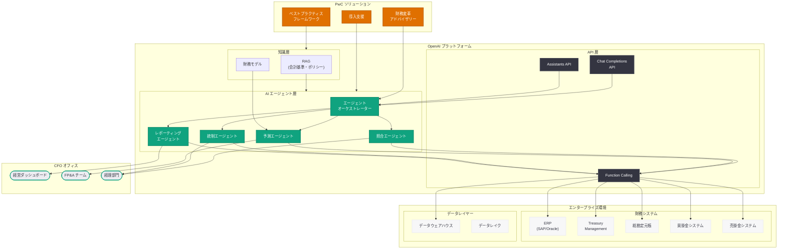

# OpenAI と PwC が CFO 機能の変革に向けて協業: AI エージェントによる財務ワークフロー自動化

## メタデータ

| 項目 | 内容 |
|------|------|
| 発表日 | 2026-05-04 |
| ソース | OpenAI News/Blog |
| カテゴリ | Global Affairs |
| 公式リンク | [OpenAI and PwC collaborate to reimagine the office of the CFO](https://openai.com/index/openai-pwc-finance-collaboration) |

## 概要

OpenAI と PwC (PricewaterhouseCoopers) は 2026 年 5 月 4 日、企業の CFO (最高財務責任者) 機能を AI エージェントによって変革するための戦略的パートナーシップを発表した。このパートナーシップは、財務ワークフローの自動化、予測精度の向上、内部統制の強化、そして CFO 組織全体のモダナイゼーションを目指すものであり、エンタープライズ AI 導入の新たなフェーズを象徴する取り組みである。

本発表は、OpenAI のエンタープライズ戦略における重要なマイルストーンである。Big Four の一角である PwC と連携することで、OpenAI は大規模な法人顧客基盤へのアクセスを獲得し、AI エージェント技術の実務適用を加速させる狙いがある。財務部門は企業内で最もデータドリブンかつプロセス集約的な組織であり、AI エージェントの導入による生産性向上の効果が最も顕著に現れる領域の一つとして位置づけられている。

## 主な内容

### パートナーシップの概要

OpenAI と PwC の協業は、AI エージェント技術をエンタープライズの財務機能に実装するための包括的なフレームワークを構築することを目的としている。PwC は世界最大級のプロフェッショナルサービスファームとして、Fortune 500 企業を含む数千社のクライアントに財務コンサルティングサービスを提供している。この既存のクライアントネットワークと OpenAI の AI エージェント技術を組み合わせることで、大規模なエンタープライズ AI 導入を実現する。

パートナーシップの主要な柱は以下の通りである。

- **共同ソリューション開発:** 財務固有のユースケースに最適化された AI エージェントソリューションの共同設計・開発
- **導入支援サービス:** PwC のコンサルティングチームによる AI エージェント導入のエンドツーエンド支援
- **ベストプラクティス策定:** 業界別・規模別の AI エージェント導入ベストプラクティスの体系化
- **人材育成:** クライアント企業の財務チームに対する AI リテラシー教育プログラムの提供

### 財務ワークフローにおける AI エージェントの活用

AI エージェントは、従来人手に依存していた財務ワークフローを自律的に実行する能力を持つ。本パートナーシップで対象とする主要な財務ワークフローには以下が含まれる。

**勘定照合 (Account Reconciliation):**
- 銀行明細と帳簿の自動照合
- 差異の自動検出と分類
- 例外処理のエスカレーション判断

**買掛金・売掛金処理 (AP/AR Processing):**
- 請求書の自動読取と会計システムへの入力
- 支払条件の検証と承認ワークフローのトリガー
- 入金消し込みの自動化

**経費精算 (Expense Management):**
- 経費申請の自動検証とポリシー準拠チェック
- 不正申請の異常検知
- 承認ルーティングの最適化

**月次・四半期決算 (Close Process):**
- 決算タスクの進捗管理と自動チェックリスト実行
- 仕訳入力の自動化とバリデーション
- 連結調整の自動処理

### 予測精度の向上

AI エージェントは、財務予測 (Financial Forecasting) の精度と速度を大幅に向上させる。従来の予測手法がスプレッドシートベースの線形外挿に依存していたのに対し、AI エージェントは複数のデータソースをリアルタイムで統合し、より精緻な予測を生成する。

- **動的予測モデル:** 市場環境の変化、季節性、マクロ経済指標を組み込んだ動的な収益・コスト予測
- **シナリオ分析の自動化:** 楽観・中立・悲観の各シナリオに基づく財務モデリングの自動生成
- **キャッシュフロー予測:** 運転資本の変動を考慮したキャッシュフロー予測の精度向上
- **予算差異分析:** 予算と実績の差異を自動分析し、根本原因の特定を支援
- **ローリングフォーキャスト:** 月次ベースでの予測更新を自動化し、常に最新の見通しを提供

### 内部統制の強化

財務部門における内部統制 (Internal Controls) は、SOX 法遵守や監査対応の観点から極めて重要である。AI エージェントは、統制活動の実行とモニタリングを自動化することで、人的エラーのリスクを低減しつつ統制の有効性を向上させる。

- **継続的モニタリング:** トランザクションのリアルタイム監視による異常検知
- **職務分離の自動検証:** アクセス権限と承認フローにおける職務分離原則の継続的チェック
- **コンプライアンスチェック:** 規制要件への準拠状況の自動評価とレポーティング
- **監査証跡の自動生成:** 全ての財務処理に対する完全な監査証跡の自動記録
- **リスク評価の動的更新:** 取引パターンの変化に基づくリスクスコアの動的再計算

### CFO 機能のモダナイゼーション

本パートナーシップの最終的な目標は、CFO 機能全体のモダナイゼーションである。従来のトランザクション処理中心の財務組織から、戦略的意思決定支援を担うインテリジェントな組織への変革を目指す。

- **戦略的 FP&A (Financial Planning & Analysis):** ルーチン業務から解放された FP&A チームが、より高度な戦略分析に注力可能に
- **リアルタイム経営ダッシュボード:** AI エージェントが集約・分析した情報に基づくリアルタイムの経営指標の可視化
- **インテリジェントレポーティング:** 規制報告、経営報告の自動生成と品質保証
- **財務変革ロードマップ:** 各企業の成熟度に応じた段階的な AI 導入計画の策定

### エンタープライズ展開戦略

PwC のグローバルネットワークを活用した段階的なエンタープライズ展開が計画されている。

1. **パイロットフェーズ:** 選定されたクライアント企業における概念実証 (PoC) の実施
2. **拡張フェーズ:** PoC で実証されたユースケースの本番環境への展開
3. **スケールフェーズ:** 複数の財務プロセスにわたる AI エージェントの統合的な展開
4. **最適化フェーズ:** 継続的な改善と新規ユースケースの探索

## 技術的な詳細

### AI エージェントの財務適用アーキテクチャ

OpenAI の AI エージェント技術を財務ワークフローに適用する際の技術的なアーキテクチャは、複数のレイヤーで構成される。

**エージェントオーケストレーション層:**
AI エージェントは、複数のサブタスクを自律的に計画・実行・検証するオーケストレーション能力を持つ。財務ワークフローの文脈では、例えば月次決算プロセスを構成する数十のタスクを適切な順序で実行し、各タスクの成果を検証しながら全体の進行を管理する。

**ツール統合層:**
AI エージェントは、ERP (SAP、Oracle、NetSuite 等)、会計システム、銀行 API、データウェアハウスなど、既存の財務システムとの統合を通じてタスクを実行する。Function Calling や Tool Use の機能を活用し、外部システムとのインタラクションを安全に実行する。

**知識・推論層:**
財務規則、会計基準 (IFRS、US GAAP)、社内ポリシーに基づく推論を行い、適切な判断と処理を実行する。RAG (Retrieval Augmented Generation) 技術により、企業固有の会計方針や処理ルールを参照しながら動作する。

### 勘定照合の自動化パターン

```python
from openai import OpenAI

client = OpenAI()

# AI エージェントによる勘定照合の実行例
response = client.responses.create(
    model="gpt-4o",
    tools=[
        {
            "type": "function",
            "function": {
                "name": "fetch_bank_statements",
                "description": "銀行明細データを取得する",
                "parameters": {
                    "type": "object",
                    "properties": {
                        "account_id": {"type": "string"},
                        "start_date": {"type": "string"},
                        "end_date": {"type": "string"}
                    }
                }
            }
        },
        {
            "type": "function",
            "function": {
                "name": "fetch_gl_entries",
                "description": "総勘定元帳エントリを取得する",
                "parameters": {
                    "type": "object",
                    "properties": {
                        "account_code": {"type": "string"},
                        "period": {"type": "string"}
                    }
                }
            }
        },
        {
            "type": "function",
            "function": {
                "name": "create_reconciliation_report",
                "description": "照合レポートを生成する",
                "parameters": {
                    "type": "object",
                    "properties": {
                        "matched_items": {"type": "array"},
                        "unmatched_items": {"type": "array"},
                        "exceptions": {"type": "array"}
                    }
                }
            }
        }
    ],
    input="2026年4月の普通預金口座(A001)の照合を実行してください。"
         "銀行明細と総勘定元帳を比較し、不一致項目を特定してレポートを作成してください。"
)
```

### 財務予測エージェントの構成パターン

```python
from openai import OpenAI

client = OpenAI()

# マルチステップの財務予測エージェント
response = client.responses.create(
    model="gpt-4o",
    tools=[
        {
            "type": "function",
            "function": {
                "name": "query_historical_financials",
                "description": "過去の財務データを取得する",
                "parameters": {
                    "type": "object",
                    "properties": {
                        "metric": {"type": "string"},
                        "periods": {"type": "integer"},
                        "granularity": {"type": "string", "enum": ["monthly", "quarterly", "yearly"]}
                    }
                }
            }
        },
        {
            "type": "function",
            "function": {
                "name": "get_market_indicators",
                "description": "市場指標・マクロ経済データを取得する",
                "parameters": {
                    "type": "object",
                    "properties": {
                        "indicators": {"type": "array", "items": {"type": "string"}},
                        "region": {"type": "string"}
                    }
                }
            }
        },
        {
            "type": "function",
            "function": {
                "name": "generate_forecast",
                "description": "予測モデルを実行し結果を生成する",
                "parameters": {
                    "type": "object",
                    "properties": {
                        "forecast_type": {"type": "string"},
                        "horizon_months": {"type": "integer"},
                        "scenarios": {"type": "array", "items": {"type": "string"}}
                    }
                }
            }
        }
    ],
    input="次四半期の売上予測を3シナリオ(楽観・中立・悲観)で生成してください。"
         "過去12ヶ月の実績データと最新の市場指標を考慮してください。"
)
```

### セキュリティとコンプライアンス考慮事項

エンタープライズの財務データを扱う AI エージェントには、厳格なセキュリティ要件が求められる。

- **データ暗号化:** 保存時・転送時のデータ暗号化 (AES-256、TLS 1.3)
- **アクセス制御:** RBAC (Role-Based Access Control) に基づく最小権限原則の適用
- **監査ログ:** 全 API コールと AI エージェントの行動ログの完全記録
- **データ残留制限:** OpenAI API のデータ保持ポリシーに基づく適切なデータ管理
- **SOC 2 Type II 準拠:** エンタープライズ向けのセキュリティ認証基準への準拠

## アーキテクチャ



## 開発者への影響

### エンタープライズ AI ソリューション開発者への影響

- **財務ドメインの AI エージェント需要拡大:** PwC のグローバルクライアントネットワークを通じた大規模な需要創出により、財務 AI ソリューションの市場が急速に拡大する見込みである。エンタープライズ向け AI ソリューションを構築する開発者にとって、財務ドメインは優先度の高い投資領域となる
- **Function Calling の高度活用:** 財務ワークフローの自動化には、複数の外部システムとの連携が不可欠であり、OpenAI API の Function Calling 機能の高度な活用パターンが確立されていくことが予想される
- **マルチエージェント設計の実践:** 照合、予測、統制、レポーティングなど、複数の専門エージェントが協調して動作するマルチエージェントアーキテクチャの設計・実装スキルが求められる

### API 利用パターンの進化

- **長時間実行タスクの管理:** 月次決算のような長時間にわたるワークフローを AI エージェントが管理するためのパターンが必要となる。Assistants API のスレッド管理やステート管理が重要な技術要素となる
- **高信頼性要件:** 財務データの処理には高い正確性が求められるため、AI エージェントの出力検証、ヒューマンインザループの設計、エラーハンドリングの堅牢性が重視される
- **コンプライアンス対応:** SOX 法、GDPR、各国の金融規制に準拠した AI エージェントの動作保証が求められ、監査可能なログ記録とガバナンス機能の実装が必須となる

### PwC パートナーシップの戦略的意義

- **チャネルパートナーモデルの確立:** OpenAI が直接販売だけでなく、コンサルティングファーム経由のチャネルパートナーモデルを本格化させたことを示す。今後、Deloitte、EY、KPMG など他の Big Four との同様のパートナーシップが拡大する可能性がある
- **垂直統合ソリューションの加速:** 汎用 AI プラットフォームから、業界・機能特化型のソリューションへの進化が加速する。財務に続き、人事、法務、サプライチェーンなどの領域でも同様のパートナーシップが展開されることが予想される
- **エンタープライズ AI の成熟化:** PoC (概念実証) から本番運用への移行を支援するエコシステムが形成されつつあり、エンタープライズ AI の実用化フェーズが本格的に到来したことを示している

## 関連リンク

- [OpenAI and PwC collaborate to reimagine the office of the CFO](https://openai.com/index/openai-pwc-finance-collaboration)
- [OpenAI News](https://openai.com/news)
- [OpenAI API Platform](https://platform.openai.com/)
- [OpenAI for Enterprise](https://openai.com/enterprise)
- [PwC AI Solutions](https://www.pwc.com/ai)
- [OpenAI Assistants API Documentation](https://platform.openai.com/docs/assistants/overview)
- [OpenAI Function Calling Guide](https://platform.openai.com/docs/guides/function-calling)

## まとめ

OpenAI と PwC の CFO 機能変革パートナーシップは、エンタープライズ AI 導入の新たな段階を象徴する発表である。Big Four の一角である PwC のグローバルな顧客基盤とコンサルティング能力、そして OpenAI の最先端 AI エージェント技術を組み合わせることで、企業の財務機能における AI 活用を本格的に推進する体制が整った。

財務ワークフローの自動化、予測精度の向上、内部統制の強化、CFO 組織のモダナイゼーションという 4 つの柱は、いずれも企業の競争力に直結する領域であり、AI エージェントの導入効果が最も明確に測定可能な分野でもある。OpenAI の API エコシステムを活用したエンタープライズソリューション開発者にとっては、財務ドメインが今後の重要な成長領域として浮上しており、Function Calling、Assistants API、RAG 技術を組み合わせたマルチエージェントアーキテクチャの設計能力が差別化要因となるであろう。

本パートナーシップは、OpenAI のエンタープライズ戦略がチャネルパートナーモデルへと拡張されたことも示しており、今後の業界全体のエンタープライズ AI 導入加速に大きな影響を与えることが予想される。
