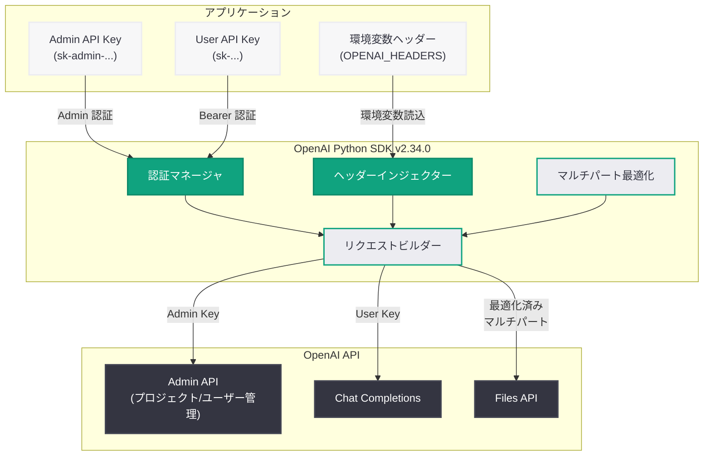
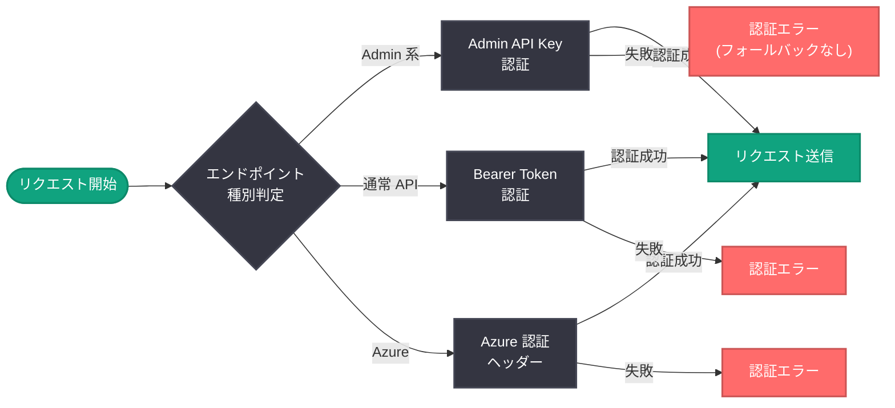

# OpenAI Python SDK v2.34.0: Admin API Key サポートと認証機構の大幅改善

## メタデータ

| 項目 | 内容 |
|------|------|
| 発表日 | 2026-05-04 |
| ソース | OpenAI API Changelog (GitHub Releases) |
| カテゴリ | API 更新 |
| 公式リンク | [Python SDK v2.34.0](https://github.com/openai/openai-python/releases/tag/v2.34.0) |

## 概要

OpenAI は 2026 年 5 月 4 日、Python SDK v2.34.0 をリリースした。今回のリリースの最大の注目点は、Admin API Key のエンドポイント単位でのサポートと、認証機構の包括的な改善である。プロジェクトに対する `external_key_id` の追加、ユーザー管理での `email` / `metadata` パラメータのサポート、そして Azure 認証ヘッダーの明示的な指定が可能になった。

さらに、型の修正 (タイムスタンプ型、`prompt_cache_retention` の enum 値修正)、マルチパートリクエストにおけるファイル構造コピーのパフォーマンス最適化、環境変数によるヘッダー設定機能の追加など、開発者体験を向上させる多数の改善が含まれている。

## 主な内容

### Admin API Key のエンドポイント単位サポート

エンドポイントごとに Admin API Key を設定できるようになった。従来はグローバルに 1 つの API キーを設定する方式が一般的だったが、v2.34.0 では管理系エンドポイント (プロジェクト管理、ユーザー管理など) に対して個別の Admin API Key を割り当てることが可能になる。これにより、組織内での権限分離とセキュリティの粒度が向上する。

加えて、プロジェクトに `external_key_id` を設定できるようになり、外部システムとの鍵の紐付けが容易になった。

### 認証機構の包括的改善

認証に関連する複数のバグ修正と機能改善が行われた。

- **Azure 認証ヘッダーの明示的指定:** Azure OpenAI Service を利用する際に、明示的に認証ヘッダーを設定できるようになった。従来の暗黙的なフォールバック動作に依存する必要がなくなり、認証フローの予測可能性が向上した
- **Admin 認証における Bearer フォールバックの回避:** Admin API の認証で不適切な Bearer トークンへのフォールバックが発生する問題が解消された
- **ストリームヘルパーにおける Bearer 認証の必須化:** ストリーミング系のヘルパーメソッドで Bearer 認証が適切に要求されるようになった
- **認証クレデンシャルの保持:** 認証情報が意図せず上書きされる問題が修正され、選択された認証クレデンシャルが正しく保持される

### 環境変数によるヘッダー設定

環境変数を通じてリクエストヘッダーを設定できる新機能が追加された。これにより、コードを変更することなく、デプロイ環境ごとにカスタムヘッダーを注入できるようになる。プロキシ環境やゲートウェイ経由でのアクセスにおいて特に有用である。

### 型の修正とデータモデルの改善

- **`prompt_cache_retention` enum 値の修正:** `in-memory` (ハイフン区切り) から `in_memory` (アンダースコア区切り) に修正。Python の命名規約に準拠した正しい値に統一された
- **タイムスタンプ型の修正:** `Response` モデルの `created_at` と `completed_at` が `float` 型に、その他のタイムスタンプが `int` 型に修正された
- **API キー属性の型保持:** Python の API キー属性の型が正しく保持されるようになった

### マルチパートリクエストのパフォーマンス最適化

マルチパートリクエストにおけるファイル構造のコピー処理が最適化された。大量のファイルをアップロードする際や、ファイル配列を含むリクエストにおいて、不要なメモリコピーが削減され、パフォーマンスが向上する。また、マルチパートファイル配列のフィールド名フォーマットも修正された。

## 技術的な詳細

### コードサンプル

#### SDK のアップグレード

```bash
# 最新版へのアップグレード
pip install --upgrade openai

# バージョン確認
python -c "import openai; print(openai.__version__)"
# 出力: 2.34.0

# 特定バージョンを指定してインストール
pip install openai==2.34.0
```

#### 環境変数によるヘッダー設定

```python
import os
from openai import OpenAI

# 環境変数でカスタムヘッダーを設定 (新機能: v2.34.0)
# デプロイ環境ごとにコードを変更せずヘッダーを注入可能
os.environ["OPENAI_HEADERS"] = "X-Custom-Header=my-value,X-Request-ID=req-123"

client = OpenAI()

# ヘッダーは自動的にリクエストに含まれる
response = client.chat.completions.create(
    model="gpt-4o",
    messages=[
        {"role": "user", "content": "Hello!"}
    ]
)
print(response.choices[0].message.content)
```

#### Admin API Key によるプロジェクト管理

```python
from openai import OpenAI

# Admin API Key を使用した管理操作
admin_client = OpenAI(
    api_key="sk-admin-...",  # Admin API Key
)

# プロジェクトに external_key_id を設定 (新機能: v2.34.0)
project = admin_client.organization.projects.create(
    name="Production App",
    external_key_id="ext-key-prod-001",  # 外部システムとの紐付け
)

# ユーザーに email と metadata を指定 (新機能: v2.34.0)
user = admin_client.organization.users.create(
    email="developer@example.com",
    metadata={"team": "backend", "role": "engineer"},
)

print(f"Project ID: {project.id}")
print(f"User ID: {user.id}")
```

#### Azure OpenAI Service での明示的認証

```python
from openai import AzureOpenAI

# Azure 認証ヘッダーの明示的設定 (修正: v2.34.0)
client = AzureOpenAI(
    azure_endpoint="https://my-resource.openai.azure.com",
    api_key="your-azure-api-key",
    api_version="2024-10-21",
    # 明示的な認証ヘッダーが正しく処理されるようになった
)

response = client.chat.completions.create(
    model="gpt-4o",
    messages=[
        {"role": "user", "content": "Hello from Azure!"}
    ]
)
print(response.choices[0].message.content)
```

### 変更一覧

| 種別 | 変更内容 |
|------|---------|
| 機能追加 | プロジェクトに `external_key_id` を追加 |
| 機能追加 | ユーザー管理に `email` / `metadata` パラメータを追加 |
| 機能追加 | エンドポイント単位の Admin API Key をサポート |
| 機能追加 | 環境変数によるヘッダー設定をサポート |
| バグ修正 | Azure 認証ヘッダーの明示的指定を許可 |
| バグ修正 | `prompt_cache_retention` の enum 値を `in_memory` に修正 |
| バグ修正 | Python API キー属性の型を保持 |
| バグ修正 | Admin 認証の Bearer フォールバックを回避 |
| バグ修正 | ストリームヘルパーで Bearer 認証を必須化 |
| バグ修正 | 認証クレデンシャルの保持を修正 |
| バグ修正 | `Response` モデルのタイムスタンプ型を修正 |
| バグ修正 | マルチパートファイル配列のフィールド名フォーマットを修正 |
| パフォーマンス | マルチパートリクエストのファイル構造コピーを最適化 |
| ドキュメント | ファイル作成 API にレート制限とベクターストア情報を追加 |

## アーキテクチャ

以下の図は、v2.34.0 で強化された Admin API Key の認証フローを示している。エンドポイント単位での Admin API Key サポートにより、管理操作と通常の API 呼び出しで異なる認証経路を使用できる仕組みを表している。



以下の図は、認証クレデンシャルの選択フローを示している。v2.34.0 での修正により、Admin API Key と通常の Bearer トークンが適切に区別され、不適切なフォールバックが防止される。



## 開発者への影響

### 組織管理者への恩恵

- **きめ細かいアクセス制御:** エンドポイント単位で Admin API Key を設定できるため、管理操作の権限をより細かく分離できる
- **外部システム統合:** `external_key_id` により、外部の鍵管理システムや ID プロバイダーとの統合が容易になる
- **ユーザー管理の柔軟性:** `email` / `metadata` パラメータの追加により、ユーザー情報の管理とフィルタリングが効率化される

### 認証処理の安定性向上

- **予測可能な認証動作:** Bearer トークンへの不適切なフォールバックが防止され、認証エラーが明確に報告されるようになった
- **Azure ユーザーの信頼性向上:** 明示的な Azure 認証ヘッダーが正しく処理されるようになり、Azure OpenAI Service 利用時の認証問題が解消された
- **ストリーミングの安全性:** ストリームヘルパーで Bearer 認証が必須化され、認証なしのストリーミングリクエストが防止される

### 型安全性の改善

- **タイムスタンプ処理の信頼性:** `created_at` / `completed_at` の型が正しく定義されたことで、時刻計算時の予期しない型エラーが解消される
- **キャッシュ設定の互換性:** `prompt_cache_retention` の enum 値が `in_memory` に修正されたため、ハイフン区切りの古い値を使用しているコードは更新が必要

### アップグレード時の注意点

- `prompt_cache_retention` に `in-memory` (ハイフン区切り) を使用している場合は `in_memory` (アンダースコア区切り) に変更が必要
- `Response` モデルの `created_at` / `completed_at` を `int` として処理していたコードは `float` 型への対応が必要な場合がある
- 認証関連のワークアラウンド (手動での Bearer フォールバック処理など) は不要になる可能性がある

## 関連リンク

- [Python SDK v2.34.0 リリースノート](https://github.com/openai/openai-python/releases/tag/v2.34.0)
- [OpenAI Admin API ドキュメント](https://platform.openai.com/docs/api-reference/organization)
- [OpenAI API Changelog](https://platform.openai.com/docs/changelog)
- [openai-python GitHub リポジトリ](https://github.com/openai/openai-python)
- [OpenAI API リファレンス](https://platform.openai.com/docs/api-reference)
- [Azure OpenAI Service ドキュメント](https://learn.microsoft.com/azure/ai-services/openai/)

## まとめ

Python SDK v2.34.0 は、Admin API Key のエンドポイント単位サポートと認証機構の包括的改善を中心としたリリースである。組織管理者にとっては、`external_key_id` やユーザー管理パラメータの追加により、きめ細かいアクセス制御と外部システム統合の選択肢が広がった。認証に関する 7 件のバグ修正により、Azure 環境を含む様々な認証シナリオでの信頼性が大幅に向上し、不適切なフォールバック動作に起因する予期しない認証エラーが解消された。型の修正は既存コードに影響を与える可能性があるため、特に `prompt_cache_retention` の enum 値とタイムスタンプ型の変更に注意してアップグレードを行うことが推奨される。マルチパートリクエストのパフォーマンス最適化は、大量ファイルアップロードのユースケースにおいて体感的な速度改善をもたらすだろう。
