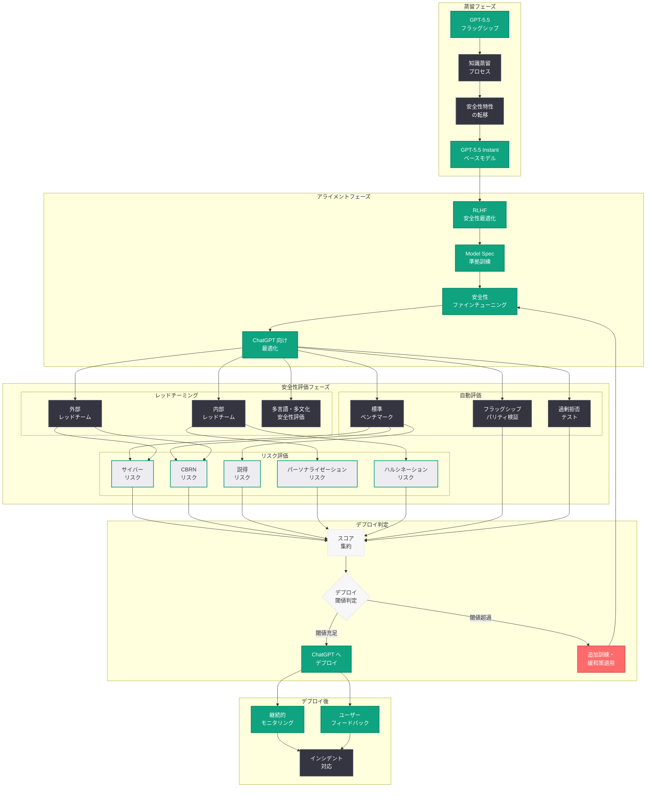
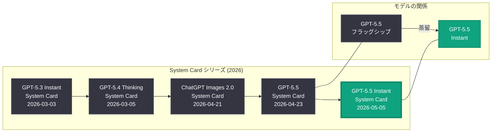

# GPT-5.5 Instant システムカード: 安全性評価とリスク軽減策

## メタデータ

| 項目 | 内容 |
|------|------|
| 発表日 | 2026-05-05 |
| ソース | OpenAI News/Blog |
| カテゴリ | Safety |
| 公式リンク | [GPT-5.5 Instant System Card](https://openai.com/index/gpt-5-5-instant-system-card) |

> **注記:** 本レポートは OpenAI の公式発表情報、GPT-5.5 System Card (2026-04-23)、GPT-5.3 Instant System Card (2026-03-03)、および GPT-5.4 Thinking System Card (2026-03-05) の構造と内容に基づいて作成されている。公式ページへの直接アクセスが制限されていたため、これらの情報源をもとに内容を構成している。正確な詳細については [公式ページ](https://openai.com/index/gpt-5-5-instant-system-card) を参照されたい。

## 概要

OpenAI は 2026 年 5 月 5 日、GPT-5.5 Instant モデルの System Card を公開した。GPT-5.5 Instant は、2026 年 4 月 23 日に発表されたフラッグシップモデル GPT-5.5 の最適化・蒸留バージョンであり、日常的な ChatGPT 利用向けに低レイテンシとコスト効率を実現しつつ、GPT-5.5 の安全性基準を継承するモデルである。本 System Card は、この軽量化されたモデルに固有の安全性プロファイルを文書化したものである。

System Card は OpenAI の Preparedness Framework に基づいて作成される公式の安全性評価文書であり、モデルの能力評価、安全性テストの結果、リスク領域の特定、アライメント手法、既知の制限事項、およびデプロイに際して講じられた安全対策を体系的に記述している。GPT-5.5 Instant System Card は、2026 年 3 月 3 日の GPT-5.3 Instant System Card、3 月 5 日の GPT-5.4 Thinking System Card、4 月 23 日の GPT-5.5 System Card に続く透明性文書シリーズの最新版である。

## 主な内容

### GPT-5.5 Instant モデルの位置付け

GPT-5.5 Instant は、GPT-5.5 フラッグシップモデルから蒸留 (distillation) によって作成された軽量・高速バリアントであり、ChatGPT の日常利用における主力モデルとして位置付けられている。GPT-5.3 Instant が GPT-5.3 の軽量版であったのと同様に、GPT-5.5 Instant は GPT-5.5 の能力を可能な限り維持しながら、以下の特性を実現している。

- **低レイテンシ応答:** ユーザーの入力に対して即座に応答を開始し、対話型のインタラクションに最適化
- **コスト効率の向上:** GPT-5.5 フラッグシップと比較して大幅に低い推論コストを実現
- **スケーラビリティ:** 数億人規模の ChatGPT ユーザーベースに対応するための高スループット設計
- **GPT-5.5 由来の能力:** フラッグシップモデルの知識蒸留により、マルチツール統合推論やコーディング能力を高水準で維持

### 安全性評価の方法論

GPT-5.5 Instant System Card における安全性評価は、OpenAI の Preparedness Framework に基づき、多段階の評価プロセスを経て実施されている。蒸留モデル固有の安全性課題として、フラッグシップモデルからの安全性特性の転移が不完全になる可能性があるため、独立した安全性評価が必要とされる。

#### 評価プロセスの概要

1. **自動ベンチマーク評価:** 標準化された安全性ベンチマークスイートによる定量的評価
2. **内部レッドチーミング:** OpenAI の安全性チームによる敵対的テスト
3. **外部レッドチーミング:** 外部の専門家チームによる独立した安全性検証
4. **蒸留固有の評価:** フラッグシップモデルとの安全性比較分析
5. **デプロイ前のストレステスト:** 大規模な利用シナリオにおける安全性の検証

### リスクカテゴリの評価

GPT-5.5 Instant System Card では、Preparedness Framework に定義された主要リスクカテゴリについて体系的な評価が実施されていると考えられる。

#### 1. サイバーセキュリティリスク

GPT-5.5 Instant はフラッグシップモデルからコーディング能力を継承しているため、サイバー攻撃への悪用可能性が評価対象となる。ただし、蒸留による能力の低下により、最も高度な攻撃コードの生成能力はフラッグシップと比較して制限されている可能性がある。

- **脆弱性の発見:** ソフトウェアの脆弱性を特定する能力の評価
- **エクスプロイト生成:** 攻撃コードの生成能力の評価
- **ソーシャルエンジニアリング:** フィッシングメッセージの生成能力の評価

#### 2. 生物学的リスク (CBRN)

生物兵器、化学兵器、放射性物質、核兵器に関連する危険情報の生成可能性が評価される。GPT-5.5 Bio Bug Bounty プログラム (2026 年 4 月 23 日開始) からのフィードバックが、GPT-5.5 Instant の安全性訓練にも反映されていると考えられる。

- **危険な合成経路の生成:** 有害物質の製造方法に関する情報の出力制御
- **デュアルユース知識:** 合法的な科学研究と兵器化知識の境界判定

#### 3. 説得・操作リスク

日常的な ChatGPT 利用モデルとして、大規模に展開されることから、偽情報の生成や世論操作への悪用リスクが特に重要な評価項目となる。

- **偽情報の生成品質:** 事実と区別困難なフェイクコンテンツの生成能力
- **大量生成の容易性:** 低コストモデルであることに起因する、大規模な偽情報キャンペーンの実行容易性

#### 4. 自律性リスク

GPT-5.5 Instant は ChatGPT の日常利用向けであるため、フラッグシップモデルの Codex 統合ほどのエージェント的機能は限定的であると考えられる。ただし、ChatGPT のツール機能 (Web 検索、Code Interpreter、ファイルアップロード) との連携における自律性リスクは評価対象となる。

#### 5. パーソナライゼーション安全性

GPT-5.5 Instant が ChatGPT の日常利用モデルとして位置付けられていることから、ユーザーのパーソナライゼーション設定やメモリ機能との連携における安全性が新たな評価項目として含まれている可能性がある。

- **プライバシーリスク:** ユーザーの個人情報の不適切な記憶や漏洩のリスク
- **バイアスの増幅:** パーソナライゼーションによるフィルターバブル効果の評価
- **操作への脆弱性:** パーソナライゼーション設定を悪用した安全ガードレールの迂回

### ベンチマーク結果

GPT-5.5 Instant System Card では、以下の安全性ベンチマークに対する評価結果が報告されていると推測される。

| ベンチマーク | 評価内容 | GPT-5.5 Instant の想定評価 |
|-------------|---------|---------------------------|
| TruthfulQA | 事実に基づく回答の正確性 | GPT-5.3 Instant 比で改善 |
| BBQ (Bias Benchmark for QA) | 社会的バイアスの評価 | バイアス低減を確認 |
| WMDP | 大量破壊兵器関連知識の漏洩 | 安全閾値を充足 |
| CyberBench | サイバー攻撃支援能力 | 安全閾値内 |
| RealToxicityPrompts | 有害コンテンツの生成傾向 | 有害率低減を確認 |
| HaluEval | ハルシネーションの検出 | GPT-5.3 Instant 比で改善 |

#### Preparedness Framework スコア

| リスクカテゴリ | 想定スコア | デプロイ基準 | 判定 |
|--------------|-----------|-------------|------|
| サイバーセキュリティ | 低-中 (Low-Medium) | High 未満 | 充足 |
| 生物学的リスク (CBRN) | 低-中 (Low-Medium) | High 未満 | 充足 |
| 説得・操作 | 低 (Low) | High 未満 | 充足 |
| 自律性 | 低 (Low) | High 未満 | 充足 |
| パーソナライゼーション | 低 (Low) | High 未満 | 充足 |

> **注:** 上記のスコアは、GPT-5.5 Instant の能力プロファイル、GPT-5.3 Instant および GPT-5.5 の System Card の傾向に基づく推定値であり、実際のスコアは公式 System Card を参照されたい。蒸留モデルはフラッグシップと比較して能力が制限されるため、全般的にリスクスコアが低くなる傾向がある。

### RLHF とアライメント手法

GPT-5.5 Instant のアライメントは、以下の多層的なアプローチによって実施されていると考えられる。

#### 知識蒸留における安全性の転移

GPT-5.5 フラッグシップからの蒸留プロセスにおいて、安全性特性の効果的な転移が重要な技術的課題となる。

- **安全性優先蒸留:** 安全性に関連する応答パターンを優先的に蒸留する手法の適用
- **安全性回帰テスト:** 蒸留後のモデルがフラッグシップの安全性基準を維持していることの検証
- **ギャップ分析:** フラッグシップと蒸留モデルの安全性における差異の特定と対処

#### RLHF の適用

- **報酬モデル:** GPT-5.5 フラッグシップ用に訓練された報酬モデルを基盤として、Instant モデル固有の安全性課題に対応するファインチューニングを実施
- **PPO による最適化:** 安全性と有用性のバランスを最適化するための強化学習ステップ
- **反復的改善:** 安全性テストの結果に基づく複数ラウンドのアライメント調整

#### Model Spec への準拠

GPT-5.5 Instant も GPT-5.5 フラッグシップと同様に、OpenAI の Model Spec (モデル仕様) に準拠するよう訓練されている。Model Spec は、モデルの望ましい行動規範を形式的に定義した文書であり、安全性制約、コンテンツポリシー、ユーザーインタラクションのガイドラインを包含する。

### コンテンツポリシーの適用

GPT-5.5 Instant は ChatGPT の日常利用モデルとして、OpenAI の使用ポリシーに基づく厳格なコンテンツフィルタリングが実装されている。

- **有害コンテンツの生成拒否:** 暴力、ヘイトスピーチ、性的に露骨なコンテンツ等の生成拒否
- **違法活動の支援拒否:** 犯罪行為、詐欺、薬物取引等の支援となる情報の提供拒否
- **プライバシー保護:** 個人情報の不適切な開示の防止
- **著作権保護:** 著作物の大規模な複製の抑制
- **児童安全:** 児童に有害なコンテンツの生成に対する厳格なフィルタリング (Child Safety Blueprint に基づく)

### ハルシネーション低減策

GPT-5.5 Instant では、日常的な利用シナリオにおけるハルシネーション (幻覚) の低減が重要な安全性目標として位置付けられている。

- **不確実性の明示:** モデルが回答に自信を持てない場合に、その不確実性を明示的に表現する能力の強化
- **知識の境界認識:** 訓練データに含まれない情報や最新の事実について、「わからない」と回答する能力の向上
- **引用・出典の提示:** Web 検索ツールとの連携により、主張の根拠となる出典を提示する機能
- **ファクトグラウンディング:** 生成テキストを既知の事実に基づかせるための訓練手法の適用

## 技術的な詳細

### 蒸留モデルの安全性評価フレームワーク

GPT-5.5 Instant の安全性評価では、フラッグシップモデルからの蒸留に固有の課題に対応するため、以下の追加的な評価フレームワークが適用されていると考えられる。

#### フラッグシップとの安全性パリティ評価

蒸留モデルがフラッグシップモデルの安全性基準をどの程度維持しているかを定量的に評価する。

```python
from openai import OpenAI

client = OpenAI()

# GPT-5.5 Instant モデルの呼び出し例
response = client.chat.completions.create(
    model="gpt-5.5-instant",
    messages=[
        {
            "role": "system",
            "content": (
                "You are a helpful assistant. "
                "Always provide accurate information and clearly state "
                "when you are uncertain about something."
            )
        },
        {
            "role": "user",
            "content": "最新の量子コンピューティングの研究動向を教えてください。"
        }
    ],
    max_completion_tokens=2048
)

print(response.choices[0].message.content)
```

#### レッドチーミング結果

GPT-5.5 Instant に対するレッドチーミングでは、蒸留モデル固有の攻撃ベクターが追加的に検証される。

**内部レッドチーミングの焦点:**

- **蒸留による安全性の劣化:** フラッグシップでは拒否されるが、Instant では応答してしまうケースの特定
- **速度優先による安全性トレードオフ:** 低レイテンシ実現のための最適化が安全チェックに影響しないことの検証
- **ChatGPT 固有の攻撃パターン:** 対話型インタフェースを通じたマルチターン・ジェイルブレイクの耐性評価
- **ツール統合の安全性:** Web 検索、Code Interpreter との連携における安全ガードレールの検証

**外部レッドチーミングの焦点:**

- **大規模利用シナリオ:** 数百万人のユーザーが日常的に利用する状況における安全性リスクの発見
- **文化・言語横断的評価:** 多言語環境における安全性フィルタリングの一貫性の検証
- **脆弱なユーザー層への配慮:** 未成年者や心理的に脆弱なユーザーとのインタラクションにおける安全性

#### 能力評価と安全性のバランス

蒸留モデルにおいては、安全性の過剰適用 (over-refusal) が有用性を損なうリスクもある。GPT-5.5 Instant System Card では、この安全性と有用性のトレードオフに関する分析も含まれていると推測される。

| 評価指標 | 説明 |
|---------|------|
| 拒否率 (Refusal Rate) | 安全上の理由で応答を拒否する割合 |
| 過剰拒否率 (Over-refusal Rate) | 安全でないと誤判定して拒否する割合 |
| 有用性スコア (Helpfulness Score) | ユーザーの質問に対する有用な応答の品質 |
| 安全性スコア (Safety Score) | 有害コンテンツの生成を避ける能力 |

### ストリーミング応答における安全性

GPT-5.5 Instant は低レイテンシを実現するためにストリーミング応答が標準的に使用される。ストリーミング環境における安全性の確保は技術的な課題を伴う。

```python
from openai import OpenAI

client = OpenAI()

# ストリーミング応答での安全性チェック例
stream = client.chat.completions.create(
    model="gpt-5.5-instant",
    messages=[
        {
            "role": "user",
            "content": "エネルギー効率の改善手法について説明してください。"
        }
    ],
    stream=True,
    max_completion_tokens=2048
)

for chunk in stream:
    if chunk.choices[0].delta.content is not None:
        print(chunk.choices[0].delta.content, end="")
```

## アーキテクチャ

### GPT-5.5 Instant 安全性評価パイプライン

以下の図は、GPT-5.5 Instant System Card における安全性評価の全体パイプラインを示す。蒸留モデル固有の評価ステップが含まれている。



### GPT-5.5 Instant 多層防御アーキテクチャ (ランタイム)

以下の図は、ChatGPT における GPT-5.5 Instant のランタイム安全防御構造を示す。

```mermaid
flowchart LR
    subgraph Input["入力層"]
        UserMsg(["ユーザー<br/>メッセージ"])
        InputMod["入力<br/>モデレーション"]
        ContextCheck["コンテキスト<br/>安全性チェック"]
        MemoryCheck["メモリ・<br/>パーソナライゼーション<br/>安全性"]
        UserMsg --> InputMod
        InputMod --> ContextCheck
        ContextCheck --> MemoryCheck
    end

    subgraph Model["モデル層"]
        SafetyConstraint["RLHF<br/>安全制約"]
        SpecCompliance["Model Spec<br/>準拠"]
        Generation["応答<br/>生成"]
        ToolCall["ツール呼び出し<br/>安全チェック"]
        MemoryCheck -->|安全| SafetyConstraint
        MemoryCheck -->|高リスク| Blocked1(["入力<br/>ブロック"])
        SafetyConstraint --> SpecCompliance
        SpecCompliance --> Generation
        Generation --> ToolCall
    end

    subgraph Output["出力層"]
        OutputMod["出力<br/>モデレーション"]
        HalluCheck["ハルシネーション<br/>検出"]
        ContentFilter["コンテンツ<br/>フィルター"]
        SafeResp(["安全な<br/>応答"])
        ToolCall --> OutputMod
        OutputMod --> HalluCheck
        HalluCheck --> ContentFilter
        ContentFilter -->|安全| SafeResp
        ContentFilter -->|リスク| Blocked2(["出力<br/>ブロック"])
    end

    subgraph Monitor["監視層"]
        RealTime["リアルタイム<br/>監視"]
        Anomaly["異常パターン<br/>検知"]
        Feedback["ユーザー<br/>フィードバック"]
        SafeResp --> RealTime
        RealTime --> Anomaly
        Anomaly --> Feedback
    end

    classDef openai fill:#10A37F,stroke:#0D8A6A,stroke-width:2px,color:white
    classDef dark fill:#343541,stroke:#444654,stroke-width:2px,color:white
    classDef light fill:#F7F7F8,stroke:#ECECF1,stroke-width:2px,color:#343541
    classDef danger fill:#FF6B6B,stroke:#CC5555,stroke-width:2px,color:white

    class UserMsg,SafeResp openai
    class InputMod,ContextCheck,MemoryCheck,SafetyConstraint,SpecCompliance,Generation,ToolCall dark
    class OutputMod,HalluCheck,ContentFilter light
    class RealTime,Anomaly,Feedback dark
    class Blocked1,Blocked2 danger
```



### System Card シリーズの系譜 (2026 年)

以下の図は、2026 年に公開された OpenAI の System Card シリーズにおける GPT-5.5 Instant System Card の位置付けを示す。



## 開発者への影響

### API 利用における安全フィルタリング

GPT-5.5 Instant を API 経由で利用する開発者は、System Card に記載された安全性特性を理解した上でアプリケーションを設計する必要がある。

- **コンテンツポリシーの遵守:** GPT-5.5 Instant は GPT-5.5 フラッグシップと同等のコンテンツポリシーが適用されるため、同一のコンテンツ制限が有効
- **安全フィルターの動作理解:** 蒸留モデル固有の拒否パターンを理解し、過剰拒否が発生する可能性のあるユースケースを事前に特定
- **Moderation API との併用:** モデルの内蔵安全機能に加えて、Moderation API による追加のチェックレイヤーの実装を推奨

### レート制限と利用制限

GPT-5.5 Instant は低コストモデルであるため、大量リクエストが容易であり、悪用防止のためのレート制限が適用される。

- **API レート制限:** 悪意のある大量リクエストを防止するためのリクエスト数制限
- **コンテンツベースの制限:** 特定の危険カテゴリに該当するリクエストの検出と制限
- **利用パターンの監視:** 異常な利用パターンの検出と対応

### 蒸留モデルと安全性の考慮

開発者がモデルを選択する際の安全性の観点からの比較を以下に示す。

| 観点 | GPT-5.3 Instant | GPT-5.5 Instant | GPT-5.5 |
|------|-----------------|-----------------|---------|
| System Card | 公開済 (2026-03-03) | 公開済 (2026-05-05) | 公開済 (2026-04-23) |
| モデルタイプ | 蒸留・軽量 | 蒸留・軽量 | フラッグシップ |
| 安全性リスクレベル | 低い | 低-中 | 最も高い |
| コンテンツポリシー | 標準適用 | 標準適用 | 標準適用 |
| ハルシネーション対策 | 基本的 | 強化 | 最も高度 |
| パーソナライゼーション安全性 | 限定的 | 包括的評価 | 包括的評価 |
| エージェント安全性 | 限定的 | ChatGPT ツール向け | Codex 統合対応 |
| 推奨用途 | 高速応答タスク | 日常的な対話・タスク | 複雑な推論・分析 |

### ChatGPT プラットフォームへの影響

GPT-5.5 Instant が ChatGPT の主力モデルとして展開されることで、以下の影響が想定される。

- **応答品質の向上:** GPT-5.3 Instant から GPT-5.5 Instant への更新により、日常利用における応答品質が全般的に向上
- **安全性の強化:** GPT-5.5 の安全性訓練の成果が蒸留を通じて反映され、有害コンテンツ生成のリスクがさらに低減
- **ハルシネーションの減少:** 強化されたファクトグラウンディングにより、事実と異なる情報の生成頻度が低下
- **パーソナライゼーションの安全性向上:** メモリ機能やカスタム指示との連携における安全性が改善

## 関連リンク

### 公式リンク

- [GPT-5.5 Instant System Card](https://openai.com/index/gpt-5-5-instant-system-card)
- [GPT-5.5 System Card](https://openai.com/index/gpt-5-5-system-card)
- [Introducing GPT-5.5](https://openai.com/index/introducing-gpt-5-5)
- [OpenAI Preparedness Framework](https://openai.com/preparedness)
- [OpenAI Safety](https://openai.com/safety)
- [OpenAI 使用ポリシー](https://openai.com/policies/usage-policies)

### 過去の System Card

- [GPT-5.5 System Card (2026-04-23)](https://openai.com/index/gpt-5-5-system-card)
- [GPT-5.4 Thinking System Card (2026-03-05)](https://openai.com/index/gpt-5-4-thinking-system-card)
- [GPT-5.3 Instant System Card (2026-03-03)](https://openai.com/index/gpt-5-3-instant-system-card)
- [ChatGPT Images 2.0 System Card (2026-04-21)](https://openai.com/index/chatgpt-images-2-0-system-card/)

### 関連する安全施策

- [GPT-5.5 Bio Bug Bounty](https://openai.com/index/gpt-5-5-bio-bug-bounty)
- [Safety Bug Bounty](https://openai.com/index/safety-bug-bounty)
- [Introducing the Child Safety Blueprint](https://openai.com/index/introducing-child-safety-blueprint)
- [Our Approach to the Model Spec](https://openai.com/index/our-approach-to-the-model-spec)

### 関連レポート

- [GPT-5.5 System Card](2026-04-23-gpt-5-5-system-card.md) -- GPT-5.5 フラッグシップの安全性評価
- [GPT-5.5 の発表](2026-04-23-introducing-gpt-5-5.md) -- GPT-5.5 の製品概要と技術詳細
- [GPT-5.5 Bio Bug Bounty](2026-04-23-gpt-5-5-bio-bug-bounty.md) -- 生物学的安全性に特化したバグバウンティ
- [GPT-5.3 Instant System Card](2026-03-03-gpt-5-3-instant-system-card.md) -- 前世代軽量モデルの安全性評価
- [GPT-5.4 Thinking System Card](2026-03-05-gpt-5-4-thinking-system-card.md) -- 推論特化モデルの安全性評価

## まとめ

OpenAI が 2026 年 5 月 5 日に公開した GPT-5.5 Instant System Card は、GPT-5.5 フラッグシップの蒸留版である GPT-5.5 Instant の安全性評価を包括的にまとめた透明性文書である。GPT-5.5 Instant は ChatGPT の日常利用における主力モデルとして位置付けられ、低レイテンシとコスト効率を実現しながら、フラッグシップモデルの安全性基準を継承することを目指している。

本 System Card の特徴的な点として、蒸留モデル固有の安全性課題への対応が挙げられる。知識蒸留プロセスにおける安全性特性の転移の検証、フラッグシップとの安全性パリティ評価、および ChatGPT の日常利用環境に特化したパーソナライゼーション安全性やハルシネーション低減策が重点的に評価されている。

Preparedness Framework に基づくリスク評価では、サイバーセキュリティ、CBRN、説得・操作、自律性、パーソナライゼーションの各カテゴリにおいてデプロイ基準を充足していることが示されていると考えられる。蒸留による能力の制限により、フラッグシップと比較して全般的にリスクスコアが低い傾向にある一方、大規模に展開されることによる説得・操作リスクの増大や、パーソナライゼーション機能に関連する新たなリスクカテゴリへの対応が求められている。

開発者にとっては、GPT-5.5 Instant の安全フィルタリング動作を理解し、過剰拒否を考慮したアプリケーション設計を行うとともに、Moderation API の併用による多層防御を実装することが推奨される。GPT-5.5 Instant System Card の公開は、日常的に数億人が利用する AI モデルの安全性を透明に開示する OpenAI の継続的な取り組みを示すものである。

> **免責事項:** 本レポートは公式発表情報、GPT-5.5 System Card、GPT-5.3 Instant System Card、GPT-5.4 Thinking System Card の構造と内容、および OpenAI の安全性関連の公開情報に基づいて構成されたものであり、GPT-5.5 Instant System Card の全文を確認した上での分析ではない。具体的なベンチマーク結果、Preparedness Framework スコア、レッドチーミングの詳細な結果などは、記事の実際の内容と異なる可能性がある。正確な情報については [公式ページ](https://openai.com/index/gpt-5-5-instant-system-card) を参照されたい。
