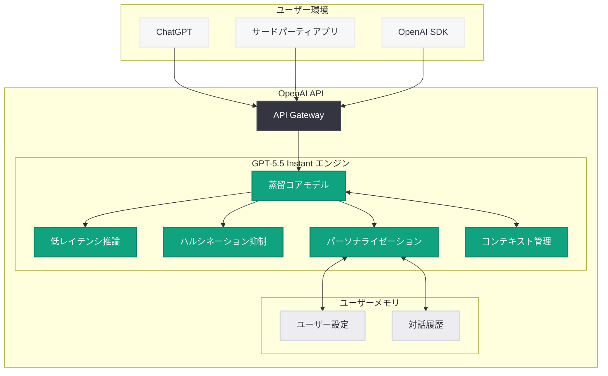
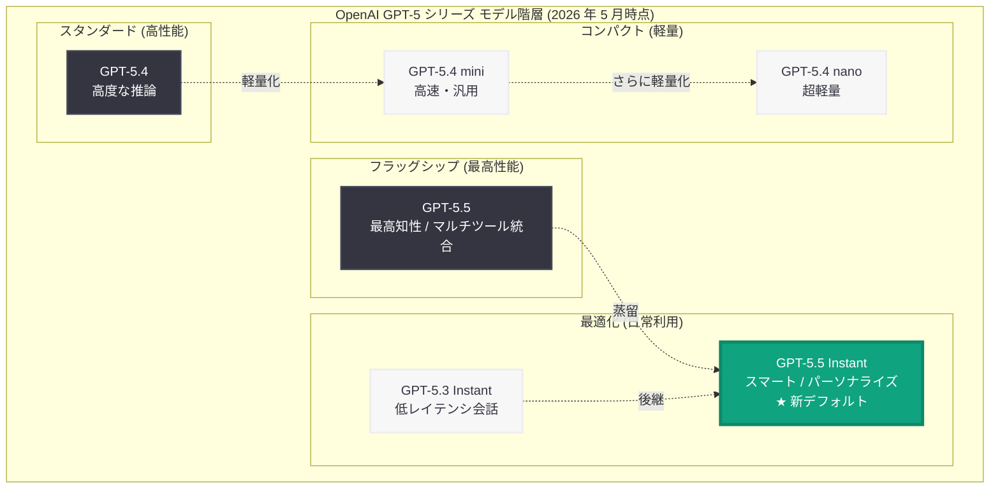
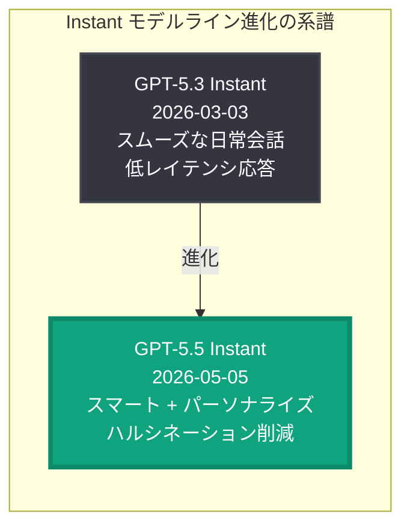

# GPT-5.5 Instant: よりスマートで明確、パーソナライズされた ChatGPT のデフォルトモデル

## メタデータ

| 項目 | 内容 |
|------|------|
| 発表日 | 2026-05-05 |
| ソース | OpenAI News/Blog |
| カテゴリ | Product |
| 公式リンク | [GPT-5.5 Instant](https://openai.com/index/gpt-5-5-instant) |

> **注記:** 本レポートは OpenAI の公式発表に基づいて作成されている。公式ページへの直接アクセスが制限されていたため、公式の説明文および関連する公開情報をもとに内容を構成している。正確な詳細については [公式ページ](https://openai.com/index/gpt-5-5-instant) を参照されたい。

## 概要

OpenAI は 2026 年 5 月 5 日、ChatGPT のデフォルトモデルを「GPT-5.5 Instant」に更新したことを発表した。GPT-5.5 Instant は、2026 年 4 月 23 日にリリースされたフラッグシップモデル GPT-5.5 の蒸留・最適化バージョンであり、日常的な ChatGPT 利用において「よりスマートで、より明確で、よりパーソナライズされた」体験を提供することを目指している。

GPT-5.5 Instant は「Instant」モデルラインの最新版として、GPT-5.3 Instant (2026-03-03) の後継に位置づけられる。フルモデルである GPT-5.5 の高い知性を継承しつつ、低レイテンシでの応答、ハルシネーションの削減、そして新たに導入されたパーソナライゼーション制御機能により、毎日の ChatGPT 利用を大きく改善するモデルとなっている。ChatGPT の全ユーザーに対してデフォルトモデルとしてロールアウトされることで、数億人規模のユーザーベースに直接影響を与える重要なアップデートである。

## 主な内容

### よりスマートで正確な回答

GPT-5.5 Instant は、前世代の GPT-5.3 Instant と比較して回答の質と正確性が大幅に向上している。フルモデル GPT-5.5 の知識と推論能力を蒸留技術により効率的に圧縮し、日常会話に最適化した形で提供する。

- **推論能力の向上:** GPT-5.5 のマルチステップ推論能力を継承し、複雑な質問に対しても論理的で正確な回答を生成
- **知識の最新性:** 最新のトレーニングデータに基づく幅広い知識ベースにより、時事的な質問にも対応
- **回答の明確性:** 冗長な表現を排除し、ユーザーが求める情報を簡潔かつ明確に伝達する最適化
- **コンテキスト活用の強化:** 会話履歴やユーザーの意図をより深く理解し、文脈に即した的確な応答を実現

### ハルシネーションの削減

GPT-5.5 Instant において、ハルシネーション (AI が事実に基づかない情報を生成する問題) の大幅な削減が実現されている。

- **事実整合性の向上:** 回答を生成する際の内部的な事実チェック機構が強化され、不正確な情報の出力頻度を大幅に低減
- **不確実性の明示:** モデルが確信を持てない情報については、その旨を明示するよう設計されており、ユーザーが回答の信頼性を判断しやすくなっている
- **「わからない」と言う能力:** 十分な情報がない場合に無理に回答を生成するのではなく、適切に「わからない」と表明する能力が向上
- **ソース参照の改善:** Web 検索を伴う回答では、情報の出典をより正確に示す機能が強化

### パーソナライゼーション制御

GPT-5.5 Instant の最も注目すべき新機能の一つが、改善されたパーソナライゼーション制御である。ユーザーが AI との対話体験を自身の好みに合わせてカスタマイズできる機能が拡張されている。

- **応答スタイルの調整:** 簡潔な回答を好むか、詳細な説明を好むかなど、ユーザーの好みに応じた応答スタイルの自動適応
- **トーンのカスタマイズ:** フォーマルからカジュアルまで、ユーザーの求めるコミュニケーションスタイルに柔軟に対応
- **専門分野の認識:** ユーザーの専門知識レベルや関心分野を学習し、適切な深さと専門性で情報を提供
- **記憶とコンテキスト:** ユーザーの過去の対話から好みや状況を記憶し、継続的な対話でより適切な応答を実現
- **制御の透明性:** パーソナライゼーションの設定をユーザーが明示的に確認・変更できるインターフェースの提供

### ChatGPT のデフォルトモデルとしての展開

GPT-5.5 Instant は、ChatGPT の新しいデフォルトモデルとしてロールアウトされる。

- **段階的なロールアウト:** 全ユーザーに対して順次提供が開始され、数日から数週間かけて完全に展開される見込み
- **無料ユーザーへの提供:** ChatGPT Free を含む全プランのユーザーがデフォルトでアクセス可能
- **シームレスな移行:** ユーザー側での設定変更は不要で、自動的に新モデルが適用
- **上位モデルとの共存:** GPT-5.5 フルモデルや推論特化モデルは引き続きプレミアムユーザー向けに利用可能

## 技術的な詳細

### API モデル名

GPT-5.5 Instant は OpenAI API を通じて以下のモデル名で利用可能と想定される。

- **モデル名:** `gpt-5.5-instant`

### モデルの位置づけ

| 特性 | GPT-5.3 Instant | GPT-5.5 Instant | GPT-5.5 (フル) |
|------|-----------------|-----------------|----------------|
| 主な用途 | 日常会話 | 日常会話 + パーソナライズ | 高度なタスク |
| 推論能力 | 基本的 | 中~高 | 最高 |
| 応答速度 | 高速 | 高速 | 標準 |
| ハルシネーション | 標準 | 大幅削減 | 低 |
| パーソナライゼーション | 基本 | 高度な制御 | 基本 |
| マルチツール統合 | 非対応 | 限定的 | フル対応 |
| コスト (推定) | 低 | 低~中 | 高 |
| ChatGPT デフォルト | 旧デフォルト | 新デフォルト | プレミアム |

### コードサンプル: 基本的な API 呼び出し

```python
from openai import OpenAI

client = OpenAI()

# GPT-5.5 Instant による基本的な対話
response = client.chat.completions.create(
    model="gpt-5.5-instant",
    messages=[
        {"role": "system", "content": "You are a helpful assistant."},
        {"role": "user", "content": "来週の東京の天気予報を教えてください。"}
    ],
    max_tokens=1024
)

print(response.choices[0].message.content)
```

### コードサンプル: ストリーミング応答

GPT-5.5 Instant の低レイテンシ特性を活かしたストリーミング利用の例を示す。

```python
from openai import OpenAI

client = OpenAI()

# ストリーミングによるリアルタイム応答
stream = client.chat.completions.create(
    model="gpt-5.5-instant",
    messages=[
        {
            "role": "system",
            "content": (
                "You are a concise and helpful assistant. "
                "Provide clear, accurate answers without unnecessary elaboration."
            )
        },
        {
            "role": "user",
            "content": "Python で CSV ファイルを読み込んで集計する方法を簡潔に教えてください。"
        }
    ],
    stream=True
)

for chunk in stream:
    if chunk.choices[0].delta.content is not None:
        print(chunk.choices[0].delta.content, end="", flush=True)
print()
```

### コードサンプル: Responses API での利用

```python
from openai import OpenAI

client = OpenAI()

# Responses API を使用した日常的なタスク
response = client.responses.create(
    model="gpt-5.5-instant",
    input="明日の朝 9 時に歯医者の予約があることをリマインドするメッセージを作成してください。",
)

print(response.output_text)
```

### コードサンプル: パーソナライゼーションを活用した対話

```python
from openai import OpenAI

client = OpenAI()

# ユーザーの好みを反映したシステムプロンプトの活用
response = client.chat.completions.create(
    model="gpt-5.5-instant",
    messages=[
        {
            "role": "system",
            "content": (
                "You are a helpful assistant. The user prefers concise, "
                "bullet-point style responses. They are a software engineer "
                "with expertise in Python and cloud architecture."
            )
        },
        {
            "role": "user",
            "content": "AWS Lambda のコールドスタート対策について教えて。"
        }
    ],
    max_tokens=1024
)

print(response.choices[0].message.content)
```

> **注:** 上記のコード例は一般的な利用パターンの想定であり、実際のモデル名やパラメータの詳細は公式ドキュメントを参照されたい。

## アーキテクチャ

### GPT-5.5 Instant のシステム構成



### OpenAI モデル階層における位置づけ



### Instant モデルラインの進化



## 開発者への影響

### ChatGPT デフォルトモデルの変更

GPT-5.5 Instant が ChatGPT のデフォルトモデルとなることで、開発者が ChatGPT プラグインや連携機能を構築している場合に影響が生じる可能性がある。

- **応答品質の向上:** デフォルトモデルの知性が向上するため、ChatGPT 連携アプリケーションのユーザー体験が自動的に改善される
- **応答スタイルの変化:** 前モデルと比較して応答のスタイルや詳細度が異なる場合があるため、プロンプトの調整が必要になる可能性がある
- **パーソナライゼーション対応:** 新しいパーソナライゼーション機能に対応したアプリケーション設計を検討すべきである

### API での利用

GPT-5.5 Instant が API を通じて利用可能になった場合、以下の観点で開発者にメリットがある。

- **コスト効率の高い高品質モデル:** フルモデル GPT-5.5 と比較して低コストでありながら、日常的なタスクには十分な品質を提供
- **低レイテンシ:** チャットボットやリアルタイムアプリケーションにおいて、ユーザー体験を損なわない高速な応答
- **ハルシネーション削減:** 事実に基づいた回答が求められるカスタマーサポートや情報提供サービスにおいて、信頼性の高い応答を実現

### モデル選択の最適化

GPT-5.5 Instant の追加により、開発者はより細かい粒度でモデルを選択できるようになる。

| ユースケース | 推奨モデル | 理由 |
|-------------|-----------|------|
| 高度なコーディング・リサーチ | GPT-5.5 | 最高の知性とマルチツール統合 |
| 日常会話・カスタマーサポート | GPT-5.5 Instant | 高品質 + 低レイテンシ + 低ハルシネーション |
| 汎用開発・エージェント | GPT-5.4 mini | コストと性能のバランス |
| 大量 API リクエスト | GPT-5.4 nano | 超低レイテンシ・最低コスト |

### 移行時の考慮事項

- **GPT-5.3 Instant からの移行:** 応答品質が向上するため、多くの場合はシームレスに移行可能。ただし、応答スタイルの変化に伴いプロンプト調整が必要な場合がある
- **パーソナライゼーション API:** 新しいパーソナライゼーション制御機能の API が提供される場合、既存のシステムプロンプトベースのカスタマイズからの移行を検討すべき
- **ハルシネーション対策の見直し:** モデル側でのハルシネーション抑制が強化されているため、アプリケーション側での独自の事実確認ロジックの必要性を再評価できる
- **テスト:** 新モデルへの切り替え前に、既存のテストスイートでの応答品質の検証を推奨

## 関連リンク

- [GPT-5.5 Instant 公式発表ページ](https://openai.com/index/gpt-5-5-instant)
- [GPT-5.5 公式発表ページ](https://openai.com/index/introducing-gpt-5-5)
- [OpenAI API ドキュメント](https://platform.openai.com/docs)
- [OpenAI モデル一覧](https://platform.openai.com/docs/models)
- [OpenAI Pricing](https://openai.com/pricing)

### 関連レポート

- [GPT-5.5 の発表](2026-04-23-introducing-gpt-5-5.md) -- GPT-5.5 Instant のベースとなるフラッグシップモデル
- [GPT-5.3 Instant の発表](2026-03-03-gpt-5-3-instant.md) -- 前世代の Instant モデル
- [GPT-5.4 の発表](2026-03-05-introducing-gpt-5-4.md) -- GPT-5.4 フラッグシップモデル
- [GPT-5.5 System Card](2026-04-23-gpt-5-5-system-card.md) -- GPT-5.5 の安全性評価

## まとめ

GPT-5.5 Instant は、OpenAI の「Instant」モデルラインにおける最新の進化であり、ChatGPT の新しいデフォルトモデルとして全ユーザーに提供される。GPT-5.5 フルモデルの知性を蒸留技術により効率的に圧縮し、日常利用に最適化した本モデルは、3 つの主要な改善を実現している。第一に、回答の正確性とスマートさの向上。第二に、ハルシネーションの大幅な削減による信頼性の強化。第三に、ユーザーの好みや利用パターンに応じたパーソナライゼーション制御の導入である。

GPT-5.3 Instant (2026 年 3 月) から約 2 か月で、Instant モデルラインは大きな飛躍を遂げた。単なる「高速応答モデル」から「高速かつ高品質でパーソナライズされたモデル」へと進化し、AI アシスタントとしての実用性を大きく高めている。開発者にとっては、コスト効率が高く信頼性の高い API モデルとしての活用が期待され、特にカスタマーサポート、情報提供、日常的なタスク支援といったユースケースにおいて、ハルシネーション削減の恩恵を直接的に受けることができるだろう。ChatGPT の数億人のユーザーベースに対するデフォルトモデルの更新として、AI アシスタントの品質基準を一段引き上げるアップデートである。
