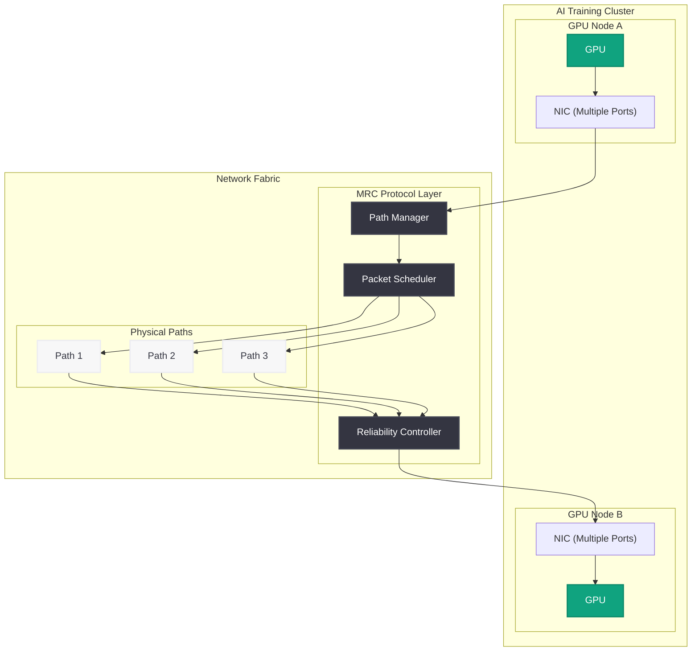

# MRC (Multipath Reliable Connection): 大規模 AI トレーニングネットワークを実現する新プロトコル

## メタデータ

| 項目 | 内容 |
|------|------|
| 発表日 | 2026-05-05 |
| ソース | OpenAI News/Blog |
| カテゴリ | Engineering |
| 公式リンク | [MRC Supercomputer Networking](https://openai.com/index/mrc-supercomputer-networking) |

> **注記:** 本レポートは OpenAI の公式発表に基づいて作成されている。公式ページへの直接アクセスが制限されていたため、公式の説明文および関連する公開情報をもとに内容を構成している。正確な詳細については [公式ページ](https://openai.com/index/mrc-supercomputer-networking) を参照されたい。

## 概要

OpenAI は MRC (Multipath Reliable Connection) と呼ばれる新しいスーパーコンピュータネットワーキングプロトコルを発表した。MRC は大規模 AI トレーニングクラスタにおける耐障害性とパフォーマンスを向上させるために設計されたプロトコルであり、OCP (Open Compute Project) を通じてオープンに公開されている。

大規模 AI モデルのトレーニングでは、数千から数万の GPU が高速ネットワークで接続され、膨大なデータを並列処理する。このスケールでは、ネットワーク障害やパケットロスが頻繁に発生し、トレーニング全体の効率を大幅に低下させる要因となる。MRC はマルチパス技術を活用することで、単一経路の障害時にも通信を途切れさせることなく継続し、大規模クラスタの安定稼働を実現する。

## 主な内容

### MRC プロトコルの概要

MRC (Multipath Reliable Connection) は、AI トレーニング専用に設計されたトランスポート層プロトコルである。従来のネットワークプロトコルは汎用的な通信を前提としているが、MRC は AI トレーニングワークロードの特性 (大容量データ転送、同期通信パターン、低遅延要件) に最適化されている。複数の物理パスを同時に活用し、信頼性の高い接続を維持することが最大の特徴である。

### マルチパスによる耐障害性の実現

大規模 AI トレーニングクラスタでは、リンク障害やスイッチ障害が統計的に避けられない。MRC は以下のメカニズムで耐障害性を確保する:

- **複数パスの同時利用:** 送信元から宛先への複数の物理経路を並行して活用し、帯域幅を最大化する
- **即時フェイルオーバー:** いずれかのパスで障害が発生した場合、残りのパスに瞬時に切り替えることで通信の中断を最小化する
- **パスの動的管理:** ネットワークの状態に応じてパスの追加・削除を動的に行い、常に最適な接続状態を維持する

### OCP を通じたオープンリリース

OpenAI は MRC を OCP (Open Compute Project) 経由でオープンソースとして公開した。これにより、業界全体が大規模 AI インフラストラクチャの課題に対して協調的に取り組むことが可能になる。OCP は Meta、Microsoft、Google など大手テクノロジー企業が参加するオープンハードウェアコミュニティであり、MRC の公開はデータセンターネットワーキングの標準化に貢献することが期待される。

### パフォーマンスの改善

MRC は単なる耐障害性の向上だけでなく、通常時のパフォーマンスも改善する:

- **帯域集約:** 複数パスを束ねることで実効帯域幅が向上する
- **負荷分散:** トラフィックを複数の経路に分散させ、ネットワークのホットスポットを軽減する
- **テール遅延の削減:** 障害時の再送処理や経路切り替えにかかる時間を大幅に短縮し、集合通信 (collective communication) のテール遅延を低減する

### 大規模 AI トレーニングクラスタへの適用

MRC は OpenAI のスーパーコンピュータ環境で実際に運用されており、数万台規模の GPU クラスタにおけるトレーニング効率の向上に寄与している。AllReduce や AllGather などの集合通信オペレーションにおいて、ネットワーク障害の影響を最小限に抑え、トレーニングジョブ全体のスループットを安定させる効果が確認されている。

## 技術的な詳細

MRC はトランスポート層で動作し、複数の物理パスを論理的な単一接続として抽象化する。各パスの状態監視、パケットスケジューリング、再送制御を統合的に管理するアーキテクチャを採用している。

### 主要コンポーネント

| コンポーネント | 役割 |
|---------------|------|
| Path Manager | パスの検出、状態監視、追加・削除の管理 |
| Packet Scheduler | パケットを最適なパスに振り分ける負荷分散 |
| Reliability Controller | パケットロスの検出、再送制御、順序保証 |

### 従来プロトコルとの比較

| 特性 | 従来のプロトコル (TCP/RDMA) | MRC |
|------|---------------------------|-----|
| パス | 単一パス | マルチパス |
| 障害時の復旧 | 秒単位の切り替え | ミリ秒単位の即時フェイルオーバー |
| 帯域利用 | 単一リンクの帯域に依存 | 複数リンクの帯域を集約 |
| AI ワークロード最適化 | 汎用設計 | AI トレーニング特化 |
| オープン標準 | 一部プロプライエタリ | OCP 経由で公開 |

## 開発者への影響

- **インフラストラクチャエンジニア:** MRC を OCP から取得し、自社の AI トレーニングクラスタに導入することで、ネットワーク障害による訓練中断を削減できる
- **AI 研究者:** ネットワーク障害を意識せずに大規模モデルのトレーニングに集中できる環境が整う。トレーニングの再開回数が減少し、GPU 時間の無駄を削減できる
- **クラウドプロバイダー:** MRC を活用することで、AI as a Service のインフラ信頼性を向上させ、SLA の改善につなげられる
- **ハードウェアベンダー:** NIC やスイッチの設計において MRC への対応を検討することで、AI インフラ市場での競争力を高められる

## 関連リンク

- [OpenAI 公式発表 - MRC Supercomputer Networking](https://openai.com/index/mrc-supercomputer-networking)
- [Open Compute Project (OCP)](https://www.opencompute.org/)
- [OpenAI Engineering Blog](https://openai.com/news)
- [OpenAI - Stargate Compute Infrastructure](https://openai.com/index/stargate-compute-infrastructure)

## まとめ

OpenAI が発表した MRC (Multipath Reliable Connection) は、大規模 AI トレーニングにおけるネットワーク課題を根本的に解決するプロトコルである。複数パスの同時活用による耐障害性の向上、帯域集約によるパフォーマンス改善、そして OCP を通じたオープンな公開という 3 つの特徴を持つ。AI モデルの規模が拡大し続ける中、MRC は数万台規模の GPU クラスタを安定的に稼働させるための重要なインフラ技術として、業界全体に貢献する可能性を持っている。
