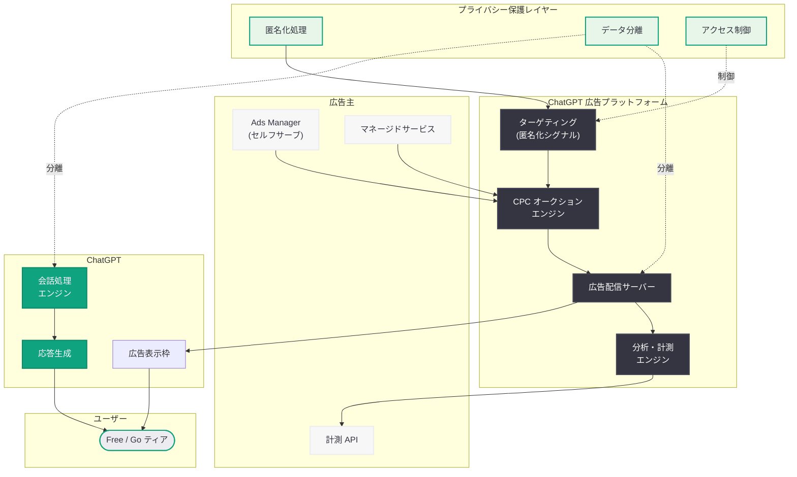

# ChatGPT 広告の新しい購入方法: セルフサーブ Ads Manager と CPC ビディングの導入

## メタデータ

| 項目 | 内容 |
|------|------|
| 発表日 | 2026-05-05 |
| ソース | OpenAI News/Blog |
| カテゴリ | Product |
| 公式リンク | [New ways to buy ChatGPT ads](https://openai.com/index/new-ways-to-buy-chatgpt-ads) |

## 概要

OpenAI は 2026 年 5 月 5 日、ChatGPT 広告プラットフォームの大幅な拡張を発表した。ベータ版のセルフサーブ Ads Manager、CPC (Cost Per Click) ビディングモデル、そして強化された計測ツールの導入により、広告主が ChatGPT 上で広告を購入・管理する方法が大きく進化する。これらの新機能は、プライバシーを最優先に設計されており、ユーザーの会話内容と広告を明確に分離する仕組みが組み込まれている。

この発表は、OpenAI が AI 広告市場において Google や Meta と本格的に競合する姿勢を鮮明にしたものである。2026 年 3 月に米国の無料・低価格ユーザー向けに広告表示を拡大して以降、広告事業の成熟化に向けた重要なマイルストーンとなる。セルフサーブプラットフォームの提供により、大企業だけでなく中小規模の広告主も ChatGPT 広告にアクセスできるようになり、広告主のエコシステムが急速に拡大することが予想される。

## 主な内容

### セルフサーブ Ads Manager (ベータ版)

OpenAI は広告主が自ら広告キャンペーンを作成、管理、最適化できるセルフサーブ型の Ads Manager をベータ版として公開した。これまで ChatGPT 広告の購入は OpenAI の営業チームを通じたマネージドサービスに限定されていたが、本ツールの導入により広告主が直接的にキャンペーンをコントロールできるようになる。

Ads Manager の主な機能は以下の通りである。

- **キャンペーン作成ウィザード:** 広告目的の設定、ターゲットオーディエンスの選択、予算配分をステップバイステップでガイド
- **クリエイティブ管理:** テキスト広告やリッチカード広告のクリエイティブを作成・編集・A/B テストする機能
- **予算管理:** 日次予算・月次予算の設定、自動入札の最適化、予算消化ペースの調整
- **リアルタイムダッシュボード:** インプレッション、クリック、CTR、コンバージョンなどの主要指標をリアルタイムで表示
- **オーディエンスセグメンテーション:** プライバシーを保護しつつ、広告を表示するユーザーセグメントを選択可能

### CPC ビディングモデル

従来の CPM (Cost Per Mille) ベースの課金に加え、CPC (Cost Per Click) ビディングモデルが導入された。広告主はユーザーが広告をクリックした場合にのみ課金される仕組みにより、広告投資のリスクを低減し、パフォーマンスベースの広告運用が可能となる。

CPC ビディングの特徴は以下の通りである。

- **オークション方式:** リアルタイムのオークションにより、広告表示の優先度が決定される
- **最大入札単価の設定:** 広告主は 1 クリックあたりの最大支払額を設定可能
- **品質スコア:** 広告の関連性とユーザーエンゲージメントに基づく品質スコアが入札価格に影響
- **スマートビディング:** 機械学習を活用した自動入札最適化により、目標 CPA (Cost Per Acquisition) に基づいた入札調整が行われる
- **入札戦略の選択:** 手動入札、目標クリック単価、目標コンバージョン単価などの入札戦略を選択可能

### 強化された計測ツール

広告効果の可視化と最適化を支援する計測ツールが大幅に強化された。

- **コンバージョントラッキング:** 広告クリック後のユーザーアクション (購入、登録、ダウンロードなど) を追跡
- **アトリビューション分析:** マルチタッチアトリビューションにより、広告がコンバージョンに寄与した度合いを分析
- **A/B テスト機能:** 広告クリエイティブ、ターゲティング、入札戦略の異なるバリエーションを比較テスト
- **レポートエクスポート:** CSV、JSON 形式でのデータエクスポートに対応し、外部分析ツールとの連携が可能
- **カスタムダッシュボード:** 広告主のニーズに合わせて主要指標のダッシュボードをカスタマイズ可能

### プライバシー保護設計

ChatGPT 広告の最大の特徴の一つは、プライバシーファーストの設計思想である。OpenAI は会話内容を広告ターゲティングに使用しないことを明確に宣言しており、以下のプライバシー保護メカニズムが実装されている。

- **会話内容の非利用:** ユーザーの会話内容は広告ターゲティングや入札に一切使用されない
- **コンテキスト分離:** 広告配信のロジックは会話処理のパイプラインから物理的に分離されている
- **匿名化されたシグナル:** 広告配信に使用されるシグナルは完全に匿名化・集約化されたデータのみ
- **ユーザーコントロール:** 広告の表示設定やデータ利用に関するユーザー側のコントロール機能を提供
- **透明性レポート:** 広告配信に関するデータ利用の透明性レポートを定期的に公開

### 会話と広告の分離

OpenAI は「会話と広告の分離」を設計原則として明確に位置づけている。ChatGPT の応答品質が広告によって影響を受けることがないよう、以下の仕組みが構築されている。

- **応答独立性:** ChatGPT の応答生成プロセスは広告システムから完全に独立して動作する
- **広告の明示的な表示:** 広告はユーザーに対して明確にラベル付けされ、オーガニックな応答と区別される
- **頻度制御:** ユーザー体験を損なわないよう、広告表示の頻度に上限が設定されている
- **フィードバック機能:** ユーザーが不適切な広告を報告し、表示を制御できるメカニズムを提供

## 技術的な詳細

### 広告配信アーキテクチャ

ChatGPT の広告配信システムは、会話処理パイプラインとは独立したマイクロサービスとして構築されている。広告配信の判断は、会話内容を参照せずに、匿名化されたコンテキストシグナルに基づいて行われる。

**広告配信フロー:**

1. ユーザーが ChatGPT にリクエストを送信
2. 会話処理パイプラインが応答を生成 (広告システムとは独立)
3. 広告配信エンジンが匿名化シグナル (デバイスタイプ、地域、時間帯など) に基づき広告候補を選定
4. CPC オークションにより表示広告が決定
5. 応答と広告が明確に区別された形でユーザーに表示

### CPC ビディングメカニズム

CPC オークションは、Google Ads などの既存プラットフォームで実績のあるセカンドプライスオークションの変形を採用していると推察される。

**オークションの流れ:**

1. 広告枠が発生した際、対象となる全広告候補のスコアを計算
2. スコア = 最大入札単価 x 品質スコア x 関連性スコア
3. 最高スコアの広告が表示される
4. 課金額は 2 位のスコアを超えるために必要な最低金額

**品質スコアの構成要素:**

- 過去の CTR (Click Through Rate) の実績
- 広告クリエイティブの品質評価
- ランディングページの品質とユーザー体験
- 広告主のアカウント履歴

### プライバシーアーキテクチャ

プライバシー保護のための技術的アーキテクチャは、以下のレイヤーで構成されている。

- **データ分離レイヤー:** 会話データと広告データが物理的に異なるストレージシステムに格納される
- **匿名化レイヤー:** 広告配信に使用されるシグナルは k-匿名性や差分プライバシーなどの技術で匿名化される
- **アクセス制御レイヤー:** 広告システムから会話データへのアクセスは技術的に不可能な設計
- **監査レイヤー:** データアクセスのログが記録され、定期的な監査により準拠状況を確認

### 計測 API

広告主向けの計測 API が提供され、プログラマティックに広告パフォーマンスデータを取得できる。

```json
{
  "campaign_id": "camp_abc123",
  "metrics": {
    "impressions": 150000,
    "clicks": 4500,
    "ctr": 0.03,
    "avg_cpc": 0.85,
    "conversions": 225,
    "cost": 3825.00,
    "roas": 3.2
  },
  "period": {
    "start": "2026-05-01",
    "end": "2026-05-05"
  }
}
```

計測 API は RESTful な設計で、OAuth 2.0 認証によりセキュアなアクセスが可能である。リアルタイムデータと日次集計データの両方を取得でき、Webhook によるイベント通知にも対応している。

## アーキテクチャ



## 開発者への影響

### 広告主・マーケティング開発者への影響

- **セルフサーブ API の活用:** Ads Manager のセルフサーブ機能により、プログラマティックな広告キャンペーン管理が可能になる。既存のマーケティングオートメーションツールとの統合が期待される
- **計測 API の統合:** RESTful な計測 API を通じて、既存の BI (Business Intelligence) ツールやデータウェアハウスとの連携が容易になる
- **CPC 最適化ツールの開発:** CPC ビディングの自動最適化ツールやスクリプトの開発ニーズが生まれる

### OpenAI API 開発者への影響

- **API 利用への直接的影響はなし:** 今回の広告プラットフォーム拡張は ChatGPT のコンシューマー向けインターフェースに限定されており、OpenAI API を通じて構築されたアプリケーションに広告が挿入されることはない
- **将来的な広告 SDK の可能性:** 広告プラットフォームが成熟するにつれ、サードパーティ開発者向けの広告 SDK や広告収益化プログラムが提供される可能性がある
- **エコシステムの拡大:** 広告収入により OpenAI の財務基盤が強化されることで、API サービスの安定性向上や価格の最適化が期待される

### プライバシー観点での開発者への影響

- **プライバシーバイデザインの参考事例:** OpenAI の会話-広告分離アーキテクチャは、AI アプリケーションにおけるプライバシー保護設計の参考モデルとなる
- **データ最小化原則:** 広告配信に会話内容を使用しないという方針は、AI 業界全体のプライバシー基準の引き上げに寄与する可能性がある
- **規制対応:** GDPR、CCPA などのプライバシー規制への準拠方法として、データ分離アーキテクチャが業界標準となる可能性がある

### 広告テクノロジー企業への影響

- **新たな DSP/SSP 連携:** ChatGPT 広告プラットフォームとの接続を検討するアドテック企業が増加すると予想される
- **対話型広告フォーマットの標準化:** AI チャットインターフェース向けの広告フォーマット標準の策定が進む可能性がある
- **計測パートナーの拡大:** サードパーティの計測パートナーとの連携プログラムが今後拡大する見込みである

## 関連リンク

- [New ways to buy ChatGPT ads](https://openai.com/index/new-ways-to-buy-chatgpt-ads)
- [OpenAI News](https://openai.com/news)
- [ChatGPT 広告の米国展開拡大 (2026 年 3 月)](https://www.reuters.com/technology/openai-expand-ads-chatgpt-all-free-low-cost-users-information-reports-2026-03-21/)
- [OpenAI と The Trade Desk の広告パートナーシップ](https://openai.com/index/openai-trade-desk-ad-partnership)
- [Powering product discovery in ChatGPT](https://openai.com/index/powering-product-discovery-in-chatgpt)

## まとめ

OpenAI によるセルフサーブ Ads Manager、CPC ビディング、強化された計測ツールの導入は、ChatGPT 広告プラットフォームの成熟化における重要なマイルストーンである。2026 年 3 月の米国全ユーザーへの広告拡大から約 2 か月で、広告主が自ら効率的にキャンペーンを運用できるインフラが整備されたことは、OpenAI の広告事業に対する本気度を示している。

特筆すべきは、プライバシーファーストの設計原則が技術アーキテクチャのレベルで実装されている点である。会話内容を広告ターゲティングに使用しないという明確な方針と、それを技術的に保証するデータ分離アーキテクチャは、AI プラットフォームにおける広告ビジネスの新たな基準を提示している。CPC ビディングモデルの導入により、広告主はパフォーマンスベースの投資が可能となり、Google Ads や Meta Ads と同様の費用対効果の可視化が実現される。

今後は広告フォーマットの多様化、グローバル展開、サードパーティ計測パートナーとの連携拡大、さらには開発者向け広告 SDK の提供など、プラットフォームとしてのさらなる拡張が見込まれる。AI 対話型インターフェースにおける広告モデルの確立は、デジタル広告業界全体のパラダイムシフトを加速させる可能性がある。
