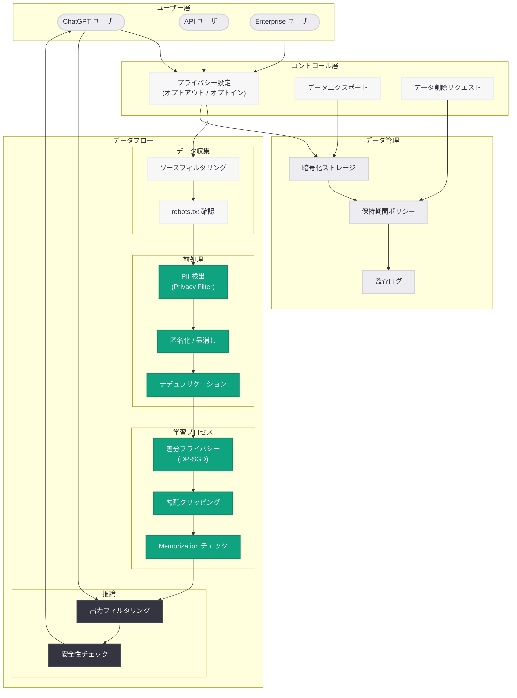

# ChatGPT がプライバシーを保護しながら世界について学ぶ仕組み

## メタデータ

| 項目 | 内容 |
|------|------|
| 発表日 | 2026-05-06 |
| ソース | OpenAI News |
| カテゴリ | グローバルアフェアーズ / プライバシー |
| 公式リンク | [How ChatGPT learns about the world while protecting privacy](https://openai.com/index/how-chatgpt-protects-privacy) |

> **注記:** 本レポートは OpenAI の公式発表に基づいて作成されている。公式ページへの直接アクセスが制限されていたため、公式の説明文および関連する公開情報をもとに内容を構成している。正確な詳細については [公式ページ](https://openai.com/index/how-chatgpt-protects-privacy) を参照されたい。

## 概要

OpenAI は 2026 年 5 月 6 日、ChatGPT がどのようにしてユーザーのプライバシーを保護しながら世界についての知識を獲得しているかを詳細に説明する記事を公開した。本記事は、モデルの学習プロセスにおける個人データの削減手法、ユーザーに提供されるデータ管理のコントロール機能、そしてプライバシー保護を設計段階から組み込む「Privacy by Design」の思想に基づいた技術的アプローチについて包括的に解説している。

AI モデルの学習において、有用性とプライバシー保護のバランスを取ることは業界全体の重要課題である。OpenAI はこの記事を通じて、ChatGPT のトレーニングデータから個人情報を積極的に削減するフィルタリング技術、ユーザーが自身の会話データの利用を制御できるオプトアウト機構、そしてデータ処理パイプライン全体に組み込まれた多層的なプライバシー保護メカニズムについて透明性を提供している。これは 2026 年 4 月に発表された OpenAI Privacy Filter に続く、同社のプライバシーに対する包括的な取り組みの一環である。

## 主な内容

### ChatGPT におけるプライバシー保護の基本方針

OpenAI は ChatGPT の設計と運用において、以下の基本原則に基づいたプライバシー保護を実施している。

- **データ最小化原則:** モデルの学習に必要なデータのみを収集・利用し、不要な個人情報は積極的に排除する
- **目的制限:** 収集されたデータは明確に定義された目的にのみ使用され、ユーザーの同意なく他の目的に転用されない
- **透明性:** データの収集・利用・保存に関するポリシーを明確に開示し、ユーザーが自身のデータの取り扱いを理解できるようにする
- **ユーザーコントロール:** データ利用に関する選択権をユーザーに付与し、オプトアウトを含む複数のコントロールオプションを提供する

これらの原則は、GDPR (一般データ保護規則)、CCPA (カリフォルニア消費者プライバシー法)、日本の個人情報保護法 (APPI) などの国際的なプライバシー規制の要件とも整合している。

### トレーニングデータにおける個人情報の削減

ChatGPT のモデル学習において、個人データを削減するための多層的なアプローチが採用されている。

#### データ収集段階のフィルタリング

学習データの収集段階で、個人情報を多く含むデータソースを事前に除外するフィルタリングが実施される。

- **ソースレベルのフィルタリング:** 個人情報が集中するデータソース (ソーシャルメディアの個人プロフィール、医療記録、金融取引データなど) を学習データから除外
- **ドメインベースの選別:** 公開情報であっても、個人のプライバシーに関わる可能性が高いドメインからのデータ収集を制限
- **robots.txt の尊重:** ウェブクローリングにおいて、データ提供者の意思表示を尊重

#### PII 検出と除去

収集されたデータに対して、2026 年 4 月に発表された OpenAI Privacy Filter をはじめとする PII (個人識別情報) 検出技術を活用し、以下の処理が実施される。

- **自動検出:** 氏名、メールアドレス、電話番号、住所、社会保障番号、クレジットカード番号などの PII を自動的に検出
- **墨消し・匿名化:** 検出された PII をマスキングまたは仮名化して、個人の特定を不可能にする
- **文脈理解型の検出:** LLM ベースの検出手法により、単純なパターンマッチングでは捉えられない文脈依存的な個人情報も識別

#### デデュプリケーション (重複排除)

特定の個人に関する情報が過度に集中しないよう、データの重複を検出・排除することで、モデルが特定個人の詳細情報を「記憶」するリスクを低減している。

### ユーザーによるデータ利用のコントロール

OpenAI はユーザーに対して、自身の会話データが AI モデルの改善にどのように利用されるかを制御する複数の手段を提供している。

#### チャット履歴とモデルトレーニングの設定

| 設定項目 | 説明 | デフォルト |
|---------|------|----------|
| チャット履歴の保存 | 会話履歴をアカウントに保存するかどうか | 有効 |
| モデル改善への利用 | 会話データをモデルのトレーニングに利用するかどうか | 有効 (オプトアウト可) |
| データエクスポート | 自身の全データをダウンロードする機能 | 利用可能 |
| アカウント削除 | アカウントと関連データの完全削除 | リクエスト可能 |

#### オプトアウト機構

ユーザーは ChatGPT の設定画面から、自身の会話データがモデルの改善に使用されることをオプトアウトできる。オプトアウトした場合でも、サービスの基本機能 (会話、チャット履歴の保存) は通常通り利用可能である。

- **個人ユーザー向け:** 設定画面から「Chat history & training」オプションを切り替え
- **API ユーザー向け:** API 経由のデータはデフォルトでモデルトレーニングに使用されない (オプトインが必要)
- **Enterprise / Team プラン:** ビジネスデータは一切モデルのトレーニングに使用されない

#### データ保持ポリシー

オプトアウトしたユーザーの会話データの保持期間は制限されており、不正利用の監視に必要な最小期間の経過後に削除される。

### プライバシー保護技術の詳細

OpenAI は ChatGPT のプライバシー保護に複数の技術的アプローチを組み合わせて採用している。

#### 差分プライバシー (Differential Privacy)

モデルの学習プロセスに数学的なプライバシー保証を組み込む手法が採用されている。差分プライバシーにより、特定の個人のデータが学習データに含まれていたかどうかを、モデルの出力から推測することが統計的に困難になる。

- **ノイズ注入:** 学習勾配にキャリブレーションされたノイズを追加し、個別のデータポイントの影響を制限
- **プライバシーバジェット管理:** epsilon パラメータによるプライバシー保証レベルの定量的管理
- **グループプライバシー:** 個人だけでなく、小規模なグループの情報も保護

#### デデュプリケーションと Memorization 対策

モデルが学習データの特定の部分を暗記 (memorization) してしまうリスクに対する対策が施されている。

- **学習時のデデュプリケーション:** 重複データの排除により、特定テキストの暗記確率を低減
- **推論時のフィルタリング:** モデルの出力に個人情報が含まれていないかをリアルタイムで監視・フィルタリング
- **レッドチーミング:** 専門チームによる定期的なプライバシー侵害テスト (個人情報の抽出試行)

#### データ処理のセキュリティ

データのライフサイクル全体を通じたセキュリティ対策が実装されている。

- **暗号化:** 保存時および転送時のデータ暗号化
- **アクセス制御:** 最小権限原則に基づいたデータアクセスの管理
- **監査ログ:** データアクセスと処理の完全なトレーサビリティ

## 技術的な詳細

### プライバシー保護パイプラインの構成

ChatGPT のプライバシー保護は、データのライフサイクルの各段階で異なる技術が適用される多層防御のアプローチを採用している。

| 段階 | 適用技術 | 目的 |
|------|---------|------|
| データ収集 | ソースフィルタリング、robots.txt 尊重 | 不適切なデータの事前排除 |
| 前処理 | PII 検出、匿名化、デデュプリケーション | 個人情報の除去 |
| 学習 | 差分プライバシー、勾配クリッピング | 数学的プライバシー保証 |
| 推論 | 出力フィルタリング、安全性チェック | 個人情報の漏洩防止 |
| 保存 | 暗号化、アクセス制御、保持期間制限 | データセキュリティ |
| 削除 | セキュアデリーション、残存データチェック | 完全なデータ消去 |

### ユーザーコントロールの技術的実装

```
設定変更リクエスト
    |
    v
[認証・認可層] -- ユーザー ID の検証
    |
    v
[ポリシーエンジン] -- オプトアウトフラグの更新
    |
    v
[データパイプライン] -- トレーニングデータからの除外処理
    |
    v
[監査ログ] -- 設定変更の記録
```

API ユーザーのデータがデフォルトでトレーニングに使用されない仕組みは、API リクエストのメタデータレベルでフラグ管理されており、データパイプラインの初期段階で自動的にフィルタリングされる。

## アーキテクチャ



## 開発者への影響

### API 利用者への影響

- **デフォルトのプライバシー保護:** API 経由のデータはデフォルトでモデルトレーニングに使用されないため、開発者は顧客データの取り扱いについて安心して API を活用できる
- **コンプライアンス対応の簡素化:** OpenAI 側でのプライバシー保護措置により、開発者が独自にプライバシー保護レイヤーを構築する負担が軽減される
- **Enterprise プランの価値:** ビジネスデータが一切トレーニングに使用されない保証は、規制産業 (金融、医療、法務) の開発者にとって特に重要である

### アプリケーション開発者への影響

- **ユーザー信頼の向上:** OpenAI のプライバシー保護施策を自社アプリケーションのプライバシーポリシーにおいて説明することで、エンドユーザーの信頼を獲得しやすくなる
- **Privacy by Design の実践:** OpenAI のアプローチを参考に、自社アプリケーションでも設計段階からプライバシー保護を組み込む文化を醸成できる
- **規制対応の明確化:** OpenAI が提供するデータ処理の透明性により、データ処理契約 (DPA) やプライバシー影響評価 (PIA) の作成が容易になる

### エンドユーザーへの影響

- **データ利用の透明性:** 自身のデータがどのように利用されるかを明確に把握できる
- **選択権の確保:** モデル改善へのデータ提供を自由に選択でき、オプトアウトしてもサービス品質が維持される
- **データポータビリティ:** データエクスポート機能により、自身のデータに対する権利を行使できる

## 関連リンク

- [How ChatGPT learns about the world while protecting privacy - OpenAI 公式](https://openai.com/index/how-chatgpt-protects-privacy)
- [Introducing OpenAI Privacy Filter (関連レポート)](./2026-04-22-openai-privacy-filter.md)
- [OpenAI Privacy Policy](https://openai.com/policies/privacy-policy)
- [OpenAI API Data Usage Policies](https://openai.com/policies/api-data-usage-policies)
- [OpenAI Enterprise Privacy](https://openai.com/enterprise-privacy)
- [OpenAI News](https://openai.com/news)

## まとめ

OpenAI が公開した「How ChatGPT learns about the world while protecting privacy」は、ChatGPT がユーザーのプライバシーを保護しながらモデルの知識を拡充する仕組みについて包括的に説明した重要な記事である。データ収集段階でのソースフィルタリング、PII 検出・匿名化による前処理、差分プライバシーを活用した学習プロセス、推論時の出力フィルタリングという多層的なプライバシー保護アプローチが採用されていることが明らかにされた。

特に注目すべきは、ユーザーに対するコントロールの提供である。個人ユーザーはオプトアウトにより会話データのトレーニング利用を拒否でき、API ユーザーのデータはデフォルトで保護され、Enterprise プランではビジネスデータが一切学習に使用されないことが保証されている。2026 年 4 月の OpenAI Privacy Filter の発表と合わせて、OpenAI がプライバシー保護を AI 開発の中核的な価値として位置づけ、技術的にも組織的にも包括的な取り組みを推進していることが示されている。開発者にとっては、API 利用時のデータ保護ポリシーが明確化されたことで、コンプライアンス対応が容易になり、規制産業におけるAI 活用の障壁が低減される意義がある。
