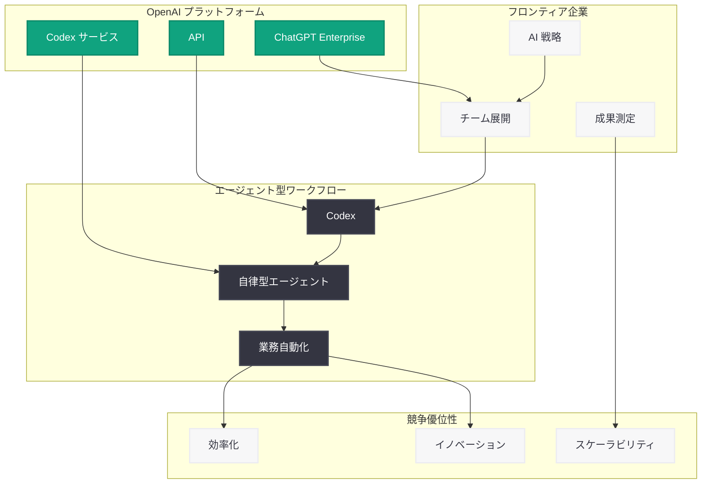

# フロンティア企業が AI の競争優位性を構築する方法 - B2B Signals の紹介

## メタデータ

| 項目 | 内容 |
|------|------|
| 発表日 | 2026-05-06 |
| ソース | OpenAI News/Blog |
| カテゴリ | Company |
| 公式リンク | [How frontier enterprises are building an AI advantage](https://openai.com/index/introducing-b2b-signals) |

> **注記:** 本レポートは OpenAI の公式発表に基づいて作成されている。公式ページへの直接アクセスが制限されていたため、公式の説明文および関連する公開情報をもとに内容を構成している。正確な詳細については [公式ページ](https://openai.com/index/introducing-b2b-signals) を参照されたい。

## 概要

OpenAI は「B2B Signals」と題したリサーチを発表し、フロンティア企業 (先進的な AI 導入を進める企業) がどのように AI の競争優位性を構築しているかを分析した。このリサーチは、エンタープライズにおける AI 導入の深化パターン、Codex を活用したエージェント型ワークフローのスケーリング手法、そして持続的な競争優位の構築方法について、実証的なデータに基づく洞察を提供するものである。

B2B Signals は、OpenAI が企業顧客のデータや導入事例を体系的に分析し、AI 導入において成功している企業に共通するパターンや戦略を明らかにすることを目的としている。特に、単なるツール導入にとどまらず、組織全体のワークフローに AI を深く統合し、それを持続可能な競争優位に転換するフロンティア企業の取り組みに焦点を当てている。

## 主な内容

### AI 導入の深化パターン

フロンティア企業における AI 導入は、単一のユースケースから組織全体への展開へと段階的に深化している。B2B Signals のリサーチでは、AI の活用が初期の実験段階を超え、ビジネスプロセスの中核に組み込まれていく過程が分析されている。先進企業は、パイロットプロジェクトから本番環境への移行を迅速に行い、成功事例を他の部門や業務領域に横展開することで、組織全体の AI 成熟度を引き上げている。

### Codex を活用したエージェント型ワークフローのスケーリング

B2B Signals では、Codex を基盤としたエージェント型 (agentic) ワークフローが企業の生産性向上において重要な役割を果たしていることが示されている。エージェント型ワークフローとは、AI が単にユーザーの指示に応答するだけでなく、自律的にタスクを計画・実行し、複数のステップにわたる複雑な業務を完遂する仕組みである。フロンティア企業はこのアプローチをスケールさせることで、ソフトウェア開発、コードレビュー、テスト自動化といった領域で大幅な効率化を実現している。

### 持続的な競争優位の構築

リサーチでは、AI 導入によって一時的な効率化を超えた「持続的な (durable) 競争優位」を構築している企業の特徴が分析されている。これらの企業は以下のような戦略を採用していると考えられる。

- **データとワークフローの統合:** 自社固有のデータと業務プロセスに AI を深く統合し、模倣困難な独自のシステムを構築
- **組織的な AI リテラシー:** 技術チームだけでなく、組織全体で AI の活用スキルを向上させる仕組みを整備
- **継続的な改善サイクル:** AI 活用の成果を測定し、フィードバックループを通じて継続的に精度と効果を改善

### エンタープライズ AI 導入の共通パターン

B2B Signals のリサーチから、成功する企業に共通するパターンとして以下が浮かび上がっている。

- **経営層のコミットメント:** AI 導入を戦略的優先事項として位置づけ、トップダウンで推進
- **段階的なスケーリング:** 小規模な成功を積み重ね、実証された価値に基づいて展開を拡大
- **インフラ投資:** AI ワークフローを支える基盤技術やプラットフォームへの先行投資

## アーキテクチャ

## 開発者への影響

B2B Signals のリサーチは、エンタープライズ向け AI ソリューションを構築する開発者にとって重要な示唆を含んでいる。

- **エージェント型アーキテクチャの需要増大:** フロンティア企業が Codex ベースのエージェント型ワークフローをスケールさせていることから、自律的にタスクを実行できる AI システムの設計能力が今後さらに求められる
- **統合の深さが差別化要因:** 単純な API 呼び出しではなく、企業の既存システムやデータソースと深く統合されたソリューションが価値を生むことが明確になった
- **スケーラビリティの設計:** 個人やチーム単位の利用から、組織全体へのスケーリングを前提とした設計が重要であり、マルチテナント対応やガバナンス機能の実装が求められる
- **成果の可視化:** 企業が AI 投資の ROI を測定・評価する傾向が強まっており、効果を定量的に示せるソリューションが選ばれる

## 関連リンク

- [OpenAI 公式: How frontier enterprises are building an AI advantage](https://openai.com/index/introducing-b2b-signals)
- [OpenAI Codex](https://openai.com/codex)
- [OpenAI for Business](https://openai.com/business)
- [OpenAI API ドキュメント](https://platform.openai.com/docs)

## まとめ

OpenAI の B2B Signals リサーチは、フロンティア企業が AI の競争優位性を構築するための具体的なパターンと戦略を明らかにした。特に、Codex を活用したエージェント型ワークフローのスケーリングが企業の生産性と競争力に大きく貢献していること、そして AI 導入の深化が一時的な効率化を超えた持続的な競争優位につながることが示されている。エンタープライズ AI の導入を検討する企業や開発者にとって、このリサーチは戦略立案と実装の両面で有用なフレームワークを提供するものである。
