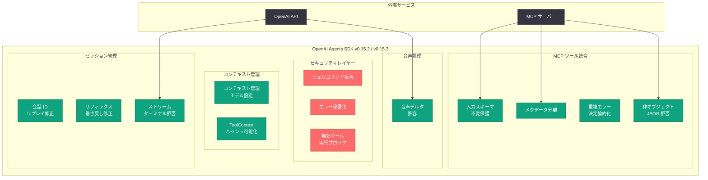

# OpenAI Agents SDK v0.15.2 / v0.15.3 リリース: MCP ツール安定性強化とセキュリティ修正

## メタデータ

| 項目 | 内容 |
|------|------|
| 発表日 | 2026-05-06 |
| ソース | OpenAI API Changelog (GitHub) |
| カテゴリ | API 更新 |
| 公式リンク | [OpenAI Agents SDK v0.15.2](https://github.com/openai/openai-agents-python/releases/tag/v0.15.2) |

## 概要

OpenAI は 2026 年 5 月 6 日、Agents SDK の v0.15.2 および v0.15.3 を同日にリリースした。v0.15.2 ではコンテキスト管理モデル設定という新機能の追加に加え、セキュリティ強化や MCP (Model Context Protocol) ツール処理の安定性向上を含む 10 件のバグ修正が実施された。v0.15.3 は v0.15.2 に対する即日のフォローアップリリースで、MCP ツールのスキーマ変異問題や音声処理の互換性に関する 4 件の修正が含まれている。

今回の 2 つのリリースは、安定性とセキュリティを重視した保守リリースである。シェルコマンドの拒否、エラーメッセージの秘匿化、無効化されたツールの実行ブロックなど、エージェントの安全な実行を確保するための多層的な防御策が導入された。また、MCP ツール統合に関する修正が両バージョン合わせて 6 件と最も多く、MCP エコシステムの成熟に伴うエッジケースへの対応が進んでいることが分かる。

## 主な内容

### コンテキスト管理モデル設定 (v0.15.2 新機能)

v0.15.2 で追加された唯一の新機能として、コンテキスト管理モデル設定 (context management model setting) が導入された。この機能により、エージェントがコンテキストウィンドウの管理方法をモデルレベルで制御できるようになった。長いコンテキストを扱うエージェントにおいて、コンテキストの圧縮やトランケーション戦略をモデル設定として定義できるため、メモリ効率の最適化やコスト管理に活用できる。

### MCP ツール関連の修正

MCP (Model Context Protocol) ツール統合に関して、v0.15.2 と v0.15.3 の両方で重要な修正が行われた。

**v0.15.2 での修正:**

- **MCP 無効 JSON エラーの秘匿化:** ツールログが無効化されている場合に、MCP から返される無効な JSON のエラーメッセージを秘匿 (redact) する処理が追加された。これにより、ログが無効な状態でも機密情報が漏洩するリスクが軽減される
- **マージされた MCP ツールメタデータの分離:** 複数の MCP サーバーからマージされたツールのメタデータが相互に干渉する問題が修正された。各 MCP ツールのメタデータが独立して管理されるようになった

**v0.15.3 での修正:**

- **ツール入力スキーマの変異回避:** MCP ツールの入力スキーマが処理中に意図せず変更される問題が修正された。スキーマオブジェクトが不変として扱われるようになり、同一ツールの複数回呼び出しでスキーマが破損するバグが解消された
- **非オブジェクト型ツール入力 JSON の拒否:** MCP ツールに対して配列やプリミティブ値など、オブジェクト型でない JSON が入力された場合に適切に拒否されるようになった
- **重複ツールエラーの決定論的化:** 複数の MCP サーバーが同名のツールを提供した場合のエラーメッセージが決定論的に生成されるようになった。これにより、テストやデバッグ時のエラー再現性が向上した

### セキュリティ強化

v0.15.2 では、エージェントの安全な実行を確保するための複数のセキュリティ修正が導入された。

- **シェルコマンドの拒否:** 文字列形式のシェルコマンド (string-like shell commands) が明示的に拒否されるようになった。これにより、エージェントが意図せずシステムコマンドを実行するリスクが排除される
- **関数ツールトレーススパンエラーの秘匿化:** トレーシングシステムに記録されるエラー情報から、関数ツールのスパンエラーが秘匿される。ログやモニタリングツールを通じた機密データの漏洩を防止する
- **無効化されたツールの実行ブロック:** 明示的に無効化された関数ツールが実行前にブロックされるようになった。ツールの有効/無効状態が実行レイヤーで強制されることにより、ランタイムの安全性が向上する

### 音声 (Audio) サポートの改善

v0.15.3 では、ModelAudio において音声フォーマットネゴシエーション前の音声デルタを許容する修正が含まれている。ストリーミング音声処理において、フォーマットネゴシエーションの完了前に音声データが到着するケースに対応し、音声エージェントの耐障害性が向上した。

### その他の修正

**v0.15.2:**

- **会話アイテム ID のリプレイ回避:** OpenAIConversationsSession でアシスタントの会話アイテム ID が重複してリプレイされる問題が修正された。セッションの状態管理がより正確になった
- **失敗レスポンスストリームの拒否:** ストリーミングにおいて失敗したレスポンスのターミナル (終端) が適切に拒否されるようになった
- **セッションサフィックスの一致巻き戻し:** セッションの巻き戻し処理が、一致するサフィックスのみを対象とするように修正された。不要なデータの巻き戻しが防止される
- **handoff フィルターの custom_tool_call 型除外:** remove_all_tools ハンドオフフィルターで custom_tool_call 型が適切にフィルタリングされるようになった
- **ToolContext のハッシュ可能化:** ToolContext が RunContextWrapper と一致するようにハッシュ可能 (hashable) になった。辞書のキーやセットの要素として ToolContext を使用できるようになった

## 技術的な詳細

### コードサンプル

#### SDK のアップグレード

```bash
# pip を使用したアップグレード
pip install --upgrade openai-agents

# 最新の v0.15.3 を明示的に指定
pip install openai-agents==0.15.3

# Poetry を使用している場合
poetry update openai-agents

# uv を使用している場合
uv pip install --upgrade openai-agents
```

#### コンテキスト管理モデル設定の使用例

```python
from agents import Agent, Runner

# コンテキスト管理モデル設定を指定したエージェント
agent = Agent(
    name="research_agent",
    instructions="You are a research assistant handling large documents.",
    model="gpt-4o",
    # コンテキスト管理の設定
    context_management_model="gpt-4o-mini",  # コンテキスト管理に使用するモデル
)

# 長いコンテキストを扱うタスクの実行
result = await Runner.run(agent, "Summarize the key findings from this report...")
print(result.final_output)
```

#### ToolContext のハッシュ可能性を活用した例

```python
from agents import Agent, FunctionTool, RunContextWrapper, ToolContext

# v0.15.2 以降: ToolContext をセットや辞書で使用可能
tool_registry: dict[ToolContext, str] = {}

async def my_tool(ctx: ToolContext, query: str) -> str:
    """ToolContext がハッシュ可能になったため、辞書キーとして使用できる"""
    # ツールコンテキストをキャッシュキーとして活用
    if ctx in tool_registry:
        return tool_registry[ctx]

    result = f"Processed: {query}"
    tool_registry[ctx] = result
    return result
```

### 変更一覧

#### v0.15.2

| 種別 | 変更内容 |
|------|---------|
| 新機能 | コンテキスト管理モデル設定の追加 |
| バグ修正 | OpenAIConversationsSession での会話アイテム ID リプレイ回避 |
| バグ修正 | 関数ツールトレーススパンエラーの秘匿化 |
| バグ修正 | MCP 無効 JSON エラーの秘匿化 (ツールログ無効時) |
| バグ修正 | 失敗レスポンスストリームターミナルの拒否 |
| バグ修正 | 一致するセッションサフィックスのみの巻き戻し |
| バグ修正 | 文字列形式シェルコマンドの拒否 |
| バグ修正 | handoff フィルターでの custom_tool_call 型除外 |
| バグ修正 | ToolContext のハッシュ可能化 |
| バグ修正 | 無効化された関数ツールの実行前ブロック |
| バグ修正 | マージされた MCP ツールメタデータの分離 |

#### v0.15.3

| 種別 | 変更内容 |
|------|---------|
| バグ修正 | MCP ツール入力スキーマの変異回避 |
| バグ修正 | 非オブジェクト型ツール入力 JSON の拒否 (MCP) |
| バグ修正 | 重複ツールエラーの決定論的化 (MCP) |
| バグ修正 | 音声フォーマットネゴシエーション前の音声デルタ許容 |

## アーキテクチャ

以下の図は、v0.15.2 / v0.15.3 で修正されたコンポーネントとそのセキュリティ境界を示している。



## 開発者への影響

### MCP ツールを使用している開発者

- v0.15.2 / v0.15.3 で MCP ツール関連の修正が 6 件含まれている。MCP サーバーと連携するエージェントを運用している場合は、スキーマの破損や重複ツールによるエラーが解消されるため、即座のアップグレードを推奨する
- 複数の MCP サーバーを同時に使用する構成では、メタデータの干渉問題と重複ツールエラーの決定論的化により、デバッグが容易になる
- MCP ツールへの入力が常にオブジェクト型であることが強制されるため、非オブジェクト型の入力に依存するカスタム実装がある場合は確認が必要

### セキュリティを重視する開発者

- シェルコマンドの拒否機能により、エージェントが意図せずシステムコマンドを実行するリスクが軽減される。これは特に、ユーザー入力を直接処理するエージェントにおいて重要
- エラー秘匿化の強化により、トレースログやモニタリングシステムを通じた情報漏洩のリスクが低減される。プロダクション環境でのエージェント運用においてセキュリティポスチャが向上する
- 無効化されたツールの実行ブロックにより、ツールの有効/無効制御がより堅牢になった

### 音声エージェントを開発している開発者

- v0.15.3 の音声デルタ許容修正により、ストリーミング音声処理の信頼性が向上した。音声フォーマットのネゴシエーションタイミングに依存しない堅牢な実装になっている

### アップグレード推奨事項

1. **v0.15.3 へのアップグレードを推奨:** v0.15.2 と v0.15.3 は同日リリースであり、v0.15.3 には v0.15.2 の追加修正が含まれているため、直接 v0.15.3 にアップグレードすることを推奨する
2. **破壊的変更なし:** 両バージョンとも破壊的変更は含まれない。既存のコードは変更なしで動作する
3. **MCP 統合のテスト:** MCP ツールを使用している場合は、アップグレード後にツールの入力スキーマと複数サーバー構成の動作を確認することを推奨する

## 関連リンク

- [Agents SDK v0.15.2 リリースノート](https://github.com/openai/openai-agents-python/releases/tag/v0.15.2)
- [Agents SDK v0.15.3 リリースノート](https://github.com/openai/openai-agents-python/releases/tag/v0.15.3)
- [openai-agents-python GitHub リポジトリ](https://github.com/openai/openai-agents-python)
- [OpenAI Agents SDK ドキュメント](https://openai.github.io/openai-agents-python/)
- [Model Context Protocol (MCP) 仕様](https://modelcontextprotocol.io/)
- [OpenAI API Changelog](https://platform.openai.com/docs/changelog)

## まとめ

Agents SDK v0.15.2 および v0.15.3 は、安定性とセキュリティを重視した同日リリースの保守バージョンである。新機能としてはコンテキスト管理モデル設定が追加されたのみだが、合計 14 件のバグ修正により SDK の堅牢性が大幅に向上した。

特に注目すべきは 3 つの領域である。第一に、MCP ツール統合の安定性向上 (6 件の修正) により、複数の MCP サーバーを活用する高度なエージェント構成の信頼性が改善された。第二に、シェルコマンド拒否・エラー秘匿化・無効ツール実行ブロックなどのセキュリティ強化により、プロダクション環境での安全なエージェント運用基盤が整備された。第三に、音声デルタの許容修正により、リアルタイム音声エージェントの耐障害性が向上した。

v0.15.3 は v0.15.2 の全ての修正を含む上位バージョンであるため、開発者は直接 v0.15.3 にアップグレードすることを推奨する。破壊的変更は含まれておらず、安全にアップグレード可能である。
