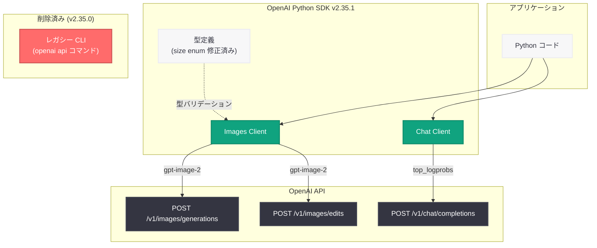

# OpenAI Python SDK v2.35.0/v2.35.1: Image 2 API の更新とレガシー CLI の削除

## メタデータ

| 項目 | 内容 |
|------|------|
| 発表日 | 2026-05-06 |
| ソース | OpenAI API Changelog (GitHub) |
| カテゴリ | API 更新 |
| 公式リンク | [OpenAI Python SDK v2.35.0](https://github.com/openai/openai-python/releases/tag/v2.35.0) |

## 概要

OpenAI は 2026 年 5 月 6 日、Python SDK v2.35.0 をリリースした。今回のリリースでは、Image Generation API (gpt-image-2) のパラメータ更新、レガシー Python CLI の完全削除、および Chat Completions API と Responses API における `top_logprobs` パラメータの説明更新が含まれている。

同日、v2.35.0 で導入された画像生成 API の `size` enum にリグレッションが発見されたため、ホットフィックスとして v2.35.1 がリリースされた。v2.35.0 を使用しているユーザーは、画像サイズ指定の問題を回避するために v2.35.1 へのアップグレードが推奨される。

## 主な内容

### Image 2 API の更新

gpt-image-2 モデルの Image Generation API パラメータが更新された。2026 年 4 月 21 日に提供開始された `gpt-image-2` は推論ベースの画像生成モデルであり、今回の SDK アップデートではこのモデルに対する API パラメータの定義が改善されている。画像生成のリクエストパラメータがより正確に型定義され、SDK の型安全性が向上した。

### レガシー Python CLI の削除

以前のバージョンで非推奨 (deprecated) とされていたレガシー Python CLI が完全に削除された。具体的には以下の 2 つの変更が行われている。

- **レガシー CLI 本体の削除:** 旧来の `openai` コマンドラインインターフェースのコードが完全に除去された
- **レガシー CLI エントリポイントのリネーム:** CLI のエントリポイントが整理され、新しい CLI 構成に統一された

レガシー CLI は以前の SDK バージョンで提供されていた `openai api` コマンド群であり、ファイルアップロードやモデル一覧取得などの操作が可能だった。現在は公式ドキュメントで推奨されている Python スクリプトや REST API 経由での操作に置き換えられている。

### top_logprobs パラメータの説明更新

Chat Completions API および Responses API で使用される `top_logprobs` パラメータのドキュメント (型定義内の説明文) が更新された。このパラメータは、各トークン位置で最も確率の高い上位 N 個のトークンとその対数確率を返す機能であり、モデルの出力を分析する際に使用される。説明文がより明確になり、開発者にとって理解しやすくなった。

### v2.35.1 ホットフィックス

v2.35.0 リリースと同日、画像生成 API の `size` パラメータの enum 定義にリグレッションが発見された。このバグにより、画像サイズの指定時に型エラーやバリデーションエラーが発生する可能性があった。v2.35.1 ではこの `size` enum のリグレッションが修正され、`"1024x1024"`、`"1792x1024"`、`"1024x1792"` などの有効なサイズ値が正しく受け入れられるようになった。

## 技術的な詳細

### コードサンプル

#### SDK のアップグレード

```bash
# v2.35.1 へのアップグレード (推奨)
pip install --upgrade openai

# バージョン確認
python -c "import openai; print(openai.__version__)"
# 出力: 2.35.1

# 特定バージョンを指定してインストール
pip install openai==2.35.1
```

#### gpt-image-2 による画像生成

```python
from openai import OpenAI

client = OpenAI()

# gpt-image-2 モデルで画像を生成
response = client.images.generate(
    model="gpt-image-2",
    prompt="A serene Japanese garden with cherry blossoms in full bloom",
    size="1024x1024",  # v2.35.1 で修正された size enum
    quality="hd",
    n=1,
)

# 生成された画像の URL を取得
image_url = response.data[0].url
print(f"Generated image URL: {image_url}")
```

#### gpt-image-2 による画像編集

```python
from openai import OpenAI

client = OpenAI()

# 既存画像の編集
response = client.images.edit(
    model="gpt-image-2",
    image=open("input.png", "rb"),
    prompt="Add a traditional Japanese torii gate in the background",
    size="1024x1024",
)

print(f"Edited image URL: {response.data[0].url}")
```

#### top_logprobs パラメータの使用例

```python
from openai import OpenAI

client = OpenAI()

# top_logprobs を使用してトークンの確率分布を取得
response = client.chat.completions.create(
    model="gpt-4o",
    messages=[
        {"role": "user", "content": "What is the capital of France?"}
    ],
    logprobs=True,
    top_logprobs=5,  # 上位 5 つのトークンの対数確率を返す
)

# 各トークンの対数確率を表示
for token_info in response.choices[0].logprobs.content:
    print(f"Token: {token_info.token}, Logprob: {token_info.logprob:.4f}")
    for top in token_info.top_logprobs:
        print(f"  Alternative: {top.token}, Logprob: {top.logprob:.4f}")
```

### 変更一覧

| 種別 | 変更内容 | バージョン |
|------|---------|-----------|
| 機能追加 | Image 2 API パラメータの更新 | v2.35.0 |
| 機能追加 | API の手動更新 | v2.35.0 |
| メンテナンス | レガシー Python CLI の削除 | v2.35.0 |
| メンテナンス | レガシー CLI エントリポイントのリネーム | v2.35.0 |
| ドキュメント | `top_logprobs` パラメータの説明更新 | v2.35.0 |
| バグ修正 | 画像生成 `size` enum のリグレッション修正 | v2.35.1 |

## アーキテクチャ

以下の図は、v2.35.0 における Image Generation API のリクエストフローと、レガシー CLI 削除後の SDK 構成を示している。



## 開発者への影響

### 破壊的変更: レガシー CLI の削除

- **影響範囲:** レガシー `openai` CLI コマンド (例: `openai api fine_tunes.create`、`openai api files.upload`) を使用しているスクリプトやワークフローが動作しなくなる
- **対応方法:** Python スクリプトによる API 呼び出し、または `curl` 等の HTTP クライアントを使用した REST API 直接呼び出しに移行する必要がある
- **CI/CD パイプラインの確認:** 自動化スクリプト内でレガシー CLI を使用している場合は、アップグレード前に代替手段への移行が必要

### Image Generation API の型安全性向上

- **型定義の更新:** gpt-image-2 モデルに対応するパラメータの型定義が更新されたため、IDE の補完機能やリンターがより正確に動作する
- **v2.35.1 への即時アップグレード推奨:** v2.35.0 の `size` enum リグレッションにより、画像サイズの指定が正しく動作しない可能性がある。v2.35.1 で修正済みのため、v2.35.0 を経由せず直接 v2.35.1 にアップグレードすることを推奨する

### ドキュメント改善

- `top_logprobs` パラメータの説明がより明確になったことで、Chat Completions API および Responses API のログ確率機能を活用する際の理解が容易になった

## 関連リンク

- [Python SDK v2.35.0 リリースノート](https://github.com/openai/openai-python/releases/tag/v2.35.0)
- [Python SDK v2.35.1 リリースノート](https://github.com/openai/openai-python/releases/tag/v2.35.1)
- [openai-python GitHub リポジトリ](https://github.com/openai/openai-python)
- [OpenAI Images API ドキュメント](https://platform.openai.com/docs/guides/images)
- [OpenAI API リファレンス](https://platform.openai.com/docs/api-reference)
- [gpt-image-2 API レポート](2026-04-21-gpt-image-2-api.md)
- [Python SDK v2.34.0 レポート](2026-05-04-openai-python-sdk-v2-34-0.md)

## まとめ

Python SDK v2.35.0/v2.35.1 は、Image Generation API (gpt-image-2) のパラメータ更新とレガシー CLI の完全削除を主軸としたリリースである。レガシー CLI の削除は破壊的変更であり、旧来の `openai api` コマンドに依存するワークフローを持つ開発者はアップグレード前に移行作業が必要となる。Image 2 API の型定義が更新されたことで SDK の型安全性が向上したが、v2.35.0 では `size` enum にリグレッションが混入したため、同日中にホットフィックス v2.35.1 がリリースされた。開発者は v2.35.0 をスキップし、直接 v2.35.1 にアップグレードすることが推奨される。
