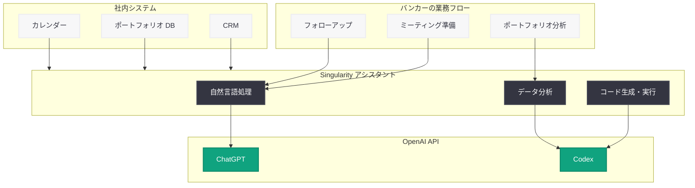

# Singular Bank が ChatGPT と Codex で銀行業務を加速

## メタデータ

| 項目 | 内容 |
|------|------|
| 発表日 | 2026-05-06 |
| ソース | OpenAI News/Blog |
| カテゴリ | B2B Story |
| 公式リンク | [Singular Bank](https://openai.com/index/singular-bank) |

> **注記:** 本レポートは OpenAI の公式発表に基づいて作成されている。公式ページへの直接アクセスが制限されていたため、公式の説明文および関連する公開情報をもとに内容を構成している。正確な詳細については [公式ページ](https://openai.com/index/singular-bank) を参照されたい。

## 概要

Singular Bank は、ChatGPT と Codex を活用した社内アシスタント「Singularity」を構築し、バンカーの日常業務を大幅に効率化した。このアシスタントにより、ミーティング準備、ポートフォリオ分析、フォローアップ業務において 1 日あたり 60 ~ 90 分の時間削減を実現している。

本事例は、金融業界における生成 AI の実用的な活用を示すものであり、OpenAI のプラットフォームを活用して実務レベルの業務改善を達成した好例である。ChatGPT の自然言語処理能力と Codex のコード生成能力を組み合わせることで、銀行業務の多岐にわたるタスクを自動化・効率化するアプローチが採用されている。

## 主な内容

### Singularity: 社内 AI アシスタントの構築

Singular Bank は「Singularity」と名付けた社内 AI アシスタントを開発した。このシステムは ChatGPT と Codex を基盤技術として採用し、バンカーが日常的に行う繰り返し作業を自動化することを目的としている。Singularity は銀行内部のデータやワークフローに統合され、個々のバンカーの業務コンテキストに応じたサポートを提供する設計となっている。

### 1 日あたり 60 ~ 90 分の業務時間削減

Singularity の導入により、バンカー 1 人あたり 1 日 60 ~ 90 分の時間削減が報告されている。この削減は以下の 3 つの主要業務領域で達成されている。

- **ミーティング準備:** 顧客との面談前に必要な情報の収集・整理を自動化し、準備時間を大幅に短縮
- **ポートフォリオ分析:** 顧客のポートフォリオデータを迅速に分析し、重要なインサイトやリスク要因を自動抽出
- **フォローアップ:** 面談後のアクションアイテム整理、メール下書き作成、次回ミーティングの準備事項の自動生成

### ChatGPT と Codex の役割分担

Singularity のアーキテクチャでは、ChatGPT と Codex がそれぞれ異なる役割を担っている。

- **ChatGPT:** 自然言語での対話インターフェース、文書の要約・生成、顧客コミュニケーションの下書き作成、ミーティングメモの整理
- **Codex:** データ処理ロジックの自動生成、ポートフォリオ分析のためのコード実行、レポート生成の自動化、社内システムとの API 連携

### 銀行業務への実装アプローチ

Singular Bank のアプローチは、汎用的な AI ツールをそのまま導入するのではなく、銀行業務に特化したカスタムソリューションとして構築されている点が特徴的である。社内のコンプライアンス要件やデータセキュリティ基準を満たしながら、バンカーの実際のワークフローに沿った形で AI を統合している。

## アーキテクチャ

## 開発者への影響

Singular Bank の事例は、金融機関が OpenAI のプラットフォームを活用して業務効率化を実現する際の実践的な参考事例となる。開発者が注目すべきポイントは以下の通り。

- **ChatGPT と Codex の組み合わせ:** 自然言語処理とコード生成を組み合わせることで、単一のモデルでは対応が難しい複合的な業務タスクをカバーできる
- **業務特化型アシスタントの設計:** 汎用ツールではなく、特定の業務フローに最適化されたアシスタントを構築することで、実測可能な時間削減効果 (60 ~ 90 分/日) を達成できる
- **社内データとの統合:** CRM やポートフォリオ管理システムなどの既存社内システムと AI を連携させることが、実用的な価値を生む鍵となる
- **コンプライアンス対応:** 金融業界では規制要件に対応した形で AI を実装する必要があり、社内アシスタントとしての構築がその解決策となり得る

## 関連リンク

- [OpenAI 公式: Singular Bank](https://openai.com/index/singular-bank)
- [OpenAI ChatGPT](https://openai.com/chatgpt)
- [OpenAI Codex](https://openai.com/codex)
- [OpenAI API ドキュメント](https://platform.openai.com/docs)

## まとめ

Singular Bank は、ChatGPT と Codex を活用した社内 AI アシスタント「Singularity」を構築し、バンカーの日常業務において 1 日あたり 60 ~ 90 分の時間削減を実現した。ミーティング準備、ポートフォリオ分析、フォローアップという 3 つの主要業務領域で具体的な効率化を達成しており、金融機関における生成 AI の実用的な導入事例として注目に値する。ChatGPT の言語処理能力と Codex のコード生成能力を組み合わせた設計アプローチは、他の金融機関や B2B 企業にとっても参考となるだろう。
