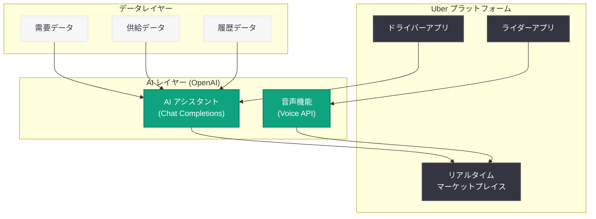

# Uber が OpenAI を活用し、ドライバーの収益最適化とライダーの迅速な配車を実現

## メタデータ

| 項目 | 内容 |
|------|------|
| 発表日 | 2026-05-06 |
| ソース | OpenAI News/Blog |
| カテゴリ | B2B Story |
| 公式リンク | [Uber uses OpenAI](https://openai.com/index/uber) |

> **注記:** 本レポートは OpenAI の公式発表に基づいて作成されている。公式ページへの直接アクセスが制限されていたため、公式の説明文および関連する公開情報をもとに内容を構成している。正確な詳細については [公式ページ](https://openai.com/index/uber) を参照されたい。

## 概要

Uber は OpenAI の技術を活用し、AI アシスタントおよび音声機能を搭載することで、ドライバーがよりスマートに収益を上げ、ライダーがより迅速に配車を予約できる仕組みを構築した。この取り組みは、グローバル規模のリアルタイムマーケットプレイスにおける AI 活用の先進事例として位置づけられる。

Uber のプラットフォームは毎日数百万件のトランザクションを処理するリアルタイムマーケットプレイスであり、ドライバーとライダーの双方にとって効率的なマッチングが事業の根幹を成す。OpenAI の技術を統合することにより、ドライバー向けには収益機会の最適化を支援する AI アシスタントを、ライダー向けにはより直感的で迅速な予約体験を提供する音声インターフェースを実現している。

## 主な内容

### ドライバー向け AI アシスタント: よりスマートな収益化

OpenAI の技術を基盤とした AI アシスタントにより、Uber のドライバーは収益を最適化するためのインテリジェントなサポートを受けられるようになった。従来、ドライバーは経験や勘に頼って走行エリアや稼働時間を決定していたが、AI アシスタントがリアルタイムデータに基づいた提案を行うことで、より効率的な稼働が可能となる。

想定される機能は以下の通りである。

- **需要予測に基づくエリア提案:** リアルタイムの需要データを分析し、高収益が見込めるエリアへの移動を提案
- **最適な稼働時間の推奨:** 過去のデータとリアルタイム需要を組み合わせ、効率的な稼働スケジュールを提示
- **自然言語での質問応答:** ドライバーが「今どこに行けば稼げる?」といった自然な質問に対して即座に回答
- **収益レポートの要約:** 日次・週次の収益状況を分かりやすく要約し、改善ポイントを提示

### ライダー向け音声機能: より迅速な配車予約

ライダー向けには、OpenAI の音声技術を活用した直感的な予約体験が提供される。テキスト入力や複数回のタップ操作を必要とせず、音声だけで配車リクエストを完了できる仕組みにより、予約プロセスが大幅に簡素化される。

想定される機能は以下の通りである。

- **音声による配車リクエスト:** 「空港まで Uber を呼んで」といった自然な発話で配車を完了
- **会話型のオプション選択:** 車種、乗車人数、経由地などのオプションを対話形式で設定
- **多言語対応:** グローバル展開を支えるマルチリンガルな音声認識と応答
- **コンテキスト理解:** 過去の利用履歴や現在地を考慮した賢い推測と提案

### グローバルリアルタイムマーケットプレイスにおける AI 統合

Uber のマーケットプレイスは、需要と供給のバランスをリアルタイムで最適化する複雑なシステムである。OpenAI の AI 技術を統合することで、このマーケットプレイスの効率性がさらに向上する。

- **リアルタイム需給マッチング:** AI による需要予測の精度向上により、ドライバーとライダーのマッチング効率が改善
- **動的価格最適化:** 需給バランスの変動に対する、よりきめ細やかな価格調整
- **待ち時間の短縮:** AI によるドライバー配置の最適化により、ライダーの平均待ち時間が短縮
- **グローバルスケーラビリティ:** 各地域の言語・文化に適応した AI 機能の展開

### AI アシスタントのアーキテクチャ (推定)

## 開発者への影響

### リアルタイム AI アプリケーション開発者への影響

- **大規模リアルタイムシステムへの AI 統合の参考事例:** 毎秒数千件のトランザクションを処理するマーケットプレイスに OpenAI の API を統合する事例は、同様のスケールを持つプラットフォームの開発者にとって貴重な参考となる
- **音声 AI のプロダクション事例:** OpenAI の音声技術を実際のコンシューマー向けアプリケーションに統合する設計パターンが確立される
- **低レイテンシ要件への対応:** リアルタイムマーケットプレイスにおける AI 推論のレイテンシ管理手法が示される

### OpenAI API 利用者への影響

- **エンタープライズ向け AI アシスタント構築の事例拡充:** Uber 規模の企業が OpenAI API を活用して AI アシスタントを構築する事例は、同様のユースケースを検討する企業に対する説得力のあるリファレンスとなる
- **Voice API の活用促進:** 音声インターフェースを活用したアプリケーション開発のベストプラクティスが蓄積される
- **B2B 活用パターンの多様化:** モビリティ分野における AI 活用事例の追加により、OpenAI のエコシステムが拡大する

### モビリティ・オンデマンドサービス業界への影響

- **競合他社の AI 導入加速:** Uber の OpenAI 活用により、Lyft、Grab、DiDi などの競合も同様の AI 統合を検討する圧力が高まる
- **ドライバー体験の再定義:** AI アシスタントによるドライバーサポートが業界標準となる可能性がある
- **音声ファーストの予約体験:** 音声インターフェースによる配車予約が普及することで、UX 設計のパラダイムが変化する可能性がある

## 関連リンク

- [Uber uses OpenAI to help people earn smarter and book faster](https://openai.com/index/uber)
- [OpenAI News](https://openai.com/news)
- [OpenAI Voice API](https://platform.openai.com/docs/guides/text-to-speech)
- [OpenAI Chat Completions API](https://platform.openai.com/docs/guides/chat-completions)
- [Uber Engineering Blog](https://www.uber.com/en-JP/blog/engineering/)

## まとめ

Uber と OpenAI のパートナーシップは、グローバル規模のリアルタイムマーケットプレイスにおける AI 活用の重要な事例である。ドライバー向けの AI アシスタントによる収益最適化支援と、ライダー向けの音声機能による迅速な配車予約という 2 つの柱を通じて、プラットフォームの両側 (供給側と需要側) の体験を同時に向上させている点が特筆に値する。

この取り組みは、AI が単なる自動化ツールではなく、リアルタイムの意思決定を支援する「知的なコパイロット」として機能することを示している。毎日数百万人が利用する Uber のプラットフォームに OpenAI の技術が統合されることで、AI アシスタントと音声インターフェースが日常的なモビリティ体験の一部となる未来が現実のものとなりつつある。
