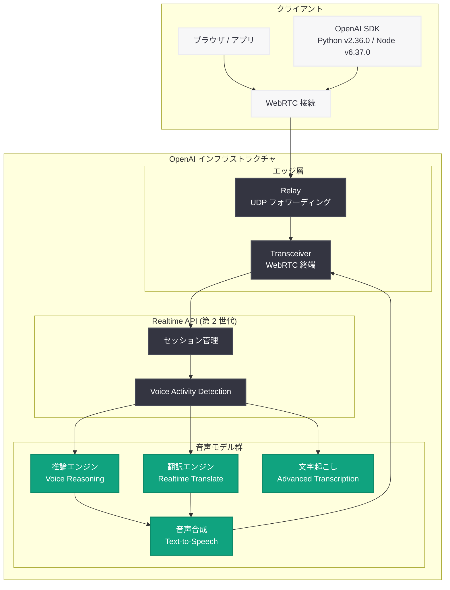
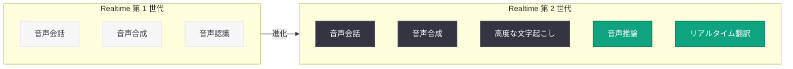

# OpenAI Realtime API に新しい音声モデルを追加: 推論・翻訳・文字起こしを統合した次世代音声インテリジェンス

## メタデータ

| 項目 | 内容 |
|------|------|
| 発表日 | 2026-05-07 |
| ソース | OpenAI News/Blog (Product) |
| カテゴリ | 新機能 / API 更新 |
| 公式リンク | [Advancing voice intelligence with new models in the API](https://openai.com/index/advancing-voice-intelligence-with-new-models-in-the-api) |

## 概要

OpenAI は 2026 年 5 月 7 日、Realtime API に新しい音声モデル群をリリースした。これらの第 2 世代リアルタイム音声モデル (Realtime 2) は、音声会話中の推論 (reasoning)、リアルタイム翻訳 (translate)、高度な文字起こし (transcription) をネイティブにサポートし、より自然でインテリジェントな音声体験を実現する。

本リリースは、5 月 4 日に公開された WebRTC スタックの再設計 (Relay + Transceiver アーキテクチャ) を基盤技術として活用しており、低レイテンシかつスケーラブルな音声 AI をデベロッパーに提供する。同日リリースの Python SDK v2.36.0 および Node SDK v6.37.0 が「realtime 2」機能をサポートしており、即座に利用を開始できる。

## 主な内容

### 第 2 世代リアルタイム音声モデル (Realtime 2)

OpenAI の Realtime API に搭載される新世代モデルは、従来のリアルタイム音声機能を大幅に拡張している。第 1 世代が主に音声会話の生成と応答に特化していたのに対し、Realtime 2 は推論能力を備えた音声モデルとして設計されており、複雑な質問への応答や多段階の思考が必要なタスクを音声インターフェースで直接処理できる。

### リアルタイム翻訳機能

Realtime 2 の最も注目すべき新機能の一つが、リアルタイム翻訳である。音声入力を受け取りながら即座に別の言語に翻訳して音声出力する機能により、以下のユースケースが実現可能になる。

- **同時通訳:** 会議やプレゼンテーションでのリアルタイム多言語翻訳
- **カスタマーサポート:** 多言語対応の音声エージェント
- **教育:** 外国語学習における即座のフィードバック
- **アクセシビリティ:** 言語の壁を超えたコミュニケーション支援

Node SDK v6.37.0 のリリースノートに「launch realtime translate」と明記されており、翻訳は Realtime 2 の主要な新機能として位置づけられている。

### 音声推論 (Voice Reasoning)

音声会話中にモデルが「考える」能力を持つことで、以下のような高度なインタラクションが可能になる。

- **複雑な質問への対応:** 数学的問題や論理的推論を含む質問に音声で正確に回答
- **文脈理解:** 長い会話の文脈を保持しながら的確に応答
- **ステップバイステップの説明:** 複雑な手順を音声で段階的に案内

### 高度な文字起こし (Advanced Transcription)

文字起こし機能も強化され、より正確で高速な音声テキスト変換が実現されている。Realtime API のストリーミング特性を活かし、発話中にリアルタイムで文字起こし結果を取得できる。

## 技術的な詳細

### SDK サポート

同日リリースされた SDK が Realtime 2 を完全サポートしている。

| SDK | バージョン | 主な機能 |
|-----|-----------|---------|
| Python SDK | v2.36.0 | `api: realtime 2` |
| Node SDK | v6.37.0 | `api: launch realtime translate + update image 2`, `api: realtime 2` |

### コードサンプル

#### WebRTC を使用したリアルタイム音声セッションの開始

```python
from openai import OpenAI

client = OpenAI()

# Realtime セッションの作成 (Realtime 2 モデルを使用)
session = client.realtime.sessions.create(
    model="gpt-4o-realtime-preview",
    modalities=["text", "audio"],
    instructions="You are a helpful assistant with reasoning capabilities.",
    voice="alloy",
    input_audio_transcription={
        "model": "whisper-1"
    },
    turn_detection={
        "type": "server_vad",
        "threshold": 0.5,
        "prefix_padding_ms": 300,
        "silence_duration_ms": 500
    }
)

print(f"Session ID: {session.id}")
print(f"Client secret: {session.client_secret.value}")
```

#### リアルタイム翻訳セッションの設定

```python
from openai import OpenAI

client = OpenAI()

# リアルタイム翻訳用セッションの作成
session = client.realtime.sessions.create(
    model="gpt-4o-realtime-preview",
    modalities=["text", "audio"],
    instructions=(
        "You are a real-time translator. "
        "Listen to the user's speech and translate it into Japanese. "
        "Respond only with the translated audio."
    ),
    voice="shimmer",
    input_audio_transcription={
        "model": "whisper-1"
    }
)
```

#### Node.js での Realtime 2 WebSocket 接続

```javascript
import OpenAI from "openai";

const openai = new OpenAI();

// Realtime セッションの作成
const session = await openai.realtime.sessions.create({
  model: "gpt-4o-realtime-preview",
  modalities: ["text", "audio"],
  instructions: "Translate all speech from English to Spanish in real-time.",
  voice: "coral",
  input_audio_transcription: {
    model: "whisper-1",
  },
  turn_detection: {
    type: "server_vad",
    threshold: 0.5,
    prefix_padding_ms: 300,
    silence_duration_ms: 500,
  },
});

console.log("Session created:", session.id);
console.log("Ephemeral key:", session.client_secret.value);
```

#### WebRTC クライアント接続 (ブラウザ)

```javascript
// ブラウザでの WebRTC 接続確立
const pc = new RTCPeerConnection();

// マイク音声の取得とトラック追加
const stream = await navigator.mediaDevices.getUserMedia({ audio: true });
const audioTrack = stream.getAudioTracks()[0];
pc.addTrack(audioTrack, stream);

// リモート音声の受信設定
pc.ontrack = (event) => {
  const audioEl = document.createElement("audio");
  audioEl.srcObject = event.streams[0];
  audioEl.autoplay = true;
  document.body.appendChild(audioEl);
};

// SDP オファーの作成と送信
const offer = await pc.createOffer();
await pc.setLocalDescription(offer);

// OpenAI Realtime API に接続
const response = await fetch(
  "https://api.openai.com/v1/realtime?model=gpt-4o-realtime-preview",
  {
    method: "POST",
    headers: {
      Authorization: `Bearer ${ephemeralKey}`,
      "Content-Type": "application/sdp",
    },
    body: offer.sdp,
  }
);

const answerSdp = await response.text();
await pc.setRemoteDescription({ type: "answer", sdp: answerSdp });
```

## アーキテクチャ

### Realtime 2 音声インテリジェンスアーキテクチャ



### 機能比較: Realtime 1 vs Realtime 2



## 開発者への影響

### 新たに可能になるユースケース

- **多言語音声エージェント:** リアルタイム翻訳により、単一のエージェントで多言語対応が可能になる。カスタマーサポート、ヘルプデスク、コンシェルジュサービスなどの構築が大幅に容易になる
- **インテリジェント音声アシスタント:** 推論能力を持つ音声モデルにより、複雑な質問やタスクに対応できる音声アシスタントの構築が可能になる
- **リアルタイム字幕・翻訳システム:** 会議やイベントでの同時通訳・字幕生成システムを API 経由で実装可能

### SDK アップグレードの推奨

Realtime 2 の機能を利用するには、以下の SDK バージョンへのアップグレードが必要である。

- **Python:** `pip install openai>=2.36.0`
- **Node.js:** `npm install openai@^6.37.0`

### インフラストラクチャの恩恵

5 月 4 日に発表された WebRTC スタックの再設計 (Relay + Transceiver アーキテクチャ) により、Realtime 2 は以下のインフラストラクチャ上の恩恵を受ける。

- **低レイテンシ:** グローバルエッジネットワークによる最小限のファーストホップ遅延
- **高スケーラビリティ:** ステートレスな Relay 層による効率的な接続管理
- **信頼性:** Kubernetes 環境でのオートスケーリング対応

### 既存の Realtime API ユーザーへの影響

既存の Realtime API を利用しているデベロッパーは、新モデルを指定することで Realtime 2 の機能を活用できる。WebRTC および WebSocket の両方の接続方式が引き続きサポートされる。

## 関連リンク

- [OpenAI Realtime API ドキュメント](https://platform.openai.com/docs/guides/realtime)
- [Delivering low-latency voice AI at scale](https://openai.com/index/delivering-low-latency-voice-ai-at-scale) - WebRTC アーキテクチャの再設計 (2026-05-04)
- [OpenAI Python SDK v2.36.0](https://github.com/openai/openai-python/releases/tag/v2.36.0)
- [OpenAI Node SDK v6.37.0](https://github.com/openai/openai-node/releases/tag/v6.37.0)
- [OpenAI API リファレンス](https://platform.openai.com/docs/api-reference)
- [OpenAI News](https://openai.com/news)

## まとめ

OpenAI の Realtime API 第 2 世代モデルは、音声 AI の能力を推論・翻訳・高度な文字起こしの 3 つの軸で大幅に拡張するリリースである。特にリアルタイム翻訳機能は、これまで専用のインフラストラクチャが必要だった同時通訳を API 一つで実現できるようにするものであり、グローバルなコミュニケーションのあり方を変える可能性を持つ。

5 月 4 日の WebRTC スタック再設計と組み合わさることで、低レイテンシかつスケーラブルな音声インテリジェンスプラットフォームが完成した形となる。デベロッパーは Python SDK v2.36.0 または Node SDK v6.37.0 にアップグレードすることで、即座にこれらの新機能を活用した音声アプリケーションの構築を開始できる。
