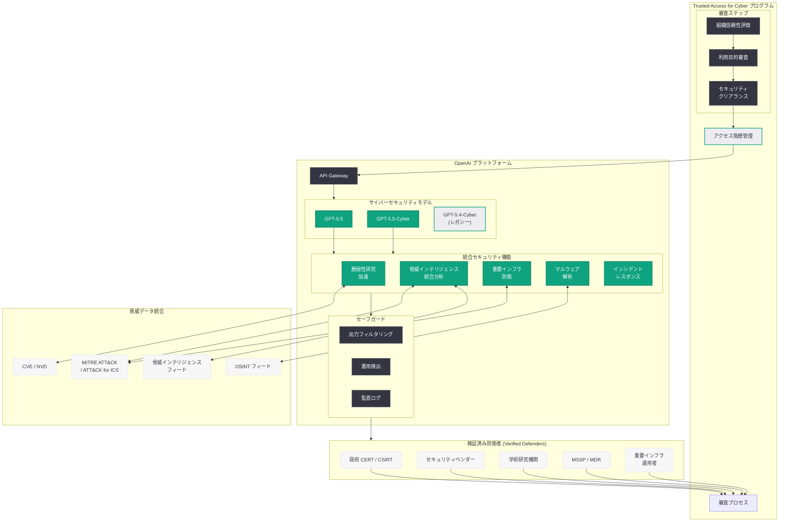
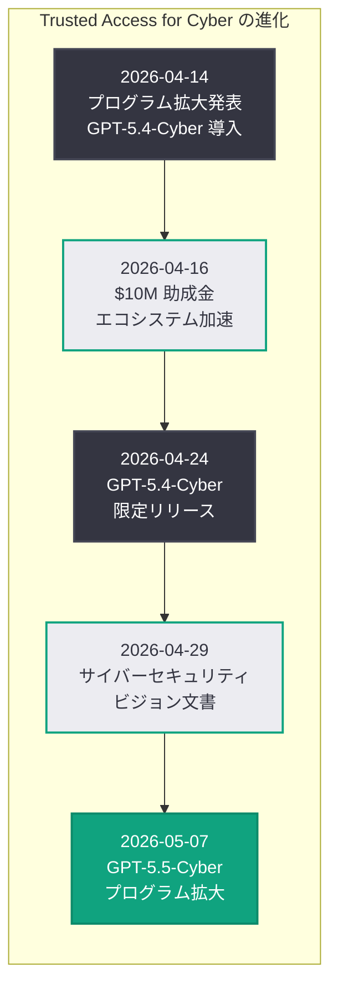

# GPT-5.5 と GPT-5.5-Cyber による Trusted Access for Cyber の拡大: 次世代サイバー防衛モデルの展開

## メタデータ

| 項目 | 内容 |
|------|------|
| 発表日 | 2026-05-07 |
| ソース | OpenAI News |
| カテゴリ | セキュリティ |
| 公式リンク | [Scaling Trusted Access for Cyber with GPT-5.5 and GPT-5.5-Cyber](https://openai.com/index/gpt-5-5-with-trusted-access-for-cyber) |

> **注記:** 本レポートは公式発表の説明文および過去の関連レポート ([2026-04-14: Trusted Access プログラムの拡大](./2026-04-14-scaling-trusted-access-cyber-defense.md)、[2026-04-24: GPT-5.4-Cyber 限定リリース](./2026-04-24-gpt-5-4-cyber-limited-release.md)、[2026-04-29: インテリジェンス時代のサイバーセキュリティ](./2026-04-29-cybersecurity-intelligence-age.md)) の情報に基づいて構成されている。公式ページへの直接アクセスが制限されていたため、公開されている情報をもとに内容を構成している。

## 概要

OpenAI は 2026 年 5 月 7 日、サイバーセキュリティ防衛者向けプログラム「Trusted Access for Cyber」を GPT-5.5 および新モデル GPT-5.5-Cyber に拡大することを発表した。本発表により、審査を通過したセキュリティ研究者およびサイバー防衛者は、GPT-5.5 をベースにサイバーセキュリティ領域に特化した次世代モデルを活用し、脆弱性研究の加速および重要インフラの保護を推進できるようになる。

GPT-5.5-Cyber は、2026 年 4 月 24 日に限定リリースされた GPT-5.4-Cyber の後継モデルであり、GPT-5.5 の「史上最も知的なモデル」としてのマルチツール統合推論能力をサイバーセキュリティ防衛に特化させたものである。4 月 14 日の Trusted Access プログラム拡大、4 月 16 日の 1,000 万ドル助成金プログラム、4 月 24 日の GPT-5.4-Cyber 限定リリース、4 月 29 日の「インテリジェンス時代のサイバーセキュリティ」ビジョン文書に続く今回の発表は、OpenAI のサイバーセキュリティ戦略が GPT-5.5 世代へと本格的に移行したことを示す重要なマイルストーンである。

## 主な内容

### GPT-5.5-Cyber の導入: GPT-5.4-Cyber からの進化

GPT-5.5-Cyber は、2026 年 4 月 23 日に発表された GPT-5.5 をベースに、サイバーセキュリティ防衛に特化したファインチューニングおよび最適化が施された次世代の専用モデルである。GPT-5.4-Cyber と比較して、以下の領域での大幅な強化が見込まれる。

- **マルチツール統合によるセキュリティ分析:** GPT-5.5 のクロスツール統合推論能力を活かし、コード分析、ネットワークログ解析、脅威インテリジェンスフィードの参照を一貫して実行する高度な分析ワークフロー
- **脆弱性研究の加速:** ゼロデイ脆弱性の発見や CVE 分析において、コードベース全体を俯瞰しつつ深層的な脆弱性パターンを検出する能力の強化。GPT-5.5 の高速推論により分析スループットが大幅に向上
- **重要インフラ防衛への最適化:** OT (Operational Technology) 環境、SCADA システム、ICS プロトコルに関する深い理解を組み込み、重要インフラ固有の脅威に対応
- **高度なマルウェア解析:** バイナリ解析、パッキング解除、難読化解除において GPT-5.5 の推論深度を活用し、より複雑なマルウェアファミリーの分析が可能
- **自律的なインシデントレスポンス:** セキュリティインシデントの検出からトリアージ、封じ込め手順の生成までを、複数のデータソースを横断的に分析しながら自律的に遂行

### Trusted Access for Cyber プログラムの GPT-5.5 世代への拡張

今回の発表の核心は、Trusted Access for Cyber プログラムが GPT-5.5 世代に正式に対応したことである。これにより、既存のプログラム参加者は GPT-5.4-Cyber に加えて GPT-5.5 および GPT-5.5-Cyber にもアクセスできるようになると考えられる。

- **既存参加者のアップグレード:** Phase 1 および Phase 2 で既に GPT-5.4-Cyber にアクセスしている政府 CERT、主要セキュリティベンダー、学術研究機関は、GPT-5.5-Cyber への移行が可能に
- **新規参加者の受付拡大:** GPT-5.4-Cyber のロールアウト Phase 3 (認定 MSSP、金融機関セキュリティチーム) に相当する組織にも GPT-5.5-Cyber へのアクセスパスが提供される見込み
- **審査プロセスの継続:** 引き続き厳格な審査プロセス (組織信頼性評価、利用目的審査、セキュリティクリアランス確認) が適用され、防衛目的での利用に限定される

### 検証済み防衛者 (Verified Defenders) への提供

OpenAI は「verified defenders」(検証済み防衛者) という表現を用いており、プログラム参加者の審査基準がさらに明確化されていることが示唆される。

- **政府機関・CERT/CSIRT:** 国家レベルのサイバー防衛を担う組織に最優先でアクセスを提供
- **セキュリティベンダー・MSSP:** 商用セキュリティ製品やマネージドセキュリティサービスに GPT-5.5-Cyber を統合し、顧客基盤全体の防衛能力を向上
- **学術研究機関:** 脆弱性研究、脅威分析手法の研究、AI セキュリティの学術研究に活用
- **重要インフラ運用者:** エネルギー、金融、通信、医療などの重要インフラを運用する組織のセキュリティチーム

### GPT-5.4-Cyber から GPT-5.5-Cyber への主な進化

| 観点 | GPT-5.4-Cyber | GPT-5.5-Cyber |
|------|---------------|---------------|
| ベースモデル | GPT-5.4 | GPT-5.5 (史上最も知的なモデル) |
| 推論方式 | 標準的なセキュリティ分析 | マルチツール統合推論によるセキュリティ分析 |
| 分析速度 | GPT-5.4 ベース | 高速化された推論 |
| 脆弱性研究 | 高精度な検出 | 加速された脆弱性研究 |
| 重要インフラ | 基本対応 | 重要インフラ防衛に最適化 |
| ツール連携 | API 経由の分析 | クロスツール統合分析 |
| コンテキスト長 | 1M トークン | 1M トークン以上 (拡張の可能性) |

## 技術的な詳細

### GPT-5.5-Cyber API の利用

GPT-5.5-Cyber は、Trusted Access for Cyber プログラムの参加者に対して OpenAI API 経由で提供される。以下は想定される基本的な利用パターンである。

```python
from openai import OpenAI

client = OpenAI()

# GPT-5.5-Cyber による脆弱性研究の加速
response = client.chat.completions.create(
    model="gpt-5.5-cyber",
    messages=[
        {
            "role": "system",
            "content": (
                "You are an advanced vulnerability researcher with deep expertise "
                "in binary analysis, source code auditing, and exploit development. "
                "Analyze the provided target for security vulnerabilities, classify "
                "findings by CVSS v3.1 score, map to relevant CWE categories, and "
                "provide detailed proof-of-concept descriptions and remediation guidance."
            )
        },
        {
            "role": "user",
            "content": (
                "Analyze this network service implementation for vulnerabilities:\n\n"
                "```c\n"
                "#include <stdio.h>\n"
                "#include <string.h>\n"
                "#include <stdlib.h>\n"
                "#include <unistd.h>\n"
                "#include <sys/socket.h>\n\n"
                "void handle_request(int client_fd) {\n"
                "    char buffer[256];\n"
                "    char response[512];\n"
                "    int bytes_read = read(client_fd, buffer, 1024);\n"
                "    sprintf(response, \"Received: %s\", buffer);\n"
                "    write(client_fd, response, strlen(response));\n"
                "}\n"
                "```\n\n"
                "Identify all vulnerabilities, assess exploitability, and provide "
                "remediation recommendations."
            )
        }
    ],
    max_tokens=8192
)

print(response.choices[0].message.content)
```

### 重要インフラ防衛のための脅威分析

GPT-5.5-Cyber のマルチツール統合推論能力を活用した重要インフラ向け脅威分析の例である。

```python
from openai import OpenAI
import json

client = OpenAI()


def analyze_critical_infrastructure_threat(
    network_logs: str,
    ot_telemetry: str,
    threat_intel_feed: str
) -> dict:
    """
    重要インフラ環境における複合的な脅威を分析する。
    IT/OT 双方のデータソースを統合し、
    MITRE ATT&CK for ICS フレームワークに基づく評価を返す。
    """
    response = client.chat.completions.create(
        model="gpt-5.5-cyber",
        messages=[
            {
                "role": "system",
                "content": (
                    "You are a critical infrastructure security analyst "
                    "specializing in IT/OT convergence threats. Analyze the "
                    "provided data sources holistically, correlating IT network "
                    "indicators with OT telemetry anomalies. Map findings to "
                    "MITRE ATT&CK for ICS framework and assess potential "
                    "impact on physical processes. Provide severity assessment "
                    "and immediate containment recommendations."
                )
            },
            {
                "role": "user",
                "content": (
                    "Analyze the following data for threats to our industrial "
                    "control system:\n\n"
                    f"## IT Network Logs\n{network_logs}\n\n"
                    f"## OT Telemetry\n{ot_telemetry}\n\n"
                    f"## Threat Intelligence\n{threat_intel_feed}\n\n"
                    "Provide:\n"
                    "1. Correlated threat assessment\n"
                    "2. MITRE ATT&CK for ICS technique mapping\n"
                    "3. Potential physical impact assessment\n"
                    "4. Immediate containment actions\n"
                    "5. Long-term remediation plan"
                )
            }
        ],
        max_tokens=8192,
        response_format={"type": "json_object"}
    )

    return json.loads(response.choices[0].message.content)
```

### 脆弱性研究の自動化パイプライン

GPT-5.5-Cyber を活用した脆弱性研究パイプラインの構築例である。

```python
from openai import OpenAI
from pathlib import Path

client = OpenAI()


def vulnerability_research_pipeline(
    target_files: list[str],
    known_cves: list[str] | None = None
) -> str:
    """
    複数のソースファイルに対して体系的な脆弱性研究を実行する。
    GPT-5.5-Cyber のマルチツール統合推論を活用し、
    ファイル間のデータフロー追跡と攻撃面の網羅的分析を行う。
    """
    code_content = ""
    for path in target_files:
        content = Path(path).read_text()
        code_content += f"\n--- {path} ---\n{content}\n"

    cve_context = ""
    if known_cves:
        cve_context = (
            "\n\nKnown CVEs in similar software:\n"
            + "\n".join(f"- {cve}" for cve in known_cves)
        )

    response = client.chat.completions.create(
        model="gpt-5.5-cyber",
        messages=[
            {
                "role": "system",
                "content": (
                    "You are a vulnerability researcher conducting systematic "
                    "security research on the provided codebase. Your goal is to "
                    "discover novel vulnerabilities by:\n"
                    "1. Tracing data flows across trust boundaries\n"
                    "2. Identifying attack surface entry points\n"
                    "3. Analyzing memory safety issues\n"
                    "4. Detecting logic flaws and race conditions\n"
                    "5. Evaluating cryptographic implementations\n"
                    "6. Checking authentication/authorization bypasses\n\n"
                    "For each finding, provide: vulnerability class, root cause, "
                    "proof-of-concept approach, CVSS v3.1 vector and score, "
                    "and recommended fix."
                )
            },
            {
                "role": "user",
                "content": (
                    "Conduct vulnerability research on this codebase:\n\n"
                    f"{code_content}"
                    f"{cve_context}\n\n"
                    "Focus on discovering novel, exploitable vulnerabilities "
                    "that could impact confidentiality, integrity, or availability."
                )
            }
        ],
        max_tokens=16384
    )

    return response.choices[0].message.content
```

### GPT-5.5 と GPT-5.5-Cyber の API モデル比較

| パラメータ | GPT-5.5 | GPT-5.5-Cyber |
|-----------|---------|---------------|
| モデル名 | `gpt-5.5` | `gpt-5.5-cyber` |
| アクセス条件 | 一般提供 | Trusted Access for Cyber 参加者限定 |
| コンテキストウィンドウ | 1M+ トークン | 1M+ トークン |
| 最適化領域 | 汎用 (コーディング、リサーチ、データ分析) | サイバーセキュリティ防衛 |
| 出力制御 | 標準ポリシー | 防衛用途限定の強化ポリシー |
| 監査機能 | 標準ログ | 全リクエストの詳細監査証跡 |

> **注:** 上記のモデル名およびパラメータは過去のリリースパターンに基づく推定であり、公式ドキュメントを参照して正確な情報を確認されたい。

## アーキテクチャ

以下の図は、GPT-5.5 世代における Trusted Access for Cyber プログラムの全体構造を示している。GPT-5.4-Cyber から GPT-5.5-Cyber への進化に伴い、マルチツール統合推論によるセキュリティ分析ワークフローが新たに加わっている。



### Trusted Access for Cyber プログラムの進化タイムライン



## 開発者への影響

### GPT-5.5 世代への移行の加速

- **既存 GPT-5.4-Cyber ユーザーの移行:** Trusted Access プログラムに既に参加しているセキュリティベンダーや研究機関は、GPT-5.5-Cyber への移行を計画すべきである。GPT-5.5 のマルチツール統合推論能力により、セキュリティ分析ワークフローの大幅な効率化が期待される
- **API 互換性の確認:** モデル名が `gpt-5.4-cyber` から `gpt-5.5-cyber` に変更されるため、既存のインテグレーションにおけるモデル指定の更新が必要となる。ただし API のインターフェース自体は互換性が維持されると想定される
- **推論能力の向上への対応:** GPT-5.5-Cyber はより高度な推論が可能であるため、プロンプト設計を最適化することで分析精度のさらなる向上が見込める。特に複雑なマルチステップの脆弱性分析や相関分析において効果が大きい

### 重要インフラセキュリティ開発の機会

- **OT セキュリティツールの開発:** GPT-5.5-Cyber の重要インフラ防衛最適化により、ICS/SCADA 環境向けのセキュリティ監視ツールや異常検知システムの開発が加速する
- **IT/OT 統合分析プラットフォーム:** IT ネットワークと OT 環境のデータを統合的に分析するプラットフォームの構築において、GPT-5.5-Cyber のマルチソース分析能力が強力な基盤となる
- **規制対応の支援:** 重要インフラのセキュリティ規制 (NERC CIP、IEC 62443 等) への準拠を AI が支援するツールの開発機会が拡大

### 脆弱性研究コミュニティへのインパクト

- **研究スループットの向上:** GPT-5.5 の高速推論と深い分析能力により、脆弱性研究者は従来よりも短期間で多くのターゲットを分析できるようになる
- **未知の脆弱性発見の加速:** パターン認識とコード理解の向上により、既存の静的解析ツールでは検出困難な論理的脆弱性やレースコンディションの発見が促進される
- **責任ある脆弱性開示プロセスとの統合:** 発見した脆弱性の CVSS スコアリング、CWE 分類、修正ガイダンスの自動生成により、脆弱性開示プロセスの効率化と品質向上が期待される

### プログラム参加に向けた準備

- **早期申請の推奨:** GPT-5.5-Cyber へのアクセスを希望する組織は、Trusted Access for Cyber プログラムへの参加申請を早期に開始すべきである。審査プロセスには数週間から数ヶ月を要する可能性がある
- **防衛目的の文書化:** 利用目的が防衛に限定されることを明確に文書化し、組織のセキュリティミッションと整合する利用計画を策定する必要がある
- **コンプライアンス体制の整備:** 全リクエストの監査証跡が記録されるため、適切なデータ管理ポリシーとログ保持手順を事前に整備しておくことが重要である

## 関連リンク

- [Scaling Trusted Access for Cyber with GPT-5.5 and GPT-5.5-Cyber (公式)](https://openai.com/index/gpt-5-5-with-trusted-access-for-cyber)
- [Trusted Access for Cyber (初期プログラム)](https://openai.com/index/trusted-access-for-cyber/)
- [GPT-5.4-Cyber 限定リリース (関連レポート 4/24)](./2026-04-24-gpt-5-4-cyber-limited-release.md)
- [Trusted Access プログラムの拡大 (関連レポート 4/14)](./2026-04-14-scaling-trusted-access-cyber-defense.md)
- [サイバー防衛エコシステムの加速 (関連レポート 4/16)](./2026-04-16-accelerating-cyber-defense-ecosystem.md)
- [インテリジェンス時代のサイバーセキュリティ (関連レポート 4/29)](./2026-04-29-cybersecurity-intelligence-age.md)
- [GPT-5.5 の発表 (関連レポート 4/23)](./2026-04-23-introducing-gpt-5-5.md)
- [OpenAI Safety](https://openai.com/safety)
- [OpenAI API ドキュメント](https://platform.openai.com/docs)
- [MITRE ATT&CK フレームワーク](https://attack.mitre.org/)
- [MITRE ATT&CK for ICS](https://attack.mitre.org/techniques/ics/)

## まとめ

OpenAI が 2026 年 5 月 7 日に発表した GPT-5.5 および GPT-5.5-Cyber による Trusted Access for Cyber プログラムの拡大は、同社のサイバーセキュリティ戦略が次世代モデルへと本格的に移行したことを示す重要な発表である。GPT-5.5 の「史上最も知的なモデル」としてのマルチツール統合推論能力をサイバーセキュリティ防衛に特化させた GPT-5.5-Cyber は、脆弱性研究の加速と重要インフラの保護という 2 つの明確な目標を掲げている。

4 月中旬以降の一連の発表 (Trusted Access プログラム拡大、助成金プログラム、GPT-5.4-Cyber 限定リリース、ビジョン文書) を経て、今回 GPT-5.5 世代への移行が実現したことで、審査済みの防衛者は業界最高水準の AI 推論能力をサイバー防衛に活用できるようになる。引き続き「検証済み防衛者」への限定提供という責任あるアプローチが維持されており、デュアルユースリスクへの慎重な姿勢と防衛側の技術的優位性確保のバランスが保たれている。

セキュリティ開発者にとっては、GPT-5.5-Cyber の統合推論能力を活かしたセキュリティツールの開発、重要インフラ向け分析プラットフォームの構築、そして脆弱性研究の効率化が今後の重要な開発機会となる。プログラムへの早期申請と、GPT-5.5 世代への移行準備を進めることが推奨される。

> **免責事項:** 本レポートは公式発表の説明文および過去の関連レポートの情報に基づいて構成されたものであり、公式ページの全文を確認した上での分析ではない。GPT-5.5-Cyber の具体的な仕様、プログラムの詳細条件、および料金体系は、公式発表の実際の内容とは異なる可能性がある点にご留意いただきたい。
