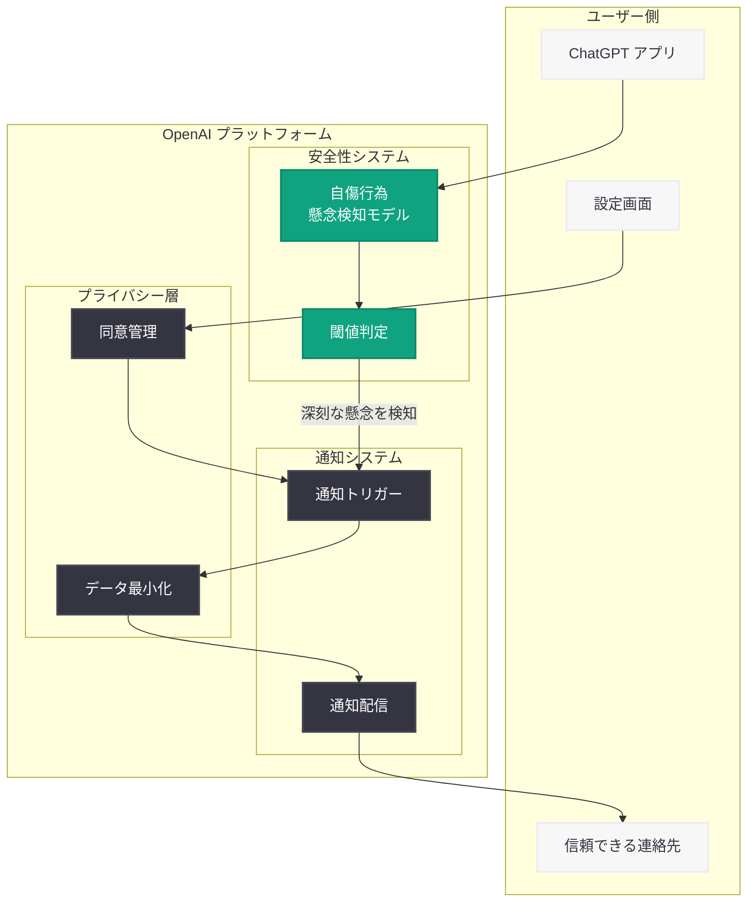

# ChatGPT に「信頼できる連絡先」機能を導入: 自傷行為の懸念を検知し指定した相手に通知する安全機能

## メタデータ

| 項目 | 内容 |
|------|------|
| 発表日 | 2026-05-07 |
| ソース | OpenAI News |
| カテゴリ | 安全性 |
| 公式リンク | [Introducing Trusted Contact in ChatGPT](https://openai.com/index/introducing-trusted-contact-in-chatgpt) |

## 概要

OpenAI は 2026 年 5 月 7 日、ChatGPT に「Trusted Contact (信頼できる連絡先)」機能を導入したことを発表した。これはオプトイン方式の安全機能であり、ユーザーが事前に指定した信頼できる相手 (家族、友人、カウンセラーなど) に対し、会話中に深刻な自傷行為の懸念が検知された場合に通知を送信する仕組みである。

本機能は、ユーザーの安全を守りつつプライバシーとコントロールを維持するというバランスを実現するものであり、OpenAI が推進してきた一連の安全施策の延長線上に位置する。10 代向け安全ポリシー、Child Safety Blueprint (2026 年 4 月)、コミュニティ安全コミットメントといった取り組みに続く重要なマイルストーンである。

## 主な内容

### 機能の仕組み

Trusted Contact 機能は以下のプロセスで動作する:

1. **連絡先の登録:** ユーザーが ChatGPT の設定画面から、信頼できる連絡先を事前に指定する
2. **会話のモニタリング:** ChatGPT が会話中に深刻な自傷行為に関連する懸念を検知する
3. **通知の送信:** 懸念が検知された場合、指定された連絡先に通知が送られる
4. **早期介入:** 通知を受けた連絡先がユーザーに対して適切なサポートを提供できる

この機能はあくまでセーフティネットとして設計されており、すべての会話内容が共有されるわけではない。

### プライバシー保護

Trusted Contact 機能は、ユーザーのプライバシーを最大限に尊重する設計となっている:

- **オプトイン方式:** 機能は完全に任意であり、ユーザーが自発的に有効化しない限り動作しない
- **通知内容の限定:** 連絡先に送られるのは懸念の検知通知のみであり、会話の詳細な内容は共有されない
- **ユーザー主導:** 連絡先の追加・削除はユーザーがいつでも自由に行える
- **透明性:** 通知が送信される条件や仕組みについてユーザーに明示される

### ユーザーコントロール

ユーザーは本機能に対して完全な制御権を保持する:

- 機能の有効化・無効化をいつでも切り替え可能
- 信頼できる連絡先の追加・変更・削除が自由に行える
- 通知の対象となる連絡先は複数設定可能 (家族、友人、専門カウンセラーなど)
- 設定の変更は即座に反映される

### 提供状況

本機能は ChatGPT の全ユーザーに対してオプションとして提供される。OpenAI が 2026 年を通じて推進してきた安全性向上の取り組みの一環として、段階的にロールアウトされる。

## 技術的な詳細

### 検知メカニズム

ChatGPT の Trusted Contact 機能における自傷行為の懸念検知は、以下の技術的要素に基づいていると考えられる:

- **自然言語理解:** 会話のコンテキストを分析し、深刻な自傷行為のリスクを示すシグナルを検出する
- **閾値ベースの判定:** 誤検知を最小限に抑えつつ、真に深刻な懸念のみを検出するよう調整されたモデル
- **コンテキスト考慮:** 単語レベルのマッチングではなく、会話全体の文脈を考慮した高精度な判定

### 通知システム

通知の配信は以下の流れで実行される:

1. 会話中の懸念シグナルを検知
2. 検知結果の信頼度を評価
3. 閾値を超えた場合に通知トリガーを発動
4. 事前登録された連絡先に対して通知を配信
5. ユーザーに対しても通知が送信されたことを透明性をもって伝達

## アーキテクチャ

## 開発者への影響

本機能は主にコンシューマー向けの安全機能であり、API を利用する開発者への直接的な技術的影響は限定的である。ただし、以下の点で間接的な影響が考えられる:

- **安全性基準の方向性:** OpenAI が AI プロダクトに求める安全性基準がさらに高まっていることを示しており、API 利用時のコンテンツポリシーにも将来的に反映される可能性がある
- **プラットフォーム設計の参考:** AI アプリケーションにおけるユーザー保護機能の実装パターンとして、オプトイン方式と通知ベースの安全ネットという設計思想は参考になる
- **メンタルヘルス関連アプリ:** ChatGPT API を活用してメンタルヘルス支援アプリを構築している開発者にとって、同様の機能を実装する際の設計指針となる
- **コンプライアンス対応:** AI 安全性に関する規制が進む中、ユーザー保護機能のベストプラクティスとして業界標準に影響を与える可能性がある

## 関連リンク

- [Introducing Trusted Contact in ChatGPT](https://openai.com/index/introducing-trusted-contact-in-chatgpt)
- [OpenAI Safety](https://openai.com/safety)
- [OpenAI News](https://openai.com/news)

## まとめ

OpenAI が ChatGPT に導入した「Trusted Contact」機能は、AI チャットボットにおけるユーザー安全性の新たな基準を示すものである。完全にオプトイン方式であり、ユーザーのプライバシーとコントロールを維持しながら、深刻な自傷行為の懸念が検知された際に信頼できる連絡先へ通知を送るというバランスの取れた設計が特徴である。

本機能は、OpenAI が 2026 年を通じて推進してきた安全施策 (10 代向け安全ポリシー、Child Safety Blueprint、コミュニティ安全コミットメント) の集大成とも言える取り組みであり、AI プロダクトにおけるユーザー保護の在り方について業界全体に影響を与える可能性がある。技術的には、会話コンテキストの高精度な理解に基づく検知システムと、プライバシーを保護する通知設計の両立が注目される。
