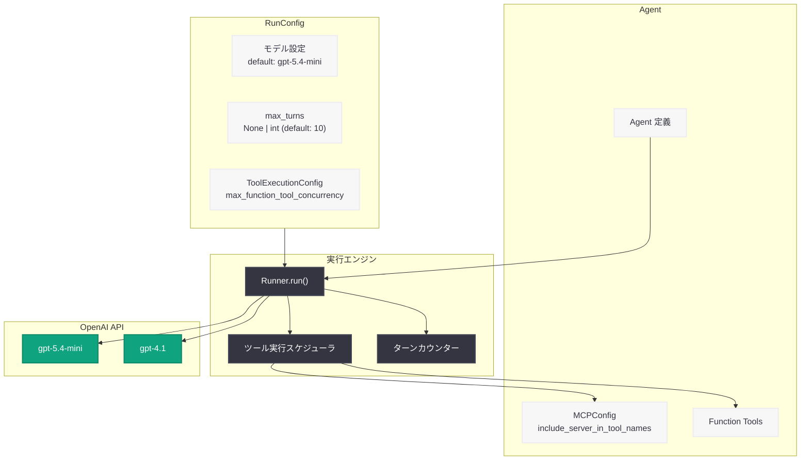

# OpenAI Agents SDK v0.16.0: デフォルトモデルが GPT-5.4-mini に変更、ツール実行の並行性制御を追加

## メタデータ

| 項目 | 内容 |
|------|------|
| 発表日 | 2026-05-07 |
| ソース | OpenAI API Changelog (GitHub) |
| カテゴリ | API 更新 |
| 公式リンク | [OpenAI Agents SDK v0.16.0](https://github.com/openai/openai-agents-python/releases/tag/v0.16.0) |

## 概要

OpenAI は 2026 年 5 月 7 日、Python 向け Agents SDK の v0.16.0 をリリースした。本バージョンでは、SDK のデフォルトモデルが従来の `gpt-4.1` から `gpt-5.4-mini` に変更されるという破壊的変更が含まれている。これにより、モデルを明示的に指定していないエージェントやランの動作が変わる可能性があるため、既存ユーザーは注意が必要である。

加えて、`max_turns=None` による実行ターン数制限の無効化オプション、`ToolExecutionConfig` によるローカル関数ツール実行の並行性制御、MCP ツール名のサーバープレフィックス付与オプションなど、複数の新機能が追加されている。エージェント構築における柔軟性と制御性を大きく向上させるリリースとなっている。

## 主な内容

### デフォルトモデルの変更

SDK のデフォルトモデルが `gpt-4.1` から `gpt-5.4-mini` に変更された。これは破壊的変更であり、モデルを明示的に指定していないすべてのエージェントとランに影響を及ぼす。新しいデフォルトは GPT-5 系モデルであるため、暗黙的なデフォルト設定に `reasoning.effort="none"` や `verbosity="low"` といった GPT-5 固有のデフォルト値が含まれる。

影響を回避するには、以下のいずれかの方法でモデルを明示的に指定する:

- エージェント定義時に `model` パラメータを指定
- 環境変数 `OPENAI_DEFAULT_MODEL` を設定

### max_turns の無効化オプション

新たに `max_turns=None` を指定することで、Agents SDK のラン実行におけるターン数制限を無効化できるようになった。従来通り `max_turns` を省略した場合は、デフォルト値の `DEFAULT_MAX_TURNS` (10) が適用される。長時間にわたるマルチステップのエージェントタスクを実行する際に有用な機能である。

### ツール実行の並行性制御

新しい `ToolExecutionConfig` クラスが `RunConfig` に追加され、SDK 側でのローカル関数ツール実行の並行性を制御できるようになった。`max_function_tool_concurrency` パラメータにより、同時に実行されるツールの数を制限できる。

これはプロバイダー側の `ModelSettings.parallel_tool_calls` (モデルが並列にツール呼び出しを生成するかどうかの制御) とは独立した、SDK 側での実行スケジューリング機能である。リソース制約のある環境やレート制限のある外部 API を呼び出すツールに対して有効である。

### サーバープレフィックス付き MCP ツール名

`MCPConfig` に新しいオプション `include_server_in_tool_names` が追加された。`True` に設定すると、MCP サーバー名がツール名に含まれるようになる。複数の MCP サーバーが同名のツールを提供する場合の名前衝突を防止するための機能である。

### バグ修正

- **Chat completions ツール呼び出し出力インデックスの安定化:** ツール呼び出し結果の出力インデックスが安定するよう修正
- **外部シンボリックリンクターゲットの拒否:** hydrate 処理時に外部を指すシンボリックリンクターゲットを拒否するよう修正 (セキュリティ強化)
- **Permissions のハッシュ可能化:** `Permissions` クラスを `User` や `Group` と同様にハッシュ可能に修正

## 技術的な詳細

### コードサンプル

#### デフォルトモデルの明示的な指定

```python
from agents import Agent

# 方法 1: エージェント定義時にモデルを明示的に指定
agent = Agent(name="Assistant", model="gpt-4.1")

# 方法 2: GPT-5.4-mini を明示的に使用 (新デフォルトと同等)
agent = Agent(name="Assistant", model="gpt-5.4-mini")
```

```bash
# 方法 3: 環境変数でデフォルトモデルを設定
export OPENAI_DEFAULT_MODEL="gpt-4.1"
```

#### max_turns の無効化

```python
from agents import Agent, Runner

agent = Agent(name="ResearchAgent", model="gpt-5.4-mini")

# ターン数制限を無効化して実行
result = await Runner.run(agent, input="複雑なリサーチタスク", max_turns=None)

# デフォルト (max_turns=10) で実行
result = await Runner.run(agent, input="通常のタスク")
```

#### ツール実行の並行性制御

```python
from agents import Agent, Runner
from agents.run import RunConfig, ToolExecutionConfig

agent = Agent(name="DataAgent", model="gpt-5.4-mini")

# SDK 側でのツール実行並行数を制限
run_config = RunConfig(
    tool_execution_config=ToolExecutionConfig(
        max_function_tool_concurrency=3  # 最大 3 つのツールを同時実行
    )
)

result = await Runner.run(agent, input="データを収集して", run_config=run_config)
```

#### MCP サーバープレフィックス付きツール名

```python
from agents import Agent
from agents.mcp import MCPConfig, MCPServerStdio

# MCP サーバー名をツール名に含める設定
mcp_config = MCPConfig(
    servers=[
        MCPServerStdio(name="filesystem", command="mcp-server-filesystem"),
        MCPServerStdio(name="database", command="mcp-server-db"),
    ],
    include_server_in_tool_names=True  # "filesystem_read_file" のような名前になる
)

agent = Agent(name="ToolAgent", model="gpt-5.4-mini", mcp_config=mcp_config)
```

## アーキテクチャ

### Agents SDK v0.16.0 の実行フロー



## 開発者への影響

### 破壊的変更: デフォルトモデルの移行

最も重要な影響は、デフォルトモデルが `gpt-4.1` から `gpt-5.4-mini` に変更されたことである。以下の点に注意が必要である:

- **推論動作の変化:** GPT-5 系モデルのデフォルト設定として `reasoning.effort="none"` が適用されるため、推論を必要とするタスクで意図しない動作の変化が生じる可能性がある
- **応答の簡潔化:** `verbosity="low"` がデフォルトとなるため、従来より短い応答が返される可能性がある
- **即座の対応推奨:** モデルを明示的に指定していないエージェントは、`Agent(model="gpt-4.1")` のように明示的に指定するか、環境変数 `OPENAI_DEFAULT_MODEL` を設定することで従来の動作を維持できる

### 新機能の活用

- **長時間タスク:** `max_turns=None` により、複雑なリサーチやマルチステップのワークフローでターン制限に悩まされることがなくなる
- **リソース管理:** `ToolExecutionConfig` により、外部 API のレート制限やシステムリソースの制約に合わせたツール実行の制御が可能になる
- **マルチサーバー MCP:** `include_server_in_tool_names` により、複数の MCP サーバーを安全に併用できるようになる

## 関連リンク

- [OpenAI Agents SDK GitHub リポジトリ](https://github.com/openai/openai-agents-python)
- [OpenAI Agents SDK v0.16.0 リリースノート](https://github.com/openai/openai-agents-python/releases/tag/v0.16.0)
- [OpenAI API ドキュメント](https://platform.openai.com/docs)
- [OpenAI モデル一覧](https://platform.openai.com/docs/models)

## まとめ

OpenAI Agents SDK v0.16.0 は、デフォルトモデルの `gpt-5.4-mini` への変更という破壊的変更を含む重要なリリースである。GPT-5 系モデルへの移行に伴い、暗黙的なデフォルト設定が変わるため、モデルを明示的に指定していない既存のエージェントは動作が変化する可能性がある。開発者は速やかにコードを確認し、必要に応じてモデルの明示的な指定を行うべきである。

一方で、`max_turns=None` によるターン制限の無効化、`ToolExecutionConfig` による並行性制御、MCP ツール名のサーバープレフィックス付与といった新機能は、エージェント構築における柔軟性を大きく向上させる。特にツール実行の並行性制御は、本番環境でのエージェント運用において重要な機能であり、外部サービスとの連携時のリソース管理を SDK レベルで制御できるようになった点は歓迎される改善である。
