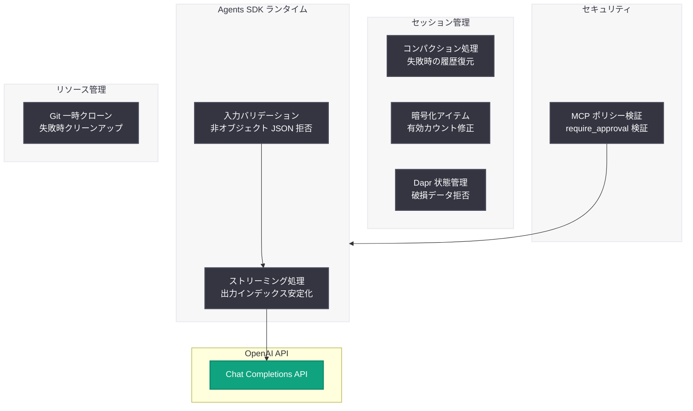

# OpenAI Agents SDK v0.16.1: 安定性・セキュリティ・データ整合性に関するバグ修正リリース

## メタデータ

| 項目 | 内容 |
|------|------|
| 発表日 | 2026-05-07 |
| ソース | OpenAI API Changelog (GitHub) |
| カテゴリ | API 更新 |
| 公式リンク | [OpenAI Agents SDK v0.16.1](https://github.com/openai/openai-agents-python/releases/tag/v0.16.1) |

## 概要

OpenAI は 2026 年 5 月 7 日、Python 向け Agents SDK の v0.16.1 をリリースした。本バージョンは同日リリースされた v0.16.0 に対するバグ修正リリースであり、新機能の追加はない。ストリーミング出力の安定性、MCP ポリシーのセキュリティ検証、セッション履歴の復元、Dapr セッション状態の整合性チェックなど、7 件のバグ修正が含まれている。

v0.16.0 で導入された破壊的変更 (デフォルトモデルの `gpt-5.4-mini` への変更) や新機能 (ツール実行並行性制御、MCP サーバープレフィックスなど) を安定させるための重要な修正が多数含まれており、v0.16.0 を使用しているすべてのユーザーに対してアップデートが推奨される。

## 主な内容

### 安定性の修正

#### Chat Completions ストリーム出力インデックスの安定化

Chat Completions API のストリーミングレスポンスにおいて、出力インデックスが不安定になる問題が修正された (Issue #3109)。ストリーミング中にツール呼び出し結果のインデックスが変動することで、エージェントの応答組み立てに失敗するケースがあった。この修正により、ストリーミングモードでのエージェント実行の信頼性が向上する。

#### セッション履歴のコンパクション失敗後の復元

セッション履歴のコンパクション (圧縮) 処理において、置換操作が失敗した場合にセッション履歴が消失する問題が修正された (Issue #3116)。コンパクションはセッション履歴が長大化した際にトークン使用量を抑制するための機能であるが、置換失敗時に元の履歴が保持されず、会話コンテキストが失われる可能性があった。本修正により、コンパクション処理の失敗時に元のセッション履歴が正しく復元される。

### セキュリティの修正

#### MCP require_approval ポリシーの検証

MCP (Model Context Protocol) ツール実行時の `require_approval` ポリシー設定が正しく検証されるようになった (Issue #3168)。不正なポリシー設定が黙認されていた問題が修正され、意図しないツール実行の自動承認を防止できるようになった。MCP ツールのセキュリティガバナンスを強化する重要な修正である。

#### 非オブジェクト型の Function Tool 入力 JSON の拒否

Function Tool に渡される入力 JSON がオブジェクト型でない場合 (例: 配列や文字列が直接渡される場合) に、これを拒否するバリデーションが追加された。不正な入力形式によるツール実行の予期しない動作を防止する。

### データ整合性の修正

#### Dapr セッション状態の破損検出

Dapr (Distributed Application Runtime) を使用したセッション状態管理において、破損したセッション状態の更新を拒否するようになった (Issue #3171)。分散環境でのセッション管理の信頼性が向上し、破損データによるエージェント動作の異常を未然に防止する。

#### 暗号化セッションアイテムの正確なカウント

セッション制限の計算において、暗号化されたセッションアイテムのうち有効なもののみをカウントするよう修正された (Issue #3174)。従来は無効なアイテムも制限カウントに含まれていたため、実際に利用可能なセッション容量が不正確になる場合があった。

#### Git リポジトリ一時クローンの失敗時クリーンアップ

Git リポジトリの一時クローン処理が失敗した際に、不完全な一時ディレクトリが残存する問題が修正された (Issue #3170)。これにより、ディスクスペースのリークや後続の操作への干渉が防止される。

## 技術的な詳細

### 修正一覧

| 修正内容 | Issue | 担当者 | 影響範囲 |
|----------|-------|--------|----------|
| ストリーム出力インデックスの安定化 | #3109 | @seratch | ストリーミング実行 |
| MCP require_approval ポリシー検証 | #3168 | @seratch | MCP ツール実行 |
| コンパクション失敗後のセッション履歴復元 | #3116 | @Aphroq | セッション管理 |
| Dapr セッション状態の破損拒否 | #3171 | @Aphroq | 分散セッション |
| Git 一時クローンのクリーンアップ | #3170 | @Aphroq | リソース管理 |
| 暗号化セッションアイテムの正確なカウント | #3174 | @Aphroq | セッション制限 |
| 非オブジェクト Function Tool 入力の拒否 | - | @ioleksiuk | ツール入力検証 |

### ドキュメント更新

- Issue #3147 に関するドキュメント更新
- v0.16.0 チェンジログの追加
- 翻訳ドキュメントの更新
- ツール実行の並行性制御に関するドキュメント追加

### アップデート方法

```bash
# pip でのアップデート
pip install --upgrade openai-agents

# バージョン確認
pip show openai-agents | grep Version
# Version: 0.16.1
```

## アーキテクチャ

### v0.16.1 修正対象の構成要素



## 開発者への影響

### 即時アップデートの推奨

v0.16.0 を使用している開発者は、以下の理由から速やかに v0.16.1 へのアップデートを行うべきである:

- **ストリーミング利用時:** 出力インデックスの不安定性により、ツール呼び出しの結果が正しく処理されない可能性がある
- **MCP ツール利用時:** セキュリティポリシーが正しく適用されず、意図しない自動承認が発生する恐れがある
- **長時間セッション利用時:** コンパクション処理の失敗により、会話コンテキストが消失するリスクがある
- **Dapr 環境での運用時:** 破損した状態更新が処理されることで、セッション全体が不正な状態になる恐れがある

### 動作の変更はなし

本リリースはバグ修正のみであり、API インターフェースや動作仕様の変更は含まれていない。v0.16.0 からのアップデートにおいて、コードの修正は不要である。

### 本番環境への影響

セッション管理やストリーミング処理の安定性に関わる修正が多数含まれるため、本番環境で Agents SDK を運用している場合は特にアップデートの優先度が高い。

## 関連リンク

- [OpenAI Agents SDK GitHub リポジトリ](https://github.com/openai/openai-agents-python)
- [OpenAI Agents SDK v0.16.1 リリースノート](https://github.com/openai/openai-agents-python/releases/tag/v0.16.1)
- [OpenAI Agents SDK v0.16.0 リリースノート](https://github.com/openai/openai-agents-python/releases/tag/v0.16.0)
- [OpenAI API ドキュメント](https://platform.openai.com/docs)
- [Dapr (Distributed Application Runtime)](https://dapr.io/)
- [MCP (Model Context Protocol) 仕様](https://modelcontextprotocol.io/)

## まとめ

OpenAI Agents SDK v0.16.1 は、同日リリースされた v0.16.0 に対する重要なバグ修正リリースである。ストリーミング出力の安定性、MCP セキュリティポリシーの適切な検証、セッション履歴のコンパクション失敗からの復元、Dapr セッション状態の整合性チェックなど、エージェント運用の信頼性に直結する 7 件の修正が含まれている。

特に注目すべきは、セッション管理に関する複数の修正 (コンパクション復元、Dapr 破損検出、暗号化アイテムカウント) が一度に行われている点であり、分散環境での長期運用シナリオにおける堅牢性が大幅に向上した。v0.16.0 を使用しているすべてのユーザーに対して、速やかなアップデートが推奨される。
