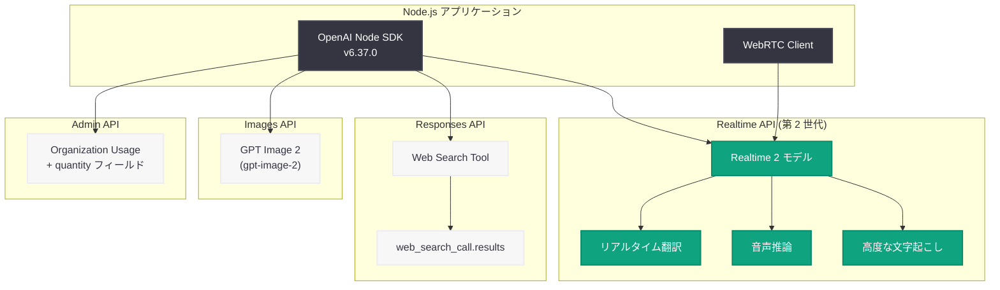
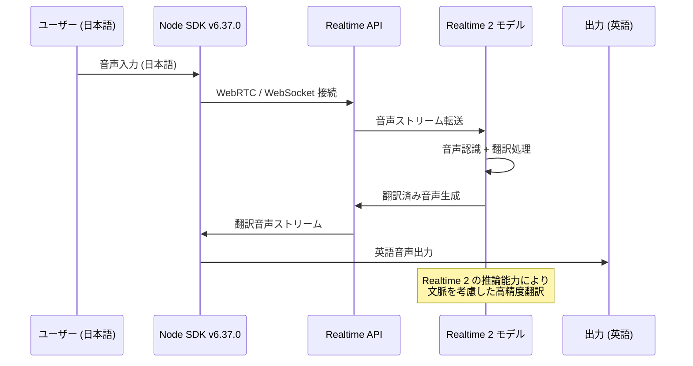
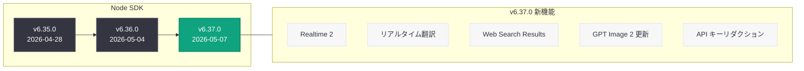

# OpenAI Node SDK v6.37.0: Realtime 2 翻訳機能、Web Search Results 出力オプション、GPT Image 2 更新を追加

## メタデータ

| 項目 | 内容 |
|------|------|
| 発表日 | 2026-05-07 |
| ソース | OpenAI API Changelog (GitHub) |
| カテゴリ | API 更新 |
| 公式リンク | [OpenAI Node SDK v6.37.0](https://github.com/openai/openai-node/releases/tag/v6.37.0) |

## 概要

OpenAI は 2026 年 5 月 7 日、Node.js/TypeScript 向け公式 SDK の v6.37.0 をリリースした。本リリースは同日発表された「Advancing voice intelligence with new models in the API」と連動しており、第 2 世代リアルタイム音声モデル (Realtime 2) のフルサポート、リアルタイム翻訳機能 (realtime translate)、GPT Image 2 モデルの更新、Responses API への `web_search_call.results` 出力オプション追加など、多岐にわたる機能強化が含まれている。

前バージョン v6.36.0 (2026 年 5 月 4 日リリース) からわずか 3 日間隔でのリリースであり、OpenAI のプラットフォーム進化に伴う SDK の迅速なアップデートが継続している。加えて、デバッグログにおける API キーのリダクション処理というセキュリティ改善と、画像生成の `size` 列挙型のリグレッション修正が含まれている。

## 主な内容

### 第 2 世代リアルタイム音声モデル (Realtime 2)

コミット `f4b7177` により、Realtime 2 モデルの SDK サポートが追加された。Realtime 2 は従来の第 1 世代リアルタイム音声モデルを大幅に拡張し、音声会話中の推論 (reasoning)、リアルタイム翻訳、高度な文字起こしをネイティブにサポートする次世代音声モデルである。

SDK レベルでは、新しいモデル識別子、セッション設定パラメータ、イベントタイプが追加されており、Realtime API のフル機能を TypeScript の型安全性を保ちながら利用できる。

### リアルタイム翻訳機能 (Realtime Translate)

コミット `a296b66` により、Realtime API のリアルタイム翻訳機能が SDK に統合された。音声入力を受け取りながら即座に別の言語に翻訳して音声出力する機能であり、以下のユースケースが実現可能になる。

- **同時通訳:** 会議やプレゼンテーションでのリアルタイム多言語翻訳
- **カスタマーサポート:** 多言語対応の音声エージェント
- **教育:** 外国語学習における即座のフィードバック
- **アクセシビリティ:** 言語の壁を超えたコミュニケーション支援

### GPT Image 2 モデルの更新

同じコミット `a296b66` で GPT Image 2 (`gpt-image-2`) モデルのサポートが更新された。2026 年 4 月 21 日にリリースされた GPT Image 2 は、高品質な画像生成・編集を提供するモデルであり、本リリースではその SDK 型定義とパラメータが最新の API 仕様に合わせて更新されている。

### Web Search Results 出力オプション

コミット `91c75e0` により、Responses API に `web_search_call.results` 出力オプションが追加された。従来の Responses API では Web 検索ツールの呼び出し結果を直接参照することが困難だったが、本機能により Web 検索の結果を構造化されたデータとして取得できるようになった。これにより、検索結果の引用元 URL や要約テキストをプログラム的に活用できる。

### Admin Organization Usage の quantity フィールド

コミット `273a8f7` により、Admin API の組織使用量レスポンスに `quantity` フィールドが追加された。これにより、API 使用量の定量的な把握と分析がより詳細に行えるようになった。

### セキュリティ改善: API キーのリダクション

コミット `99c9c80` により、デバッグログ出力時に `api-key` ヘッダーがリダクション (マスキング) されるようになった。開発中にデバッグモードを有効にした際、誤って API キーがログファイルやコンソール出力に含まれるリスクが排除された。

### バグ修正: 画像生成 size 列挙型のリグレッション

コミット `4fe8469` により、画像生成 API の `size` パラメータの列挙型に関するリグレッションが修正された。GPT Image 2 のリリースに伴い導入された型定義の問題が解消されている。

## 技術的な詳細

### コードサンプル

#### SDK のアップグレード

```bash
# npm を使用したアップグレード
npm install openai@latest

# バージョン指定でのインストール
npm install openai@6.37.0

# yarn を使用している場合
yarn upgrade openai@^6.37.0

# pnpm を使用している場合
pnpm update openai
```

#### リアルタイム翻訳セッションの開始

```typescript
import OpenAI from "openai";

const client = new OpenAI();

// Realtime 2 モデルを使用した翻訳セッションの作成
const session = await client.realtime.sessions.create({
  model: "gpt-4o-realtime-preview",
  modalities: ["audio", "text"],
  // リアルタイム翻訳の設定
  translate: {
    source_language: "ja", // 日本語入力
    target_language: "en", // 英語出力
  },
  voice: "alloy",
  input_audio_format: "pcm16",
  output_audio_format: "pcm16",
});

console.log(`Session ID: ${session.id}`);
console.log(`Client Secret: ${session.client_secret?.value}`);
```

#### WebRTC を使用したリアルタイム翻訳接続

```typescript
import OpenAI from "openai";

const client = new OpenAI();

// エフェメラルキーを取得
const session = await client.realtime.sessions.create({
  model: "gpt-4o-realtime-preview",
  modalities: ["audio", "text"],
  translate: {
    source_language: "ja",
    target_language: "en",
  },
  voice: "shimmer",
});

// WebRTC 接続の確立 (ブラウザ環境)
const pc = new RTCPeerConnection();
const audioEl = document.createElement("audio");
audioEl.autoplay = true;

pc.ontrack = (event) => {
  audioEl.srcObject = event.streams[0];
};

// マイクからの音声入力を追加
const stream = await navigator.mediaDevices.getUserMedia({ audio: true });
pc.addTrack(stream.getTracks()[0]);

const offer = await pc.createOffer();
await pc.setLocalDescription(offer);

// OpenAI Realtime API に接続
const response = await fetch(
  "https://api.openai.com/v1/realtime?model=gpt-4o-realtime-preview",
  {
    method: "POST",
    headers: {
      Authorization: `Bearer ${session.client_secret?.value}`,
      "Content-Type": "application/sdp",
    },
    body: offer.sdp,
  }
);

const answerSdp = await response.text();
await pc.setRemoteDescription({ type: "answer", sdp: answerSdp });
```

#### Web Search Results 出力オプションの使用

```typescript
import OpenAI from "openai";

const client = new OpenAI();

// Responses API で web_search_call.results を含むレスポンスを取得
const response = await client.responses.create({
  model: "gpt-4o",
  tools: [{ type: "web_search_preview" }],
  input: "OpenAI の最新ニュースを教えてください",
  // Web 検索結果を出力に含める
  include: ["web_search_call.results"],
});

// レスポンスの出力を解析
for (const output of response.output) {
  if (output.type === "web_search_call") {
    console.log(`検索クエリ: ${output.query}`);
    // web_search_call.results が含まれる場合
    if (output.results) {
      for (const result of output.results) {
        console.log(`  タイトル: ${result.title}`);
        console.log(`  URL: ${result.url}`);
        console.log(`  スニペット: ${result.snippet}`);
      }
    }
  } else if (output.type === "message") {
    for (const content of output.content) {
      if (content.type === "output_text") {
        console.log(`\n回答: ${content.text}`);
        // 引用情報の取得
        if (content.annotations) {
          for (const annotation of content.annotations) {
            if (annotation.type === "url_citation") {
              console.log(`  引用: ${annotation.url}`);
            }
          }
        }
      }
    }
  }
}
```

#### GPT Image 2 による画像生成

```typescript
import OpenAI from "openai";
import fs from "fs";

const client = new OpenAI();

// GPT Image 2 を使用した画像生成
const response = await client.images.generate({
  model: "gpt-image-2",
  prompt: "A serene Japanese garden with cherry blossoms in spring",
  size: "1536x1024", // v6.37.0 で修正された size 列挙型
  quality: "high",
  n: 1,
});

// Base64 でエンコードされた画像を保存
if (response.data[0].b64_json) {
  const buffer = Buffer.from(response.data[0].b64_json, "base64");
  fs.writeFileSync("generated-image.png", buffer);
  console.log("画像を保存しました: generated-image.png");
}
```

#### デバッグモードでの安全なログ出力

```typescript
import OpenAI from "openai";

// デバッグモードを有効化
// v6.37.0 以降、api-key ヘッダーは自動的にリダクションされる
const client = new OpenAI({
  apiKey: process.env.OPENAI_API_KEY,
});

// DEBUG 環境変数で有効化する場合
// OPENAI_LOG=debug node app.js
// ログ出力例:
// > Request headers: { "authorization": "Bearer sk-...REDACTED", ... }
```

### 変更一覧

| 種別 | 変更内容 | コミット |
|------|---------|---------|
| 機能追加 | Admin Organization Usage に quantity フィールド追加 | `273a8f7` |
| 機能追加 | web_search_call.results 出力オプション追加 | `91c75e0` |
| 機能追加 | Realtime Translate + GPT Image 2 更新 | `a296b66` |
| 機能追加 | API 手動更新 | `794b905` |
| 機能追加 | API 手動更新 | `6963729` |
| 機能追加 | Realtime 2 サポート | `f4b7177` |
| バグ修正 | 画像生成 size 列挙型のリグレッション修正 | `4fe8469` |
| メンテナンス | デバッグログでの api-key ヘッダーのリダクション | `99c9c80` |

## アーキテクチャ

### v6.37.0 の新機能アーキテクチャ



### リアルタイム翻訳のデータフロー



### SDK リリースタイムライン



## 開発者への影響

- **リアルタイム音声アプリケーションの高度化:** Realtime 2 モデルのサポートにより、推論能力を持つ音声エージェントを Node.js で構築できるようになった。従来の単純な音声応答から、複雑な質問への論理的回答が可能な音声 AI へと進化する
- **多言語対応の劇的な簡素化:** リアルタイム翻訳機能により、翻訳サービスの別途統合が不要になった。セッション設定で言語ペアを指定するだけで、低レイテンシの同時通訳が実現する
- **Web 検索結果の活用:** `web_search_call.results` 出力オプションにより、Responses API の Web 検索結果を構造化データとして取得し、引用元の表示やファクトチェック機能の実装が容易になった
- **画像生成の安定性向上:** `size` 列挙型のリグレッション修正により、GPT Image 2 で利用可能なすべてのサイズオプション (`1024x1024`、`1536x1024`、`1024x1536` など) を型安全に指定できるようになった
- **セキュリティの向上:** デバッグログでの API キーリダクションにより、開発中のログ出力やエラーレポートに API キーが含まれるリスクが排除された。本番環境でのインシデント調査時にも安全にログを共有できる
- **既存コードへの影響は最小限:** 本リリースは追加的な機能であり、破壊的変更は含まれていない。安全にアップグレードできる

### アップグレード手順

```bash
# 1. 依存関係の更新
npm install openai@6.37.0

# 2. TypeScript の型チェック (型定義の追加に伴う確認)
npx tsc --noEmit

# 3. テストの実行
npm test

# 4. Realtime API 関連コードの確認 (任意)
grep -rn "realtime" --include="*.ts" --include="*.js" .
```

## 関連リンク

- [Node SDK v6.37.0 リリースノート](https://github.com/openai/openai-node/releases/tag/v6.37.0)
- [Node SDK v6.36.0 リリースノート](https://github.com/openai/openai-node/releases/tag/v6.36.0)
- [v6.36.0...v6.37.0 の完全な差分](https://github.com/openai/openai-node/compare/v6.36.0...v6.37.0)
- [Advancing voice intelligence with new models in the API](https://openai.com/index/advancing-voice-intelligence-with-new-models-in-the-api)
- [OpenAI Realtime API ドキュメント](https://platform.openai.com/docs/guides/realtime)
- [OpenAI Responses API ドキュメント](https://platform.openai.com/docs/guides/responses)
- [GPT Image 2 API ドキュメント](https://platform.openai.com/docs/guides/images)
- [openai-node GitHub リポジトリ](https://github.com/openai/openai-node)

## まとめ

Node SDK v6.37.0 は、OpenAI プラットフォームの大規模な機能拡張に対応する重要なリリースである。6 件の機能追加、1 件のバグ修正、1 件のセキュリティ改善が含まれ、前バージョン v6.36.0 からわずか 3 日間隔でのリリースとなった。

最大の注目点は、第 2 世代リアルタイム音声モデル (Realtime 2) とリアルタイム翻訳機能のサポートである。同日発表された「Advancing voice intelligence with new models in the API」と連動しており、音声 AI の推論能力と多言語翻訳を Node.js アプリケーションから即座に利用できるようになった。5 月 4 日にリリースされた WebRTC スタックの再設計を基盤として、低レイテンシかつスケーラブルな音声 AI 体験を提供する。

加えて、Responses API の `web_search_call.results` 出力オプションにより Web 検索結果の構造化データ取得が可能になり、GPT Image 2 の型定義更新とサイズ列挙型のリグレッション修正により画像生成 API の安定性が向上した。デバッグログでの API キーリダクションは、開発プロセス全体のセキュリティを底上げする歓迎すべき改善である。

本リリースは破壊的変更を含まず、安全にアップグレードできる。特にリアルタイム音声アプリケーションや多言語対応を検討している開発者には、即座のアップグレードを推奨する。
