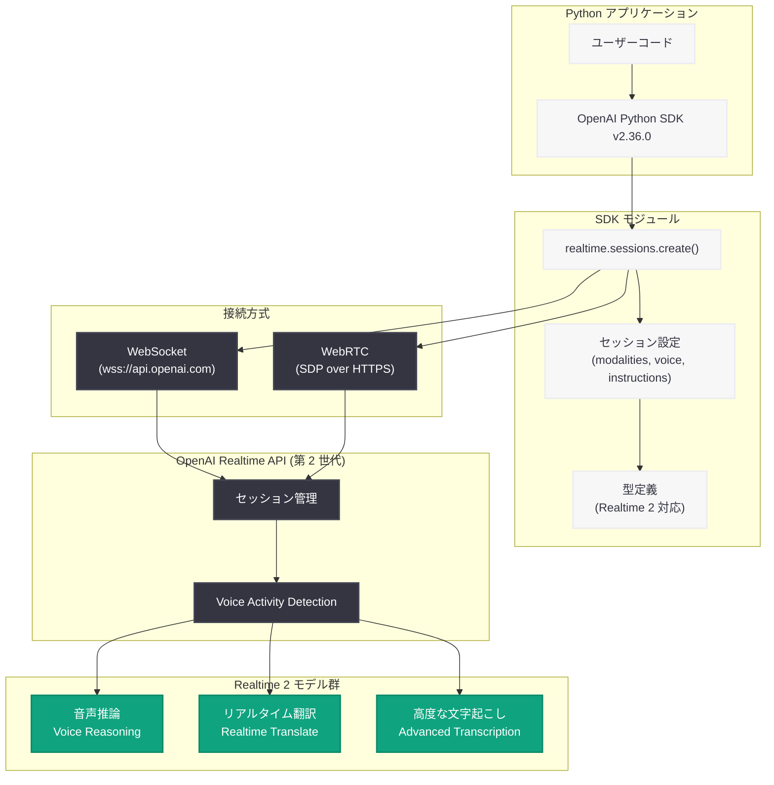
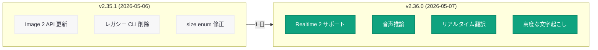

# OpenAI Python SDK v2.36.0: Realtime 2 サポートを追加し次世代音声インテリジェンスに対応

## メタデータ

| 項目 | 内容 |
|------|------|
| 発表日 | 2026-05-07 |
| ソース | OpenAI API Changelog (GitHub) |
| カテゴリ | API 更新 |
| 公式リンク | [OpenAI Python SDK v2.36.0](https://github.com/openai/openai-python/releases/tag/v2.36.0) |

## 概要

OpenAI は 2026 年 5 月 7 日、Python SDK v2.36.0 をリリースした。本リリースの最大の特徴は、同日発表された「Advancing voice intelligence with new models in the API」に対応する第 2 世代リアルタイム音声モデル (Realtime 2) の SDK サポートである。Realtime 2 は、音声会話中の推論 (reasoning)、リアルタイム翻訳 (translate)、高度な文字起こし (transcription) をネイティブにサポートする次世代音声モデルであり、本 SDK アップデートによって Python デベロッパーはこれらの機能を即座に活用できる。

前バージョン v2.35.1 (2026 年 5 月 6 日リリース) からわずか 1 日でのリリースであり、プラットフォームの進化に合わせた SDK の迅速なアップデートが継続している。

## 主な内容

### 第 2 世代リアルタイム音声モデル (Realtime 2) のサポート

コミット `8fe0ab8` により、Realtime 2 モデルの完全な SDK サポートが追加された。Realtime 2 は従来の第 1 世代リアルタイム音声モデルを大幅に拡張するものであり、以下の 3 つの新機能を中核としている。

- **音声推論 (Voice Reasoning):** 音声会話中にモデルが「考える」能力を持ち、複雑な質問や多段階の思考が必要なタスクに音声インターフェースで対応
- **リアルタイム翻訳 (Realtime Translate):** 音声入力を受け取りながら即座に別の言語に翻訳して音声出力
- **高度な文字起こし (Advanced Transcription):** ストリーミング特性を活かした、発話中のリアルタイム文字起こし

SDK レベルでは、新しいモデル識別子、セッション設定パラメータ、イベントタイプが追加されており、Realtime API の全機能を Python の型ヒントの恩恵を受けながら利用できる。

### API の手動更新

コミット `13c639c` により、API 定義の手動更新が行われている。これは OpenAI が API 仕様の変更を SDK に反映する際の定期的なメンテナンス作業であり、型定義やパラメータの整合性が最新の API 仕様に合わせて更新されている。

## 技術的な詳細

### 変更一覧

| 種別 | 変更内容 | コミット |
|------|---------|---------|
| 機能追加 | Realtime 2 モデルのサポート | `8fe0ab8` |
| 機能追加 | API の手動更新 | `13c639c` |

### コードサンプル

#### SDK のアップグレード

```bash
# v2.36.0 へのアップグレード
pip install --upgrade openai

# バージョン確認
python -c "import openai; print(openai.__version__)"
# 出力: 2.36.0

# 特定バージョンを指定してインストール
pip install openai==2.36.0
```

#### Realtime 2 セッションの作成 (音声推論)

```python
from openai import OpenAI

client = OpenAI()

# Realtime 2 モデルを使用した音声セッションの作成
session = client.realtime.sessions.create(
    model="gpt-4o-realtime-preview",
    modalities=["text", "audio"],
    instructions=(
        "You are a helpful assistant with advanced reasoning capabilities. "
        "Think step by step when answering complex questions."
    ),
    voice="alloy",
    input_audio_transcription={
        "model": "whisper-1"
    },
    turn_detection={
        "type": "server_vad",
        "threshold": 0.5,
        "prefix_padding_ms": 300,
        "silence_duration_ms": 500
    }
)

print(f"Session ID: {session.id}")
print(f"Client secret: {session.client_secret.value}")
```

#### リアルタイム翻訳セッションの設定

```python
from openai import OpenAI

client = OpenAI()

# リアルタイム翻訳用セッションの作成
# 英語から日本語への同時通訳を設定
session = client.realtime.sessions.create(
    model="gpt-4o-realtime-preview",
    modalities=["text", "audio"],
    instructions=(
        "You are a real-time translator. "
        "Listen to the user's speech in English and translate it into Japanese. "
        "Respond only with the translated audio. "
        "Maintain natural speech patterns and appropriate honorifics."
    ),
    voice="shimmer",
    input_audio_transcription={
        "model": "whisper-1"
    },
    turn_detection={
        "type": "server_vad",
        "threshold": 0.4,
        "prefix_padding_ms": 200,
        "silence_duration_ms": 300
    }
)

print(f"Translation session created: {session.id}")
```

#### WebRTC 接続でのリアルタイム音声ストリーミング

```python
import asyncio
import json
import websockets
from openai import OpenAI

client = OpenAI()

# セッションの作成
session = client.realtime.sessions.create(
    model="gpt-4o-realtime-preview",
    modalities=["text", "audio"],
    instructions="You are a helpful voice assistant with reasoning capabilities.",
    voice="coral",
    input_audio_transcription={
        "model": "whisper-1"
    }
)

# WebSocket 経由でのリアルタイム接続
async def connect_realtime():
    url = "wss://api.openai.com/v1/realtime?model=gpt-4o-realtime-preview"
    headers = {
        "Authorization": f"Bearer {session.client_secret.value}",
        "OpenAI-Beta": "realtime=v2"
    }

    async with websockets.connect(url, extra_headers=headers) as ws:
        # セッション更新イベントの送信
        await ws.send(json.dumps({
            "type": "session.update",
            "session": {
                "modalities": ["text", "audio"],
                "instructions": "Respond concisely with reasoning.",
            }
        }))

        # イベントの受信ループ
        async for message in ws:
            event = json.loads(message)
            if event["type"] == "response.audio_transcript.done":
                print(f"Transcript: {event['transcript']}")
            elif event["type"] == "response.done":
                print("Response complete")
                break

asyncio.run(connect_realtime())
```

#### 高度な文字起こし機能の活用

```python
from openai import OpenAI

client = OpenAI()

# 高度な文字起こし機能を有効にしたセッション
session = client.realtime.sessions.create(
    model="gpt-4o-realtime-preview",
    modalities=["text", "audio"],
    instructions="Transcribe all speech accurately with punctuation and formatting.",
    voice="alloy",
    input_audio_transcription={
        "model": "whisper-1"
    },
    turn_detection={
        "type": "server_vad",
        "threshold": 0.3,
        "prefix_padding_ms": 500,
        "silence_duration_ms": 800
    }
)

print(f"Transcription session: {session.id}")
print(f"Ephemeral key: {session.client_secret.value}")
```

## アーキテクチャ

### Python SDK v2.36.0 における Realtime 2 統合アーキテクチャ



### SDK バージョン進化: v2.35.1 から v2.36.0 への変更



## 開発者への影響

### 新たに可能になるユースケース

- **多言語音声エージェント:** リアルタイム翻訳により、Python バックエンドから単一のエージェントで多言語対応の音声サービスを構築可能。カスタマーサポート、コンシェルジュ、ヘルプデスクなどに適用できる
- **インテリジェント音声アシスタント:** 推論能力を持つ音声モデルにより、複雑な計算や論理的思考を伴う音声アシスタントを Python で開発可能
- **リアルタイム字幕・議事録システム:** 高度な文字起こし機能を活用し、会議やイベントのリアルタイム字幕生成、自動議事録作成を実装可能

### SDK アップグレードの推奨

Realtime 2 の機能を利用するには v2.36.0 以上が必要である。

```bash
pip install openai>=2.36.0
```

v2.35.1 からのアップグレードにおいて破壊的変更は含まれていないため、既存のコードに影響を与えることなく安全にアップグレードできる。

### Node SDK との同時リリース

同日リリースの Node SDK v6.37.0 も同等の Realtime 2 サポートを提供している。Python と Node.js の両方で統一された API インターフェースが利用可能であり、チーム内で複数言語を使用している場合でも一貫した開発体験が得られる。

### WebRTC スタック再設計との組み合わせ

2026 年 5 月 4 日に発表された WebRTC スタックの再設計 (Relay + Transceiver アーキテクチャ) により、Realtime 2 は低レイテンシかつスケーラブルなインフラストラクチャ上で動作する。Python SDK v2.36.0 は、この新インフラストラクチャと完全に統合されている。

## 関連リンク

- [OpenAI Python SDK v2.36.0 リリースノート](https://github.com/openai/openai-python/releases/tag/v2.36.0)
- [openai-python GitHub リポジトリ](https://github.com/openai/openai-python)
- [Advancing voice intelligence with new models in the API](https://openai.com/index/advancing-voice-intelligence-with-new-models-in-the-api) - Realtime 2 の公式発表
- [OpenAI Realtime API ドキュメント](https://platform.openai.com/docs/guides/realtime)
- [OpenAI Node SDK v6.37.0](https://github.com/openai/openai-node/releases/tag/v6.37.0) - 同日リリースの Node SDK
- [Delivering low-latency voice AI at scale](https://openai.com/index/delivering-low-latency-voice-ai-at-scale) - WebRTC アーキテクチャの再設計 (2026-05-04)
- [OpenAI API リファレンス](https://platform.openai.com/docs/api-reference)

## まとめ

Python SDK v2.36.0 は、Realtime 2 モデルの SDK サポートを主軸としたリリースである。同日発表された「Advancing voice intelligence with new models in the API」に対応し、音声推論、リアルタイム翻訳、高度な文字起こしという 3 つの新機能を Python デベロッパーが即座に活用できるようにしている。前バージョン v2.35.1 からわずか 1 日でのリリースであり、プラットフォームの急速な進化に SDK が追従している点が印象的である。Realtime 2 は音声 AI の能力を大幅に拡張するものであり、多言語音声エージェントやインテリジェント音声アシスタントなど、新しいカテゴリのアプリケーション開発を可能にする重要なアップデートといえる。
