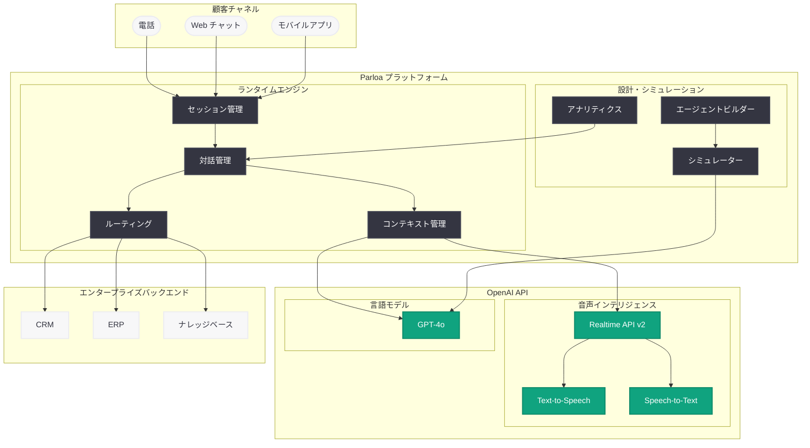
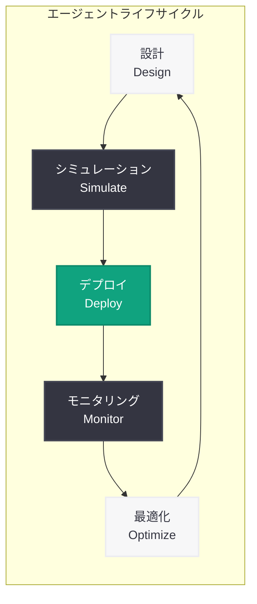

# Parloa が OpenAI モデルを活用し「顧客が話したくなる」音声 AI カスタマーサービスエージェントを構築

## メタデータ

| 項目 | 内容 |
|------|------|
| 発表日 | 2026-05-07 |
| ソース | OpenAI News |
| カテゴリ | B2B 事例 |
| 公式リンク | [Parloa builds service agents customers want to talk to](https://openai.com/index/parloa) |

## 概要

ドイツ発の会話型 AI プラットフォーム企業 Parloa が、OpenAI のモデルを活用してスケーラブルな音声駆動 AI カスタマーサービスエージェントを構築している事例が公開された。Parloa のプラットフォームにより、エンタープライズ企業は音声 AI エージェントの設計、シミュレーション、デプロイを一気通貫で行い、信頼性の高いリアルタイムインタラクションを実現できる。

本事例は、同日発表された「Advancing voice intelligence with new models in the API」(Realtime API 第 2 世代モデル) のエンタープライズにおける実践的活用例として位置づけられ、OpenAI の音声インテリジェンス技術がプロダクション環境でどのように利用されているかを示す重要な B2B ストーリーである。

## 主な内容

### Parloa の企業背景

Parloa はドイツ・ベルリンを拠点とする会話型 AI プラットフォーム企業であり、エンタープライズ向けの AI カスタマーサービスソリューションを提供している。同社のミッションは「顧客が話したくなるサービスエージェント」の実現であり、従来の IVR (自動音声応答) システムとは根本的に異なるアプローチで、自然で知的な音声対話体験を構築している。

同社は大手エンタープライズ企業をターゲットとし、コンタクトセンターの AI トランスフォーメーションを支援している。OpenAI のモデルを基盤技術として採用することで、人間のエージェントと同等以上の対話品質を持つ AI エージェントの大規模展開を可能にしている。

### 音声エージェントの主要機能

Parloa のプラットフォームは、音声 AI エージェントのライフサイクル全体をカバーする包括的な機能を提供している。

**設計 (Design):**
- ノーコード / ローコードのエージェント設計インターフェース
- 会話フローのビジュアル構築
- プロンプトエンジニアリングの最適化ツール
- 多言語対応の会話シナリオ設計

**シミュレーション (Simulate):**
- デプロイ前のエージェント動作テスト
- 様々な顧客シナリオの自動シミュレーション
- 品質メトリクスの測定と最適化
- エッジケースの検出と対処

**デプロイ (Deploy):**
- エンタープライズグレードのスケーラビリティ
- 既存のコンタクトセンターインフラとの統合
- リアルタイムモニタリングとアナリティクス
- 段階的なロールアウト管理

### エンタープライズユースケース

Parloa の音声 AI エージェントは、以下のようなエンタープライズユースケースで活用されている。

- **カスタマーサポート:** 問い合わせ対応、問題解決、FAQ への音声回答
- **注文管理:** 注文状況の確認、変更、キャンセル処理
- **予約・スケジューリング:** アポイントメントの予約、変更、リマインダー
- **アカウント管理:** 残高照会、プラン変更、情報更新
- **多言語対応:** グローバル企業向けの複数言語での同時サービス提供

### 導入成果

Parloa のプラットフォームを導入したエンタープライズ企業では、以下のような成果が報告されている。

- 顧客満足度の向上: AI エージェントによる迅速で正確な対応
- 対応時間の短縮: リアルタイム処理による待ち時間の削減
- スケーラビリティ: ピーク時の問い合わせ増加に柔軟に対応
- コスト効率: 人的リソースの最適配分による運用コストの改善
- 24 時間 365 日対応: 時間帯を問わない高品質なサービス提供

## 技術的な詳細

### OpenAI モデルの活用

Parloa は OpenAI の複数のモデルと API を組み合わせて、高度な音声 AI エージェントを構築している。

**Realtime API の活用:**

同日発表された Realtime API 第 2 世代モデルにより、Parloa のエージェントは以下の能力を獲得している。

- **音声推論 (Voice Reasoning):** 複雑な顧客の質問に対して、文脈を理解しながら的確に回答
- **リアルタイム処理:** 低レイテンシでの音声入出力により、自然な会話テンポを実現
- **音声活動検出 (VAD):** 顧客の発話タイミングを正確に検知し、適切なタイミングで応答

**Chat Completions API の活用:**

- 会話のコンテキスト管理と意図理解
- ナレッジベースからの情報検索と回答生成
- 業務ロジックに基づく判断と処理

**音声合成 (TTS) の活用:**

- 自然で人間的な音声によるレスポンス生成
- 複数の音声ペルソナによるブランドに合わせた対応
- 多言語での音声出力

### Realtime API 統合アーキテクチャ

Parloa のプラットフォームは、OpenAI の Realtime API を基盤として以下のアーキテクチャで構成されていると考えられる。

1. **音声入力層:** WebRTC を使用した低レイテンシの音声キャプチャ
2. **セッション管理層:** Realtime API セッションのライフサイクル管理
3. **対話管理層:** 会話状態、コンテキスト、インテントの管理
4. **ビジネスロジック層:** CRM、ERP 等のバックエンドシステムとの連携
5. **音声出力層:** 合成音声のリアルタイムストリーミング

### コードサンプル

#### Realtime API を活用した音声エージェントセッションの構成例

```python
from openai import OpenAI

client = OpenAI()

# Parloa スタイルのカスタマーサービスエージェントセッション
session = client.realtime.sessions.create(
    model="gpt-4o-realtime-preview",
    modalities=["text", "audio"],
    instructions=(
        "You are a professional customer service agent for an enterprise. "
        "Be polite, efficient, and solution-oriented. "
        "Follow the company's service guidelines and escalate "
        "complex issues to human agents when necessary. "
        "Always confirm the customer's identity before making changes."
    ),
    voice="shimmer",
    input_audio_transcription={
        "model": "whisper-1"
    },
    turn_detection={
        "type": "server_vad",
        "threshold": 0.5,
        "prefix_padding_ms": 300,
        "silence_duration_ms": 700
    }
)

print(f"Agent Session ID: {session.id}")
print(f"Client secret: {session.client_secret.value}")
```

#### エージェント会話シミュレーションの例

```python
from openai import OpenAI

client = OpenAI()

# デプロイ前のエージェント品質テスト (シミュレーション)
simulation_response = client.chat.completions.create(
    model="gpt-4o",
    messages=[
        {
            "role": "system",
            "content": (
                "You are simulating a customer calling about an order issue. "
                "Generate a realistic customer scenario including: "
                "emotional state, specific problem, expected resolution. "
                "This is used to test AI agent performance before deployment."
            )
        },
        {
            "role": "user",
            "content": (
                "Generate a test scenario for: "
                "Category: Order delayed\n"
                "Difficulty: Medium\n"
                "Language: German\n"
                "Customer emotion: Frustrated but polite"
            )
        }
    ]
)

test_scenario = simulation_response.choices[0].message.content
print(f"Test scenario: {test_scenario}")
```

## アーキテクチャ

### Parloa 音声 AI エージェントプラットフォームアーキテクチャ



### エージェントライフサイクル



## 開発者への影響

### 音声 AI エージェント開発のベストプラクティス

Parloa の事例は、エンタープライズグレードの音声 AI エージェントを構築する際の実践的な指針を提供している。

- **設計段階からのテスト:** AI を使ったシミュレーションにより、デプロイ前にエージェントの品質を検証するアプローチは、プロダクション障害のリスクを低減する
- **Realtime API の活用:** 同日発表された Realtime API 第 2 世代モデルの推論能力により、複雑なカスタマーサービスシナリオへの対応が飛躍的に向上する
- **多層アーキテクチャ:** 対話管理、ビジネスロジック、バックエンドシステム連携を分離した設計により、保守性とスケーラビリティを両立できる
- **段階的デプロイ:** シミュレーションからプロダクションへの段階的な移行パターンは、エンタープライズ環境での AI 導入において重要なアプローチである

### エンタープライズ音声 AI の構築に向けて

開発者が同様のシステムを構築する際の考慮事項は以下の通り。

- **Realtime API v2 の採用:** 低レイテンシかつ高品質な音声インタラクションを実現するため、最新の Realtime API を基盤として選択することが推奨される
- **コンテキスト管理の設計:** 長い会話セッションでのコンテキスト保持と、適切なタイミングでのエスカレーション判断が重要である
- **バックエンド連携:** CRM、ERP 等の既存システムとの統合を前提としたアーキテクチャ設計が必要である
- **品質モニタリング:** リアルタイムでの会話品質メトリクスの収集と継続的な改善サイクルの構築が不可欠である

### Realtime API 第 2 世代との関連

同日リリースされた Realtime API の新モデルが提供する音声推論、リアルタイム翻訳、高度な文字起こし機能は、Parloa のようなエンタープライズ音声エージェントプラットフォームにとって以下の恩恵をもたらす。

- **音声推論:** 顧客の複雑な問い合わせに対して、推論を行いながら的確に回答できる
- **リアルタイム翻訳:** グローバル企業の多言語カスタマーサポートを単一エージェントで実現可能に
- **高度な文字起こし:** 会話ログの正確な記録と分析が容易になり、品質改善サイクルが加速する

## 関連リンク

- [OpenAI 公式記事: Parloa builds service agents customers want to talk to](https://openai.com/index/parloa)
- [Advancing voice intelligence with new models in the API](https://openai.com/index/advancing-voice-intelligence-with-new-models-in-the-api) - 同日発表の Realtime API 第 2 世代モデル
- [OpenAI Realtime API ドキュメント](https://platform.openai.com/docs/guides/realtime)
- [OpenAI Text-to-Speech API ドキュメント](https://platform.openai.com/docs/guides/text-to-speech)
- [OpenAI Speech-to-Text API ドキュメント](https://platform.openai.com/docs/guides/speech-to-text)
- [Parloa 公式サイト](https://www.parloa.com/)

## まとめ

Parloa の事例は、OpenAI の音声インテリジェンス技術がエンタープライズのカスタマーサービス領域でどのように実用化されているかを示す重要な B2B ストーリーである。「顧客が話したくなるサービスエージェント」というビジョンのもと、設計・シミュレーション・デプロイという一連のライフサイクルを統合的に管理するプラットフォームは、AI カスタマーサービスの成熟度を示している。

同日発表された Realtime API 第 2 世代モデルの音声推論やリアルタイム翻訳機能は、Parloa のようなプラットフォームの能力を更に拡張するものであり、エンタープライズ音声 AI の新たな可能性を切り拓くものである。開発者にとっては、音声 AI エージェントの設計パターン、テスト手法、スケーラブルなアーキテクチャの構築において貴重な参考事例となるだろう。
