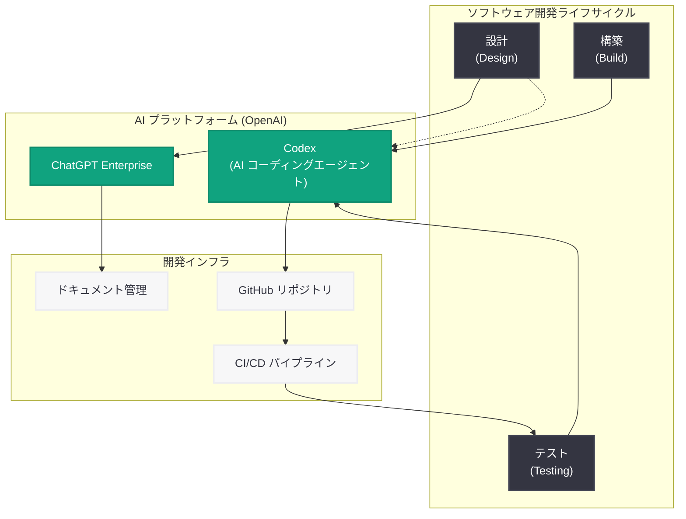

# Simplex が ChatGPT Enterprise と Codex でソフトウェア開発を再構築

## メタデータ

| 項目 | 内容 |
|------|------|
| 発表日 | 2026-05-07 |
| ソース | OpenAI News/Blog |
| カテゴリ | B2B 事例 |
| 公式リンク | [Simplex rethinks software development with Codex](https://openai.com/index/simplex) |

> **注記:** 本レポートは OpenAI の公式発表に基づいて作成されている。公式ページへの直接アクセスが制限されていたため、公式の説明文および関連する公開情報をもとに内容を構成している。正確な詳細については [公式ページ](https://openai.com/index/simplex) を参照されたい。

## 概要

Simplex は、ChatGPT Enterprise と Codex を活用してソフトウェア開発プロセス全体を再構築し、設計 (Design)、構築 (Build)、テスト (Testing) の各フェーズにおける所要時間を短縮しながら、AI 駆動のワークフローを全社的にスケールさせている。

本事例は、OpenAI のエンタープライズ向け AI コーディングエージェント Codex がソフトウェア開発のライフサイクル全体にわたって実用的な価値を提供できることを示す好例である。2026 年 5 月 6 日に公開された Singular Bank や Uber の事例に続く形で発表されており、OpenAI のエンタープライズ顧客獲得戦略の一環として位置付けられる。

## 主な内容

### Simplex の企業概要

Simplex はテクノロジー / フィンテック領域で事業を展開する企業であり、金融テクノロジーやソフトウェアソリューションの開発を手掛けている。高度な技術力を基盤とした製品開発を強みとしており、開発チームの生産性向上と品質確保が事業成長の重要な要素となっている。

テクノロジー企業として、ソフトウェア開発の効率化は直接的にビジネス成果に影響するため、AI ツールの導入による開発プロセスの最適化は戦略的な取り組みとして位置付けられている。

### ChatGPT Enterprise の活用: 設計フェーズの効率化

Simplex は ChatGPT Enterprise をソフトウェア設計 (Design) フェーズに活用し、以下の業務効率化を実現していると考えられる。

- **要件定義の整理と構造化:** 自然言語での要件記述を構造化されたドキュメントに変換し、仕様の曖昧さを早期に解消
- **アーキテクチャ設計の検討:** 技術的な設計判断における選択肢の比較分析、トレードオフの整理を AI が支援
- **設計レビューの効率化:** 設計ドキュメントのレビューにおいて、潜在的な課題の検出や改善提案を自動化
- **ナレッジの共有と再利用:** 過去のプロジェクトで蓄積された設計パターンやベストプラクティスの検索・活用を支援

### Codex の活用: 構築とテストフェーズの加速

Codex (OpenAI のクラウドベース AI コーディングエージェント) は、構築 (Build) およびテスト (Testing) フェーズにおいて以下の形で活用されていると推定される。

- **コード生成と実装の加速:** 設計仕様に基づいたコードの自動生成、ボイラープレートコードの削減、実装パターンの適用
- **テストコードの自動生成:** ユニットテスト、インテグレーションテストの自動作成により、テストカバレッジを効率的に向上
- **コードレビューの支援:** Pull Request のレビューにおいて、バグの検出、コード品質の改善提案、セキュリティリスクの指摘を自動化
- **リファクタリングの実行:** 既存コードの改善やモダナイゼーションを Codex が自律的に実行し、技術的負債の解消を加速
- **バグ修正の効率化:** 問題の根本原因の分析と修正コードの生成を支援し、デバッグ時間を短縮

### AI 駆動ワークフローのスケール

Simplex の取り組みの特徴は、個人レベルの AI 活用にとどまらず、組織全体のワークフローとして AI を統合している点にある。

- **開発ライフサイクル全体への適用:** 設計、構築、テストという開発の 3 大フェーズすべてで AI を活用し、エンドツーエンドの効率化を実現
- **チーム単位でのスケール:** 個々の開発者だけでなく、チーム全体の開発プロセスとして AI ツールを標準化
- **ワークフローへの組み込み:** AI を補助的なツールとしてではなく、開発ワークフローの中核的な要素として位置付け

### 成果と効果

公式説明文に基づく主な成果は以下の通りである。

- **設計時間の短縮:** 要件定義から設計完了までのリードタイムが短縮
- **構築時間の削減:** コード実装にかかる工数が Codex の支援により削減
- **テスト時間の効率化:** テスト作成と実行にかかる時間が自動化により短縮
- **AI ワークフローのスケール:** 組織全体で AI 駆動の開発プロセスが標準化

## 技術的な詳細

### 使用ツール

| ツール | 用途 |
|--------|------|
| ChatGPT Enterprise | 設計支援、ドキュメント作成、ナレッジ共有 |
| Codex | コード生成、テスト自動化、コードレビュー、リファクタリング |

### Codex の特徴

Codex は OpenAI が提供するクラウドベースの AI コーディングエージェントであり、以下の特徴を持つ。

- **クラウドネイティブ:** サンドボックス化されたクラウド環境でコードを実行し、安全に開発タスクを自律的に処理
- **マルチタスク対応:** 複数のコーディングタスクを並列で処理可能
- **コードベース理解:** リポジトリ全体のコンテキストを理解した上でコード生成や修正を実行
- **セキュアな実行環境:** エンタープライズのセキュリティ要件に対応したサンドボックス環境で動作

### 統合アプローチ

Simplex の開発ワークフローにおける ChatGPT Enterprise と Codex の統合は、以下のような構成で行われていると推定される。

- **ChatGPT Enterprise:** 開発チーム全員がアクセス可能な対話型 AI として、設計段階でのブレインストーミング、仕様の壁打ち、技術的な質問応答に使用
- **Codex:** 開発チームが GitHub リポジトリと連携し、実装タスクやテスト生成を自動化。Pull Request ベースのワークフローに統合

## アーキテクチャ

## 開発者への影響

### ソフトウェア開発チームへの影響

- **開発ライフサイクル全体での AI 活用モデル:** Simplex の事例は、AI を特定のフェーズ (例: コード生成のみ) ではなく、設計からテストまでの全フェーズに統合する包括的なアプローチを示している。開発チームがこのモデルを参考にすることで、より体系的な AI 導入が可能となる
- **Codex のエンタープライズ活用パターン:** チーム単位での Codex 活用により、個人の生産性向上だけでなく、組織全体の開発スループット向上を実現する設計パターンが確立される
- **テスト自動化の進化:** Codex によるテストコード生成は、テストカバレッジの向上とテスト作成コストの削減を同時に実現する可能性を示している

### テクノロジー / フィンテック業界への影響

- **開発スピードの競争力:** AI 駆動の開発ワークフローにより、機能リリースまでのサイクルタイムが短縮され、市場投入速度 (Time-to-Market) における競争優位性が生まれる
- **品質とスピードの両立:** 従来トレードオフの関係にあった開発スピードと品質を、AI の支援により同時に向上させるアプローチが実証される
- **エンジニアリング文化の変革:** AI をワークフローの中核に据える開発文化への移行が、テクノロジー企業の標準となる可能性がある

### OpenAI エコシステムへの影響

- **Codex のユースケース拡大:** ソフトウェア開発企業自身が Codex を導入する事例は、Codex の実用性を最も説得力のある形で実証するものである
- **ChatGPT Enterprise と Codex の組み合わせ:** 2 つの製品を組み合わせることで開発ライフサイクル全体をカバーするアプローチは、OpenAI のエンタープライズ製品ポートフォリオの価値を高める
- **B2B 事例の蓄積:** Singular Bank (金融)、Uber (モビリティ)、Simplex (テクノロジー / フィンテック) と続く事例により、多様な業界での Codex 活用が実証されている

## 関連リンク

- [Simplex rethinks software development with Codex](https://openai.com/index/simplex)
- [OpenAI Codex](https://openai.com/codex)
- [ChatGPT Enterprise](https://openai.com/chatgpt/enterprise)
- [OpenAI News](https://openai.com/news)
- [Singular Bank が Codex を活用した事例](https://openai.com/index/singular-bank)
- [OpenAI API ドキュメント](https://platform.openai.com/docs)

## まとめ

Simplex は、ChatGPT Enterprise と Codex を組み合わせてソフトウェア開発プロセス全体を再構築し、設計、構築、テストの各フェーズにおける所要時間を短縮するとともに、AI 駆動のワークフローを組織全体にスケールさせた。この事例は、AI コーディングエージェントが単なるコード生成ツールにとどまらず、開発ライフサイクル全体を変革するポテンシャルを持つことを示している。

Singular Bank、Uber に続く B2B 事例として、OpenAI のエンタープライズ戦略が着実に進展していることを裏付けるものであり、特にテクノロジー / フィンテック企業が自社の開発プロセスに Codex を統合する先行事例として、同業種の企業にとって重要な参考となるだろう。
