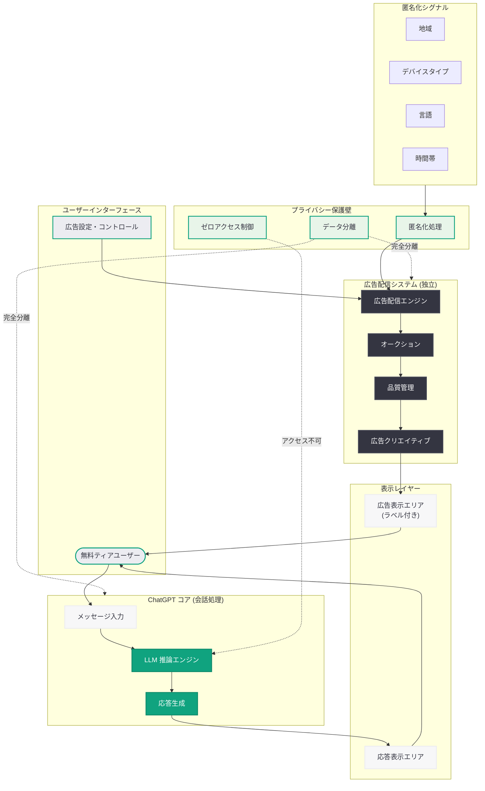

# ChatGPT での広告テスト開始: 無料アクセスを支える新たな収益モデル

## メタデータ

| 項目 | 内容 |
|------|------|
| 発表日 | 2026-05-07 |
| ソース | OpenAI News |
| カテゴリ | ビジネス / 企業戦略 |
| 公式リンク | [Testing ads in ChatGPT](https://openai.com/index/testing-ads-in-chatgpt) |

## 概要

OpenAI は 2026 年 5 月 7 日、ChatGPT の無料ティアユーザー向けに広告表示のテストを開始することを発表した。この取り組みは、無料アクセスの持続可能性を確保するための収益モデルとして位置づけられており、明確なラベリング、回答の独立性、強固なプライバシー保護、ユーザーコントロールの 4 つの原則に基づいて設計されている。

OpenAI は 2026 年 3 月以降、広告事業の構築を段階的に進めてきた。Meta の広告幹部の採用、The Trade Desk との広告パートナーシップ、セルフサーブ Ads Manager の導入と、着実にインフラを整備してきた中で、今回の発表は ChatGPT の会話インターフェース内に実際に広告を表示する実験段階への移行を示すものである。AI チャットインターフェースにおける広告のあり方を定義する試みとして、業界全体に大きなインパクトを与える可能性がある。

## 主な内容

### 広告フォーマットと表示位置

ChatGPT 内の広告は、会話の応答とは明確に区別される形で表示される。広告は「Sponsored」または「広告」のラベルが付与され、オーガニックな回答とビジュアル的にも分離される設計となっている。

広告の表示タイミングと位置については以下の特徴がある。

- **会話応答後の表示:** ChatGPT の回答が完了した後に、関連する広告カードが表示される
- **明確な視覚的区別:** 広告エリアは背景色やボーダーで区切られ、通常の応答と混同されない設計
- **頻度制限:** ユーザー体験を損なわないよう、広告表示の頻度に適切な上限が設定されている
- **対象ユーザー:** 無料ティアのユーザーを主な対象とし、有料プラン (Plus、Pro、Team 等) のユーザーには広告が表示されない

### 4 つの基本原則

OpenAI は ChatGPT 広告の設計において、以下の 4 つの基本原則を掲げている。

#### 1. 明確なラベリング (Clear Labeling)

広告コンテンツには必ず「広告」であることを示すラベルが付与される。ユーザーが広告とオーガニックな応答を容易に区別できるよう、視覚的な差別化が徹底されている。

#### 2. 回答の独立性 (Answer Independence)

ChatGPT の応答内容は広告によって一切影響を受けない。広告主が対価を支払ったとしても、ChatGPT の回答が特定の製品やサービスを優遇する方向に歪められることはない。回答生成と広告配信は完全に独立したプロセスとして動作する。

#### 3. プライバシー保護 (Privacy Protections)

ユーザーの個人的な会話内容は広告主と共有されない。広告ターゲティングにおいて、ユーザーが ChatGPT に入力した質問や会話の詳細が利用されることはなく、プライバシーが技術的に保護される仕組みが構築されている。

#### 4. ユーザーコントロール (User Control)

ユーザーは広告の表示設定を管理できる。広告の表示頻度の調整、特定カテゴリの広告の非表示、広告に関するフィードバックの送信など、ユーザーが主体的に広告体験をコントロールする手段が提供される。

### プライバシー保護の具体策

OpenAI はプライバシー保護を技術的に保証するために、以下の施策を実装している。

- **会話データの非共有:** ユーザーと ChatGPT の間の会話内容は広告主に一切共有されない
- **匿名化されたシグナルのみ使用:** 広告配信の判断には、地域、言語、デバイスタイプなどの匿名化された集約データのみが使用される
- **データ分離アーキテクチャ:** 会話処理システムと広告配信システムが物理的に分離されたインフラで運用される
- **監査体制:** プライバシー保護の遵守状況を定期的に監査し、透明性レポートを公開する

### ユーザーコントロールの仕組み

ユーザーには以下の広告管理機能が提供される。

- **広告設定ページ:** ChatGPT の設定メニューから広告に関する設定を確認・変更可能
- **カテゴリ選択:** 表示を希望しない広告カテゴリの指定
- **フィードバック機能:** 不適切な広告の報告、広告の非表示リクエスト
- **透明性ツール:** 広告が表示される理由の確認

### ビジネス上の合理性

OpenAI が広告収入モデルを導入する背景には、以下のビジネス的な要因がある。

- **無料アクセスの持続:** ChatGPT の無料ティアを維持し、より多くのユーザーに AI を届けるための財源確保
- **インフラコストの増大:** 大規模言語モデルの推論コストは膨大であり、無料ユーザーの増加に伴いコスト負担が増大している
- **収益源の多様化:** サブスクリプション収入だけでなく、広告収入という新たな収益柱の構築
- **競争力の維持:** Google、Meta など既存の広告プラットフォームに対抗し、AI 時代の新たな広告市場を開拓

## 技術的な詳細

### 広告配信システム

ChatGPT の広告配信は、会話処理パイプラインとは完全に独立したマイクロサービスとして構築されている。

**広告配信の流れ:**

1. ユーザーが ChatGPT にメッセージを送信
2. 会話エンジンが通常通り応答を生成 (広告システムとは独立して動作)
3. 広告配信エンジンが匿名化コンテキストシグナルに基づき、適切な広告候補を選定
4. オークションシステムが表示する広告を決定
5. 応答と広告が明確に区別された状態でユーザーのインターフェースに表示

### プライバシーアーキテクチャ

プライバシー保護は、以下の多層防御アーキテクチャによって実現されている。

- **物理的分離:** 会話データストアと広告データストアが異なるインフラストラクチャ上に配置される
- **匿名化処理:** 広告配信に使用されるシグナルは、差分プライバシーや k-匿名性の技術で保護される
- **ゼロアクセス設計:** 広告システムから会話データへのアクセスパスが技術的に存在しない設計
- **暗号化:** データ転送時および保存時の暗号化が施されている
- **アクセスログ監査:** 全てのデータアクセスが記録され、異常検知システムにより監視される

### 広告品質管理

表示される広告の品質を確保するため、以下の仕組みが導入されている。

- **広告審査プロセス:** 全ての広告クリエイティブが事前審査を経て配信される
- **カテゴリ制限:** 特定のカテゴリ (医薬品、ギャンブル等) に対する厳格な規制
- **リアルタイムモニタリング:** 広告表示後のユーザーフィードバックをリアルタイムで監視
- **自動停止メカニズム:** 問題のある広告を自動的に配信停止するシステム

## アーキテクチャ

## 開発者への影響

### OpenAI API 開発者

- **API 経由のアプリケーションへの影響はなし:** 今回の広告テストは ChatGPT のコンシューマー向けインターフェースに限定されており、OpenAI API を利用したサードパーティアプリケーションに広告が挿入されることはない
- **将来的な広告 SDK の可能性:** 広告プラットフォームが成熟した場合、サードパーティ開発者向けの広告収益化プログラムが提供される可能性がある
- **プライバシー設計の参考:** 会話データと広告データの分離アーキテクチャは、AI アプリケーションにおけるプライバシー保護設計の参考モデルとなる

### 広告テクノロジー開発者

- **新たな広告配信先:** ChatGPT が広告配信のインベントリとして利用可能になることで、DSP (Demand Side Platform) からの接続ニーズが拡大する
- **対話型広告フォーマットの開発:** AI チャットインターフェースに最適化された広告クリエイティブの開発が求められる
- **計測・アトリビューション:** AI 対話型広告における効果計測手法の確立が必要となる

### プライバシー・コンプライアンス開発者

- **AI 広告のプライバシー基準:** OpenAI のプライバシー保護設計は、AI プラットフォームにおける広告のプライバシー基準として参照される可能性が高い
- **規制対応:** GDPR、CCPA、日本の個人情報保護法などへの準拠において、データ分離アーキテクチャが業界のベストプラクティスとなりうる

### ユーザー体験設計者

- **広告と AI 応答の共存設計:** ユーザー体験を損なわずに広告を統合するデザインパターンが、業界全体の参考事例となる
- **ユーザーコントロール UI:** 広告設定のユーザーインターフェースの設計が、他の AI プラットフォームにおける標準を形成する可能性がある

## 関連リンク

- [Testing ads in ChatGPT](https://openai.com/index/testing-ads-in-chatgpt)
- [New ways to buy ChatGPT ads](https://openai.com/index/new-ways-to-buy-chatgpt-ads)
- [OpenAI News](https://openai.com/news)
- [OpenAI と The Trade Desk の広告パートナーシップ](https://openai.com/index/openai-trade-desk-ad-partnership)
- [Powering product discovery in ChatGPT](https://openai.com/index/powering-product-discovery-in-chatgpt)

## まとめ

OpenAI による ChatGPT 内での広告テスト開始は、AI チャットインターフェースにおける広告ビジネスモデルの確立に向けた重要な一歩である。2026 年 3 月の Meta 広告幹部の採用、The Trade Desk とのパートナーシップ、セルフサーブ Ads Manager の導入と段階的に広告インフラを構築してきた OpenAI が、いよいよ実際のユーザーに対して広告表示を開始する段階に入った。

最も注目すべきは、OpenAI が掲げる 4 つの基本原則 (明確なラベリング、回答の独立性、プライバシー保護、ユーザーコントロール) が、技術アーキテクチャのレベルで実装されている点である。会話処理と広告配信を物理的に分離し、ゼロアクセス設計によりプライバシーを技術的に保証するアプローチは、従来のウェブ広告とは一線を画すものである。

一方で、AI アシスタントの会話体験に広告を導入することへのユーザーの反応は未知数であり、テストの結果次第で広告フォーマットや表示方針が大きく変更される可能性もある。無料アクセスの持続可能性とユーザー体験のバランスをどのように取るかが、今後の広告事業の成否を左右するだろう。AI プラットフォームにおける広告のあり方を定義するこの試みは、Google、Meta に次ぐ第 3 の広告プラットフォームとしての OpenAI の地位を確立する上で、極めて重要な戦略的転換点となる。
