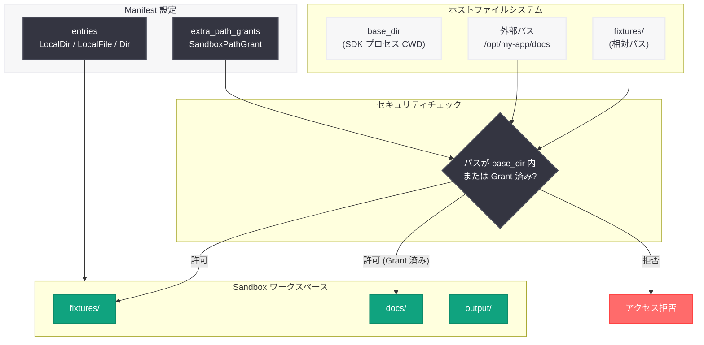

# OpenAI Agents SDK v0.17.0: RealtimeAgent のデフォルトモデル変更と Sandbox セキュリティ強化

## メタデータ

| 項目 | 内容 |
|------|------|
| 発表日 | 2026-05-08 |
| ソース | OpenAI API Changelog (GitHub) |
| カテゴリ | API 更新 |
| 公式リンク | [OpenAI Agents SDK v0.17.0](https://github.com/openai/openai-agents-python/releases/tag/v0.17.0) |

## 概要

OpenAI は 2026 年 5 月 8 日、Python 向け Agents SDK の v0.17.0 をリリースした。本バージョンでは、RealtimeAgent のデフォルトモデルが `gpt-realtime-2` に変更されたほか、Sandbox のローカルソースマテリアライゼーションに関するセキュリティ強化が行われている。

特に Sandbox の変更は、ローカルファイルやディレクトリのアーティファクト境界に関する問題を修正するものであり、SDK プロセスの `base_dir` 外部からのファイルコピーを制限する破壊的変更を含んでいる。信頼されたホストパスを明示的に許可する `SandboxPathGrant` による移行パスが提供されており、セキュリティと利便性のバランスを取った設計となっている。

## 主な内容

### RealtimeAgent のデフォルトモデル変更

RealtimeAgent のデフォルトモデルが `gpt-realtime-2` に変更された。`gpt-realtime-2` は OpenAI のリアルタイム音声・テキスト処理に最適化されたモデルであり、RealtimeAgent を使用する際にモデルを明示的に指定していない場合、自動的にこの新しいモデルが使用される。

リアルタイムセッションにおける応答品質と低レイテンシ性能の向上が期待される変更である。既存のコードでモデルを明示的に指定している場合は影響を受けないが、デフォルトに依存しているコードでは動作が変化する可能性がある。

### Sandbox ローカルソースマテリアライゼーションの変更

本バージョンで最も重要なセキュリティ関連の変更として、Sandbox のローカルソースマテリアライゼーションが強化された。具体的には以下の制約が追加されている:

- `LocalFile.src` および `LocalDir.src` は、マテリアライゼーションの `base_dir` 内に収まっている必要がある
- `base_dir` は、マニフェストが適用される時点での SDK プロセスのカレントワーキングディレクトリとなる
- 相対パスのローカルソースはそのディレクトリから解決される
- 絶対パスのローカルソースは、既に `base_dir` 内にあるか、明示的な `extra_path_grants` で許可されている必要がある

この変更により、ローカルアーティファクト境界の問題が修正され、意図しないファイルアクセスを防止できるようになった。ただし、`base_dir` 外部の信頼されたホストファイルやディレクトリを意図的に Sandbox ワークスペースにコピーしているアプリケーションには影響がある。

### バグ修正

- **Responses コンテキスト管理の extra_args 衝突修正:** Responses のコンテキスト管理において `extra_args` が衝突する問題が修正された。複数のコンテキストマネージャーが同時に使用される場合の安定性が向上している。

## 技術的な詳細

### SandboxPathGrant による移行

`base_dir` 外部のファイルにアクセスする必要がある場合、`Manifest` レベルで `SandboxPathGrant` を使用して信頼されたホストルートを明示的に許可する必要がある。セキュリティのベストプラクティスとして、Sandbox が読み取りのみを必要とする場合は `read_only=True` を指定することが推奨される。

```python
from pathlib import Path

from agents.sandbox import Manifest, SandboxPathGrant
from agents.sandbox.entries import Dir, LocalDir

# SDK プロセスの base_dir 外にある絶対ホストパス
TRUSTED_DOCS_ROOT = Path("/opt/my-app/docs")

manifest = Manifest(
    extra_path_grants=(
        SandboxPathGrant(path=str(TRUSTED_DOCS_ROOT), read_only=True),
    ),
    entries={
        "fixtures": LocalDir(src=Path("fixtures"), description="Local test fixtures."),
        "docs": LocalDir(src=TRUSTED_DOCS_ROOT, description="Trusted local documents."),
        "output": Dir(description="Generated artifacts."),
    },
)
```

### コードサンプル: RealtimeAgent の使用

```python
from agents import RealtimeAgent

# v0.17.0 以降、デフォルトで gpt-realtime-2 が使用される
agent = RealtimeAgent(name="VoiceAssistant")

# 従来のモデルを明示的に指定する場合
agent_legacy = RealtimeAgent(name="VoiceAssistant", model="gpt-4o-realtime")
```

## アーキテクチャ

### Sandbox マテリアライゼーションのセキュリティモデル



## 開発者への影響

- **RealtimeAgent ユーザー:** デフォルトモデルが `gpt-realtime-2` に変更されたため、モデルを明示指定していない場合は動作が変化する可能性がある。必要に応じてモデルを明示的に指定すること
- **Sandbox 利用者 (破壊的変更):** `base_dir` 外部のファイルを Sandbox にコピーしているアプリケーションは、`SandboxPathGrant` を追加する移行作業が必要となる
- **セキュリティ向上:** Sandbox のアーティファクト境界が強化されたことで、意図しないファイルアクセスのリスクが低減される
- **読み取り専用グラント推奨:** Sandbox が読み取りのみを必要とする外部パスには `read_only=True` を設定することで、最小権限の原則に従った設計が可能
- **extra_args 衝突の解消:** Responses のコンテキスト管理で `extra_args` が衝突する問題が修正され、複雑なエージェント構成の安定性が向上

## 関連リンク

- [OpenAI Agents SDK GitHub リポジトリ](https://github.com/openai/openai-agents-python)
- [OpenAI Agents SDK v0.17.0 リリースノート](https://github.com/openai/openai-agents-python/releases/tag/v0.17.0)
- [gpt-realtime-2 モデルドキュメント](https://developers.openai.com/api/docs/models/gpt-realtime-2)
- [OpenAI API ドキュメント](https://platform.openai.com/docs)

## まとめ

OpenAI Agents SDK v0.17.0 は、RealtimeAgent のデフォルトモデル変更と Sandbox セキュリティ強化を中心としたリリースである。RealtimeAgent は `gpt-realtime-2` をデフォルトモデルとして採用し、リアルタイム処理の品質向上が図られている。

最も注目すべき変更は Sandbox のローカルソースマテリアライゼーション制約の強化であり、`base_dir` 外部のファイルアクセスに明示的な `SandboxPathGrant` が必要となった。これはセキュリティ上の重要な改善であるが、外部ファイルを意図的に利用しているアプリケーションでは移行作業が発生する。`read_only` フラグを活用した最小権限設計が推奨されており、本番環境でのエージェント運用における安全性が一段と向上したリリースである。
