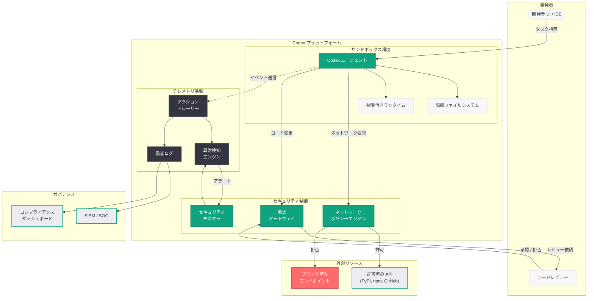

# OpenAI における Codex の安全な運用: サンドボックス、承認フロー、ネットワークポリシー、テレメトリによるセキュアなエージェント管理

## メタデータ

| 項目 | 内容 |
|------|------|
| 発表日 | 2026-05-08 |
| ソース | OpenAI News |
| カテゴリ | セキュリティ |
| 公式リンク | [Running Codex safely at OpenAI](https://openai.com/index/running-codex-safely) |

## 概要

OpenAI は 2026 年 5 月 8 日、自社内で Codex エージェントを安全に運用するためのセキュリティアーキテクチャと運用プラクティスを公開した。本記事では、サンドボックス化、承認ワークフロー、ネットワークポリシー、エージェントネイティブテレメトリの 4 つの柱を中心に、AI コーディングエージェントを企業環境でセキュアかつコンプライアンスに準拠した形で導入・運用する方法を詳述している。

Codex のようなコーディングエージェントはコード生成からデプロイメントまで自動化する強力な能力を持つが、その自律性ゆえにセキュリティリスクも伴う。OpenAI はこの課題に対して、エージェントの実行環境を厳密に隔離し、人間の承認を介在させ、ネットワークアクセスを制限し、全ての動作を監視可能にするという多層防御アプローチを採用している。本記事は、他の組織が Codex を安全に導入するための参考モデルとしても位置付けられている。

## 主な内容

### サンドボックスによるエージェント隔離

Codex エージェントの実行環境には、厳格なサンドボックス技術が適用されている。各エージェントインスタンスは独立した隔離環境で動作し、ホストシステムや他のエージェントから完全に分離される。

- **コンテナベースの隔離:** 各 Codex タスクは専用のコンテナ内で実行され、ファイルシステム、プロセス空間、ネットワークスタックが分離される
- **最小権限の原則:** エージェントにはタスク遂行に必要最小限の権限のみが付与される。ルートアクセスや特権操作はデフォルトで禁止
- **一時的な実行環境:** タスク完了後にコンテナは破棄され、状態の永続化は明示的に許可された範囲に限定される
- **リソース制限:** CPU、メモリ、ディスク I/O に対するリソースクォータを設定し、リソース枯渇攻撃を防止
- **読み取り専用ベースイメージ:** ベースとなるシステムイメージは読み取り専用でマウントされ、システムレベルの改竄を防止

この多層的なサンドボックスにより、仮にエージェントが悪意あるコードを生成・実行したとしても、影響範囲は当該コンテナ内に封じ込められる。

### 承認ワークフローによるヒューマンインザループ

Codex が生成したコード変更を本番環境に適用する前に、人間による承認を必須とするワークフローが構築されている。

- **段階的承認モデル:** 変更のリスクレベルに応じて、自動承認、単一承認者、複数承認者の 3 段階の承認レベルを設定可能
- **変更影響分析:** エージェントが生成した変更に対して、影響範囲の自動分析 (変更ファイル数、影響を受ける依存関係、テストカバレッジ) を提示
- **プルリクエストベースのレビュー:** コード変更は必ずプルリクエストとして提出され、既存のコードレビュープロセスに統合される
- **ロールバック機能:** 承認済み変更にも即座にロールバック可能な仕組みを備え、問題発生時の迅速な復旧を保証
- **監査証跡:** 誰がいつ何を承認したかの完全な記録を保持し、コンプライアンス要件に対応

### ネットワークポリシーとアクセス制御

エージェントのネットワークアクセスは、明示的に許可されたエンドポイントのみに制限される。

- **ホワイトリスト方式:** エージェントがアクセス可能な外部エンドポイント (パッケージレジストリ、API エンドポイントなど) を明示的にリスト化
- **デフォルト拒否ポリシー:** ホワイトリストに含まれないアクセスは全てブロックされ、データ流出やサプライチェーン攻撃のリスクを軽減
- **DNS フィルタリング:** DNS レベルでのアクセス制御により、未知のドメインへの通信を遮断
- **内部ネットワーク分離:** エージェント環境から本番システムや機密データストアへの直接アクセスを禁止し、API ゲートウェイ経由でのみ必要なサービスにアクセス可能
- **送信データの検査:** エージェントが送信するデータの内容を検査し、機密情報 (シークレット、認証トークンなど) の外部流出を防止

### エージェントネイティブテレメトリ

従来のアプリケーション監視とは異なる、AI エージェントの動作特性に最適化されたテレメトリ基盤を構築している。

- **アクション単位のトレーシング:** エージェントの各アクション (ファイル読み取り、コマンド実行、コード生成など) を個別にトレースし、実行フローを可視化
- **意思決定の記録:** エージェントがなぜそのアクションを選択したかの推論プロセスを記録し、事後分析を可能にする
- **異常検知:** エージェントの通常の動作パターンからの逸脱をリアルタイムで検知し、アラートを生成
- **リソース消費の監視:** コンピュートリソース、API 呼び出し回数、実行時間などのメトリクスを継続的に収集
- **セキュリティイベントの相関分析:** 複数のエージェントインスタンスにまたがるセキュリティイベントを相関分析し、組織全体の脅威を検出

## 技術的な詳細

### サンドボックス設定の構成例

Codex エージェントのサンドボックス環境は、宣言的な設定ファイルによって構成される。以下は概念的な設定例である。

```yaml
# codex-sandbox-policy.yaml
apiVersion: codex.openai.com/v1
kind: SandboxPolicy
metadata:
  name: production-codex-agent
spec:
  container:
    image: codex-runtime:latest
    readOnlyRootFilesystem: true
    resources:
      limits:
        cpu: "4"
        memory: "8Gi"
        ephemeral-storage: "20Gi"
      requests:
        cpu: "2"
        memory: "4Gi"
  security:
    runAsNonRoot: true
    allowPrivilegeEscalation: false
    capabilities:
      drop: ["ALL"]
  network:
    defaultPolicy: deny
    allowedEndpoints:
      - host: "pypi.org"
        port: 443
        protocol: HTTPS
      - host: "registry.npmjs.org"
        port: 443
        protocol: HTTPS
      - host: "github.com"
        port: 443
        protocol: HTTPS
    dnsPolicy: restricted
  approval:
    level: multi-reviewer
    requiredApprovers: 2
    autoApprovePatterns:
      - "docs/**"
      - "tests/**"
```

### 承認ワークフローの API 統合

承認ワークフローはプログラマブルに制御可能であり、既存の CI/CD パイプラインやガバナンスツールと統合できる。

```python
from openai import OpenAI

client = OpenAI()

# Codex タスクの作成と承認ポリシーの設定
task = client.codex.tasks.create(
    description="認証モジュールのリファクタリング",
    repository="org/backend-service",
    approval_policy={
        "level": "multi_reviewer",
        "required_approvers": 2,
        "auto_approve_paths": ["tests/*", "docs/*"],
        "block_paths": ["*.env", "secrets/*"],
        "notify_channels": ["#security-review"]
    },
    sandbox_policy="production-codex-agent",
    network_policy={
        "allowed_hosts": ["pypi.org", "github.com"],
        "block_internal": True
    }
)

# タスク完了後の承認ステータス確認
status = client.codex.tasks.get_approval_status(task.id)
print(f"承認状態: {status.state}")  # pending / approved / rejected
print(f"承認者: {status.approvers}")
print(f"変更サマリー: {status.change_summary}")
```

### テレメトリデータの構造

エージェントネイティブテレメトリは、構造化されたイベントストリームとして出力される。

```json
{
  "trace_id": "codex-trace-2026-05-08-abc123",
  "agent_id": "codex-agent-prod-001",
  "task_id": "task-xyz789",
  "events": [
    {
      "timestamp": "2026-05-08T10:30:00Z",
      "type": "action",
      "action": "file_read",
      "target": "src/auth/handler.py",
      "reasoning": "認証ハンドラーの現在の実装を確認",
      "duration_ms": 45
    },
    {
      "timestamp": "2026-05-08T10:30:02Z",
      "type": "action",
      "action": "code_generation",
      "target": "src/auth/handler.py",
      "reasoning": "JWT 検証ロジックの脆弱性を修正",
      "lines_changed": 12,
      "risk_score": 0.7
    },
    {
      "timestamp": "2026-05-08T10:30:05Z",
      "type": "security_event",
      "category": "network_access_blocked",
      "detail": "エージェントが未許可エンドポイント api.external.com へのアクセスを試行",
      "action_taken": "blocked"
    }
  ]
}
```

## アーキテクチャ



## 開発者への影響

- **セキュリティバイデザインの採用指針:** OpenAI が自社実践として公開したセキュリティアーキテクチャは、他の組織が Codex を導入する際のリファレンスモデルとなる。サンドボックス、承認、ネットワーク制御、テレメトリの 4 層構造は、AI エージェント全般のセキュリティ設計に適用可能である
- **既存 DevSecOps パイプラインとの統合:** 承認ワークフローがプルリクエストベースであるため、GitHub、GitLab などの既存コードレビューインフラとシームレスに統合できる。新たなツールの導入コストが低い
- **コンプライアンス対応の加速:** 監査ログとテレメトリデータの構造化により、SOC 2、ISO 27001、GDPR などの規制要件に対するエビデンス提供が容易になる
- **段階的導入の実現:** 自動承認パターンの設定により、低リスクな変更 (テストやドキュメント) から段階的に Codex の自律性を拡大するアプローチが可能
- **セキュリティチームとの協働:** エージェントネイティブテレメトリにより、セキュリティチームが AI エージェントの動作を従来のセキュリティ監視と同じツールチェーンで監視可能になる
- **ネットワークポリシーの事前設計:** デフォルト拒否ポリシーの採用により、導入前にエージェントが必要とする外部アクセス先を明確にする設計プロセスが求められる

## 関連リンク

- [Running Codex safely at OpenAI (公式)](https://openai.com/index/running-codex-safely)
- [OpenAI Codex](https://openai.com/codex)
- [OpenAI Security](https://openai.com/security)
- [Codex Cloud Environments](https://developers.openai.com/codex/cloud/environments/)
- [関連レポート: Codex エージェントループの内部構造](2026-03-12-unrolling-codex-agent-loop.md)
- [関連レポート: Codex Security リサーチプレビュー](2026-03-06-codex-security-research-preview.md)
- [関連レポート: Codex Remote Connections](2026-04-22-codex-remote-connections.md)
- [関連レポート: Codex Hooks](2026-03-31-codex-hooks.md)

## まとめ

OpenAI が公開した「Running Codex safely at OpenAI」は、AI コーディングエージェントを企業環境で安全に運用するための包括的なセキュリティフレームワークを示した記事である。サンドボックスによる実行環境の隔離、承認ワークフローによる人間の監視、ネットワークポリシーによるアクセス制御、エージェントネイティブテレメトリによる可観測性の確保という 4 つの柱で構成される多層防御アプローチは、OpenAI 自身の内部実践に基づいており、他の組織が Codex を安全に導入するための実践的なガイドラインとして機能する。AI エージェントの自律性と安全性のバランスを取るためのエンジニアリング的アプローチとして、コーディングエージェントのエンタープライズ採用が加速する中で重要な参考資料となる。
