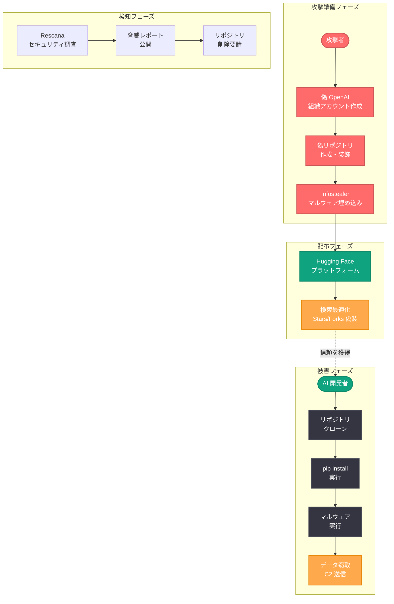

# サプライチェーン攻撃: Hugging Face 上の偽 OpenAI リポジトリが情報窃取マルウェアを配布

## メタデータ

| 項目 | 内容 |
|------|------|
| 発表日 | 2026-05-10 |
| ソース | 外部報道 (Rescana 等) |
| カテゴリ | セキュリティ |
| 公式リンク | [Supply Chain Attack Coverage](https://news.google.com/search?q=OpenAI+Hugging+Face+malware) |

> **注記:** 本レポートは、Rescana のサイバーセキュリティレポートおよび複数のニュースソースに基づいて作成されている。OpenAI 自身による公式声明ではなく、外部のセキュリティ研究者による発見に基づく情報である。

## 概要

2026 年 5 月 10 日、サイバーセキュリティ企業 Rescana は、AI モデル共有プラットフォーム Hugging Face 上に OpenAI の公式リポジトリを偽装した悪意あるリポジトリが存在し、情報窃取型マルウェア (Infostealer) を配布していたことを報告した。この攻撃は、AI 開発者や AI ツールを利用するユーザーを標的としたサプライチェーン攻撃であり、正規の OpenAI ツールやモデルに見せかけることで、開発者の信頼を悪用するものであった。

本件は、AI エコシステムにおけるサプライチェーンセキュリティのリスクが深刻化していることを示す重要な事例である。Hugging Face のようなオープンなモデル共有プラットフォームは、AI 開発の民主化に大きく貢献している一方で、悪意ある攻撃者がその信頼性を悪用する攻撃ベクトルとなり得ることが改めて明らかになった。特に OpenAI のような著名なブランドを騙ることで、開発者がセキュリティ検証を怠りやすい心理を突いた巧妙な手法である。

## 主な内容

### 攻撃の手法

攻撃者は Hugging Face プラットフォーム上に、OpenAI の公式組織アカウントに酷似した偽のリポジトリを作成した。このリポジトリは以下の特徴を持っていた。

- **ブランドの偽装:** OpenAI のロゴ、ブランドカラー、命名規則を模倣し、公式リポジトリであるかのように見せかけた
- **信頼性の演出:** README ファイルに詳細なドキュメント、使用例、インストール手順を記載し、正規のプロジェクトとしての体裁を整えた
- **正規ツールの模倣:** OpenAI の既存ツール (GPT モデルのファインチューニングユーティリティや推論最適化ツールなど) を模倣した名称とディスクリプションを使用
- **依存関係の悪用:** インストールスクリプトや requirements ファイルに悪意あるパッケージへの依存関係を埋め込み、セットアップ時にマルウェアが自動的にダウンロード・実行される仕組みを構築

攻撃者はまた、リポジトリに星 (Stars) やフォークを人為的に追加し、人気のあるプロジェクトであるかのように見せかけるソーシャルエンジニアリング手法も併用していたとみられる。

### マルウェアの動作

配布されていたマルウェアは情報窃取型 (Infostealer) に分類されるもので、以下のデータを標的としていた。

| 窃取対象 | 詳細 |
|----------|------|
| API キー | OpenAI、Hugging Face、AWS、GCP などのクラウドサービスの API キー |
| 認証情報 | ブラウザに保存されたパスワード、Cookie、セッショントークン |
| 環境変数 | `.env` ファイルや環境変数に格納された機密情報 |
| SSH 鍵 | `~/.ssh/` ディレクトリ内の秘密鍵 |
| 暗号通貨ウォレット | ローカルに保存された暗号通貨ウォレットの情報 |
| 開発設定 | `.git/config`、`.npmrc`、`.pypirc` などの開発者設定ファイル |

マルウェアはインストール後、バックグラウンドで動作し、収集したデータを攻撃者が管理する外部サーバー (C2: Command and Control サーバー) に暗号化して送信する挙動を示した。さらに、永続化メカニズムを実装し、システム再起動後も動作を継続する機能を持っていた。

### 影響範囲

本攻撃の影響範囲は以下の通り報告されている。

- **主な被害者:** AI 開発者、データサイエンティスト、ML エンジニア
- **影響を受けたプラットフォーム:** Linux および macOS 環境 (開発環境として一般的なプラットフォーム)
- **地理的範囲:** グローバル (英語圏を中心に複数地域で被害を確認)
- **発見までの期間:** リポジトリが作成されてから Rescana による検知まで数日から数週間の間、攻撃が継続していた可能性がある

具体的な被害者数は公開されていないが、AI 関連ツールへの需要の高まりを考慮すると、相当数の開発者がリポジトリをクローンまたはインストールした可能性がある。

## 技術的な詳細

### 攻撃ベクトルの分析

本攻撃は、複数の段階で構成される多層的なサプライチェーン攻撃である。

**攻撃の技術的特徴:**

1. **セットアップスクリプトの悪用:** `setup.py` や `pyproject.toml` のインストールフック (`post_install`) を利用し、パッケージインストール時に悪意あるコードを自動実行
2. **難読化:** マルウェアのペイロードは Base64 エンコードや多重の文字列操作により難読化され、静的解析による検出を回避
3. **条件付き実行:** 仮想環境やサンドボックスを検知した場合は動作を停止し、セキュリティ研究者による解析を困難にする回避技術を実装
4. **段階的なペイロード配信:** 初期段階では無害に見えるコードのみを実行し、追加のペイロードを外部サーバーから動的にダウンロード

### 検知と対策

**検知指標 (IoC: Indicators of Compromise):**

- 不審な外部通信: インストール後に未知の外部 IP アドレスへの通信が発生
- 異常なファイルアクセス: `.env`、`.ssh/`、ブラウザのプロファイルディレクトリへの予期しないアクセス
- 新規プロセスの生成: インストール後にバックグラウンドプロセスが起動

**防御策:**

| 対策 | 実施内容 |
|------|----------|
| リポジトリ検証 | クローン前に組織アカウントの認証バッジ (Verified) を確認する |
| コードレビュー | `setup.py` や `pyproject.toml` のインストールスクリプトを実行前に確認する |
| 仮想環境の使用 | 信頼性の低いパッケージは隔離された仮想環境でテストする |
| ネットワーク監視 | インストール時の不審な外部通信を監視する |
| シークレット管理 | API キーや認証情報を環境変数ではなく、専用のシークレットマネージャーで管理する |
| 依存関係スキャン | `pip-audit`、`safety`、`Snyk` などのツールで依存関係の脆弱性を定期的にスキャンする |

## 開発者への影響

### AI 開発者が取るべき対策

AI 開発者は、本件を教訓として以下の実践を日常の開発ワークフローに組み込むことが推奨される。

**パッケージ・リポジトリの検証プロセス:**

1. **組織の正当性確認:** Hugging Face や GitHub 上のリポジトリをクローンする前に、組織アカウントが公式に認証されているか (Verified バッジの有無) を必ず確認する
2. **公式サイトとの照合:** OpenAI の公式ウェブサイト (openai.com) や公式 GitHub 組織 (github.com/openai) からリンクされているリポジトリであることを確認する
3. **コミット履歴の確認:** リポジトリのコミット履歴、コントリビューター、作成日を確認し、不自然な点がないか検証する
4. **コミュニティの評判:** リポジトリに関する議論やレビューが信頼できるコミュニティで行われているか確認する

**セキュリティベストプラクティス:**

- **最小権限の原則:** 開発環境で使用する API キーには必要最小限の権限のみを付与する
- **シークレットのローテーション:** 万が一の漏洩に備え、API キーや認証情報を定期的にローテーションする
- **多要素認証 (MFA):** すべての開発者アカウント (Hugging Face、GitHub、クラウドサービス) で MFA を有効にする
- **ネットワーク分離:** 開発環境と本番環境を厳密に分離し、開発環境からの機密データへのアクセスを制限する

### OpenAI ユーザーへの注意

OpenAI のツールやモデルを利用する際は、必ず以下の公式チャネルからダウンロードすること。

- **公式 Python パッケージ:** `pip install openai` (PyPI 上の公式パッケージ)
- **公式 GitHub:** https://github.com/openai
- **公式ドキュメント:** https://platform.openai.com/docs

Hugging Face 上で「OpenAI」を名乗るリポジトリを発見した場合は、OpenAI の公式組織ページ (https://huggingface.co/openai) に含まれるものであることを確認し、それ以外のリポジトリについては慎重に対応する必要がある。

## 関連リンク

- [Rescana Cybersecurity Report](https://www.rescana.com/)
- [Hugging Face Security](https://huggingface.co/docs/hub/security)
- [OpenAI Official GitHub](https://github.com/openai)
- [OpenAI Platform Documentation](https://platform.openai.com/docs)
- [NIST Software Supply Chain Security](https://www.nist.gov/itl/executive-order-14028-improving-nations-cybersecurity/software-supply-chain-security)
- [OWASP Supply Chain Security](https://owasp.org/www-project-software-component-verification-standard/)

## まとめ

2026 年 5 月 10 日に報告された本件は、Hugging Face 上に OpenAI を偽装したリポジトリが作成され、情報窃取型マルウェアが配布されていたサプライチェーン攻撃である。攻撃者は OpenAI のブランドを悪用し、AI 開発者の信頼を騙ることでマルウェアのインストールを誘導した。このマルウェアは API キー、認証情報、SSH 鍵などの機密データを窃取する機能を持ち、AI 開発者にとって深刻な脅威であった。

本件は、AI エコシステムの急速な成長に伴い、モデル共有プラットフォームがサプライチェーン攻撃の新たなベクトルとなりつつあることを示している。開発者はリポジトリの正当性を検証するプロセスを確立し、シークレット管理の強化、依存関係の監査、ネットワーク監視の実施など、多層的なセキュリティ対策を講じることが不可欠である。AI ツールの利便性と引き換えにセキュリティを軽視することは、個人および組織全体のセキュリティ態勢を危険にさらす結果となる。

> **免責事項:** 本レポートは、Rescana のセキュリティレポートおよび公開されているニュースソースに基づいて構成されたものである。OpenAI 自身による公式発表ではなく、外部研究者による発見に基づく情報であるため、詳細が異なる可能性がある点にご留意いただきたい。
