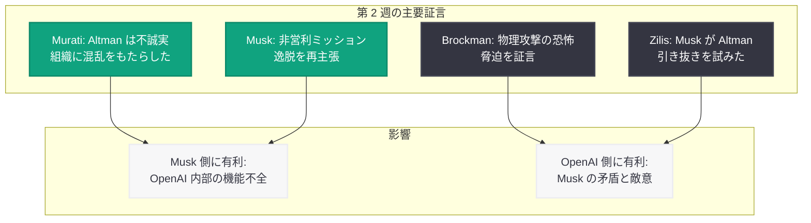

# Musk v. OpenAI 裁判第 2 週: 元幹部の爆弾証言と法廷闘争の激化

## メタデータ

| 項目 | 内容 |
|------|------|
| 発表日 | 2026-05-10 |
| ソース | 外部報道 (NYT, WSJ, MIT Technology Review, FT, Mashable, Vox, AOL) |
| カテゴリ | 法務・コーポレート |
| 公式リンク | [Musk v. OpenAI Trial Coverage](https://news.google.com/search?q=OpenAI+Musk+trial) |

## 概要

Musk v. OpenAI 裁判の第 2 週 (5 月 8 日 - 10 日) は、元幹部による爆弾証言が相次ぎ、裁判の流れを大きく変える展開となった。元 CTO の Mira Murati が Sam Altman を「不誠実 (dishonest)」と評し、彼が組織に「混乱 (chaos)」をもたらしたと証言したことは、OpenAI 内部の機能不全を示す強力な証拠として注目を集めた。一方、Elon Musk 自身も 5 月 9 日に再び証人台に立ち、OpenAI が非営利ミッションを放棄したという自らの主張を改めて展開した。

さらに、OpenAI 共同創業者の Greg Brockman が、Musk から物理的な攻撃を受けるのではないかと恐れた会議の様子を証言し、Musk が Altman と Brockman を「アメリカで最も嫌われる男にする」と脅迫したことを明かした。Musk の関係者である Shivon Zilis も、Musk が Sam Altman を xAI に引き抜こうとした事実を暴露するなど、双方の人間関係の深刻な破綻が法廷で明らかにされた。Financial Times の報道によれば、OpenAI の企業価値は $852B (約 8520 億ドル) に達しており、この裁判の帰結は AI 業界全体に対して巨大な影響を及ぼす。

## 主な内容

### Mira Murati 元 CTO の証言

OpenAI の元 CTO である Mira Murati は、裁判の第 2 週において最も注目される証人の一人として証言台に立った。Murati は 2024 年 9 月に OpenAI を退社しているが、在職中の経験に基づき、Sam Altman の経営スタイルについて痛烈な批判を展開した。

Murati は Altman を「不誠実 (dishonest)」と明確に形容し、彼のリーダーシップが組織内に「混乱 (chaos)」を生み出したと証言した。この証言は、2023 年 11 月の取締役会による Altman 解任騒動の背景にある内部対立を裏付けるものであり、Musk 側にとっては OpenAI のガバナンス問題を立証する有力な証拠となる。

Murati の証言が特に重要なのは、彼女が Musk 側の証人ではなく、OpenAI の元幹部として独立した立場から証言している点である。元 CTO という立場から見た Altman の経営手法への批判は、単なる個人的確執ではなく、組織運営の構造的問題を示唆するものとして陪審員に強い印象を与えると見られる。

### Elon Musk の証人台出廷

5 月 9 日、Elon Musk は裁判第 2 週において再び証人台に立った。Musk は、OpenAI が設立時の非営利ミッションである「人類全体の利益のための AI 開発」から完全に逸脱し、営利追求に転換したという主張を改めて展開した。

Musk の証言では、OpenAI の初期設立時における合意事項、自身が数十億ドル規模の資金を投じた経緯、そして営利転換によってその投資の前提が覆されたことが語られた。前週の証言で xAI が OpenAI の技術を一部利用したことを認めた Musk にとって、今回の出廷は自らの主張の信頼性を回復する機会でもあったが、OpenAI 側弁護団による反対尋問では厳しい追及を受けたと報じられている。

### Greg Brockman の証言

OpenAI 共同創業者の Greg Brockman は、Musk との関係が破綻した経緯について衝撃的な証言を行った。Brockman は、ある会議において Musk が激昂し、「物理的に攻撃されるのではないか (going to physically attack)」と感じたと述べた。

さらに Brockman は、Musk が Altman と自分に対して「アメリカで最も嫌われる男にしてやる (most hated men in America)」と脅迫したことを証言した。この証言は、Musk の訴訟動機が非営利ミッションの保護ではなく、個人的な報復や競争的な敵意に基づいている可能性を示唆するものであり、Musk 側の主張を大きく毀損する内容である。

Brockman の証言は、OpenAI からの離脱後に初めて公の場で詳細に語られたものであり、裁判における重要な転換点として位置づけられている。

### Shivon Zilis の暴露

Musk の関係者であり、Neuralink の取締役を務める Shivon Zilis が、Musk が Sam Altman を自身の AI 企業 xAI に引き抜こうとした (poach) 事実を暴露した。この証言は、Musk が OpenAI を批判しながらも、その中核人材を自社に取り込もうとしていたという矛盾を明確に示すものである。

Zilis の証言は、Musk の訴訟における「非営利ミッションの保護者」としての立場をさらに弱体化させる。Altman を批判し CEO 解任を求める一方で、同じ Altman を自社に引き抜こうとした事実は、Musk の真の目的が OpenAI の弱体化と自社 xAI の競争力強化にあったことを示唆する。

## 裁判の背景と論点

### 非営利ミッション逸脱の争点

本裁判の核心は、OpenAI が 2015 年の設立時に掲げた「人類全体の利益のための汎用人工知能 (AGI) の開発」という非営利ミッションから逸脱したか否かという点にある。Musk は、OpenAI が 2019 年に営利子会社を設立し、その後段階的に営利企業としての性格を強めてきたことが、設立時の合意に対する契約違反であると主張している。

### $852B の企業価値と IPO

Financial Times の報道によれば、OpenAI の企業価値は $852B に達している。Musk は、本来非営利法人として設立された OpenAI がこれほどの営利価値を生み出していること自体が、ミッション逸脱の証拠であると主張する。一方 OpenAI 側は、営利子会社の設立は AI 開発に必要な資金調達のために不可欠であり、非営利法人が引き続き監督権を持つ構造は維持されてきたと反論している。

### 法的請求の構造

Musk 側の法的請求は多岐にわたるが、主要な争点は以下の通りである。

- **契約違反:** OpenAI 設立時の非営利ミッションに関する合意の違反
- **CEO 解任:** Sam Altman の CEO 職からの解任 (2026 年 4 月に追加)
- **賠償金の非営利法人帰属:** 勝訴時の賠償金を OpenAI の非営利法人に帰属させる要求
- **組織構造の原状回復:** 営利転換の取り消しと非営利組織への復帰

## 開発者への影響

本裁判の結果は、OpenAI の API サービスを利用する開発者に対して以下の影響を及ぼす可能性がある。

- **組織構造の変動リスク:** 仮に裁判所が Altman の CEO 解任や営利転換の取り消しを命じた場合、OpenAI の経営体制と事業戦略が根本的に変化し、API サービスの方向性や料金体系に影響が生じる可能性がある
- **IPO への影響:** 裁判の長期化や不利な判決は、OpenAI の IPO 計画に影響を与え、資金調達能力の変化を通じて開発投資やサービス品質に波及しうる
- **API 料金体系の不確実性:** OpenAI のガバナンス構造が変更された場合、現在の料金モデルや企業向けサービスの条件が見直される可能性がある
- **マルチプロバイダー戦略の推奨:** 裁判の行方が不透明な中、開発者は Anthropic、Google、Meta など複数の AI プロバイダーを活用するマルチプロバイダー戦略を維持することが引き続き推奨される
- **長期的な業界規制:** 本裁判が AI 企業のガバナンスに関する法的先例を形成する場合、業界全体の規制環境が変化し、AI サービスの提供条件に影響する可能性がある

## 関連リンク

- [New York Times: Musk v. OpenAI Trial Coverage](https://www.nytimes.com/)
- [Wall Street Journal: OpenAI Trial Week 2](https://www.wsj.com/)
- [MIT Technology Review: Murati Testimony](https://www.technologyreview.com/)
- [Financial Times: OpenAI Valuation $852B](https://www.ft.com/)
- [Mashable: Musk on the witness stand](https://mashable.com/)
- [Vox: OpenAI Trial Analysis](https://www.vox.com/)
- [前回のレポート: Musk が xAI モデルの OpenAI 技術利用を認める](2026-05-03-musk-xai-trained-on-openai-testimony.md)
- [関連レポート: Musk が Altman CEO 解任を要求](2026-04-07-musk-seeks-altman-ouster.md)

## まとめ

Musk v. OpenAI 裁判の第 2 週は、双方にとって決定的な証言が相次ぐ激動の展開となった。Mira Murati 元 CTO による Altman への「不誠実」評価は Musk 側の主張を強化する一方、Brockman が証言した物理攻撃への恐怖や脅迫、そして Zilis による Altman 引き抜き未遂の暴露は、Musk の真の動機に深刻な疑問を投げかけている。$852B の企業価値を持つ OpenAI の将来を左右するこの裁判は、非営利ミッションの保護と営利追求の是非、創業者間の人間関係の破綻、そして AI 業界全体のガバナンスのあり方を問う歴史的な法廷闘争へと発展している。第 3 週以降の展開と最終的な判決が、OpenAI のみならず AI 産業全体の方向性を決定づけることになる。
