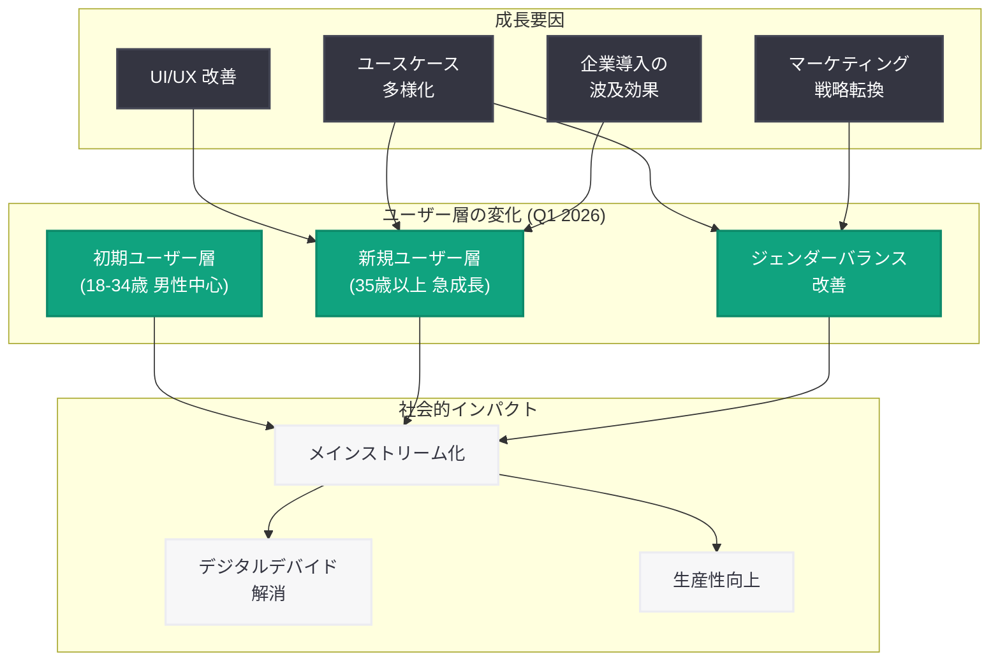
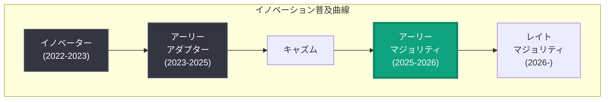

# ChatGPT の利用拡大: 2026 年第 1 四半期の採用動向レポート

## メタデータ

| 項目 | 内容 |
|------|------|
| 発表日 | 2026-05-11 |
| ソース | OpenAI Signals Research |
| カテゴリ | 利用動向 / リサーチ |
| 公式リンク | [openai.com/signals/research/2026q1-update](https://openai.com/signals/research/2026q1-update) |

## 概要

OpenAI は 2026 年 5 月 11 日、「Signals」リサーチシリーズの一環として、2026 年第 1 四半期 (1 月 - 3 月) における ChatGPT の利用動向に関する調査レポートを公開した。本レポートでは、ChatGPT の利用者層が大幅に拡大し、特に 35 歳以上のユーザーにおいて最も急速な成長が確認されたことが報告されている。

この調査結果は、AI ツールが初期のテクノロジー愛好者層を超えて、一般的なメインストリーム層に浸透しつつあることを示す重要な指標である。また、ジェンダーバランスの改善も確認され、従来の男性偏重の利用パターンからより均等な利用形態へと移行が進んでいることが明らかになった。これらのデータは、生成 AI が社会全体のインフラストラクチャとして定着しつつある現状を裏付けるものである。

## 主な内容

### 利用者層の変化

2026 年第 1 四半期において、ChatGPT の利用者プロファイルに顕著な変化が確認された。従来は技術リテラシーの高い 18 - 34 歳の男性ユーザーが中心であった利用者構成が、より多様な層へと拡大している。

この変化の背景には、以下の要因が考えられる。

- **ユーザーインターフェースの改善:** ChatGPT の対話型インターフェースが継続的に改善され、技術的な知識がなくても直感的に利用できるようになった
- **ユースケースの多様化:** コーディングや技術的なタスクだけでなく、日常的な文章作成、学習支援、健康相談、レシピ検索など、幅広い用途での活用が進んだ
- **認知度の向上:** メディア報道や口コミを通じて、AI ツールの存在と実用性が幅広い層に認知されるようになった
- **企業導入の波及効果:** 職場での ChatGPT Enterprise や Team プランの導入を通じて、個人利用を開始するユーザーが増加した

### 年齢層別の成長

本レポートで最も注目すべきデータの一つが、年齢層別の成長率である。35 歳以上のユーザー層において最も急速な成長が記録された。

#### 年齢層別の成長動向

| 年齢層 | 成長傾向 | 主な利用目的 |
|--------|---------|-------------|
| 18 - 24 歳 | 安定的成長 | 学習支援、コンテンツ作成、プログラミング |
| 25 - 34 歳 | 緩やかな成長 | 業務効率化、キャリア支援、クリエイティブ作業 |
| 35 - 44 歳 | 急速な成長 | ビジネス文書、マネジメント支援、情報収集 |
| 45 - 54 歳 | 最も急速な成長 | 業務効率化、学習、健康・ライフスタイル |
| 55 歳以上 | 顕著な成長 | 情報検索、コミュニケーション支援、趣味 |

35 歳以上の層での急成長は、AI ツールが「若者向けの新しいテクノロジー」から「年齢を問わず活用できる実用的なツール」へと認識が変化したことを示している。この層のユーザーは、特に以下の特徴を持つ。

- 業務経験が豊富で、AI をタスク効率化のために戦略的に活用する傾向がある
- デジタルネイティブではないが、スマートフォンやクラウドサービスの利用経験を通じて AI ツールへの抵抗感が低減している
- 可処分時間の活用や自己投資の一環として AI を位置づける傾向がある

### ジェンダーバランスの改善

2026 年第 1 四半期のデータでは、ChatGPT の利用におけるジェンダーバランスが改善傾向にあることが確認された。サービス開始当初は男性ユーザーが大多数を占めていた利用者構成が、より均等な分布に近づいている。

#### ジェンダーバランス改善の推移

初期段階では生成 AI ツールの利用者は男性が圧倒的多数を占めていたが、2025 年後半から女性ユーザーの比率が着実に上昇し、2026 年第 1 四半期にはより均衡のとれた利用パターンが観察されている。

この改善に寄与した要因として、以下が挙げられる。

- **利用シーンの拡大:** 教育、ヘルスケア、クリエイティブ分野など、従来女性の参加率が高い領域での AI 活用が進んだ
- **マーケティング戦略の変化:** テクノロジー中心の訴求から、実生活の課題解決を中心とした訴求への転換
- **ロールモデルの増加:** 様々な分野で女性が AI を活用する事例が共有され、心理的障壁が低下した
- **プロダクトの多様性:** 音声モード、画像生成、パーソナライゼーション機能など、多様なニーズに対応する機能の充実

### メインストリーム化の示唆

本調査結果は、ChatGPT が「イノベーター」「アーリーアダプター」の段階を超え、「アーリーマジョリティ」層への本格的な浸透が進んでいることを示している。Everett Rogers のイノベーション普及理論に照らすと、2026 年第 1 四半期は AI ツールが「キャズム」を越えた時期として位置づけられる可能性がある。

メインストリーム化を裏付ける指標。

- 年齢層の均一化: 特定の若年層に集中していた利用が全年齢層に分散
- ジェンダーギャップの縮小: 利用者のジェンダー比率が一般人口の比率に近接
- 利用目的の多様化: 技術的タスクから日常タスクへの拡大
- 継続利用率の向上: 一度利用を開始したユーザーの定着率が改善

## 技術的な詳細

### Signals リサーチシリーズについて

「Signals」は OpenAI が定期的に公開するリサーチシリーズであり、ChatGPT の利用動向、ユーザー行動パターン、社会的インパクトなどを定量的に分析した知見を共有するものである。匿名化されたメタデータと外部調査データを組み合わせた包括的な分析手法を採用している。

### データ収集と分析手法

本レポートのデータは、以下のソースから収集・分析されたものと推定される。

- **利用メタデータ:** ChatGPT プラットフォームから取得された匿名化された利用統計
- **ユーザーサーベイ:** 利用者に対するアンケート調査による属性データ
- **外部市場調査:** 第三者機関による AI 利用動向調査データ
- **アプリストアデータ:** iOS / Android アプリのダウンロード統計と利用動向

### ChatGPT プラットフォームの成長を支える技術基盤

ChatGPT の利用者拡大を支える技術的な基盤として、2026 年第 1 四半期に以下の改善が実施された。

```python
from openai import OpenAI

client = OpenAI()

# ChatGPT API を活用したユーザー体験の最適化例
# 多様なユーザー層に対応するパーソナライズされた応答
response = client.chat.completions.create(
    model="gpt-5.4",
    messages=[
        {
            "role": "system",
            "content": (
                "You are a helpful assistant that adapts your communication "
                "style to the user's needs. Consider the user's context, "
                "technical background, and communication preferences to "
                "provide the most accessible and useful response."
            )
        },
        {
            "role": "user",
            "content": "AIの使い方を教えてください"
        }
    ],
    max_tokens=2048
)
```

```python
from openai import OpenAI

client = OpenAI()

# 利用動向分析: ユーザーセグメント別の利用パターン把握
def analyze_adoption_trends(segment_data: dict) -> dict:
    """ユーザーセグメント別の利用動向を分析する"""
    response = client.chat.completions.create(
        model="gpt-5.4",
        messages=[
            {
                "role": "system",
                "content": (
                    "You are a data analyst specializing in AI adoption "
                    "trends. Analyze user segment data and identify key "
                    "growth patterns, demographic shifts, and adoption "
                    "barriers across different user groups."
                )
            },
            {
                "role": "user",
                "content": (
                    f"Analyze the following user segment data for Q1 2026 "
                    f"ChatGPT adoption trends: {segment_data}"
                )
            }
        ],
        temperature=0.2,
        response_format={"type": "json_object"}
    )
    return response.choices[0].message.content
```

## アーキテクチャ

### ChatGPT 利用者拡大の構造



### イノベーション普及モデルにおける ChatGPT の位置づけ



## 開発者への影響

ChatGPT の利用者層拡大は、API を利用するアプリケーション開発者にとって以下の重要な示唆を持つ。

- **多様なユーザーペルソナへの対応:** 技術者だけでなく、幅広い年齢層やバックグラウンドを持つユーザーに対応するため、直感的な UI 設計とアクセシビリティの確保がより重要になる。専門用語を避け、コンテキストに応じたガイダンスを提供するインターフェースが求められる

- **パーソナライゼーションの重要性:** ユーザー層の多様化に伴い、個々のユーザーのリテラシーレベルや利用目的に応じた応答のカスタマイズが不可欠になる。System Prompt の設計においても、幅広いユーザー層を想定した柔軟な対応が必要である

- **ローカライゼーションとインクルーシビティ:** グローバルかつ多様なユーザー層に対応するため、多言語対応だけでなく、文化的背景や年齢層に配慮したコンテンツ設計が重要になる

- **ユースケースの再定義:** 従来のコーディング支援やテキスト生成中心のユースケースから、健康管理、教育、家事、趣味、コミュニケーション支援など、日常生活に密着したユースケースへの対応が求められる

- **信頼性とセーフティの強化:** 技術に詳しくないユーザーの増加に伴い、AI の出力に対する過度な依存やハルシネーションのリスクに対する配慮がより重要になる。ユーザーに対する適切な免責事項の表示や、出力の信頼度を明示する仕組みの導入が推奨される

- **アクセシビリティ対応:** 高齢者を含む幅広い年齢層への対応として、フォントサイズの調整、音声入力/出力の充実、シンプルなナビゲーションなど、アクセシビリティに関する取り組みが差別化要因となる

## 関連リンク

- [How ChatGPT adoption broadened in early 2026 (原文)](https://openai.com/signals/research/2026q1-update)
- [OpenAI Signals Research](https://openai.com/signals)
- [ChatGPT](https://chat.openai.com)
- [OpenAI API ドキュメント](https://platform.openai.com/docs)
- [Introducing the Adoption news channel](https://openai.com/index/introducing-the-adoption-news-channel)
- [The five AI value models driving business reinvention](https://openai.com/index/the-five-ai-value-models-driving-business-reinvention)

## まとめ

2026 年第 1 四半期における ChatGPT の利用動向は、AI ツールのメインストリーム化が本格的に進行していることを示す重要なマイルストーンである。35 歳以上のユーザー層での急速な成長とジェンダーバランスの改善は、ChatGPT が技術愛好者のためのツールから、社会全体のインフラストラクチャへと変貌を遂げつつあることを裏付けている。

開発者にとっては、より多様なユーザー層を想定したプロダクト設計が求められるフェーズに突入したことを意味する。パーソナライゼーション、アクセシビリティ、信頼性の確保が、今後の AI アプリケーション開発における競争優位の源泉となるだろう。OpenAI の Signals リサーチシリーズは、こうした市場動向を把握するための重要な情報源として、引き続き注目に値する。
