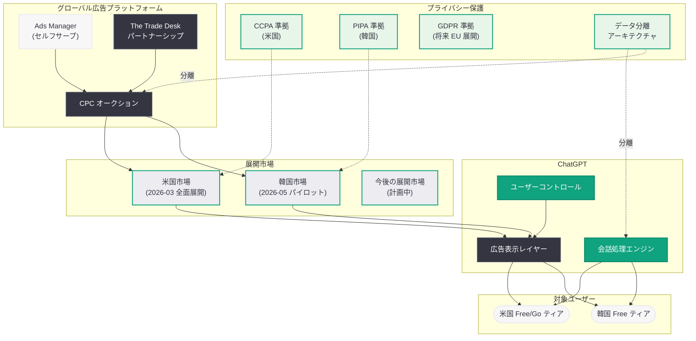

# ChatGPT 広告パイロットが韓国に拡大: OpenAI のグローバル広告戦略の加速

## メタデータ

| 項目 | 内容 |
|------|------|
| 発表日 | 2026-05-11 |
| ソース | 外部報道 (thelec.net 等) |
| カテゴリ | 広告・ビジネス |
| 公式リンク | [ChatGPT Ads Korea Coverage](https://news.google.com/search?q=OpenAI+ChatGPT+ads+Korea) |

## 概要

OpenAI は 2026 年 5 月 11 日、ChatGPT の広告パイロットプログラムを韓国市場に拡大したことが報じられた。韓国のテクノロジーメディア thelec.net をはじめとする複数の報道機関がこの動きを伝えており、米国に続く国際市場への広告展開として注目されている。韓国はアジア太平洋地域において AI サービスの普及率が高く、ChatGPT のユーザーベースも大きいことから、グローバル広告展開の初期市場として選定されたと見られる。

この発表は、OpenAI が 2026 年 3 月以降に段階的に構築してきた広告事業のグローバル化における重要なマイルストーンである。同年 3 月には元 Meta 広告幹部の採用と The Trade Desk とのパートナーシップ締結、米国全無料ユーザーへの広告拡大を実施し、5 月にはセルフサーブ Ads Manager の導入と ChatGPT での広告テスト開始を発表した。韓国への展開はこれらの国内施策に続く、初の本格的な海外市場進出となる。

## 主な内容

### 韓国市場への広告展開

韓国は OpenAI にとって戦略的に重要な海外市場の一つである。以下の要因が韓国市場への早期展開を後押ししたと考えられる。

- **高いデジタル広告市場の成熟度:** 韓国のデジタル広告市場は 2025 年時点で約 80 億ドル規模であり、アジア太平洋地域で最もデジタル化が進んだ市場の一つである
- **ChatGPT の高い普及率:** 韓国では ChatGPT のリリース直後から急速に普及が進み、ビジネスから教育まで幅広い分野で活用されている
- **テクノロジーへの高い受容性:** スマートフォン普及率やインターネット利用率が世界トップクラスであり、新しいテクノロジーサービスの受容速度が速い
- **広告主エコシステムの充実:** Samsung、LG、Hyundai、Naver、Kakao など、グローバルブランドから国内テック企業まで、潜在的な広告主が豊富に存在する

韓国市場での広告パイロットは、米国と同様に ChatGPT の無料ティアユーザーを対象とし、会話応答とは明確に区別される形式で広告が表示されると推察される。広告のラベリング、回答の独立性、プライバシー保護、ユーザーコントロールという 4 つの基本原則は韓国展開においても維持される見通しである。

### OpenAI の広告戦略タイムライン

OpenAI の広告事業は 2026 年 3 月から急速に展開されてきた。以下に主要なマイルストーンを時系列で整理する。

| 日付 | イベント | 内容 |
|------|---------|------|
| 2026-03-22 | The Trade Desk パートナーシップ | プログラマティック広告配信のインフラ構築 |
| 2026-03-23 | 元 Meta 広告幹部の採用 | 広告事業の本格的な経営体制を確立 |
| 2026-03-21 | 米国での広告展開拡大 | Free ティア・Go ティアの全米ユーザーへ広告を拡大 |
| 2026-05-05 | セルフサーブ Ads Manager 導入 | CPC ビディング、計測ツール、セルフサーブ管理画面を公開 |
| 2026-05-07 | ChatGPT での広告テスト開始 | 4 つの基本原則に基づく広告表示の実証実験を開始 |
| 2026-05-11 | 韓国への広告パイロット拡大 | 初の本格的な海外市場への広告展開 |

このタイムラインから明らかなように、OpenAI はわずか 2 か月足らずの間に、人材確保、インフラ構築、国内全面展開、ツール整備、国際展開という一連のプロセスを完了しており、広告事業に対する極めて高いプライオリティと実行速度が窺える。

### 広告プラットフォームの技術仕様

韓国市場への展開においても、OpenAI が構築した広告プラットフォームの技術インフラが活用される。主要な技術仕様は以下の通りである。

#### セルフサーブ Ads Manager

- **キャンペーン管理:** 広告主が自らキャンペーンを作成、予算設定、ターゲティングを管理
- **クリエイティブツール:** テキスト広告やリッチカード広告のA/Bテスト機能
- **リアルタイムダッシュボード:** インプレッション、クリック、CTR、コンバージョンの可視化
- **多言語対応:** 韓国語を含む複数言語でのキャンペーン設定が可能

#### CPC ビディングモデル

- **リアルタイムオークション:** セカンドプライスオークションによる公平な広告枠配分
- **品質スコアシステム:** 広告の関連性とユーザーエンゲージメントを評価
- **スマートビディング:** 機械学習による入札最適化
- **通貨対応:** 韓国ウォン (KRW) での予算設定と課金に対応

#### プライバシー保護

- **会話内容の非利用:** ユーザーの会話データは広告ターゲティングに一切使用しない
- **データ分離アーキテクチャ:** 会話処理システムと広告配信システムの物理的分離
- **韓国個人情報保護法への準拠:** 韓国の個人情報保護法 (PIPA) に準拠したデータ取り扱い
- **匿名化処理:** 地域、デバイスタイプ、言語など匿名化シグナルのみ使用

### 韓国市場における規制対応

韓国での広告展開にあたっては、以下の規制への対応が必要となる。

- **個人情報保護法 (PIPA):** 韓国の包括的なプライバシー法であり、個人データの収集・利用・第三者提供に厳格な規制を設けている
- **表示広告法:** 広告であることの明示的な表示が義務付けられており、OpenAI の「明確なラベリング」原則と合致する
- **電気通信事業法:** オンラインサービスにおける広告表示に関する規制
- **韓国公正取引委員会 (KFTC) のガイドライン:** AI サービスにおける広告に関する今後のガイドライン策定が予想される

## アーキテクチャ

## 開発者への影響

### OpenAI API 開発者

- **API 利用への直接的影響はなし:** 韓国市場への広告展開は ChatGPT のコンシューマー向けインターフェースに限定されており、OpenAI API を利用したサードパーティアプリケーションには影響しない
- **多言語広告 API の可能性:** グローバル展開が進むことで、将来的に多言語対応の広告 API や広告 SDK が提供される可能性がある
- **韓国向けアプリケーション開発:** 韓国市場での ChatGPT 利用が広告により活性化されることで、韓国向け AI アプリケーションの需要が高まる可能性がある

### 広告テクノロジー開発者

- **アジア太平洋地域の DSP 連携:** 韓国の広告テクノロジー企業が ChatGPT 広告プラットフォームとの連携を開始する可能性がある
- **韓国語広告クリエイティブ:** AI 対話型インターフェースに最適化された韓国語広告フォーマットの開発が求められる
- **計測・アトリビューション:** 韓国市場特有の広告効果計測手法の整備が必要となる

### プライバシー・コンプライアンス開発者

- **PIPA 対応の実装:** 韓国の個人情報保護法に準拠したデータ処理パイプラインの構築が必要
- **クロスボーダーデータフロー:** 韓国のデータローカリゼーション要件への対応が広告配信アーキテクチャに影響する可能性がある
- **同意管理:** 韓国ユーザー向けの広告関連の同意取得・管理メカニズムの実装

### 韓国のスタートアップ・企業

- **新たな広告チャネル:** 韓国企業にとって ChatGPT は AI ネイティブな広告配信先として活用可能となる
- **中小企業のアクセス拡大:** セルフサーブ Ads Manager により、韓国の中小企業も手軽に ChatGPT 広告を活用できるようになる
- **AI コマースとの連携:** ChatGPT の商品発見機能 (Product Discovery) と広告の組み合わせにより、E コマースとの統合が進む

## 今後の展望

### グローバル展開のロードマップ

韓国への広告パイロット拡大は、OpenAI のグローバル広告戦略の第一歩に過ぎない。今後以下の地域への展開が予想される。

- **日本:** 韓国と並ぶアジア太平洋地域の主要市場であり、デジタル広告市場の規模も大きい
- **欧州 (EU):** GDPR への対応が必要だが、巨大な広告市場が存在する
- **東南アジア:** 急成長中のデジタル経済圏として注目されている
- **インド:** ユーザーベースの急拡大が見込まれる市場

### 競合環境の変化

- **Google との競合深化:** Google の検索広告やディスプレイ広告に対し、AI 対話型広告という新たな広告形態での差別化が進む
- **韓国ローカルプレイヤー:** Naver や Kakao などの韓国国内プラットフォームとの広告枠の競合が生じる可能性がある
- **Meta との間接競合:** SNS 広告とは異なる AI コンテキスト広告としてのポジショニングが鍵となる

## 関連リンク

- [ChatGPT 広告テスト開始](../2026-05-07-testing-ads-in-chatgpt.md)
- [ChatGPT 広告の新しい購入方法](../2026-05-05-new-ways-to-buy-chatgpt-ads.md)
- [ChatGPT 広告の米国展開拡大](../2026-03-21-chatgpt-ads-expansion-us.md)
- [OpenAI News](https://openai.com/news)
- [The Trade Desk パートナーシップ](https://openai.com/index/openai-trade-desk-ad-partnership)
- [thelec.net (韓国テック報道)](https://thelec.net)

## まとめ

OpenAI が ChatGPT の広告パイロットプログラムを韓国に拡大したことは、同社の広告事業がグローバルフェーズに突入したことを明確に示している。2026 年 3 月に米国で広告インフラの構築を開始してからわずか 2 か月で海外展開に踏み切るスピード感は、OpenAI が広告事業を収益の柱として本格的に育成する意思を鮮明にしている。

韓国市場が選ばれた背景には、高いデジタル広告市場の成熟度、ChatGPT の高い普及率、テクノロジーに対する高い受容性、そして充実した広告主エコシステムがある。プライバシー保護の観点では、韓国の個人情報保護法 (PIPA) への準拠が求められるが、OpenAI が米国で構築した会話-広告分離アーキテクチャは、各国の規制要件に適応可能な設計となっている。

今後は韓国での広告パイロットの成果を踏まえ、日本、欧州、東南アジアなど他の主要市場への展開が段階的に進められると予想される。AI 対話型プラットフォームにおける広告モデルのグローバルスタンダードを誰が定義するかという競争において、OpenAI は着実に先行者優位を確立しつつある。
