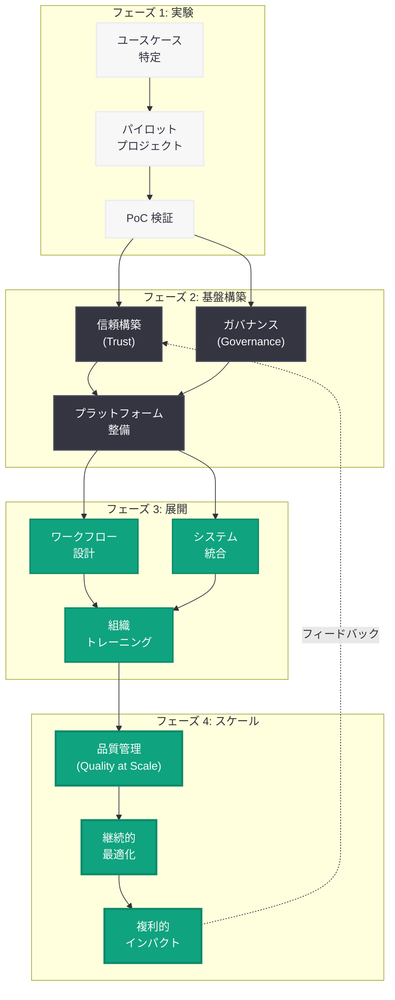
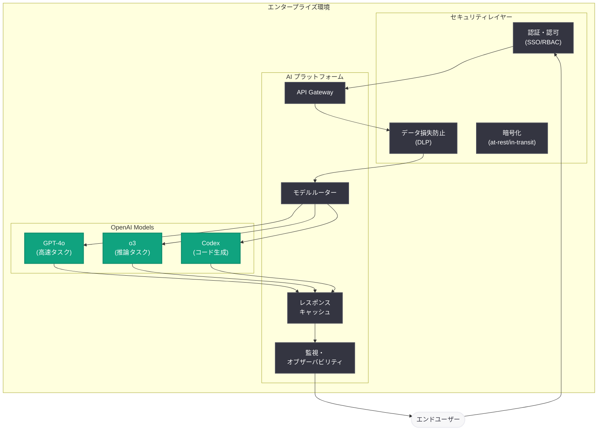

# エンタープライズにおける AI スケーリング: OpenAI 公式ガイド

## メタデータ

| 項目 | 内容 |
|------|------|
| 発表日 | 2026-05-11 |
| ソース | OpenAI Business Guides |
| カテゴリ | ガイド / エンタープライズ |
| 公式リンク | [How enterprises are scaling AI](https://openai.com/business/guides-and-resources/how-enterprises-are-scaling-ai) |

## 概要

OpenAI は 2026 年 5 月 11 日、エンタープライズ向けビジネスガイド「How enterprises are scaling AI」を公開した。本ガイドは、企業が AI を初期実験段階から全社規模での展開へとスケールさせ、複利的なインパクトを実現するための包括的なフレームワークを提示するものである。

本ガイドでは、AI スケーリングの成功に不可欠な 4 つの柱として「信頼構築 (Trust)」「ガバナンス (Governance)」「ワークフロー設計 (Workflow Design)」「スケールにおける品質 (Quality at Scale)」を定義し、それぞれについて実践的なアプローチと具体的な実装方法を解説している。パイロットプロジェクトから全社展開に至るまでの道筋を示し、チェンジマネジメント、データプライバシー、ROI 測定といった共通の課題に対する解決策を提供している。

## 主な内容

### 信頼構築 (Trust)

AI システムの全社展開において、組織的な信頼の構築は最も根本的な課題である。本ガイドでは、信頼を以下の 3 つのレイヤーで捉えるフレームワークを提示している。

**技術的信頼:**

- AI モデルの出力精度と一貫性の検証メカニズム
- ハルシネーション (幻覚) の検出と防止策
- モデルの限界に関する透明性のある文書化
- 出力結果の監査証跡 (Audit Trail) の整備

**組織的信頼:**

- 経営層から現場までの AI リテラシー向上プログラム
- 成功事例の社内共有とナレッジベースの構築
- AI 導入による業務変化に対する従業員の不安解消
- 段階的な権限委譲による信頼醸成

**顧客信頼:**

- AI が関与するプロセスに対する顧客への適切な開示
- データ利用に関する明確なポリシーと同意取得
- AI 出力に対する人間レビューの保証
- インシデント発生時の迅速な対応体制

信頼構築は一度で完了するものではなく、継続的なモニタリングとフィードバックループを通じて段階的に強化していく必要がある。ガイドでは、信頼度を定量化するためのメトリクスとして、モデル精度、ユーザー満足度、インシデント発生率、採用率の 4 指標を推奨している。

### ガバナンス (Governance)

AI ガバナンスは、AI の利用を組織全体で適切に管理・統制するための仕組みである。本ガイドでは、エンタープライズにおける AI ガバナンスを以下の構成要素で定義している。

**ガバナンス体制:**

- AI Center of Excellence (CoE) の設立と役割定義
- AI 倫理委員会による利用ケースの審査プロセス
- データスチュワードとモデルオーナーの責任分担
- インシデント対応チームの編成と権限

**ポリシーフレームワーク:**

- AI 利用ポリシーの策定 (許可される用途と禁止される用途の明確化)
- データ分類基準に基づくアクセス制御
- サードパーティ AI サービスの利用基準
- モデルの定期的な再評価と更新手順

**コンプライアンス要件:**

- 業界固有の規制要件 (金融、医療、製造等) への対応
- 個人情報保護法制 (GDPR、CCPA 等) との整合性確保
- AI 出力の説明責任 (Explainability) の確保
- バイアス検出と公平性の監視

**リスク管理:**

- AI 固有のリスクカテゴリの定義と評価基準
- リスクベースのアプローチによるユースケース優先順位付け
- モデルリスク管理 (MRM) フレームワークの適用
- 事業継続計画 (BCP) における AI 依存リスクの考慮

### ワークフロー設計 (Workflow Design)

AI を効果的にビジネスプロセスに統合するためのワークフロー設計は、スケーリング成功の鍵を握る。本ガイドでは、以下の設計原則を示している。

**Human-in-the-Loop (HITL) 設計:**

- AI と人間の役割分担の明確化
- 介入ポイント (Intervention Point) の適切な配置
- エスカレーションルールの定義
- フィードバック収集メカニズムの組み込み

**プロセス再設計のアプローチ:**

1. **現状分析**: 既存業務プロセスのマッピングとボトルネック特定
2. **AI 適用可能性評価**: 各タスクの自動化適性スコアリング
3. **パイロット設計**: 小規模な検証環境でのプロトタイピング
4. **段階的展開**: 成功メトリクスに基づく段階的ロールアウト
5. **継続的最適化**: データ駆動型の改善サイクル

**統合パターン:**

- **Copilot パターン**: AI がアシスタントとして人間の作業を支援
- **Autopilot パターン**: AI が定型業務を自律的に処理し、例外のみ人間がハンドリング
- **Orchestrator パターン**: AI がワークフロー全体を制御し、適切なタイミングで人間に判断を委譲
- **Validator パターン**: 人間が作成した成果物を AI がレビュー・検証

**変更管理 (Change Management):**

- ステークホルダーマップの作成と影響分析
- トレーニングプログラムの設計と実施
- 段階的なロールアウト計画 (部門別、地域別)
- 成功指標の定義と進捗トラッキング

### スケールにおける品質 (Quality at Scale)

AI を全社規模で展開する際、品質の維持は最大の技術的課題の一つである。本ガイドでは、スケールにおける品質管理のベストプラクティスを提示している。

**品質保証フレームワーク:**

- AI 出力のサンプリング検査とベンチマーク評価
- A/B テストによる継続的な性能比較
- ユーザーフィードバックに基づく品質スコアリング
- 自動化された回帰テストパイプライン

**モニタリングと観測性:**

- リアルタイムのモデル性能ダッシュボード
- データドリフト検出とアラート機能
- レイテンシーとスループットの継続監視
- コスト効率の追跡と最適化

**スケーリング戦略:**

- 使用量に応じたインフラストラクチャのオートスケーリング
- プロンプトテンプレートの標準化とバージョン管理
- モデル選択の最適化 (タスク複雑度に応じた適切なモデルの使い分け)
- キャッシュ戦略によるコスト削減とレスポンス高速化

**継続的改善サイクル:**

1. **測定**: KPI と品質メトリクスの定期的な収集
2. **分析**: パフォーマンス低下の根本原因分析
3. **改善**: プロンプト最適化、ファインチューニング、ワークフロー調整
4. **展開**: 改善策の本番環境への適用と効果検証

## 技術的な詳細

### エンタープライズ AI スケーリングジャーニー

以下の図は、企業が AI を初期実験からスケールまで成長させる過程を示している。

### 成熟度モデル

本ガイドでは、企業の AI 成熟度を 5 段階で評価するフレームワークを提示している。

| レベル | 名称 | 特徴 |
|--------|------|------|
| 1 | 探索 | 個人レベルでの AI 試用、公式な戦略なし |
| 2 | 実験 | パイロットプロジェクトの実施、限定的な成果測定 |
| 3 | 標準化 | ガバナンス確立、プラットフォーム整備、複数部門での展開 |
| 4 | 最適化 | データ駆動型の改善、全社的な AI 統合、ROI の可視化 |
| 5 | 変革 | AI ファーストの業務設計、複利的なインパクト、競争優位の確立 |

### 推奨アーキテクチャ

### ROI 測定フレームワーク

本ガイドでは、AI 投資の ROI を測定するための指標体系を提示している。

| カテゴリ | 指標 | 測定方法 |
|----------|------|----------|
| 効率性 | タスク完了時間の短縮率 | Before/After 比較 |
| 品質 | エラー率の削減 | サンプリング検査 |
| スケール | 処理件数の増加 | システムログ分析 |
| コスト | 人件費削減額 | FTE 換算 |
| 収益 | 新規収益機会の創出 | 売上貢献分析 |
| 満足度 | 従業員 NPS スコア | 定期サーベイ |

## 開発者への影響

- **エンタープライズ向け AI プロダクト開発者**: 本ガイドのフレームワークに準拠した製品設計が求められるようになる。特に、ガバナンス機能 (監査ログ、アクセス制御、利用状況レポート) の組み込みが差別化要因となる
- **プラットフォームエンジニア**: AI Gateway やモデルルーターの構築、オブザーバビリティスタックの整備が新たな技術課題として浮上する。OpenAI API を直接呼び出すのではなく、抽象化レイヤーを介した統制された利用が標準になる
- **セキュリティエンジニア**: AI 固有のセキュリティリスク (プロンプトインジェクション、データ漏洩、モデル操作) に対する防御策の実装が求められる。既存のセキュリティフレームワークを AI に適応させる知識が必要
- **データエンジニア**: AI ワークフローに供給するデータパイプラインの品質管理がより重要になる。データドリフトの検出、データリネージュの追跡、品質ゲートの実装が求められる
- **SRE / DevOps エンジニア**: AI システムの可用性と性能を保証するための新しいオペレーションプラクティスが必要になる。モデルの応答時間、トークン使用量、エラー率の監視が標準的な SLI/SLO に追加される
- **経営企画・DX 推進担当者**: 本ガイドは AI 導入の意思決定フレームワークとして活用できる。投資対効果の試算、リスク評価、ロードマップ策定の基礎資料となる

## 関連リンク

- [How enterprises are scaling AI - OpenAI Business Guides](https://openai.com/business/guides-and-resources/how-enterprises-are-scaling-ai)
- [OpenAI for Business](https://openai.com/business)
- [OpenAI Enterprise Privacy](https://openai.com/enterprise-privacy)
- [ChatGPT Enterprise](https://openai.com/chatgpt/enterprise)
- [OpenAI API Platform](https://platform.openai.com)
- [OpenAI Security Portal](https://trust.openai.com)

## まとめ

本ガイド「How enterprises are scaling AI」は、企業が AI を単なる実験ツールから、ビジネス全体に複利的なインパクトをもたらす戦略的資産へと変革するための実践的なロードマップを提供している。信頼構築、ガバナンス、ワークフロー設計、スケールにおける品質という 4 つの柱を軸に、段階的かつ持続可能な AI スケーリングのアプローチを示している。

特に重要なのは、AI スケーリングが技術的な課題だけでなく、組織文化、プロセス変革、人材育成を含む包括的な取り組みであるという視点である。本ガイドは、技術的な実装方法だけでなく、チェンジマネジメントや ROI 測定といったビジネス面での課題にも踏み込んでおり、CTO から現場のエンジニアまで幅広いステークホルダーにとって有用な内容となっている。

エンタープライズにおける AI 活用が成熟期を迎えつつある中、本ガイドは業界標準となるフレームワークを提示しており、今後の AI 戦略策定における重要なリファレンスとなるだろう。
