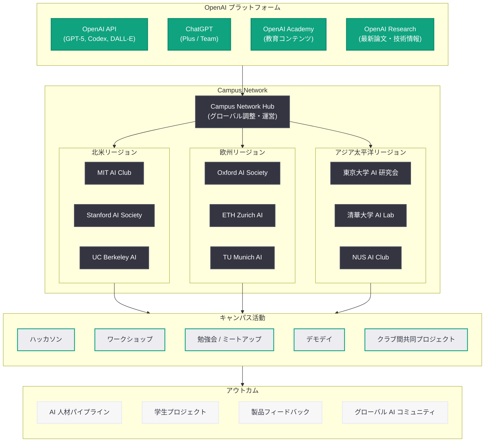

# OpenAI Campus Network -- 世界中の大学生クラブを AI で接続するグローバルコミュニティを始動

## メタデータ

| 項目 | 内容 |
|------|------|
| 発表日 | 2026-05-11 |
| ソース | OpenAI News |
| カテゴリ | コミュニティ / 教育 |
| 公式リンク | [OpenAI Campus Network](https://openai.com/index/openai-campus-network-student-club-interest-form) |

## 概要

OpenAI は 2026 年 5 月 11 日、世界中の大学に所属する学生クラブを対象とした新たなコミュニティプログラム「OpenAI Campus Network」の関心表明フォーム (Interest Form) を公開した。本プログラムは、大学キャンパスにおける AI コミュニティの構築を支援し、学生クラブ間のグローバルなネットワーク形成、AI ツールへのアクセス提供、イベント開催支援を通じて、次世代の AI 人材育成を加速させることを目的としている。

本発表は、OpenAI が 2026 年に入ってから一貫して推進してきた教育・コミュニティ施策の延長線上に位置する。2026 年 4 月 6 日に発表された OpenAI Safety Fellowship (AI 安全性研究のフェローシッププログラム)、4 月 10 日の OpenAI Academy (企業・個人向け教育プラットフォーム)、4 月 12 日の EMEA Youth Wellbeing Grant (若者のウェルビーイング助成金) に続く施策であり、OpenAI が教育機関との連携を戦略的に重視していることを改めて示すものである。Campus Network は特に大学生のコミュニティ形成に焦点を当てており、GitHub Campus Experts や Google Developer Student Clubs (GDSC) など他社の先行プログラムと同様のアプローチで、キャンパスにおける AI エコシステムの構築を目指している。

## 主な内容

### Campus Network の概要

OpenAI Campus Network は、大学の学生クラブを中心とした AI コミュニティの形成を支援するグローバルプログラムである。従来の個人向けフェローシップやインターンシップとは異なり、学生クラブという「組織」を単位としてネットワークを構築する点が大きな特徴である。

プログラムの主な目的は以下の通りである。

- **グローバル接続:** 世界中の大学に存在する AI 関連学生クラブ同士を接続し、知識やベストプラクティスの共有を促進する
- **AI ツールへのアクセス:** 参加クラブに対して、ChatGPT、API クレジット、Codex などの OpenAI 製品へのアクセスを提供する
- **イベント開催支援:** キャンパスにおける AI 関連イベント (ハッカソン、ワークショップ、勉強会など) の開催を支援する
- **コミュニティ構築:** AI を活用したキャンパスコミュニティの形成を通じて、学生の学習体験を向上させる

### 参加対象と登録プロセス

Campus Network の参加対象は、大学に正式に所属する学生クラブであると考えられる。関心表明フォームの公開は、本格的なプログラムローンチに先立つ事前登録フェーズであり、以下のような流れが想定される。

1. **関心表明:** 学生クラブの代表者がオンラインフォームで関心を表明
2. **審査・選考:** OpenAI による申請内容のレビューと選考プロセス
3. **オンボーディング:** 選考通過後の正式参加手続きとプログラム説明
4. **活動開始:** ツールアクセス提供、イベント支援開始

### 提供される特典

Campus Network に参加する学生クラブには、以下の特典が提供されると想定される。

#### AI ツールへのアクセス

| ツール | 想定される提供内容 |
|--------|------------------|
| ChatGPT | Plus / Team プランへのアクセス |
| OpenAI API | クレジットの付与 (教育利用向け) |
| Codex | コーディング支援ツールへのアクセス |
| DALL-E / Sora | 画像・動画生成ツールの利用枠 |

#### イベント支援

- **ハッカソン支援:** 機材、スポンサーシップ、メンタリングの提供
- **ワークショップ素材:** OpenAI Academy のコンテンツを活用した教育素材
- **スピーカー派遣:** OpenAI エンジニアや研究者によるゲスト講演
- **コミュニティイベント:** クラブ間交流イベント、デモデイの企画支援

#### ネットワーキング

- **グローバルコミュニティ:** 他大学のクラブリーダーとの交流機会
- **OpenAI チームとの接点:** エンジニアや研究者とのネットワーキング
- **インターンシップ機会:** OpenAI やパートナー企業でのインターンシップ情報
- **プロジェクトショーケース:** 学生プロジェクトの公開・紹介プラットフォーム

### 他社プログラムとの比較

OpenAI Campus Network は、テクノロジー企業が大学コミュニティにおけるエコシステム構築のために実施してきた先行プログラムと類似のアプローチを採用している。

| プログラム | 運営企業 | 開始年 | 対象 | 主な特典 |
|-----------|---------|--------|------|---------|
| **OpenAI Campus Network** | OpenAI | 2026 | 学生クラブ | AI ツール、イベント支援、グローバル接続 |
| GitHub Campus Experts | GitHub / Microsoft | 2016 | 個人 (学生リーダー) | GitHub Pro、トレーニング、イベント支援 |
| Google Developer Student Clubs (GDSC) | Google | 2017 | 学生グループ | Google Cloud クレジット、メンタリング、認定証 |
| Microsoft Learn Student Ambassadors | Microsoft | 2019 | 個人 (学生) | Azure クレジット、認定資格、メンタリング |
| AWS Educate | Amazon | 2015 | 教育機関 | AWS クレジット、カリキュラム、ラボ |

OpenAI Campus Network の差別化要因は以下の点にある。

- **AI ネイティブ:** 汎用クラウドやデベロッパーツールではなく、AI に特化した支援プログラムである
- **クラブ単位:** 個人ではなく学生クラブを対象とすることで、コミュニティのスケール効果を最大化する
- **最先端モデルへのアクセス:** GPT-5 系列、Codex など、最先端の AI モデルへのアクセスを提供する
- **急速に成長する AI 市場:** AI 人材の需要が急増する中、学生にとっての魅力が高い

### OpenAI の教育・コミュニティ戦略全体像

Campus Network は、OpenAI が展開する教育・コミュニティ施策群の一部として位置付けられる。

| 施策 | 発表日 | 対象 | 目的 |
|------|--------|------|------|
| AI 教育機会 | 2026-03-05 | 一般 | AI 教育の機会創出 |
| ChatGPT 数学・科学学習 | 2026-03-10 | 学生 (K-12) | 学習体験の向上 |
| OpenAI Safety Fellowship | 2026-04-06 | 研究者 | AI 安全性研究の推進 |
| OpenAI Academy | 2026-04-10 | 企業・個人 | AI リテラシー向上 |
| EMEA Youth Wellbeing Grant | 2026-04-12 | 若者支援団体 | ウェルビーイング促進 |
| **Campus Network** | **2026-05-11** | **学生クラブ** | **キャンパス AI コミュニティ** |

## 技術的な詳細

### Campus Network のエコシステム構造

OpenAI Campus Network は、OpenAI のプラットフォーム、学生クラブ、大学、およびパートナーエコシステムを接続する多層的な構造を持つ。

### 想定されるプログラム運営フロー

Campus Network の運営は、年間サイクルに基づく以下のようなフローで構成されると考えられる。

```mermaid
flowchart LR
    subgraph Recruitment["募集フェーズ"]
        direction TB
        R1["関心表明フォーム公開"]
        R2["申請受付・審査"]
        R3["参加クラブ選定"]
    end

    subgraph Onboarding["オンボーディング"]
        direction TB
        O1["キックオフイベント"]
        O2["ツールアクセス付与"]
        O3["コミュニティ参加"]
    end

    subgraph Active["活動期間"]
        direction TB
        A1["月次ミートアップ"]
        A2["ハッカソン開催"]
        A3["プロジェクト開発"]
    end

    subgraph Showcase["成果発表"]
        direction TB
        S1["プロジェクトデモ"]
        S2["ベストプラクティス共有"]
        S3["年次サミット"]
    end

    Recruitment --> Onboarding --> Active --> Showcase

    classDef openai fill:#10A37F,stroke:#0D8A6A,stroke-width:2px,color:white
    classDef dark fill:#343541,stroke:#444654,stroke-width:2px,color:white

    class R1,R2,R3 openai
    class O1,O2,O3 dark
    class A1,A2,A3 openai
    class S1,S2,S3 dark
```

### API クレジットと技術リソースの提供モデル

学生クラブへの技術リソース提供は、段階的なティア制度で運営される可能性がある。

| ティア | 対象 | API クレジット | ChatGPT アクセス | イベント支援 |
|--------|------|---------------|-----------------|-------------|
| Starter | 新規参加クラブ | 月額 $100 相当 | Team プラン (5 席) | 四半期 1 回 |
| Growth | 6 ヶ月以上活動 | 月額 $500 相当 | Team プラン (15 席) | 月 1 回 |
| Impact | 顕著な成果を出したクラブ | 月額 $2,000 相当 | Team プラン (30 席) | 無制限 |

## 開発者への影響

### 学生開発者へのメリット

OpenAI Campus Network は、学生開発者に対して以下のような直接的なメリットをもたらす。

#### 最先端 AI ツールへの無償アクセス

通常であれば有料の OpenAI API やChatGPT Plus / Team プランへのアクセスが提供されることで、学生が個人の金銭的負担なく最先端の AI モデルを利用した開発・研究を行えるようになる。これは特に、AI アプリケーション開発のプロトタイピングやハッカソンプロジェクトにおいて大きな障壁の除去となる。

#### キャリア形成の機会

- **ポートフォリオ構築:** Campus Network を通じて開発したプロジェクトは、就職活動におけるポートフォリオとして活用できる
- **ネットワーキング:** OpenAI のエンジニアや研究者との接点は、AI 業界でのキャリア形成において貴重な機会となる
- **インターンシップへの道:** プログラム参加者が OpenAI やパートナー企業のインターンシップにおいて優先的に考慮される可能性がある

#### スキルアップの加速

OpenAI Academy のコンテンツと Campus Network の実践機会を組み合わせることで、理論と実践の両面から AI スキルを加速的に向上させることができる。

### AI エコシステムへの波及効果

#### オープンソースプロジェクトの活性化

学生クラブがハッカソンやプロジェクトで開発した成果物がオープンソースとして公開されることで、AI エコシステム全体の発展に寄与する。OpenAI API を活用した教育ツール、生産性向上アプリケーション、研究支援ツールなどの開発が促進される。

#### AI 人材パイプラインの構築

Campus Network は、OpenAI にとって将来の AI 人材を発掘・育成するパイプラインとしても機能する。学生がプログラムを通じて OpenAI の技術スタックに精通することで、卒業後に OpenAI やそのエコシステムパートナーに貢献する人材の供給源となる。

#### 製品フィードバックループの確立

多様なバックグラウンドを持つ学生が OpenAI の製品を積極的に利用することで、多角的なフィードバックが蓄積される。特に教育現場での AI 活用に関する知見は、製品改善やユースケースの拡大に直接活かされる。

### 教育機関への影響

#### カリキュラムとの連携

Campus Network の活動は、大学の AI 関連カリキュラムを補完する役割を果たす。正課外の学生クラブ活動として、講義で学んだ理論を実践に移す機会を提供する。

#### 大学間連携の促進

同じネットワークに属する複数大学のクラブが共同プロジェクトやイベントを実施することで、大学間の学術的・技術的な交流が促進される。

## 関連リンク

- [OpenAI Campus Network Interest Form (公式)](https://openai.com/index/openai-campus-network-student-club-interest-form)
- [関連レポート: OpenAI Academy を正式ローンチ](2026-04-10-openai-academy-launch.md)
- [関連レポート: OpenAI Safety Fellowship](2026-04-06-openai-safety-fellowship.md)
- [関連レポート: EMEA Youth Wellbeing Grant](2026-04-12-emea-youth-wellbeing-grant.md)
- [関連レポート: AI 教育機会](2026-03-05-ai-education-opportunity.md)
- [関連レポート: ChatGPT に数学・科学の学習機能が追加](2026-03-10-chatgpt-math-science-learning.md)
- [GitHub Campus Experts](https://education.github.com/experts)
- [Google Developer Student Clubs](https://developers.google.com/community/gdsc)
- [OpenAI News](https://openai.com/news)

## まとめ

OpenAI Campus Network は、世界中の大学に所属する学生クラブを対象としたグローバルコミュニティプログラムであり、AI ツールへのアクセス提供、イベント開催支援、クラブ間のグローバル接続を通じて、キャンパスにおける AI コミュニティの構築を支援する。2026 年 5 月 11 日に関心表明フォームが公開されたことで、本格ローンチに向けた事前登録フェーズが開始された。

本プログラムは、GitHub Campus Experts や Google Developer Student Clubs など他社の先行プログラムと同様のアプローチを採用しつつも、AI ネイティブなプログラムとして差別化されている。GPT-5 系列や Codex といった最先端の AI モデルへのアクセスを学生に提供する点は、AI 分野でのキャリアを志す学生にとって極めて魅力的な特典となる。

OpenAI にとって Campus Network は、AI 人材パイプラインの構築、製品フィードバックの獲得、ブランドのキャンパスでの浸透という複数の戦略的目標を同時に達成する施策である。2026 年 4 月の OpenAI Academy ローンチ、Safety Fellowship、EMEA Youth Wellbeing Grant と合わせて、OpenAI が教育・コミュニティ分野への投資を本格化させていることが明確に示された。今後、関心表明フォームの締め切り、参加クラブの選定、プログラムの正式ローンチといったスケジュールの詳細が発表されることが期待される。
