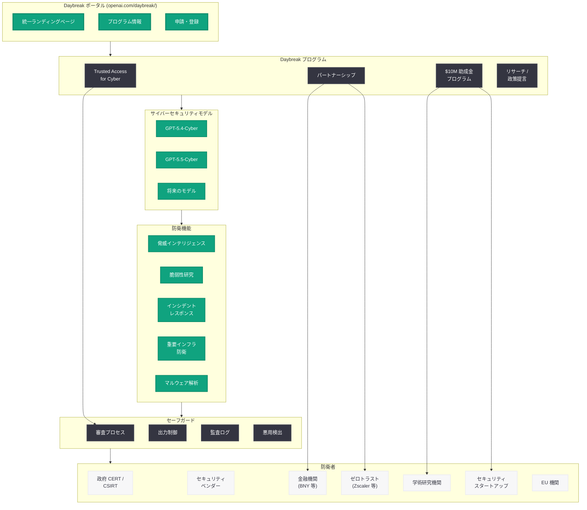

# Daybreak: OpenAI サイバー防衛イニシアチブの統合ブランドが始動

## メタデータ

| 項目 | 内容 |
|------|------|
| 発表日 | 2026-05-11 |
| ソース | OpenAI News |
| カテゴリ | セキュリティ / サイバー防衛 |
| 公式リンク | [Daybreak: Frontier AI for Cyber Defenders](https://openai.com/daybreak/) |

> **注記:** 本レポートは公開情報、関連する報道 (CNBC 等)、および過去の関連レポートに基づいて作成されている。公式ページへの直接アクセスが制限されていたため、公開されている情報をもとに内容を構成している。

## 概要

OpenAI は 2026 年 5 月 11 日、サイバーセキュリティ防衛に関する同社の全施策を統合する新ブランド「Daybreak」を発表した。Daybreak は新しい AI モデルや製品ではなく、これまで「OpenAI for Cyber」として展開されてきた複数のサイバーセキュリティイニシアチブを一つの統合ブランドとして再構成したものである。openai.com/daybreak/ は、OpenAI のサイバーセキュリティプログラムおよびプロダクトの統一ポータルとして機能する。

Daybreak の発表は、OpenAI が 2026 年 4 月以降急速に拡大してきたサイバーセキュリティ戦略の集大成を象徴するものである。Trusted Access for Cyber プログラムの拡大 (4 月 14 日)、1,000 万ドルの助成金プログラム (4 月 16 日)、GPT-5.4-Cyber の限定リリース (4 月 24 日)、「インテリジェンス時代のサイバーセキュリティ」ビジョン文書 (4 月 29 日)、GPT-5.5-Cyber の展開 (5 月 7 日) と、矢継ぎ早に展開されてきた各施策を統一的なブランドのもとに整理し、外部のサイバー防衛者に対して明確な入口を提供する戦略的なリブランディングである。同日には EU に対する新たなサイバーモデルへのアクセス提供も報じられており (CNBC)、グローバルな展開の加速が窺える。

## 主な内容

### Daybreak とは何か: リブランディングの意義

Daybreak は、OpenAI が 2026 年に入って急速に展開してきたサイバーセキュリティ関連の取り組みを、単一の統合ブランドとして対外的に打ち出すものである。これまで個別に発表されてきた以下の施策が、Daybreak の傘の下に統合される。

- **Trusted Access for Cyber プログラム:** 審査済み防衛者への優先的な AI モデルアクセス
- **GPT-5.4-Cyber / GPT-5.5-Cyber:** サイバーセキュリティ防衛に特化した専用モデル
- **1,000 万ドル助成金プログラム:** サイバー防衛エコシステムの開発者・研究者支援
- **パートナーシッププログラム:** BNY、Zscaler 等の主要企業との連携
- **ビジョン文書と政策提言:** AI 時代のサイバーセキュリティに関する 5 つのアクションプラン

「Daybreak」(夜明け) という名称は、サイバー攻撃の暗闇に対して AI が防衛者にもたらす光明を象徴していると考えられ、防衛側の技術的優位性の確保というメッセージを込めたブランディングである。

### 統合ポータルとしての openai.com/daybreak/

openai.com/daybreak/ は、OpenAI のサイバーセキュリティに関する全プログラムとプロダクトの統一ランディングページとして機能する。これまでは Trusted Access for Cyber、GPT-5.4-Cyber、助成金プログラムなどが個別のブログ記事やページとして散在していたが、Daybreak ポータルではこれらを体系的に整理し、防衛者が必要な情報やリソースに容易にアクセスできるよう設計されていると考えられる。

ポータルの想定構成要素は以下の通りである。

- **プログラム概要:** Daybreak の全体像とミッションステートメント
- **サイバーセキュリティモデル:** GPT-5.4-Cyber、GPT-5.5-Cyber へのアクセス情報
- **Trusted Access 申請:** プログラム参加の審査プロセスとエントリーポイント
- **助成金プログラム:** 1,000 万ドルの API 助成金への応募情報
- **パートナー紹介:** 参画企業とユースケース
- **リサーチとリソース:** サイバーセキュリティ AI に関する技術文書とガイダンス

### OpenAI のサイバーセキュリティ戦略の全体像

Daybreak の発表により、OpenAI のサイバーセキュリティ戦略が明確な全体像として可視化された。2026 年 4 月から 5 月にかけての一連の発表を時系列で整理すると、以下のような戦略的進化が見て取れる。

| 日付 | 施策 | 位置づけ |
|------|------|----------|
| 2026-04-14 | Trusted Access for Cyber 拡大 | 基盤プログラムの確立 |
| 2026-04-16 | 1,000 万ドル助成金 | エコシステムへの投資 |
| 2026-04-24 | GPT-5.4-Cyber 限定リリース | 初期モデルの展開 |
| 2026-04-29 | サイバーセキュリティ 5 アクションプラン | ビジョンと政策フレームワーク |
| 2026-05-07 | GPT-5.5-Cyber 展開 | 次世代モデルへの移行 |
| 2026-05-11 | **Daybreak 発表** | **全施策の統合ブランド化** |

この時系列は、OpenAI が計画的かつ段階的にサイバーセキュリティ分野でのプレゼンスを構築し、最終的に Daybreak という統一ブランドとして結実させた戦略の全容を示している。

### EU へのサイバーモデルアクセス提供

CNBC の報道によれば、Daybreak 発表と同日に OpenAI は EU に対して新たなサイバーモデルへのアクセスを提供することが明らかになった。これは以下の観点で重要である。

- **地政学的な展開:** サイバーセキュリティは国家安全保障に直結する分野であり、EU への提供は OpenAI のグローバル戦略の重要な一歩である
- **規制環境への対応:** EU AI Act をはじめとする欧州の AI 規制フレームワークの中で、セキュリティ特化モデルをどのように位置づけるかという先例的な意味を持つ
- **NATO 同盟国への防衛支援:** サイバー空間における脅威が増大する中、同盟国の防衛能力強化に貢献する取り組みとして位置づけられる
- **Anthropic との国際競争:** 欧州市場においても Anthropic の Mythos モデルとの競争が想定され、先行的なアクセス提供による市場確保の意図がある

### Daybreak が包含するサイバーセキュリティ機能

Daybreak ブランドのもとに統合されるサイバーセキュリティ機能は、以下の領域をカバーすると考えられる。

#### 脅威インテリジェンス分析

- MITRE ATT&CK / ATT&CK for ICS フレームワークに基づく脅威マッピング
- リアルタイムの IoC (Indicators of Compromise) 分析
- APT グループの TTP (Tactics, Techniques, and Procedures) 分析

#### 脆弱性研究と管理

- ゼロデイ脆弱性の発見支援
- CVE 分析と CVSS スコアリング
- 大規模コードベースのセキュリティ監査

#### インシデントレスポンス

- 自動化されたアラートトリアージ
- インシデントの検出から封じ込めまでの支援
- フォレンジック分析の自動化

#### 重要インフラ防衛

- IT/OT 統合環境の脅威分析
- ICS/SCADA セキュリティの監視と異常検知
- 物理プロセスへの影響評価

#### マルウェア解析

- バイナリ解析とリバースエンジニアリング
- マルウェアファミリーの分類と挙動分析
- 難読化解除とアンパッキング

## 技術的な詳細

### Daybreak エコシステムのアーキテクチャ

以下の図は、Daybreak ブランドのもとに統合されたサイバーセキュリティエコシステムの全体構造を示している。



### Daybreak の戦略的進化タイムライン

```mermaid
flowchart LR
    subgraph Phase1["Phase 1: 基盤構築"]
        T1["2026-04-14<br/>Trusted Access<br/>プログラム拡大"]
        T2["2026-04-16<br/>$10M 助成金<br/>エコシステム加速"]
    end

    subgraph Phase2["Phase 2: モデル展開"]
        T3["2026-04-24<br/>GPT-5.4-Cyber<br/>限定リリース"]
        T4["2026-04-29<br/>サイバーセキュリティ<br/>ビジョン文書"]
    end

    subgraph Phase3["Phase 3: 次世代展開"]
        T5["2026-05-07<br/>GPT-5.5-Cyber<br/>Trusted Access 拡大"]
    end

    subgraph Phase4["Phase 4: ブランド統合"]
        T6["2026-05-11<br/>Daybreak<br/>統合ブランド発表"]
        T7["2026-05-11<br/>EU への<br/>モデルアクセス提供"]
    end

    T1 --> T2
    T2 --> T3
    T3 --> T4
    T4 --> T5
    T5 --> T6
    T6 --> T7

    classDef openai fill:#10A37F,stroke:#0D8A6A,stroke-width:2px,color:white
    classDef dark fill:#343541,stroke:#444654,stroke-width:2px,color:white
    classDef accent fill:#ECECF1,stroke:#10A37F,stroke-width:2px,color:#343541
    classDef highlight fill:#10A37F,stroke:#0D8A6A,stroke-width:3px,color:white

    class T6,T7 highlight
    class T1,T3,T5 dark
    class T2,T4 accent
```



### 統合プラットフォームとしての API アクセスパターン

Daybreak ブランド下での API アクセスは、これまでと同様に OpenAI API を通じて提供されると想定される。統合ポータルが提供する価値は、プログラムへの参加プロセスの簡素化と、適切なモデルやリソースへのガイダンスである。

```python
from openai import OpenAI

client = OpenAI()

# Daybreak プログラム経由で GPT-5.5-Cyber にアクセス
# (Trusted Access for Cyber の審査通過が前提)
response = client.chat.completions.create(
    model="gpt-5.5-cyber",
    messages=[
        {
            "role": "system",
            "content": (
                "You are a cybersecurity threat analyst operating under "
                "the Daybreak program. Analyze the provided threat data "
                "and map findings to the MITRE ATT&CK framework. "
                "Provide actionable intelligence for cyber defenders."
            )
        },
        {
            "role": "user",
            "content": (
                "Analyze the following indicators for potential APT activity:\n\n"
                "- Scheduled task created: svchost_update.exe\n"
                "- DNS queries to DGA-generated domains (entropy > 4.2)\n"
                "- Cobalt Strike beacon traffic on port 443\n"
                "- LSASS memory access via unsigned process\n"
                "- WMI lateral movement to 3 domain controllers\n\n"
                "Provide threat assessment, ATT&CK mapping, and "
                "recommended containment actions."
            )
        }
    ],
    max_tokens=8192
)

print(response.choices[0].message.content)
```

## 戦略的意義

### サイバーセキュリティ AI 市場におけるポジショニング

Daybreak のブランド化は、OpenAI がサイバーセキュリティ AI 市場における自社のポジションを明確に打ち出すための戦略的な動きである。

- **ブランド認知の確立:** これまで個別施策として散在していたサイバーセキュリティの取り組みを、「Daybreak」という記憶に残りやすいブランドで統一することで、セキュリティコミュニティにおける認知度を高める
- **Anthropic との差別化:** Anthropic が Mythos ブランドでサイバーセキュリティ市場に参入する中、OpenAI も専用ブランドで対抗する姿勢を明確にした
- **包括性の訴求:** 単一のモデルやツールではなく、プログラム、助成金、パートナーシップ、ビジョンを含む包括的なエコシステムとして提示することで、市場での優位性を主張
- **グローバル展開の基盤:** EU へのアクセス提供と合わせて、国際的なサイバー防衛コミュニティへの展開基盤としてのブランドを確立

### 防衛者コミュニティへのメッセージ

Daybreak という名称は、サイバーセキュリティの防衛者に対する明確なメッセージを含んでいる。

- **攻撃者に対する技術的優位性:** AI の最先端能力を防衛側に優先的に提供し、攻撃者が汎用 AI を悪用するのに対して防衛側が専用モデルで対抗できるようにする
- **統一されたリソースアクセス:** 個別のプログラムや申請先を探す必要なく、Daybreak ポータルから全リソースにアクセスできるようになる
- **長期的なコミットメント:** ブランドの確立は、OpenAI のサイバーセキュリティ分野への長期的投資の表明である
- **コミュニティの形成:** Daybreak のもとに防衛者コミュニティが形成され、知見の共有と協力体制の構築が促進される

### AI 企業のサイバーセキュリティ戦略における位置づけ

OpenAI の Daybreak は、AI 企業がサイバーセキュリティ分野でどのように社会的責任を果たし、同時にビジネス機会を追求するかの先例を示している。

- **責任ある AI デプロイの実践:** セキュリティ特化モデルを審査済み防衛者に限定提供することで、デュアルユースリスクを管理しながら防衛能力を向上させる
- **エコシステムアプローチ:** 自社モデルの提供だけでなく、助成金による開発者支援、パートナーシップによる産業展開、政策提言による制度整備を含む包括的なアプローチ
- **ブランドによる信頼構築:** 統一ブランドの確立は、セキュリティコミュニティとの長期的な信頼関係構築の第一歩である

## 開発者への影響

### サイバーセキュリティ開発者にとっての変化

- **ワンストップアクセスの実現:** Daybreak ポータルにより、OpenAI のサイバーセキュリティプログラム、モデル、助成金、ドキュメントへのアクセスが一元化される。開発者は複数のブログ記事やページを横断して情報を収集する必要がなくなる
- **参入経路の明確化:** Trusted Access for Cyber への参加方法、助成金への応募手順、パートナーシッププログラムの要件が統一ポータルで明確に提示されることで、プログラムへの参加ハードルが心理的に低下する
- **エコシステムの可視化:** Daybreak に参画している他の組織やパートナーの情報が集約されることで、コラボレーションの機会を見つけやすくなる
- **将来のロードマップの予測:** 統合ブランドの存在は、OpenAI が今後もサイバーセキュリティ分野に継続投資する意思の表明であり、開発者は安心して長期的な開発計画を立てられる

### 既存プログラム参加者への影響

- **ブランド変更に伴う移行:** 既存の Trusted Access for Cyber プログラム参加者は、Daybreak ブランドへの移行に伴うポータル URL や管理画面の変更に対応する必要がある可能性がある
- **API アクセスの継続性:** モデル名 (gpt-5.4-cyber, gpt-5.5-cyber) や API インターフェースの変更は伴わないと想定される。ブランド変更は主にマーケティングとプログラム管理のレイヤーでの変更である
- **追加リソースの利用:** Daybreak ポータルを通じて新たなドキュメント、ベストプラクティスガイド、コミュニティフォーラムなどのリソースにアクセスできるようになる可能性がある

### 新規参入を検討する開発者への推奨事項

- **Daybreak ポータルの確認:** openai.com/daybreak/ にアクセスし、プログラムの全体像と参加要件を把握する
- **助成金プログラムへの応募検討:** サイバーセキュリティツールの開発を計画している場合、1,000 万ドルの API 助成金プログラムへの応募を検討する
- **段階的な準備:** Trusted Access for Cyber の審査には時間を要するため、早期に準備を開始し、組織の防衛ミッションと利用計画を文書化しておく
- **EU 開発者の機会:** EU へのアクセス提供が始まったことで、欧州のサイバーセキュリティ開発者にとっても参加の機会が広がっている

## 関連リンク

- [Daybreak: Frontier AI for Cyber Defenders (公式)](https://openai.com/daybreak/)
- [GPT-5.5 と GPT-5.5-Cyber による Trusted Access 拡大 (関連レポート 5/7)](./2026-05-07-gpt-5-5-trusted-access-cyber.md)
- [インテリジェンス時代のサイバーセキュリティ (関連レポート 4/29)](./2026-04-29-cybersecurity-intelligence-age.md)
- [GPT-5.4-Cyber の限定リリース (関連レポート 4/24)](./2026-04-24-gpt-5-4-cyber-limited-release.md)
- [サイバー防衛エコシステムの加速 (関連レポート 4/16)](./2026-04-16-accelerating-cyber-defense-ecosystem.md)
- [Trusted Access プログラムの拡大 (関連レポート 4/14)](./2026-04-14-scaling-trusted-access-cyber-defense.md)
- [OpenAI Safety](https://openai.com/safety)
- [OpenAI API ドキュメント](https://platform.openai.com/docs)
- [MITRE ATT&CK フレームワーク](https://attack.mitre.org/)

## まとめ

OpenAI が 2026 年 5 月 11 日に発表した「Daybreak」は、同社のサイバーセキュリティに関する全施策を統合する戦略的なリブランディングである。新しいモデルや製品の発表ではなく、2026 年 4 月以降に急速に展開されてきた Trusted Access for Cyber プログラム、GPT-5.4-Cyber / GPT-5.5-Cyber、1,000 万ドル助成金、パートナーシップ、政策提言という複数の施策を「Daybreak」という統一ブランドのもとに体系化したものである。

Daybreak ポータル (openai.com/daybreak/) は、サイバー防衛者にとってのワンストップアクセスポイントとして機能し、プログラム参加、モデルアクセス、助成金応募、パートナー情報の全てを一元的に提供する。同日に報じられた EU へのサイバーモデルアクセス提供と合わせ、OpenAI のサイバーセキュリティ戦略がグローバルに本格展開する段階に入ったことを示している。

Anthropic の Mythos との競争が激化する中、Daybreak というブランドの確立は、OpenAI がサイバーセキュリティ AI 市場において長期的なコミットメントを持ち、包括的なエコシステムアプローチで防衛者コミュニティを支援する姿勢を明確に打ち出したものとして評価される。セキュリティ開発者にとっては、統一ポータルを通じた情報アクセスの改善と、今後のプログラム拡大への期待が主な恩恵となる。

> **免責事項:** 本レポートは公開情報および関連報道に基づいて構成されたものであり、Daybreak ポータルの全コンテンツを確認した上での分析ではない。ポータルの具体的な構成、新たに提供されるリソースの詳細、および EU アクセス提供の具体的条件については、公式ページを直接参照されたい。
