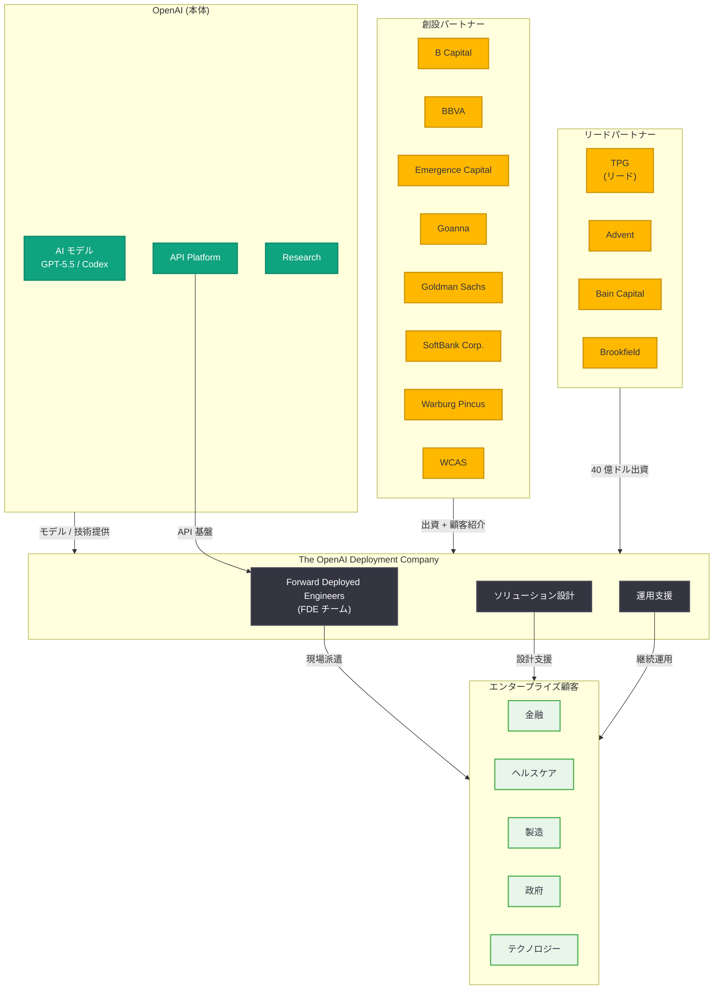

# OpenAI Deployment Company が正式に発足 -- 19 社のグローバルパートナーと FDE モデルで企業 AI 導入を加速

## メタデータ

| 項目 | 内容 |
|------|------|
| 発表日 | 2026-05-11 |
| ソース | OpenAI News |
| カテゴリ | 企業 / パートナーシップ |
| 公式リンク | [The OpenAI Deployment Company](https://openai.com/index/openai-launches-the-deployment-company/) |

## 概要

2026 年 5 月 11 日、OpenAI は「The OpenAI Deployment Company」の正式発足を公式発表した。これは 5 月 3 日に報じられた「DeployCo」として知られていた子会社の正式名称およびローンチであり、OpenAI と 19 の大手グローバル投資ファーム、コンサルティング企業、システムインテグレーターによるコミットされたパートナーシップとして位置づけられている。TPG がリード、Advent、Bain Capital、Brookfield が共同リード創設パートナーとして参画し、総額 40 億ドル (約 6,000 億円) の資金調達を基盤とする。

The OpenAI Deployment Company の最大の特徴は「Forward Deployed Engineers」(FDE) モデルの採用である。これは Palantir が先駆けたことで知られるアプローチであり、OpenAI のエンジニアを企業の現場に派遣し、AI の実装・導入を直接支援するものである。従来の API 提供やセルフサービス型のプラットフォームビジネスとは異なり、ハイタッチなサービスデリバリーを通じてエンタープライズ AI の導入障壁を劇的に低減することを目指す。この発表は、OpenAI がテクノロジーベンダーからエンタープライズサービス企業へと事業領域を拡張する戦略的転換点を象徴している。

## 主な内容

### パートナーシップ構造

The OpenAI Deployment Company は 19 社のグローバルパートナーによって構成される。各パートナーの役割と位置づけは以下の通りである。

#### リードパートナー

| パートナー | 役割 | 主な強み |
|-----------|------|----------|
| TPG | リード創設パートナー | グローバル PE、テクノロジー投資に強み |

#### 共同リード創設パートナー

| パートナー | 役割 | 主な強み |
|-----------|------|----------|
| Advent International | 共同リード | テクノロジー・ビジネスサービス分野の PE |
| Bain Capital | 共同リード | テクノロジー投資、オペレーション改善 |
| Brookfield | 共同リード | インフラ投資、大規模資本展開 |

#### その他の創設パートナー

| パートナー | カテゴリ | 注目点 |
|-----------|----------|--------|
| B Capital | VC / 成長投資 | グローバルテック投資 |
| BBVA | 金融機関 | 欧州・中南米の金融エコシステム |
| Emergence Capital | VC | エンタープライズ SaaS に特化 |
| Goanna | 投資ファーム | アジア太平洋地域 |
| Goldman Sachs | 投資銀行 | グローバル金融ネットワーク |
| SoftBank Corp. | 通信・テクノロジー | 日本・アジア市場へのアクセス |
| Warburg Pincus | PE | テクノロジー・ヘルスケア投資 |
| WCAS (Welsh, Carson, Anderson & Stowe) | PE | テクノロジー・ヘルスケア特化 |

**パートナー構成の特徴:** 単なる資金提供者にとどまらず、コンサルティング企業やシステムインテグレーターが含まれている点が重要である。これにより、投資資金の確保だけでなく、実際の企業 AI 導入における実行能力を備えたエコシステムが構築されている。特に BBVA や SoftBank Corp. のような事業会社の参画は、特定の業界・地域での AI 導入の加速を意図したものと考えられる。

### Forward Deployed Engineers (FDE)

#### FDE モデルの概要

Forward Deployed Engineers (FDE) は、OpenAI のエンジニアを企業の現場に直接派遣し、AI システムの設計・実装・運用を支援する人材配置モデルである。

**FDE の主な役割:**

- **要件定義支援:** 企業の業務プロセスを理解し、AI 活用ポイントを特定
- **カスタム実装:** 企業固有のニーズに合わせた AI ソリューションの設計・構築
- **統合支援:** 既存システムとの API 連携、データパイプラインの構築
- **運用立ち上げ:** 本番環境へのデプロイメントと初期運用の安定化
- **ナレッジトランスファー:** 企業内部チームへの技術移管

#### Palantir モデルとの比較

FDE モデルは Palantir Technologies が政府・大企業向けに展開してきたアプローチと類似している。

| 観点 | Palantir FDE | OpenAI Deployment Company FDE |
|------|-------------|-------------------------------|
| 対象 | 政府機関、大企業 | グローバル企業全般 |
| 技術領域 | データ分析・インテリジェンス | AI / LLM 導入全般 |
| スケール | 自社エンジニアのみ | パートナーエコシステムとの連携 |
| 収益モデル | ソフトウェア + サービス | 推定: サービス + API 利用料 |
| 参入障壁 | セキュリティクリアランス | OpenAI モデルへの専門知識 |

#### コミュニティからの反応

Hacker News では 36 ポイント、30 件のコメントを集め、以下のような議論が展開された。

- **コンサルティングファームとの類似性:** 「本質的にはコンサルティング / SI ビジネスであり、テック企業のスケーラビリティとは相容れない」との指摘
- **ヘッドカウントに比例するスケーリング:** FDE モデルは人員数に線形にスケールするため、ソフトウェアビジネスの指数的成長モデルとは異なるという懸念
- **Palantir との比較:** 「Palantir のプレイブックそのもの」「ただし OpenAI の方がモデルの優位性がある」との評価
- **戦略的合理性:** 「エンタープライズ AI 導入のボトルネックは技術ではなく実装。FDE はそのギャップを埋める」との肯定的見解

### ビジネスモデルと戦略的意義

#### 収益構造

The OpenAI Deployment Company のビジネスモデルは、従来の OpenAI の API プラットフォームビジネスを補完する形で設計されていると考えられる。

1. **サービス収入:** FDE によるコンサルティング・実装サービスの対価
2. **API 利用料の拡大:** 導入支援を通じた API 利用量の増加
3. **マネージドサービス:** 継続的な運用支援・保守契約
4. **カスタムソリューション:** 企業固有の AI アプリケーション開発

#### 戦略的ポジショニング

OpenAI が Deployment Company を設立した戦略的意義は複数ある。

**市場拡大:** セルフサービスでは獲得できない大企業層へのリーチ拡大。Fortune 500 企業の多くは、AI 導入に際してベンダーの直接支援を求めており、FDE モデルはそのニーズに直接応える。

**競合との差別化:** Anthropic や Google が API プラットフォーム中心のアプローチをとる中、OpenAI はサービスレイヤーまで垂直統合することで差別化を図る。

**PE ファームの活用:** 40 億ドルの PE 資金は、人材採用とグローバル展開に必要な初期投資を可能にする。PE ファームのポートフォリオ企業への AI 導入も見込まれ、顧客獲得チャネルとしても機能する。

**IPO に向けた収益多角化:** OpenAI の IPO を見据え、API 収入だけでなくサービス収入を加えることで収益基盤の安定性をアピールする狙いがある。

#### 従来のコンサルティング / SI との違い

| 観点 | 従来の SI / コンサル | OpenAI Deployment Company |
|------|---------------------|--------------------------|
| AI モデルへのアクセス | サードパーティ利用 | OpenAI モデルの第一者 |
| モデルのカスタマイズ | 限定的 | フルアクセス (ファインチューニング等) |
| 技術の深さ | 汎用的 | OpenAI プラットフォーム専門 |
| ロードマップへの影響 | なし | 顧客フィードバックが製品に反映 |
| 先行アクセス | なし | 新モデル・機能への早期アクセス |

## 技術的な詳細

### 組織・パートナーシップ構造

### FDE エンゲージメントモデル

### 想定されるテクノロジースタック

FDE が企業への AI 導入で活用すると推定される技術要素。

- **モデル層:** GPT-5.5、GPT-5.5 Instant、Codex、GPT-Rosalind (ドメイン特化)
- **プラットフォーム層:** OpenAI API (Chat Completions、Assistants、Responses API)、Codex エージェント
- **デプロイメント層:** Azure OpenAI Service、AWS 上の OpenAI モデル、Databricks 統合
- **セキュリティ層:** FedRAMP Moderate 認証環境、プライバシーフィルター
- **運用層:** Managed Agents、ワークスペースエージェント

## 開発者への影響

### エンタープライズ開発者への直接的影響

1. **導入支援の充実:** FDE による直接支援により、企業内の開発者は OpenAI 技術の活用方法をハンズオンで学べる機会が増加する
2. **ベストプラクティスの確立:** FDE が複数企業で蓄積した実装パターンが、ドキュメントやツールキットとして開発者コミュニティに還元される可能性がある
3. **エンタープライズ向けツールの拡充:** 大企業の要件に基づいた新しい API 機能やデプロイメントツールの開発が加速する

### AI エンジニア市場への影響

- **新たなキャリアパス:** FDE というポジションが AI エンジニアの新しいキャリアオプションとして確立される
- **スキル要件の明確化:** エンタープライズ AI 導入に必要なスキルセット (技術力 + ビジネス理解 + コミュニケーション) が明確になる
- **認定制度の可能性:** OpenAI Deployment Company による技術認定プログラムの導入が予想される

### スタートアップ・パートナーエコシステムへの影響

- **協業機会:** Deployment Company のパートナーネットワークを通じた協業機会の創出
- **競合リスク:** OpenAI が直接サービスを提供することで、OpenAI API を使ったコンサルティングを行うスタートアップとの競合が生じる可能性
- **エコシステムの階層化:** OpenAI 直接対応 (大企業) とパートナー対応 (中堅企業) の二層構造が形成される可能性

### スケーリングに関する議論

コミュニティで指摘されている「ヘッドカウントに線形にスケールする」問題について、以下の観点が考えられる。

- **短期的制約:** FDE モデルは確かに人員数に比例してスケールするため、急速な拡大には限界がある
- **長期的戦略:** FDE での実装経験を基に、自動化ツールやセルフサービスソリューションを開発し、最終的にはソフトウェア的なスケーリングに移行する可能性
- **パートナーレバレッジ:** 19 社のパートナーネットワークを通じて、OpenAI 自身のヘッドカウントを超えたスケーリングを実現する構造

## 関連リンク

- [The OpenAI Deployment Company (公式発表)](https://openai.com/index/openai-launches-the-deployment-company/)
- [OpenAI 公式サイト](https://openai.com)
- [OpenAI エンタープライズ](https://openai.com/enterprise)
- [OpenAI API プラットフォーム](https://platform.openai.com)

### 関連レポート

- [OpenAI の子会社「DeployCo」が大手 PE ファームから 40 億ドルの資金調達に成功](2026-05-03-openai-deployco-4b-pe-funding.md) -- 本発表の前段となる PE 資金調達の報道
- [エンタープライズ AI の次なるフェーズ](2026-04-08-next-phase-of-enterprise-ai.md) -- OpenAI のエンタープライズ戦略
- [OpenAI モデル、Codex、Managed Agents が AWS に到来](2026-04-28-openai-models-codex-managed-agents-aws.md) -- マルチクラウド展開
- [GPT-5.5 と Codex が Databricks 上で利用可能に](2026-05-01-gpt-5-5-codex-on-databricks.md) -- プラットフォーム統合
- [Stargate コンピュートインフラストラクチャ](2026-04-29-stargate-compute-infrastructure.md) -- 大規模コンピュート基盤
- [Codex のエンタープライズ向けスケーリング](2026-04-21-scaling-codex-enterprises.md) -- エンタープライズ Codex 展開
- [OpenAI FedRAMP Moderate 認証](2026-04-27-openai-fedramp-moderate.md) -- 政府機関向けセキュリティ認証

## まとめ

The OpenAI Deployment Company の正式発足は、OpenAI の事業戦略における重要なマイルストーンであり、以下の点で注目に値する。

1. **API ベンダーからサービス企業への拡張:** OpenAI は純粋なテクノロジープラットフォーム企業からエンタープライズサービス企業へと事業領域を拡張した。これは「AI を作る」だけでなく「AI を届ける」ことにコミットする姿勢の表明である

2. **前例のないパートナーシップ規模:** 19 社のグローバルパートナーによるコンソーシアム型のアプローチは、AI 業界において前例のない規模であり、投資・コンサルティング・実装の全フェーズをカバーする包括的なエコシステムを構成している

3. **FDE モデルのリスクと可能性:** Forward Deployed Engineers モデルはエンタープライズ AI 導入の実行ギャップを埋める有効なアプローチである一方、スケーラビリティに関する構造的課題を抱えている。この課題をパートナーレバレッジと自動化ツールの開発でどう克服するかが、今後の成否を分ける

4. **競争環境への影響:** OpenAI がサービスレイヤーに進出することで、AI コンサルティング / SI 市場の競争構造が大きく変化する可能性がある。Accenture、Deloitte、McKinsey 等の既存コンサルティングファームとの関係 (競合 or 協業) が今後の注目点となる

5. **日本市場への示唆:** SoftBank Corp. がパートナーとして参画していることから、日本市場での展開も視野に入っていると考えられる。日本企業の AI 導入加速につながる可能性がある

5 月 3 日の PE 資金調達報道から約 1 週間での正式発表となり、OpenAI が Deployment Company を戦略的優先事項として位置づけていることが伺える。エンタープライズ AI 市場の成長が続く中、OpenAI がプラットフォームとサービスの両面で市場をリードできるか、今後の展開が注目される。
