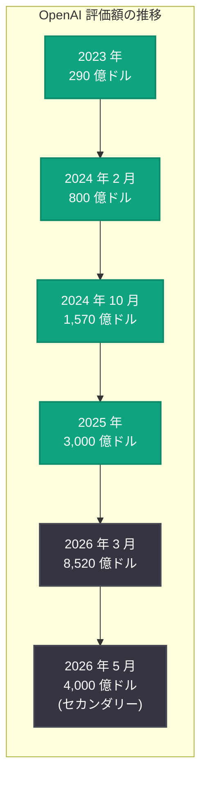

# OpenAI 社員向け株式売却プログラム: 1 人最大 3,000 万ドル、評価額 4,000 億ドルに到達

## メタデータ

| 項目 | 内容 |
|------|------|
| 発表日 | 2026-05-11 |
| ソース | 外部報道 (The Economic Times, Financial Times 等) |
| カテゴリ | コーポレート・財務 |
| 公式リンク | [OpenAI Share Sale Coverage](https://news.google.com/search?q=OpenAI+share+sale+400+billion) |

## 概要

OpenAI が従業員向けの大規模な株式売却プログラム (テンダーオファー) を実施し、社員 1 人あたり最大 3,000 万ドル (約 45 億円) の持株売却を認めることが 2026 年 5 月 11 日に報じられた。本プログラムにおける OpenAI の企業評価額は 4,000 億ドル (約 60 兆円) に設定されており、AI 業界の歴史においても前例のない規模のセカンダリー取引となる。

この評価額は、2026 年 3 月 31 日に完了した 1,220 億ドルの資金調達ラウンド時に設定された 8,520 億ドルのプライマリー評価額とは異なる水準であるが、テンダーオファーにおけるセカンダリー市場での売却価格として 4,000 億ドルが提示されたことは、OpenAI が非公開企業として世界最大級の企業価値を有していることを改めて示すものである。従業員にとっては、IPO を待たずに保有株式の一部を現金化できる極めて魅力的な流動性イベントとなる。

## 主な内容

### 株式売却プログラムの詳細

今回のテンダーオファーは、OpenAI が急成長期に入社した従業員に対して流動性を提供するためのプログラムである。

- **売却上限:** 1 人あたり最大 3,000 万ドル (約 45 億円) まで保有株式を売却可能
- **評価額基準:** 1 株あたりの売却価格は企業評価額 4,000 億ドルに基づいて算出
- **対象者:** OpenAI の現従業員および一部の元従業員が対象と見られる
- **購入者:** 外部の機関投資家やセカンダリーファンドが株式の買い手となる
- **制限事項:** 保有株式の全量売却は認められず、一定割合の保持が条件とされる可能性がある

テンダーオファーにおける 3,000 万ドルという売却上限は、スタートアップの従業員向け流動性プログラムとしては異例の高額である。これは OpenAI の初期従業員が保有するストックオプションや RSU の価値が、同社の急激な企業価値成長に伴い極めて大きくなっていることを反映している。

### 評価額 4,000 億ドルの意義

OpenAI の企業評価額は過去数年間で指数関数的な成長を遂げてきた。今回のテンダーオファーにおける 4,000 億ドルの評価額は、セカンダリー市場における実勢価格を反映したものである。

| 時期 | 評価額 | イベント |
|------|--------|----------|
| 2023 年初頭 | 約 290 億ドル | テンダーオファー |
| 2024 年 2 月 | 約 800 億ドル | セカンダリー取引 |
| 2024 年 10 月 | 約 1,570 億ドル | シリーズ資金調達 |
| 2025 年前半 | 約 3,000 億ドル | 大型資金調達ラウンド |
| 2026 年 3 月 | 8,520 億ドル | 1,220 億ドル調達完了 |
| 2026 年 5 月 | 4,000 億ドル | 従業員向けテンダーオファー (セカンダリー) |

注目すべきは、今回のテンダーオファーの評価額 (4,000 億ドル) が直近のプライマリーラウンド評価額 (8,520 億ドル) を大幅に下回っている点である。これはセカンダリー市場特有のディスカウントであり、以下の要因が考えられる。

- **流動性ディスカウント:** 非公開企業の株式は公開市場の株式に比べて流動性が低いため、一定のディスカウントが適用される
- **ロックアップ条件:** 購入者に対する売却制限が付与されている可能性
- **プライマリーとセカンダリーの性質の違い:** プライマリーラウンドでは優先権や保証条項が付帯するが、セカンダリーでは普通株ベースの取引となる
- **市場の調整:** AI セクター全体のバリュエーション見直しの影響

### DeployCo への PE 投資との関連

2026 年 5 月 3 日に報じられた OpenAI 子会社 DeployCo への 40 億ドルの PE 投資と、今回の従業員向け株式売却プログラムは、OpenAI グループ全体の資本戦略の一環として位置づけられる。

- **DeployCo 40 億ドル調達:** エンタープライズデプロイメント事業を独立子会社化し、PE ファームから 40 億ドルを調達。事業セグメントの明確化と収益基盤の強化を狙う
- **従業員流動性の確保:** テンダーオファーにより従業員のモチベーション維持と人材リテンションを強化。IPO 前の流動性提供は人材獲得競争においても重要な差別化要因
- **IPO 準備の加速:** 複数の資本市場施策を並行して実行することで、IPO に向けた企業体制の整備が着実に進んでいることを示す

## 企業価値の推移

OpenAI の企業価値は、設立から現在まで驚異的な成長曲線を描いている。

### 成長の背景

OpenAI の急激な企業価値成長を支える主要因は以下の通りである。

1. **ChatGPT の爆発的普及:** 2022 年末のリリース以降、ユーザー数は数億人規模に拡大し、消費者向け AI アプリケーションの代名詞となった
2. **エンタープライズ収益の急成長:** ChatGPT Enterprise、API プラットフォーム、Codex 等の法人向けサービスが急速に収益を拡大
3. **モデル性能の継続的進化:** GPT-4、GPT-4o、GPT-5 シリーズ、GPT-5.5 と世代を重ねるごとに性能が飛躍的に向上
4. **プラットフォーム戦略の拡大:** AWS、Azure、Databricks 等のマルチクラウドプラットフォームへの展開により市場アクセスを拡大
5. **大型資金調達の成功:** 2026 年 3 月の 1,220 億ドル調達は史上最大級であり、成長に必要な資本を確保

## 開発者への影響

### API 価格と投資への影響

OpenAI の大規模な資金調達と高い評価額は、開発者にとって以下のような影響をもたらす可能性がある。

- **API 価格の安定性:** 潤沢な資金により、コンピュートコストの増大を直ちに API 価格に転嫁する圧力が軽減される。開発者は当面、予測可能なコスト構造で開発を進められる
- **インフラ投資の継続:** 大規模資金により Stargate プロジェクト等のコンピュートインフラへの投資が継続され、API のスループットやレイテンシの改善が見込まれる
- **新機能の開発加速:** 資金余力により、Agents SDK、Codex、Voice API 等の開発者向けツールへの投資が維持・強化される

### 人材リテンションとエコシステムの安定

テンダーオファーによる従業員の流動性確保は、OpenAI のエンジニアリングチームの安定性に直結する。

- **優秀な人材の維持:** AI 人材の争奪戦が激化する中、従業員が IPO を待たずに報酬を実現できることは、他社への転職インセンティブを低減する
- **開発ロードマップの安定:** コアエンジニアの離職リスクが軽減されることで、API や開発者ツールのロードマップが安定的に実行される
- **エコシステムの信頼性:** 開発者は OpenAI プラットフォームへの長期的なコミットメントを行いやすくなる

### IPO に向けた展望

OpenAI の IPO が実現した場合、開発者やパートナー企業にとっても重要な転換点となる。

- **透明性の向上:** 上場企業として四半期ごとの業績開示が義務化され、プラットフォームの成長状況や財務健全性が可視化される
- **ガバナンスの強化:** 公開市場の規律により、API の価格変更や利用規約の変更がより予測可能になる可能性がある
- **長期的な成長コミットメント:** 株主に対する成長責任が明確化されることで、開発者向けプラットフォームへの継続投資が担保される

## 関連リンク

- [The Economic Times: OpenAI Employee Share Sale](https://economictimes.indiatimes.com)
- [Financial Times: OpenAI Valuation](https://www.ft.com)
- [OpenAI 公式サイト](https://openai.com)
- [OpenAI API プラットフォーム](https://platform.openai.com)

### 関連レポート

- [OpenAI の子会社 DeployCo が 40 億ドルの PE 資金調達](2026-05-03-openai-deployco-4b-pe-funding.md) -- PE ファームとの資本関係の進展
- [OpenAI、1,220 億ドルの大型資金調達を発表](2026-03-31-accelerating-the-next-phase-ai.md) -- 史上最大の資金調達ラウンド
- [OpenAI PE 向け 17.5% リターン保証](2026-03-23-openai-pe-pitch-175-return.md) -- PE ファームとの関係構築
- [ARK ETF による OpenAI プレ IPO 投資](2026-04-06-openai-ark-etf-pre-ipo.md) -- セカンダリー市場での動き
- [Microsoft と OpenAI のパートナーシップ修正](2026-04-27-microsoft-openai-partnership-amendment.md) -- 戦略的パートナーシップの進化

## まとめ

OpenAI が従業員向け株式売却プログラムにおいて 1 人あたり最大 3,000 万ドルの売却を認め、評価額 4,000 億ドルでのテンダーオファーを実施することは、以下の 3 点で重要な意味を持つ。

1. **従業員への報酬実現:** 急成長期に OpenAI に参画した従業員が、IPO を待たずに保有株式の一部を現金化できることで、人材リテンションと組織の安定性が強化される。AI 人材市場が過熱する中、この流動性提供は競合他社との人材獲得競争において決定的な優位性となる

2. **企業価値の市場検証:** セカンダリー市場での 4,000 億ドル評価は、プライマリーラウンドの 8,520 億ドルとは異なる水準であるものの、外部の機関投資家が実際に購入する価格として市場の実勢を反映している。非公開企業としてこの規模のテンダーオファーが成立すること自体が、OpenAI の事業基盤の強固さを証明している

3. **IPO への布石:** テンダーオファーは従業員の売却欲求を事前に吸収し、IPO 直後の大量売りを防ぐ効果もある。DeployCo への PE 投資、ARK ETF によるプレ IPO ファンド、そして今回のテンダーオファーと、OpenAI は複数の資本市場施策を段階的に実行しており、IPO に向けた準備が着実に進んでいることが見て取れる

開発者にとっては、OpenAI の財務基盤の安定と人材リテンションの強化は、プラットフォームの継続的な発展を期待できる好材料である。一方で、高い評価額に伴う成長期待が API の価格設計や事業方針にどのような影響を与えるかについては、引き続き注視が必要である。
