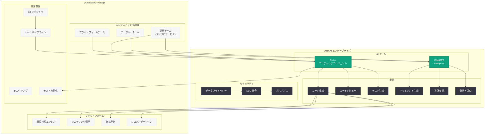
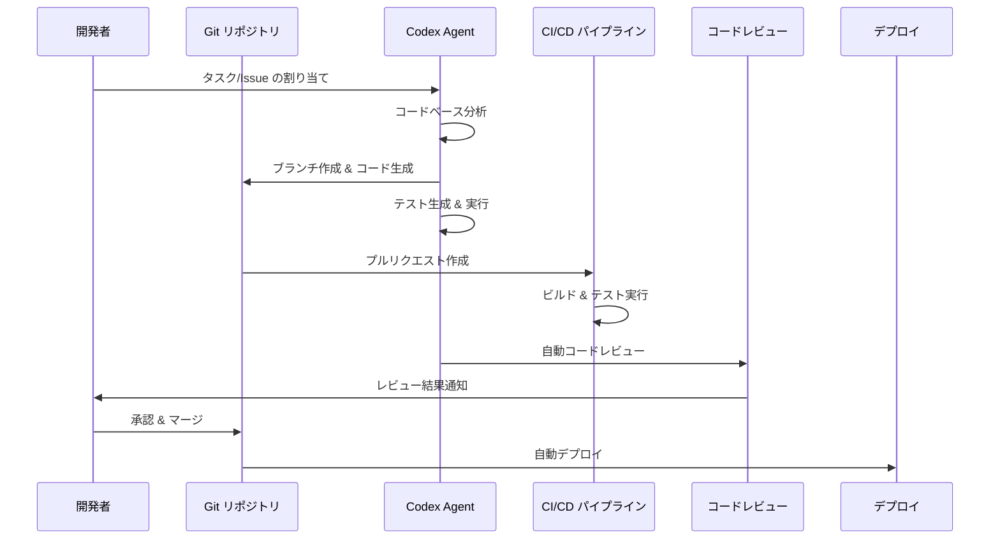

# AutoScout24 が Codex と ChatGPT で開発ワークフローを AI 駆動にスケール

## メタデータ

| 項目 | 内容 |
|------|------|
| 発表日 | 2026-05-12 |
| ソース | OpenAI News/Blog |
| カテゴリ | カスタマーストーリー / エンタープライズ |
| 公式リンク | [openai.com/index/autoscout24](https://openai.com/index/autoscout24) |

> **注記:** 本レポートは、元記事の全文取得が制限されていたため、公開されている記事の概要情報および AutoScout24 Group に関する公開情報に基づいて作成されている。正確な詳細については [公式ページ](https://openai.com/index/autoscout24) を参照されたい。

## 概要

ヨーロッパ最大のオンライン自動車マーケットプレイスである AutoScout24 が、OpenAI の Codex と ChatGPT を活用してエンジニアリングワークフローを AI 駆動にスケールさせた事例が公開された。開発サイクルの大幅な短縮、コード品質の向上、そしてエンジニアリングチーム全体への AI 導入の拡大を実現している。

AutoScout24 Group はヨーロッパの主要な自動車マーケットプレイスを複数運営しており、ドイツを拠点に 18 カ国以上でサービスを展開する大規模プラットフォーム企業である。毎月数千万人のユーザーが新車・中古車の検索や取引に利用するこのプラットフォームにおいて、AI を活用したエンジニアリングの変革は、サービスの信頼性とイノベーション速度の両立を目指す戦略的な取り組みとして注目される。本事例は、OpenAI のエンタープライズ向け AI ツールが欧州の大規模テクノロジー企業においても実用的な成果を上げていることを示す重要なケーススタディである。

## 主な内容

### AutoScout24 Group の概要

AutoScout24 Group は欧州最大級のオンライン自動車マーケットプレイスを運営する企業グループである。主要なサービスと特徴は以下の通り。

- **AutoScout24:** 欧州最大のオンライン自動車マーケットプレイス。中古車および新車の売買プラットフォーム
- **ImmoScout24:** ドイツ最大の不動産ポータルサイト (姉妹サービス)
- **展開地域:** ドイツ、イタリア、フランス、オランダ、ベルギー、オーストリアなど 18 カ国以上
- **月間利用者数:** 数千万人規模のアクティブユーザー
- **掲載台数:** 数百万台の車両リスティング
- **本社所在地:** ドイツ・ミュンヘン

AutoScout24 Group はテクノロジーカンパニーとしてのアイデンティティを持ち、大規模なエンジニアリング組織を擁している。検索アルゴリズム、レコメンデーションエンジン、価格予測モデルなど、AI/ML 技術はプロダクトの中核に位置付けられている。

### Codex によるエンジニアリングワークフローの変革

AutoScout24 のエンジニアリングチームは、OpenAI の Codex (クラウドベースのコーディングエージェント) を導入し、開発プロセス全体を AI で強化している。

#### 開発サイクルの短縮

Codex の導入により、従来の開発サイクルが大幅に短縮された。主な効果は以下の通りである。

- **コード生成の自動化:** 新機能の実装やボイラープレートコードの生成を Codex が支援し、開発者がクリエイティブな設計判断に集中できる環境を実現
- **バグ修正の迅速化:** Codex がコードベースを分析し、バグの原因特定と修正案の提示を自動化。障害対応のリードタイムを短縮
- **プロトタイピングの加速:** 新機能のプロトタイプ作成を Codex が支援し、アイデアから実装までの時間を大幅に削減

#### コード品質の向上

Codex は単なるコード生成ツールではなく、品質管理の観点でもエンジニアリングチームを支援している。

- **自動コードレビュー:** プルリクエストに対して Codex が自動的にレビューを実施し、潜在的な問題やベストプラクティスからの逸脱を検出
- **テスト生成:** ユニットテストや統合テストの自動生成により、テストカバレッジの向上を実現
- **リファクタリング支援:** 技術的負債の特定とリファクタリング案の提示を自動化し、コードベースの健全性を維持
- **セキュリティスキャン:** コードレベルのセキュリティ脆弱性を早期に検出し、安全なコードベースの維持に貢献

### ChatGPT によるナレッジワークの効率化

AutoScout24 は Codex に加えて ChatGPT (Enterprise 版) も導入し、エンジニアリング組織全体のナレッジワークを効率化している。

#### ドキュメンテーションと知識共有

- **技術ドキュメントの作成支援:** API ドキュメント、アーキテクチャ設計書、オンボーディングガイドなどの作成を ChatGPT が支援
- **コードの説明と解説:** 複雑なコードベースの理解を ChatGPT が支援し、新メンバーのオンボーディングを加速
- **多言語対応:** ヨーロッパ 18 カ国以上で展開するサービスにおける多言語ドキュメントの作成と翻訳

#### 設計と意思決定の支援

- **アーキテクチャ設計の壁打ち:** システム設計における選択肢の比較検討やトレードオフの分析を ChatGPT と対話形式で実施
- **技術選定の調査:** 新技術やフレームワークの評価における情報収集と分析の効率化
- **障害分析:** インシデント発生時のログ分析やルートコーズ特定の支援

### AI 導入の組織的なスケール

AutoScout24 の事例で特に注目すべきは、AI ツールの導入を一部のチームに留めず、エンジニアリング組織全体にスケールさせている点である。

- **段階的な導入アプローチ:** パイロットチームでの検証を経て、全エンジニアリングチームへの展開を実施
- **内部チャンピオンの育成:** AI ツール活用のベストプラクティスを共有するチャンピオンプログラムの運営
- **利用ガイドラインの整備:** セキュリティポリシーとの整合性を確保しながら、開発者が安心して AI ツールを活用できるガイドラインを策定
- **成果の可視化:** AI ツール導入による生産性向上を定量的に測定し、組織全体で共有

## 技術的な詳細

### AutoScout24 の技術スタック (推定)

AutoScout24 は大規模なマーケットプレイスプラットフォームを運営しており、以下のような技術スタックを基盤としていると推定される。

| レイヤー | 技術要素 |
|----------|----------|
| フロントエンド | React/Next.js、モバイルアプリ (iOS/Android) |
| バックエンド | マイクロサービスアーキテクチャ、Java/Kotlin、Go |
| データ基盤 | Apache Kafka、Spark、データレイク |
| インフラ | クラウドネイティブ (AWS/GCP)、Kubernetes |
| ML/AI | 検索ランキング、レコメンデーション、価格予測モデル |
| CI/CD | GitHub Actions、Terraform、ArgoCD |

### Codex の統合パターン

AutoScout24 のようなマイクロサービスアーキテクチャを持つ大規模システムにおける Codex の典型的な統合パターンは以下の通りである。

```python
from openai import OpenAI

client = OpenAI()

# AutoScout24 のマイクロサービス開発における Codex 活用例
# 車両検索 API のエンドポイント実装支援
response = client.chat.completions.create(
    model="codex-1",
    messages=[
        {
            "role": "system",
            "content": (
                "You are a senior software engineer at AutoScout24. "
                "Follow our coding standards: microservice architecture, "
                "RESTful API design, comprehensive error handling, "
                "and thorough test coverage. Use Kotlin with Spring Boot."
            )
        },
        {
            "role": "user",
            "content": (
                "Implement a new endpoint for the vehicle search service "
                "that supports filtering by price range, mileage, and "
                "fuel type with pagination support."
            )
        }
    ],
    temperature=0.2,
)
```

### CI/CD パイプラインとの統合

Codex をCI/CD パイプラインに統合することで、開発ワークフロー全体を自動化している。

```yaml
# GitHub Actions での Codex 統合例 (概念図)
name: AI-Powered Code Review
on:
  pull_request:
    types: [opened, synchronize]

jobs:
  codex-review:
    runs-on: ubuntu-latest
    steps:
      - uses: actions/checkout@v4
      - name: Run Codex Code Review
        uses: openai/codex-action@v1
        with:
          task: "review"
          context: "AutoScout24 coding standards"
      - name: Run Codex Test Generation
        uses: openai/codex-action@v1
        with:
          task: "generate-tests"
          coverage-target: "80%"
```

### アーキテクチャ



### 開発ワークフローにおける Codex の活用フロー



## 開発者への影響

AutoScout24 の事例は、ヨーロッパの大規模マーケットプレイス企業における AI 駆動エンジニアリングの実践モデルとして、以下の重要な示唆を提供する。

- **マーケットプレイス企業での AI エンジニアリング:** 数百万台の車両リスティングと数千万人のユーザーを抱える大規模マーケットプレイスにおいて、Codex と ChatGPT が実用的な開発効率化ツールとして機能することが実証された。検索、レコメンデーション、価格予測など、データ密集型のサービスを支えるエンジニアリングチームでの活用は、同様のプラットフォーム企業にとって参考となる

- **欧州エンタープライズ市場での OpenAI 浸透:** AutoScout24 はドイツを拠点に 18 カ国以上で展開する欧州の主要テクノロジー企業である。この導入は、OpenAI のエンタープライズ向けプロダクトが米国やアジア太平洋地域だけでなく、欧州市場でも着実に浸透していることを示す。GDPR をはじめとする欧州の厳格なデータ保護規制の下でも、ChatGPT Enterprise と Codex が採用された点は注目に値する

- **マイクロサービスアーキテクチャとの親和性:** 大規模マーケットプレイスに典型的なマイクロサービスアーキテクチャにおいて、Codex はサービス間のインタフェース設計、個々のサービスの実装、テスト生成など、多様なタスクを支援できる。サービス数が多いほど Codex の効率化効果は大きくなると考えられる

- **多言語・多国籍チームでの活用:** 18 カ国以上で事業を展開する AutoScout24 のエンジニアリングチームは国際的な構成であり、ChatGPT の多言語対応能力がドキュメンテーションやコミュニケーションの効率化に寄与していると推測される。グローバルな開発チームを持つ企業にとって示唆的な事例である

- **開発サイクル短縮の競争優位性:** オンライン自動車マーケットプレイスは競争が激しい市場であり、新機能の迅速なリリースが競争優位の源泉となる。Codex による開発サイクルの短縮は、直接的にビジネスの競争力強化につながる

- **AI 導入の組織的スケール手法:** 一部のチームに留まらず、エンジニアリング組織全体に AI ツールを展開する手法 (段階的導入、チャンピオンプログラム、ガイドライン整備) は、同様の規模の企業が AI 導入を計画する際の実践的な参考モデルとなる

## 関連リンク

- [AutoScout24 scales engineering with AI-powered workflows (公式)](https://openai.com/index/autoscout24)
- [AutoScout24 公式サイト](https://www.autoscout24.com)
- [関連レポート: Rakuten が Codex で問題修復速度を 2 倍に向上](2026-03-11-rakuten-codex.md)
- [関連レポート: CyberAgent が ChatGPT Enterprise と Codex で AI 活用を加速](2026-04-09-cyberagent-chatgpt-enterprise-codex.md)
- [関連レポート: NVIDIA のエンジニアが Codex を活用](2026-05-12-nvidia-engineers-codex.md)
- [OpenAI Codex](https://openai.com/codex)
- [ChatGPT Enterprise](https://openai.com/chatgpt/enterprise)
- [OpenAI API ドキュメント](https://platform.openai.com/docs)

## まとめ

ヨーロッパ最大のオンライン自動車マーケットプレイスである AutoScout24 が、OpenAI の Codex と ChatGPT Enterprise を導入し、エンジニアリングワークフロー全体を AI 駆動にスケールさせた事例が公開された。開発サイクルの短縮、コード品質の向上、そして組織全体への AI 導入の拡大という 3 つの柱を中心に、大規模マーケットプレイスプラットフォームのエンジニアリングを変革している。

18 カ国以上で展開し、数千万人のユーザーを抱える AutoScout24 の事例は、欧州のエンタープライズ市場における OpenAI プロダクトの実用性を実証するものである。GDPR 環境下での導入成功は、データ保護に対する懸念を持つ欧州企業にとって重要な先行事例となる。Codex による自動コードレビュー、テスト生成、バグ修正の迅速化と、ChatGPT Enterprise によるナレッジワークの効率化を組み合わせることで、エンジニアリング組織の生産性を包括的に向上させるモデルを構築している。

Rakuten、CyberAgent に続くグローバルな大規模企業の Codex 導入事例として、AI コーディングエージェントがエンタープライズ環境で実用的な価値を提供するフェーズに入ったことを改めて裏付けるケーススタディである。
