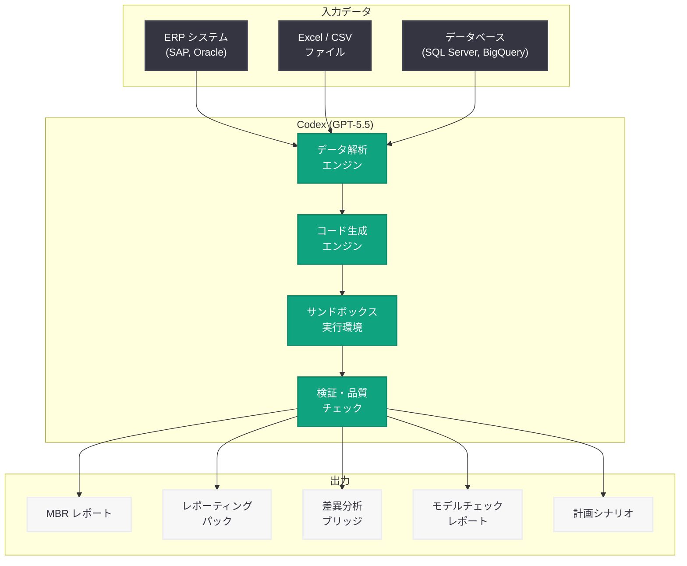

# Codex で変わる経理・財務チームの業務: OpenAI Academy ガイド

## メタデータ

| 項目 | 内容 |
|------|------|
| 発表日 | 2026-05-12 |
| ソース | OpenAI Academy |
| カテゴリ | Codex / 企業活用 |
| 公式リンク | [How finance teams use Codex](https://openai.com/academy/how-finance-teams-use-codex) |

## 概要

OpenAI は 2026 年 5 月 12 日、OpenAI Academy にて「How finance teams use Codex」と題する実践ガイドを公開した。本ガイドは、OpenAI のクラウドベース AI コーディングエージェントである Codex を活用し、経理・財務チームが日常業務を大幅に効率化する方法を具体的に解説するものである。

Codex は現在 GPT-5.5 を基盤モデルとして採用しており、自然言語の指示からコードを自動生成・実行する能力を持つ。本ガイドでは、MBR (Monthly Business Review: 月次経営レビュー)、レポーティングパック、差異分析ブリッジ、財務モデルチェック、計画シナリオの 5 つの主要ユースケースについて、実際の業務入力データを用いた活用方法が示されている。従来は手作業で数時間から数日を要していたこれらのタスクが、Codex により数分で完了可能になることが示されている。

## 主な内容

### MBR (月次経営レビュー) の自動作成

Monthly Business Review は、企業の月次パフォーマンスを経営陣に報告するための重要な文書である。従来、財務チームは以下の作業を手動で行っていた。

- ERP システムからのデータ抽出
- Excel や Google Sheets での集計・加工
- PowerPoint や Google Slides でのプレゼンテーション作成
- 前月比・前年比の計算とコメント記述

Codex を活用することで、これらの一連のプロセスを自動化できる。具体的には、CSV や Excel 形式の生データを Codex に渡し、「月次経営レビュー資料を作成せよ」と指示するだけで、以下が自動生成される。

- 売上高、営業利益、EBITDA 等の KPI サマリー
- 前月比・前年比の変動率と要因分析
- グラフ・チャートを含むビジュアルレポート
- 経営陣向けのエグゼクティブサマリー

### レポーティングパックの生成

レポーティングパックは、投資家、取締役会、規制当局向けに定期的に作成される財務報告書パッケージである。Codex は以下の作業を自動化する。

- **損益計算書 (P&L)** の自動フォーマット
- **貸借対照表 (B/S)** の構造化
- **キャッシュフロー計算書** の作成
- 各種財務比率 (流動比率、自己資本比率、ROE 等) の計算
- 前期比較テーブルの自動生成

Codex はデータの整合性チェックも同時に行い、貸借が一致しない場合やキャッシュフローの計算に矛盾がある場合には警告を出力する。

### 差異分析ブリッジ (Variance Bridge) の構築

差異分析ブリッジは、予算 (Plan) と実績 (Actual) の差異を要因別に分解し、ウォーターフォールチャートとして可視化するツールである。Codex を使用した差異分析のワークフローは以下のとおりである。

1. **データ入力**: 予算データと実績データを Codex に提供
2. **差異計算**: Codex が自動的に各項目の差異を計算
3. **要因分解**: 売上数量差異、価格差異、コスト差異、為替差異等に分解
4. **可視化**: ウォーターフォールチャートとして自動描画
5. **コメント生成**: 各差異項目に対する説明文を自動生成

これにより、FP&A (Financial Planning & Analysis) チームは分析結果の解釈と意思決定支援に集中できるようになる。

### 財務モデルチェック

財務モデルは複雑な Excel スプレッドシートで構築されることが多く、数式エラーやロジックの不整合が見落とされやすい。Codex による自動モデルチェックでは以下を検証する。

- **循環参照の検出**: 意図しない循環参照を特定
- **ハードコード値の検出**: 数式中に埋め込まれた固定値を特定し、入力セルへの参照を推奨
- **単位の整合性**: 千円単位と百万円単位の混在を検出
- **時系列の連続性**: 期間の欠落や重複を検出
- **感度分析**: 主要パラメータの変動が最終結果に与える影響度を評価
- **数式の論理チェック**: 合計値と内訳の不一致を検出

### 計画シナリオの作成

財務計画において、複数のシナリオを作成・比較することは意思決定の質を向上させる。Codex は以下のシナリオ作成を支援する。

- **ベースケース**: 現在のトレンドが継続した場合の予測
- **アップサイドケース**: 売上成長率の上振れ、コスト削減の成功を仮定
- **ダウンサイドケース**: 景気後退、為替変動、供給制約を仮定
- **ストレステスト**: 極端な条件下でのキャッシュフロー耐久性を検証

各シナリオについて、3 年から 5 年の財務三表 (P&L、B/S、CF) を自動生成し、主要 KPI の推移を比較するダッシュボードを出力する。

## 技術的な詳細

### Codex のアーキテクチャと財務ワークフローの統合

Codex はクラウド上のサンドボックス環境でコードを生成・実行するエージェントであり、以下のアーキテクチャで財務ワークフローと統合される。



### コードサンプル: Codex API を使用した差異分析の自動化

以下は、Codex API を使用して予算と実績の差異分析ブリッジを自動生成する Python コードの例である。

```python
from openai import OpenAI
import json

client = OpenAI()

# 財務データの準備
budget_data = """
部門,予算売上(百万円),実績売上(百万円),予算コスト(百万円),実績コスト(百万円)
営業部門,500,520,300,310
マーケティング,200,180,150,145
プロダクト,100,110,80,85
カスタマーサクセス,80,75,60,58
"""

# Codex にタスクを送信
response = client.responses.create(
    model="codex",
    instructions="""あなたは経験豊富な FP&A アナリストです。
    提供された予算・実績データから差異分析ブリッジを作成してください。
    以下を含めてください:
    1. 各部門の売上差異と要因分析
    2. コスト差異の分解
    3. 営業利益への影響度
    4. Python の matplotlib を使用したウォーターフォールチャートのコード
    5. 経営陣向けのサマリーコメント""",
    input=f"以下の予算・実績データを分析してください:\n{budget_data}",
    tools=[
        {
            "type": "code_interpreter"
        }
    ]
)

# 結果の取得
print(response.output_text)
```

### コードサンプル: 月次レポート自動生成パイプライン

```python
from openai import OpenAI
import pandas as pd
from pathlib import Path

client = OpenAI()


def generate_monthly_report(data_path: str, month: str) -> str:
    """Codex を使用して月次経営レビューを自動生成する"""

    # データの読み込み
    df = pd.read_csv(data_path)

    # Codex にレポート生成を依頼
    response = client.responses.create(
        model="codex",
        instructions="""あなたは CFO 直属の財務アナリストです。
        提供されたデータから月次経営レビュー (MBR) を作成してください。

        レポートには以下を含めること:
        - エグゼクティブサマリー (3 行以内)
        - KPI ダッシュボード (売上、営業利益、EBITDA、FCF)
        - 前月比・前年比の変動分析
        - 部門別パフォーマンス
        - リスクと機会の識別
        - 次月のアクションアイテム

        出力形式: Markdown""",
        input=f"対象月: {month}\nデータ:\n{df.to_string()}",
        tools=[
            {
                "type": "code_interpreter"
            }
        ]
    )

    return response.output_text


def run_model_check(model_path: str) -> dict:
    """財務モデルの品質チェックを実行する"""

    response = client.responses.create(
        model="codex",
        instructions="""財務モデルの品質チェックを実行してください。
        以下の項目を検証し、JSON 形式で結果を返してください:
        - circular_references: 循環参照のリスト
        - hardcoded_values: ハードコードされた値のリスト
        - unit_mismatches: 単位不整合のリスト
        - missing_periods: 欠落期間のリスト
        - formula_errors: 数式エラーのリスト
        - risk_score: 総合リスクスコア (0-100)""",
        input=f"モデルファイル: {model_path}",
        tools=[
            {
                "type": "code_interpreter"
            }
        ]
    )

    return json.loads(response.output_text)


# 使用例
if __name__ == "__main__":
    # 月次レポートの生成
    report = generate_monthly_report(
        data_path="financial_data_202605.csv",
        month="2026年5月"
    )
    Path("output/mbr_202605.md").write_text(report)

    # モデルチェックの実行
    check_result = run_model_check("financial_model_fy2026.xlsx")
    print(f"リスクスコア: {check_result['risk_score']}/100")
```

### API パラメータの詳細

| パラメータ | 説明 | 推奨値 |
|-----------|------|--------|
| `model` | 使用するモデル | `codex` |
| `instructions` | タスクの詳細指示 | 財務ドメイン固有の指示を含める |
| `tools` | 使用するツール | `code_interpreter` を必須で含める |
| `input` | 入力データ | CSV、JSON、またはテキスト形式の財務データ |

## 開発者への影響

- **財務 SaaS 開発者**: Codex API を統合することで、自社プロダクトに AI による財務分析機能を組み込める。レポート自動生成やモデル検証機能をエンドユーザーに提供可能
- **社内ツール開発者**: 経理・財務部門向けの社内自動化ツールに Codex を組み込むことで、手作業の大幅削減が実現可能。特に月次決算後のレポーティング工数を削減できる
- **データエンジニア**: ERP やデータウェアハウスから Codex へのデータパイプラインを構築する需要が増加。データ品質の確保がより重要になる
- **FP&A チーム**: コーディング経験がなくても、自然言語で財務分析を指示できるようになる。分析の民主化が進み、より多くのメンバーが高度な分析を実行可能に
- **コンプライアンス担当**: Codex が生成した財務レポートの正確性を検証する新しいワークフローの設計が必要。AI 出力に対する承認プロセスの整備が求められる

## 関連リンク

- [OpenAI Academy - How finance teams use Codex](https://openai.com/academy/how-finance-teams-use-codex)
- [OpenAI Codex 公式ドキュメント](https://platform.openai.com/docs/guides/codex)
- [OpenAI API リファレンス](https://platform.openai.com/docs/api-reference)
- [OpenAI Academy トップページ](https://openai.com/academy)
- [Codex セキュリティリサーチプレビュー](https://openai.com/index/codex-security-research-preview)

## まとめ

OpenAI Academy の本ガイドは、Codex が単なるコード生成ツールではなく、財務業務全体を変革するエージェントとして活用できることを実証している。MBR 作成、レポーティングパック生成、差異分析ブリッジ構築、財務モデルチェック、計画シナリオ作成という 5 つの主要ユースケースを通じて、従来は数時間から数日を要していた作業が数分に短縮される可能性が示された。

GPT-5.5 を基盤とする Codex は、財務データの理解と処理において高い精度を発揮し、自然言語での指示だけで複雑な財務分析を実行できる。開発者にとっては、Codex API を自社プロダクトや社内ツールに統合することで、新たなビジネス価値を創出する機会が広がっている。今後、財務・経理領域における AI 活用は加速し、人間のアナリストはより戦略的な意思決定支援に注力できるようになるだろう。
