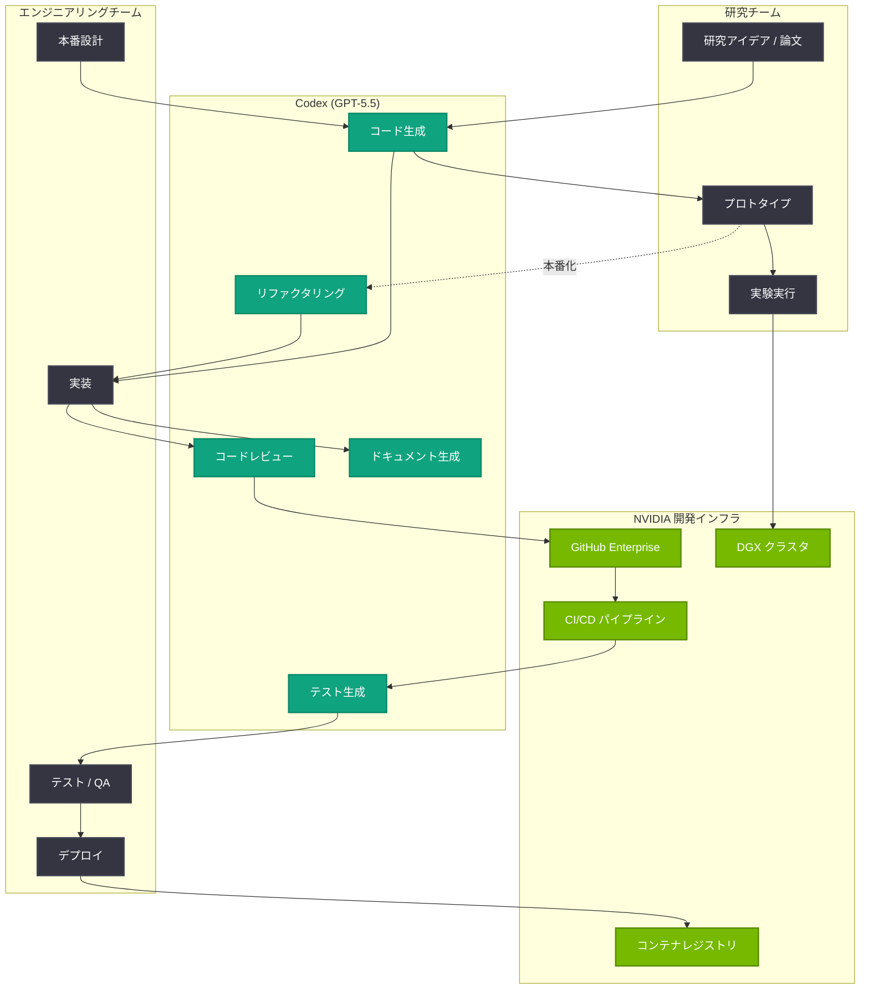

# NVIDIA エンジニアと研究者が Codex で構築する方法: GPT-5.5 による本番システム開発と研究実験の加速

## メタデータ

| 項目 | 内容 |
|------|------|
| 発表日 | 2026-05-12 |
| ソース | OpenAI News |
| カテゴリ | カスタマーストーリー / エンタープライズ |
| 公式リンク | [How NVIDIA engineers and researchers build with Codex](https://openai.com/index/nvidia) |

> **注記:** 本レポートは OpenAI の公式発表に基づいて作成されている。公式ページへの直接アクセスが制限されていたため、公式の説明文および関連する公開情報をもとに内容を構成している。正確な詳細については [公式ページ](https://openai.com/index/nvidia) を参照されたい。

## 概要

OpenAI は 2026 年 5 月 12 日、GPU / AI チップの世界的リーダーである NVIDIA が社内の開発ワークフローに Codex を導入し、GPT-5.5 を活用して本番システムの構築と研究アイデアの実験への変換を行っている事例を公開した。

本カスタマーストーリーは、AI ネイティブ企業である NVIDIA が自社の高度な AI 能力を持ちながらも OpenAI の Codex を選択したという点で、Codex のエンタープライズ価値を極めて説得力のある形で実証している。NVIDIA のエンジニアリングチームは Codex を活用して本番レベルのシステムを出荷し、研究チームは研究論文やアイデアを実行可能な実験コードに迅速に変換している。これは、最も技術的に洗練された組織においても Codex が実用的な価値を提供できることを示す重要なマイルストーンである。

## 主な内容

### NVIDIA における Codex の戦略的意義

NVIDIA は世界最大級の AI / GPU コンピューティング企業であり、自社内に CUDA、TensorRT、cuDNN など多数の高度なソフトウェアプラットフォームを開発・保守している。数千人規模のエンジニアと研究者を擁し、AI、グラフィックス、自動運転、ロボティクスなど多岐にわたる領域で最先端のソフトウェアを開発している。

このような AI ネイティブ企業が外部の AI コーディングエージェントである Codex を選択したことは、以下の観点から戦略的に重要な意味を持つ。

- **技術的信頼性の証明:** AI の専門家集団が Codex の品質を評価し、自社ワークフローに導入する価値があると判断した
- **生産性向上の実証:** 高度な技術者でも Codex の支援により追加の生産性向上が得られることを示す
- **研究と実装のギャップ解消:** 研究アイデアから実行可能コードへの変換という、多くの組織が抱える課題に対する解決策を提示

### エンジニアリングチームによる本番システム開発

NVIDIA のエンジニアリングチームは、Codex (GPT-5.5 搭載) を本番システムの開発に活用している。主な活用パターンは以下の通りである。

- **インフラストラクチャコードの生成:** 大規模分散システムのインフラストラクチャコード、デプロイメントスクリプト、設定管理の自動生成
- **API 開発の加速:** 内部マイクロサービス間の API 設計・実装において、Codex が仕様に基づいたコード生成を実行
- **テスト自動化:** 複雑なハードウェア / ソフトウェアスタックに対するテストコードの自動生成と、エッジケースの網羅
- **コードレビューとリファクタリング:** 大規模コードベースの品質維持において、Codex が改善提案やバグの早期発見を支援
- **ドキュメント生成:** 技術仕様書や API ドキュメントの自動生成と更新

### 研究チームによる実験コードへの変換

NVIDIA の研究チームは、Codex を研究プロセスの加速に活用している。研究アイデアから実行可能な実験への変換は、従来多大な時間と労力を要するプロセスであったが、Codex の導入により大幅に効率化されている。

- **論文実装の高速化:** 最新の研究論文のアルゴリズムを実行可能なコードに変換し、再現実験を迅速に実施
- **プロトタイプの迅速な構築:** 新しいアイデアの検証に必要なプロトタイプコードを短時間で生成
- **実験フレームワークの構築:** ハイパーパラメータ探索、結果の可視化、実験管理のためのフレームワークコードを自動生成
- **データパイプラインの構築:** 実験に必要なデータ前処理、拡張、読み込みのパイプラインを効率的に構築
- **ベンチマーク実装:** 比較実験に必要なベースラインモデルの実装を Codex が支援

### GPT-5.5 の活用

Codex が GPT-5.5 を搭載していることで、NVIDIA の高度な技術ワークロードに対応できる能力を実現している。

- **高度なコード理解:** CUDA カーネル、GPU プログラミング、並列計算など NVIDIA 固有の技術スタックに対する深い理解
- **長文コンテキスト:** 大規模なコードベース全体のコンテキストを保持し、一貫性のあるコード生成を実現
- **推論能力:** 複雑なアルゴリズムの設計や最適化における高度な推論を実行
- **マルチモーダル対応:** 研究論文の図表やアーキテクチャ図を理解し、対応するコードを生成

### 研究からプロダクションへのブリッジ

NVIDIA の事例における最も重要なポイントの一つは、Codex が研究プロトタイピングと本番デプロイメントの間のギャップを橋渡しする役割を果たしていることである。

- **研究コードの本番化:** 研究者が作成したプロトタイプコードを、Codex が本番品質のコードに変換
- **スケーラビリティの確保:** 単一 GPU で動作する研究コードを、マルチノード分散環境で動作する本番コードに変換
- **エラーハンドリングの追加:** 研究段階では省略されがちなエラーハンドリング、ロギング、モニタリングのコードを自動追加
- **コーディング規約の適用:** NVIDIA 社内のコーディング規約やベストプラクティスに準拠したコードへの変換

## 技術的な詳細

### NVIDIA の Codex 統合アーキテクチャ



### Codex API を活用したワークフロー自動化の例

NVIDIA のチームが Codex API を活用して研究コードを本番化するワークフローの実装例を以下に示す。

```python
import openai
from pathlib import Path


def convert_research_to_production(
    research_code_path: str,
    coding_standards_path: str,
    output_path: str,
) -> dict:
    """
    研究プロトタイプコードを本番品質のコードに変換する。

    Codex (GPT-5.5) を使用して、研究段階のコードにエラーハンドリング、
    ロギング、型アノテーション、ドキュメントを追加し、
    コーディング規約に準拠した本番コードを生成する。
    """
    client = openai.OpenAI()

    # 研究コードとコーディング規約を読み込み
    research_code = Path(research_code_path).read_text()
    coding_standards = Path(coding_standards_path).read_text()

    # Codex に本番化タスクを依頼
    response = client.chat.completions.create(
        model="gpt-5.5",
        messages=[
            {
                "role": "system",
                "content": (
                    "あなたは NVIDIA のシニアソフトウェアエンジニアです。"
                    "研究プロトタイプコードを本番品質のコードに変換してください。\n\n"
                    "以下の要件を満たすこと:\n"
                    "1. 包括的なエラーハンドリングの追加\n"
                    "2. 構造化ロギングの実装\n"
                    "3. 型アノテーションの追加\n"
                    "4. docstring とインラインコメントの追加\n"
                    "5. マルチ GPU 対応のスケーラビリティ確保\n"
                    "6. ユニットテストの生成\n\n"
                    f"コーディング規約:\n{coding_standards}"
                ),
            },
            {
                "role": "user",
                "content": (
                    f"以下の研究プロトタイプコードを本番品質に変換してください:\n\n"
                    f"```python\n{research_code}\n```"
                ),
            },
        ],
        temperature=0.2,
        max_tokens=8192,
    )

    production_code = response.choices[0].message.content

    # 生成された本番コードを保存
    output_file = Path(output_path)
    output_file.parent.mkdir(parents=True, exist_ok=True)
    output_file.write_text(production_code)

    return {
        "status": "success",
        "input_file": research_code_path,
        "output_file": output_path,
        "model": response.model,
        "tokens_used": response.usage.total_tokens,
    }


def generate_experiment_from_idea(
    research_idea: str,
    framework: str = "pytorch",
) -> str:
    """
    研究アイデアの自然言語記述から実行可能な実験コードを生成する。

    NVIDIA の研究者が新しいアイデアを迅速に検証するために使用する。
    """
    client = openai.OpenAI()

    response = client.chat.completions.create(
        model="gpt-5.5",
        messages=[
            {
                "role": "system",
                "content": (
                    "あなたは NVIDIA Research の計算科学者です。"
                    "与えられた研究アイデアを実行可能な実験コードに変換してください。\n\n"
                    "要件:\n"
                    f"- フレームワーク: {framework}\n"
                    "- NVIDIA GPU (CUDA) を最大限に活用すること\n"
                    "- 再現性を確保するためシード固定を含めること\n"
                    "- 実験結果の可視化コードを含めること\n"
                    "- ハイパーパラメータを設定ファイルから読み込む構成にすること\n"
                    "- Weights & Biases によるログ記録を含めること"
                ),
            },
            {
                "role": "user",
                "content": f"以下の研究アイデアを実装してください:\n\n{research_idea}",
            },
        ],
        temperature=0.3,
        max_tokens=8192,
    )

    return response.choices[0].message.content


def batch_code_review(
    pull_request_diff: str,
    repository_context: str,
) -> dict:
    """
    Codex を使用して PR のコードレビューを実行する。

    NVIDIA のエンジニアリングチームが大規模コードベースの
    品質維持に使用するワークフロー。
    """
    client = openai.OpenAI()

    response = client.chat.completions.create(
        model="gpt-5.5",
        messages=[
            {
                "role": "system",
                "content": (
                    "あなたは NVIDIA のコードレビュアーです。"
                    "以下の観点で PR をレビューしてください:\n\n"
                    "1. パフォーマンス: GPU 利用効率、メモリ管理\n"
                    "2. 正確性: ロジックエラー、エッジケース\n"
                    "3. セキュリティ: バッファオーバーフロー、入力検証\n"
                    "4. 保守性: コード構造、命名規則\n"
                    "5. CUDA 固有: スレッド同期、メモリコアレッシング\n\n"
                    f"リポジトリコンテキスト:\n{repository_context}"
                ),
            },
            {
                "role": "user",
                "content": f"以下の PR diff をレビューしてください:\n\n{pull_request_diff}",
            },
        ],
        temperature=0.1,
        max_tokens=4096,
    )

    review_content = response.choices[0].message.content

    return {
        "review": review_content,
        "model": response.model,
        "tokens_used": response.usage.total_tokens,
    }


# 使用例
if __name__ == "__main__":
    # 例 1: 研究アイデアから実験コードを生成
    idea = """
    Transformer のアテンション機構において、従来の softmax の代わりに
    線形アテンションを使用し、さらに CUDA カーネルレベルで
    Flash Attention と同等のメモリ効率を実現する新しい
    カーネル融合手法を検証する。
    """
    experiment_code = generate_experiment_from_idea(idea)
    print("生成された実験コード:")
    print(experiment_code)

    # 例 2: 研究コードを本番化
    result = convert_research_to_production(
        research_code_path="research/linear_attention_prototype.py",
        coding_standards_path="standards/nvidia_python_style.md",
        output_path="production/attention/linear_attention.py",
    )
    print(f"\n本番化完了: {result}")
```

### 技術スタックの統合

| コンポーネント | 技術 | Codex の役割 |
|--------------|------|-------------|
| GPU カーネル | CUDA C++ | カーネルコードのレビュー、最適化提案 |
| ML フレームワーク | PyTorch / TensorRT | モデル実装、推論最適化コード生成 |
| インフラ | Kubernetes / DGX | デプロイメント設定、スケーリング設計 |
| CI/CD | GitHub Actions | テストパイプライン、自動化スクリプト生成 |
| ドキュメント | Sphinx / Markdown | API リファレンス、技術仕様書の自動生成 |

## 開発者への影響

### AI ネイティブ企業にとっての示唆

NVIDIA の事例は、AI 技術に精通した企業であっても、外部の AI コーディングエージェントを活用することで追加の生産性向上を得られることを示している。これは以下の点で業界全体に重要な影響を与える。

- **AI ツールの普遍的価値:** AI の専門家でさえ Codex の恩恵を受けることは、あらゆる技術レベルの開発者にとって AI コーディングツールが有用であることの強力な証拠となる
- **専門性の補完:** Codex は開発者の専門性を置き換えるものではなく、補完するものであることが NVIDIA の事例から明確に読み取れる
- **研究生産性の向上:** 研究者がコーディングの詳細に時間を費やす代わりに、アイデアの創出と検証に集中できる環境が実現される

### エンタープライズ導入への影響

- **技術的信頼性のベンチマーク:** NVIDIA という世界最高水準の技術企業が Codex を採用したことは、他のエンタープライズ企業にとって導入判断の強力な後押しとなる
- **GPT-5.5 の実用性実証:** 最も要求水準の高い技術ワークロード (GPU プログラミング、分散システム、ML 研究) において GPT-5.5 が実用的な価値を提供できることが実証された
- **ROI の明確化:** 研究から本番への変換時間短縮、コードレビュー効率化など、具体的な ROI を示すユースケースが提示された

### 開発ワークフローの進化

- **研究駆動開発の加速:** 「アイデア → プロトタイプ → 実験 → 本番」のサイクルが Codex により大幅に短縮される開発パラダイムが普及する可能性がある
- **コード品質の底上げ:** AI レビューの日常化により、組織全体のコード品質が均一化される
- **知識の民主化:** 特定の専門家のみが持つドメイン知識 (CUDA 最適化など) が、Codex を通じてチーム全体に共有される

### OpenAI エコシステムへの影響

- **Codex のエンタープライズ信頼性:** NVIDIA の導入は、Codex が最もミッションクリティカルなワークロードにも対応できることの証明となる
- **GPT-5.5 のポジショニング:** 高度な技術タスクに対応できるモデルとしての GPT-5.5 の市場での位置付けが強化される
- **B2B 事例の多様化:** Singular Bank (金融)、Uber (モビリティ)、Simplex (フィンテック)、NVIDIA (半導体 / AI) と、業界横断的な事例蓄積が加速している

## 関連リンク

- [How NVIDIA engineers and researchers build with Codex](https://openai.com/index/nvidia)
- [OpenAI Codex](https://openai.com/codex)
- [OpenAI GPT-5.5](https://openai.com/index/gpt-5-5)
- [NVIDIA Developer](https://developer.nvidia.com/)
- [Simplex rethinks software development with Codex](https://openai.com/index/simplex)
- [Running Codex safely at OpenAI](https://openai.com/index/running-codex-safely)
- [OpenAI API ドキュメント](https://platform.openai.com/docs)

## まとめ

NVIDIA が OpenAI の Codex (GPT-5.5 搭載) を社内の開発ワークフローに導入した本事例は、AI コーディングエージェントの価値を最も説得力のある形で実証するものである。世界最高水準の AI / GPU テクノロジー企業が自社の AI 能力を持ちながらも Codex を選択し、本番システムの出荷と研究アイデアの実験化に活用しているという事実は、Codex の技術的成熟度とエンタープライズ対応力の高さを物語っている。

特に注目すべきは、研究プロトタイピングと本番デプロイメントの間のギャップを Codex が橋渡しする役割を果たしている点である。この「研究 → 本番」変換の自動化は、多くのテクノロジー企業が抱える構造的な課題に対する具体的な解決策を提示しており、今後のソフトウェア開発のあり方に大きな影響を与える可能性がある。

Singular Bank、Uber、Simplex に続く本事例は、OpenAI のエンタープライズ戦略が半導体 / AI 業界にまで拡大していることを示しており、Codex が業界を問わず本番レベルのワークロードに対応できるプラットフォームとして確立されつつあることの証左である。
