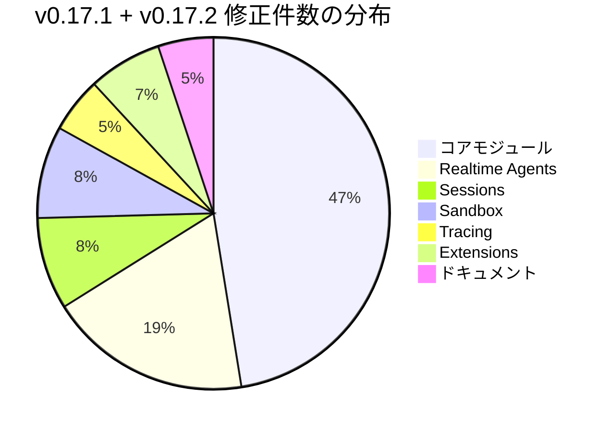

# OpenAI Agents SDK v0.17.1 / v0.17.2: v0.17.0 後の大規模安定化リリース

## メタデータ

| 項目 | 内容 |
|------|------|
| 発表日 | 2026-05-11 / 2026-05-12 |
| ソース | OpenAI API Changelog (GitHub) |
| カテゴリ | SDK アップデート |
| 公式リンク | [v0.17.2](https://github.com/openai/openai-agents-python/releases/tag/v0.17.2) / [v0.17.1](https://github.com/openai/openai-agents-python/releases/tag/v0.17.1) |

## 概要

OpenAI は 2026 年 5 月 11 日と 12 日に、Python 向け Agents SDK の v0.17.1 および v0.17.2 を連続してリリースした。これらは 5 月 8 日にリリースされた v0.17.0 (デフォルトモデルの gpt-5.4-mini 変更、RealtimeAgent デフォルトの gpt-realtime-2 変更、Sandbox セキュリティ強化) の後に発見された多数の不具合を修正する安定化リリースである。v0.17.1 は Sandbox、Tracing、Sessions、Realtime Agents、コアモジュール、Extensions の 6 つのサブシステムにまたがる 50 件以上のバグ修正を含む大規模パッチであり、v0.17.2 はその翌日にさらに 6 件の追加修正を行ったフォローアップリリースとなっている。

これらのリリースは新機能の追加ではなく、既存機能の信頼性と堅牢性の向上に焦点を当てたものである。Realtime Agents におけるオーディオ処理の安定性向上、セッション管理における破損データのハンドリング改善、トレーシングのシャットダウン時の安全性確保、ハンドオフ処理時のデータ保持など、プロダクション環境でのエージェント運用において重要な修正が多数含まれている。v0.17.0 の大きな変更後に発見されたリグレッションへの迅速な対応として、SDK の成熟度を示すリリースである。

## 主な内容

### v0.17.1 の主要な修正

#### Sandbox 関連

v0.17.0 で導入された Sandbox セキュリティ強化に伴い、いくつかの問題が発見され修正された。

- **Sandbox プロバイダーエラー詳細の表示:** Sandbox プロバイダーが返すエラーの詳細情報が正しく伝達されるようになった。従来はエラーメッセージが省略され、デバッグが困難だった問題が解消されている
- **アーカイブ抽出の制限 (#3274):** Sandbox アーカイブの抽出時にサイズ制限が適用されるようになった。悪意のあるアーカイブによるディスク枯渇攻撃を防止するセキュリティ修正である
- **Git リポジトリサブパスの検証 (#3273):** `GitRepo` のサブパス指定に対する検証が追加された。パストラバーサルを防止し、リポジトリ外のファイルアクセスを制限する
- **空の GitRepo サブパス許可:** リポジトリルートを指すための空文字列サブパスが正しく処理されるようになった
- **GitRepo ルートサブパスエイリアスの保持:** `.` や空文字列などルートを示す複数の表記が一貫して処理されるようになった

#### Tracing 関連

トレーシングサブシステムのシャットダウン時やエラー時の堅牢性が強化された。

- **シャットダウン時のベストエフォートトレーシング:** プロセス終了時にトレーシングのシャットダウンがベストエフォートで行われるようになった。シャットダウン中の例外がプロセス終了を妨げなくなっている
- **BatchTraceProcessor ワーカーの生存維持:** エクスポーターのエラーが発生しても `BatchTraceProcessor` のワーカースレッドが停止しなくなった。一時的なエクスポートエラーからの自動復旧が可能になっている
- **No-op トレーシングスパン ID のガード:** トレーシングが無効化されている場合のスパン ID アクセスにおけるガード処理が追加された

#### Sessions 関連

セッション管理における破損データの処理とメタデータ管理が改善された。

- **hosted tool ID の保持 (#3267):** OpenAI 会話セッションにおいて、必須のホスト型ツール ID が正しく保持されるようになった。セッション復元時にツール参照が失われる問題が修正されている
- **破損アイテムのスキップ (#3304):** `pop` 操作時に破損したアイテムが検出された場合、エラーを投げる代わりにスキップするようになった。セッションの継続利用が可能になっている
- **MongoDB メタデータタイムスタンプの追跡 (#3306):** MongoDB セッションバックエンドにおけるメタデータのタイムスタンプ管理が修正された
- **Redis セッションの created_at 保持:** Redis セッションバックエンドで書き込み時に `created_at` タイムスタンプが上書きされる問題が修正された
- **MongoDBSession.pop_item の破損ドキュメントスキップ:** MongoDB セッションの `pop_item` でも同様に破損ドキュメントをスキップする処理が追加された

#### Realtime Agents 関連

リアルタイムエージェントに関しては最も多くの修正が行われ、音声処理からツール承認、セッション設定まで広範囲にわたる改善が実施された。

- **ツール承認のスコープ分離 (#3333):** Realtime ツール承認が修飾キーでスコープ化されるようになった。複数のリアルタイムエージェントが同時に動作する場合のツール承認の混同が解消されている
- **未知のツール呼び出しへの出力送信 (#3286):** 不明なツール呼び出しに対してリアルタイム出力が正しく送信されるようになった
- **イベントイテレーターのクローズ通知 (#3284):** リアルタイムイベントイテレーターが接続クローズ時に正しく起動される問題が修正された
- **トランスクリプトの保持:** 既存のトランスクリプトが古いデルタアキュムレーターによって上書きされなくなった
- **max_output_tokens の公開:** `RealtimeSessionModelSettings` に `max_output_tokens` が公開された
- **RealtimeAgent フィールドの検証:** `__post_init__` でのフィールド検証が追加され、不正な設定を早期に検出できるようになった
- **無効な input_text パーツのスキップ:** ユーザー入力変換時に無効な `input_text` パーツがスキップされる
- **input_type なしの on_handoff エラー:** `input_type` が指定されているが `on_handoff` がない場合に `UserError` が発行される
- **output_audio コンテンツパーツの保持:** `output_item` イベントにおけるオーディオコンテンツパーツが正しく保持される
- **None audio.input/audio.output の処理:** `None` 値のオーディオ入出力が「未設定」として正しく扱われる
- **AudioInput.to_base64() のバッファ変更防止:** `to_base64()` 呼び出しが呼び出し元のバッファを変更しないよう修正された。音声エージェントにおける予期しないデータ破損が防止されている

#### コアモジュール関連

SDK のコアモジュールにおいて、バリデーション強化、ハンドオフ処理の改善、ストリーミング安定性の向上など多数の修正が行われた。

- **Chat Completions レスポンス機能検証のオプトイン化:** レスポンス機能のバリデーションがオプトインに変更された。既存コードとの互換性が維持されている
- **サーバー状態の拒否 (#3275):** Chat Completions でのサーバー状態の不正な使用が適切に拒否される
- **再利用可能プロンプトの拒否 (#3282):** サポートされていない再利用可能プロンプトが明示的に拒否される
- **マルチチョイスストリームの厳密バリデーション (#3313):** 複数選択肢ストリームが厳密なバリデーションに準拠するよう修正された
- **カスタムツール呼び出しの拒否 (#3308):** Chat Completions での不正なカスタムツール呼び出しが明示的に拒否される
- **リトライバックオフ設定の検証 (#3270):** モデルリトライのバックオフ設定値が検証されるようになった
- **ネストされたハンドオフ履歴の保持 (#3319):** ネストされたハンドオフ時にコンテンツ履歴が正しく保持されるようになった
- **ストリーミングガードレールの例外クリーンアップ (#3280):** ストリーミングガードレールでの例外処理が改善された
- **RunState ガードレールペイロードの正規化 (#3288):** ガードレールペイロードが `RunState` で正しく正規化されるようになった
- **汎用 dict 出力スキーマの整合 (#3315):** 汎用的な辞書型の出力スキーマが正しく整合されるようになった
- **空の strict スキーマ (#3317):** 新しい空の strict スキーマが毎回新規生成されるようになった
- **handoff() の assertion 置換 (#781):** `handoff()` 関数内の assertion が `UserError` に置き換えられ、本番環境での適切なエラーハンドリングが可能になった
- **apply_patch の失敗ステータス保持:** `apply_patch` 操作時の失敗ステータスが正しく保持されるようになった
- **Usage.add の request_usage_entries 保持:** 既存の `request_usage_entries` が `Usage.add` で上書きされなくなった
- **出力ガードレールタスクの await:** キャンセルされた出力ガードレールタスクがトリップワイヤー時に適切に await される
- **output_tokens_details の永続化:** 入力詳細が `None` の場合でも `output_tokens_details` が正しく永続化される
- **孤立した reasoning items の削除:** ドロップされたツール呼び出しによって孤立した reasoning items が適切に削除される
- **CompactionItem のサイレントスキップ:** ストリームキューヘルパーにおいて `CompactionItem` がサイレントにスキップされる
- **非同期 on_handoff の await:** `async __call__` を持つ `on_handoff` コーラブルが適切に await されるようになった
- **ハンドオフ間のツールガードレール結果保持:** `SingleStepResult` でハンドオフ間のツールガードレール結果が保持される
- **response_id の保持:** 会話再開時に最後の既知の `response_id` が保持される
- **MCP strict スキーマ変換の分離:** MCP の strict スキーマ変換が non-strict フォールバックから分離された
- **Computer インスタンスのプロバイダーダックタイピング除外:** `Computer` インスタンスがプロバイダーのダックタイピングから除外された
- **needs_approval_checker のスキップ:** ステータスが既に解決済みの場合、`needs_approval_checker` がスキップされるようになった
- **MCPToolCancellationError のエクスポート:** `MCPToolCancellationError` がトップレベルパッケージからエクスポートされるようになった
- **チェーン $ref のシブリングキー展開保持:** JSON Schema の `$ref` チェーン時にシブリングキーが正しく展開されるようになった

#### Extensions 関連

サードパーティ LLM 統合の拡張機能における修正が行われた。

- **並列ツール呼び出し分割時のコンテンツ重複防止 (any-llm):** `any-llm` 拡張で並列ツール呼び出しを分割する際に、コンテンツブロックと署名付き思考ブロックが重複して出力される問題が修正された
- **並列ツール呼び出し分割時のコンテンツ重複防止 (litellm):** `litellm` 拡張でも同様の重複問題が修正された
- **文字列ツールトリマー許可リストの処理 (#3330):** ツールトリマーの許可リストが文字列として渡された場合の処理が修正された
- **HandoffInputData.input_items の保持:** `remove_all_tools` 呼び出し時に `HandoffInputData.input_items` が保持されるようになった

### v0.17.2 の修正内容

v0.17.1 リリースの翌日に公開された v0.17.2 では、さらに 6 件のバグ修正と 3 件のドキュメント改善が含まれている。

#### バグ修正

- **OpenAI Conversations reasoning 永続化の修正 (#3268):** OpenAI 会話における reasoning (推論) の永続化が正しく動作するようになった。会話セッション間で推論コンテキストが失われる問題が解消されている
- **未知の realtime ツールへの自動応答回避 (#3287 参照):** 不明なリアルタイムツールに対して自動応答が送信されなくなった。v0.17.1 の関連修正 (#3286) と対をなす修正であり、未知のツールに対する一貫した動作が確保されている
- **シャットダウン時のトレーシングリトライバックオフ中断 (#3354):** シャットダウンシグナルを受信した場合、トレーシングのリトライバックオフが即座に中断されるようになった。プロセスの迅速な終了が可能になっている
- **ローカル承認拒否理由の保持 (#3359):** ローカルでの承認拒否時に、拒否理由が正しく保持されるようになった。監査やデバッグ時に拒否の根拠を追跡できる
- **AsyncSQLiteSession でのセッション設定の尊重 (#3361):** `AsyncSQLiteSession` がセッション設定を正しく反映するようになった
- **空の chat ツール出力の回避 (#3310):** 空のチャットツール出力が生成されなくなった。下流での不要な処理やエラーが防止されている

#### ドキュメント改善

- リトライの `max_delay` パラメータの動作に関するドキュメントの明確化
- メモリ関連 docstring のクロスリファレンスの正規化
- #3278 リリース後の Sandbox アーカイブ制限に関するドキュメントの追加

## 技術的な詳細

### 影響を受けるパターンとコード例

#### Realtime ツール承認のスコープ分離

v0.17.1 以前では、複数の RealtimeAgent が同じツール承認コンテキストを共有していたため、あるエージェントのツール承認が別のエージェントに意図せず適用される可能性があった。

```python
from agents import RealtimeAgent, RealtimeSession

# v0.17.1 以降: ツール承認は修飾キーでスコープ化される
agent_a = RealtimeAgent(
    name="AssistantA",
    tools=["web_search", "code_exec"],
    tool_approval_required=True,
)

agent_b = RealtimeAgent(
    name="AssistantB",
    tools=["file_read"],
    tool_approval_required=True,
)

# 各エージェントのツール承認は独立して管理される
# agent_a の web_search 承認が agent_b に影響しない
```

#### セッション破損データのハンドリング

```python
from agents.sessions import MongoDBSession

session = MongoDBSession(connection_uri="mongodb://...", db="agents")

# v0.17.1 以降: 破損したアイテムは自動的にスキップされる
# 以前はエラーが発生してセッション全体が利用不能になっていた
items = await session.pop_item()
# 破損ドキュメントがある場合でもエラーにならず、
# 有効なアイテムのみが返される
```

#### AudioInput のバッファ安全性

```python
from agents.voice import AudioInput

audio_buffer = bytearray(b"\x00\x01\x02\x03...")

# v0.17.1 以前: to_base64() が caller のバッファを変更する可能性があった
base64_data = audio_input.to_base64()

# v0.17.1 以降: 元のバッファは変更されない
assert audio_buffer == bytearray(b"\x00\x01\x02\x03...")  # 保証される
```

#### シャットダウン時のトレーシング安全性

```python
import signal
from agents.tracing import BatchTraceProcessor

processor = BatchTraceProcessor(exporter=my_exporter)

# v0.17.2 以降: シャットダウンシグナルでリトライバックオフが中断される
# プロセスは長時間のバックオフ待機なしに迅速に終了可能
# signal.SIGTERM を受信した場合、バックオフ中のリトライは即座にキャンセルされる
```

### Agents SDK アーキテクチャ概要

```mermaid
flowchart TD
    subgraph Application["アプリケーション層"]
        UserCode["ユーザーコード"]
    end

    subgraph Core["Agents SDK コア"]
        Agent["Agent"]
        Runner["Runner"]
        Handoff["Handoff 処理"]
        Guardrails["Guardrails"]
        Usage["Usage トラッキング"]
    end

    subgraph Realtime["Realtime Agents"]
        RA["RealtimeAgent"]
        RASession["RealtimeSession"]
        AudioIO["AudioInput / AudioOutput"]
        ToolApproval["Tool Approval<br/>(スコープ分離)"]
    end

    subgraph Sessions["Sessions"]
        SQLite["AsyncSQLiteSession"]
        MongoDB["MongoDBSession"]
        Redis["RedisSession"]
        OpenAIConv["OpenAI Conversations"]
    end

    subgraph Tracing["Tracing"]
        BatchProcessor["BatchTraceProcessor"]
        Exporter["Trace Exporter"]
        ShutdownHandler["Shutdown Handler<br/>(ベストエフォート)"]
    end

    subgraph Sandbox["Sandbox"]
        SandboxProvider["Sandbox Provider"]
        GitRepo["GitRepo 検証"]
        Archive["Archive 制限"]
        PathGrant["PathGrant"]
    end

    subgraph Extensions["Extensions"]
        AnyLLM["any-llm"]
        LiteLLM["litellm"]
        ToolTrimmer["Tool Trimmer"]
        MCP["MCP 統合"]
    end

    UserCode --> Agent
    Agent --> Runner
    Runner --> Handoff
    Runner --> Guardrails
    Runner --> Usage

    Agent --> RA
    RA --> RASession
    RASession --> AudioIO
    RASession --> ToolApproval

    Runner --> Sessions
    Sessions --> SQLite
    Sessions --> MongoDB
    Sessions --> Redis
    Sessions --> OpenAIConv

    Runner --> Tracing
    Tracing --> BatchProcessor
    BatchProcessor --> Exporter
    BatchProcessor --> ShutdownHandler

    Runner --> Sandbox
    Sandbox --> SandboxProvider
    Sandbox --> GitRepo
    Sandbox --> Archive
    Sandbox --> PathGrant

    Agent --> Extensions
    Extensions --> AnyLLM
    Extensions --> LiteLLM
    Extensions --> ToolTrimmer
    Extensions --> MCP

    classDef openai fill:#10A37F,stroke:#0D8A6A,stroke-width:2px,color:white
    classDef dark fill:#343541,stroke:#444654,stroke-width:2px,color:white
    classDef light fill:#F7F7F8,stroke:#ECECF1,stroke-width:2px,color:#343541
    classDef accent fill:#5436DA,stroke:#4028B8,stroke-width:2px,color:white

    class Agent,Runner,RA openai
    class Handoff,Guardrails,Usage,RASession,AudioIO,ToolApproval dark
    class SQLite,MongoDB,Redis,OpenAIConv,BatchProcessor,Exporter,ShutdownHandler light
    class SandboxProvider,GitRepo,Archive,PathGrant,AnyLLM,LiteLLM,ToolTrimmer,MCP accent
```



### 修正のカテゴリ別分布



## 開発者への影響

### 即座にアップデートが推奨されるケース

- **Realtime Agents を使用している場合:** v0.17.0 で RealtimeAgent のデフォルトモデルが変更された後、音声処理やツール承認に関する多数の不具合が発見されている。特に `AudioInput.to_base64()` のバッファ変更バグはデータ破損につながる可能性があり、音声エージェントを運用している場合は即座にアップデートすべきである
- **MongoDB / Redis セッションバックエンドを使用している場合:** セッションデータの破損ハンドリングとタイムスタンプ管理の修正により、本番環境での安定性が大幅に向上している
- **ハンドオフチェーンを使用している場合:** ネストされたハンドオフでのコンテンツ履歴保持やツールガードレール結果の保持に関する修正があるため、複雑なエージェント間連携を行っている場合は影響を受ける可能性が高い
- **any-llm や litellm 拡張を使用している場合:** 並列ツール呼び出し時のコンテンツ重複バグが修正されており、マルチプロバイダー構成での正確性が向上している

### 互換性に関する注意事項

- **破壊的変更なし:** v0.17.1 および v0.17.2 には破壊的変更は含まれていない。v0.17.0 からのアップグレードは安全に行える
- **バリデーション強化:** Chat Completions のレスポンス機能検証はオプトインに変更されたため、既存コードが突然失敗することはない
- **assertion から UserError への変更:** `handoff()` 関数内の assertion が `UserError` に変更されたため、`-O` (最適化) フラグ付きで Python を実行していた場合にもエラーが適切に検出されるようになった

### パフォーマンスへの影響

- **トレーシングのシャットダウン改善:** プロセス終了時のトレーシングフラッシュがベストエフォートになったことで、シャットダウン時間が短縮される可能性がある
- **BatchTraceProcessor の安定性:** エクスポーターエラーでワーカーが停止しなくなったため、一時的なネットワーク障害後のトレースデータ損失が削減される
- **破損データスキップ:** セッションの破損データをスキップすることで、エラーによるリトライやセッション再作成のオーバーヘッドが削減される

## 関連リンク

- [OpenAI Agents SDK GitHub リポジトリ](https://github.com/openai/openai-agents-python)
- [v0.17.2 リリースノート](https://github.com/openai/openai-agents-python/releases/tag/v0.17.2)
- [v0.17.1 リリースノート](https://github.com/openai/openai-agents-python/releases/tag/v0.17.1)
- [v0.17.0 リリースノート](https://github.com/openai/openai-agents-python/releases/tag/v0.17.0)
- [OpenAI Agents SDK ドキュメント](https://openai.github.io/openai-agents-python/)
- [OpenAI API リファレンス](https://platform.openai.com/docs/api-reference)

## まとめ

OpenAI Agents SDK v0.17.1 および v0.17.2 は、v0.17.0 のメジャーリリース後に発見された多数の不具合を修正する重要な安定化リリースである。合計 50 件以上のバグ修正が含まれており、特に Realtime Agents の音声処理安定性、セッションバックエンドの堅牢性、トレーシングのシャットダウン安全性に関する改善が注目に値する。

本リリースの特徴は、機能追加ではなく品質向上に完全に注力している点である。`AudioInput.to_base64()` のバッファ変更バグ、セッションの破損データハンドリング、ハンドオフ間のデータ保持など、プロダクション環境で長期間運用した場合に顕在化する種類の問題が多く修正されている。v0.17.0 で導入されたデフォルトモデル変更 (gpt-5.4-mini) や Sandbox セキュリティ強化の後、エコシステム全体でのテストにより発見されたリグレッションへの迅速な対応は、SDK の成熟度とメンテナンス品質の高さを示している。

Agents SDK を本番環境で使用しているすべての開発者に対して、v0.17.2 への即時アップデートを推奨する。特に Realtime Agents、MongoDB / Redis セッション、マルチエージェントハンドオフを利用しているプロジェクトでは、安定性の大幅な改善が期待できる。
