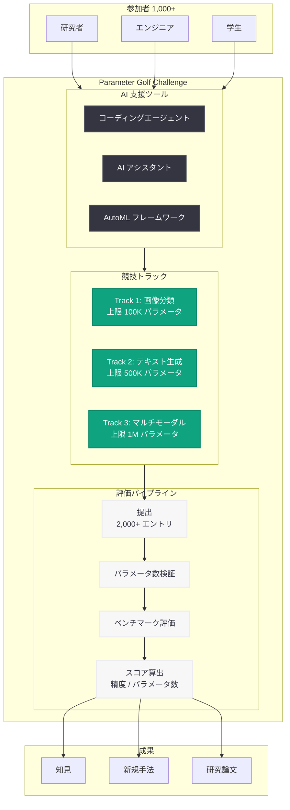
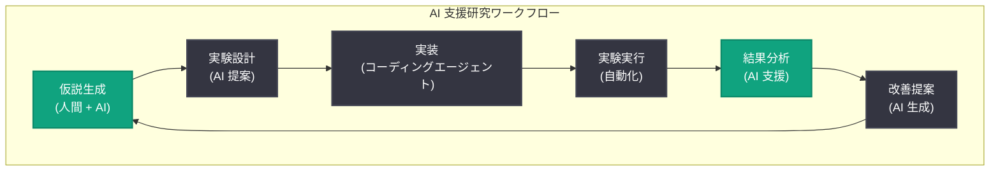

# Parameter Golf が AI 支援研究について教えてくれたこと

## メタデータ

| 項目 | 内容 |
|------|------|
| 発表日 | 2026-05-12 |
| ソース | OpenAI Research |
| カテゴリ | 研究成果 |
| 公式リンク | https://openai.com/index/what-parameter-golf-taught-us |

## 概要

OpenAI は「Parameter Golf」と題した大規模なコンペティションの結果と知見を発表した。このチャレンジには 1,000 人以上の参加者が集まり、2,000 件を超える提出が行われた。Parameter Golf は、厳格なパラメータ制約の下で機械学習モデルを設計・最適化するという独創的な競技形式を採用しており、ゴルフにおいてより少ない打数でホールインを目指すように、より少ないパラメータ数で高い性能を達成することが目標である。

この取り組みを通じて、AI 支援による機械学習研究の可能性、コーディングエージェントの有効性、量子化技術の革新、および制約下での新しいモデルアーキテクチャの設計について、多くの貴重な知見が得られた。特に、AI ツールが研究ワークフローをどのように加速・変革できるかという点において、実践的なエビデンスが蓄積された。

## 主な内容

### Parameter Golf の概要

Parameter Golf は、OpenAI が主催した機械学習研究コンペティションである。参加者は、指定されたタスクにおいて可能な限り少ないパラメータ数でモデルを構築し、高い性能を達成することを求められた。「ゴルフ」の名称が示すように、少ないパラメータ数 (= 少ない打数) で目標を達成することが評価される。

チャレンジの主な特徴は以下の通り.

- **参加規模**: 1,000 人以上の研究者・エンジニアが参加
- **提出数**: 2,000 件以上のモデルが提出された
- **制約条件**: 各トラックごとに厳格なパラメータ上限が設定
- **評価基準**: 精度とパラメータ効率のバランスで総合評価
- **AI ツール利用**: 参加者は AI アシスタントやコーディングエージェントの使用が許可された

### 主要な知見

Parameter Golf を通じて得られた主要な知見は、AI 支援研究の現状と可能性を明確に示している。

1. **AI アシスタントの有効性**: AI ツールを活用した参加者は、探索空間の効率的なナビゲーション、ハイパーパラメータの最適化、およびアーキテクチャの反復改善において顕著な優位性を示した。

2. **人間と AI の協働パターン**: 最も成功した参加者は、AI を単なるコード生成ツールとしてではなく、研究パートナーとして活用していた。仮説の生成、実験設計の提案、結果の解釈において AI との対話的なワークフローが有効であった。

3. **制約がイノベーションを促進**: 厳格なパラメータ制約が存在することで、参加者は従来のアプローチに固執せず、創造的な解決策を模索する動機付けが生まれた。

4. **知識の民主化**: AI ツールの支援により、専門知識の深さに関わらず幅広い参加者が競争力のある解決策を提出できた。

### コーディングエージェントの活用

Parameter Golf において、コーディングエージェントの活用は参加者の研究プロセスを大きく変革した。

**効果的な活用パターン:**

- **反復的な実験**: コーディングエージェントを用いて、数百のアーキテクチャバリエーションを短期間で実装・評価
- **デバッグと最適化**: モデルのボトルネック特定やメモリ効率の改善をエージェントが支援
- **コードリファクタリング**: パラメータ数を削減するためのコード構造の最適化を自動化
- **ドキュメント生成**: 実験結果の体系的な記録と分析レポートの自動生成

**エージェントの限界:**

一方で、コーディングエージェントにはいくつかの限界も明らかになった。

- 高度に創造的なアーキテクチャの発想は依然として人間の直感に依存
- 実験の全体的な方向性の決定には人間の判断が不可欠
- エージェントの提案を無批判に受け入れると局所最適に陥るリスクがある

### 量子化に関する発見

Parameter Golf の制約下で、参加者は量子化技術に関して多くの革新的アプローチを発見した。

**主要な量子化手法:**

1. **混合精度量子化**: モデルの異なる層に対して異なるビット幅を適用し、精度とパラメータ効率のトレードオフを最適化
2. **学習済み量子化ステップ**: 量子化の閾値をタスクに応じて学習することで、従来の固定量子化よりも高い精度を維持
3. **構造化スパース量子化**: スパース性と量子化を組み合わせることで、パラメータ数の大幅な削減を実現
4. **動的量子化スケジューリング**: 推論時に入力に応じて量子化レベルを動的に調整する手法

**成果:**

- 一部の提出では、フルパラメータモデルの 10% 以下のパラメータ数で 95% 以上の精度を維持
- 新しい量子化手法の組み合わせにより、従来の理論的限界を超える圧縮率を達成
- タスク特化型の量子化スキームが汎用的手法を大幅に上回るケースが多数確認された

### 新しいモデル設計

パラメータ制約が厳しい環境下で、参加者は従来とは異なる創造的なモデルアーキテクチャを多数提案した。

**注目されたアーキテクチャ:**

1. **パラメータ共有ネットワーク**: 層間でパラメータを共有することで、実効パラメータ数を大幅に削減しつつ表現力を維持
2. **条件付きコンパクトモデル**: 入力に応じてモデルの活性化パスを動的に選択し、少ないパラメータで多様なパターンに対応
3. **ハイパーネットワーク方式**: 小さなネットワークが主モデルのパラメータを生成する階層的構造
4. **周波数領域モデル**: パラメータを周波数空間で表現し、低周波成分のみを保持することで効率的な圧縮を実現

## 技術的な詳細

### Parameter Golf チャレンジの構造



### 評価メトリクス

Parameter Golf のスコアリングは以下の式で算出される.

```
Golf Score = Task Accuracy / log2(Parameter Count)
```

この評価指標により、単純にパラメータを増やして精度を上げるアプローチではなく、効率的なパラメータ利用が報われる設計となっている。

### AI 支援研究ワークフロー



### 主要な技術的トレンド

| 手法カテゴリ | 代表的アプローチ | 平均圧縮率 | 精度維持率 |
|-------------|----------------|-----------|-----------|
| 量子化 | 混合精度、学習済みステップ | 8-16x | 92-97% |
| パラメータ共有 | 層間共有、循環構造 | 4-8x | 88-95% |
| 蒸留 + 刈込 | タスク特化蒸留 | 10-20x | 90-96% |
| ハイパーネットワーク | 生成的パラメータ | 6-12x | 85-93% |
| 周波数圧縮 | FFT ベース表現 | 5-10x | 87-94% |

## 開発者への影響

Parameter Golf の成果は、機械学習の実務者に対して以下のような影響を与える。

- **エッジデバイスへの展開**: 制約下で高性能を達成する手法は、モバイルデバイスや IoT デバイスへのモデル展開に直接応用可能
- **推論コストの削減**: パラメータ効率の良いモデル設計は、クラウド推論のコスト削減に貢献
- **AI 支援開発の実践**: コーディングエージェントを研究ワークフローに組み込むベストプラクティスが確立された
- **研究の加速**: AI ツールを活用することで、仮説検証サイクルを大幅に短縮できることが実証された
- **新しい圧縮技術**: 発見された量子化・圧縮手法は、プロダクション環境でのモデル最適化に即座に適用可能
- **オープンな知見共有**: コンペティションの結果として得られた手法の多くがオープンソースとして公開される予定

## 関連リンク

- [What Parameter Golf taught us about AI-assisted research (公式記事)](https://openai.com/index/what-parameter-golf-taught-us)
- [OpenAI Research](https://openai.com/research)
- [OpenAI 公式ドキュメント](https://platform.openai.com/docs)
- [OpenAI API リファレンス](https://platform.openai.com/docs/api-reference)

## まとめ

Parameter Golf は、AI 支援による機械学習研究の現在地と将来の可能性を示す画期的なコンペティションであった。1,000 人以上の参加者と 2,000 件以上の提出を通じて、以下の重要な結論が導き出された。

1. **AI 支援は研究を加速する**: コーディングエージェントや AI アシスタントを活用した参加者は、実験の反復速度と探索範囲の両面で優位性を示した。
2. **制約がイノベーションを生む**: パラメータ制約が参加者の創造性を刺激し、従来のアプローチでは発見されなかった新しい手法が多数生まれた。
3. **量子化技術の進歩**: 混合精度量子化や学習済み量子化ステップなど、実用的な新手法が発見された。
4. **人間と AI の最適な協働**: 最高の成果は、AI を研究パートナーとして活用しつつ、人間が方向性と判断を担う協働モデルから生まれた。
5. **研究の民主化**: AI ツールの支援により、幅広いバックグラウンドの参加者が競争力のある成果を出せることが実証された。

OpenAI は今後もこのような取り組みを通じて、AI と人間の協働による研究の発展を推進していく方針を示している。
