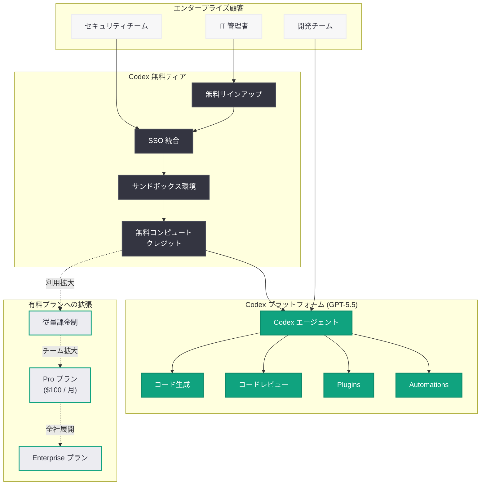
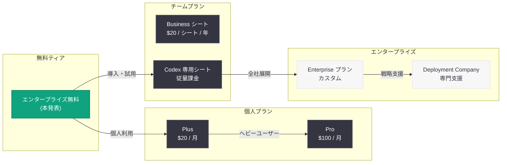

# OpenAI、エンタープライズ向け Codex を無料で提供開始 -- 企業 AI コーディング市場の覇権争いが新局面に

## メタデータ

| 項目 | 内容 |
|------|------|
| 発表日 | 2026-05-13 |
| ソース | OpenAI Blog |
| カテゴリ | Codex / 企業活用 / プライシング |
| 公式リンク | [Get Codex for your enterprise, free](https://openai.com/index/get-codex-for-your-enterprise-free/) |

## 概要

OpenAI は 2026 年 5 月 13 日、エンタープライズ向けに Codex を無料で提供する新プログラムを発表した。「Get Codex for your enterprise, free」と題された本発表は、GPT-5.5 を基盤とするクラウドベース AI コーディングエージェント Codex を、企業が無料で試用・導入できるようにするものであり、エンタープライズ AI コーディング市場における採用加速を狙った戦略的施策である。

本発表は、OpenAI が 2026 年に入って推進してきた Codex のエンタープライズ展開戦略の集大成と位置付けられる。2026 年 4 月 2 日のチーム向け柔軟な従量課金制導入、4 月 11 日の ChatGPT Pro $100 プラン、4 月 16 日の「Codex for almost everything」によるスーパーアプリ化、4 月 21 日のグローバルコンサルティング企業との連携によるエンタープライズ展開加速を経て、今回の無料提供により導入障壁を完全に取り除く構えである。Anthropic の Claude Code や GitHub Copilot Enterprise との競争が激化するなか、OpenAI はプライシング戦略で攻勢をかけている。

## 主な内容

### エンタープライズ無料ティアの戦略的意義

OpenAI がエンタープライズ向け Codex を無料で提供する決定は、単なる価格戦略ではなく、AI コーディングエージェント市場における地位を確固たるものにするための戦略的施策である。その背景には以下の要因がある。

- **市場シェアの早期確保:** エンタープライズ AI コーディング市場はまだ成熟しておらず、先行者利益が大きい。無料提供により導入のハードルを下げ、企業の開発ワークフローに Codex を定着させることで、将来的な有料転換やアップセルにつなげる狙いがある
- **競合対策:** Anthropic の Claude Code、GitHub Copilot Enterprise、Google Gemini Code Assist がエンタープライズ市場で攻勢を強めるなか、価格面での優位性を確保する
- **データフライホイールの構築:** 多くの企業が Codex を利用することで、ユースケースの多様性や改善フィードバックが蓄積され、プロダクト品質のさらなる向上につながる
- **OpenAI Deployment Company との連携:** 2026 年 5 月 11 日に発表された「OpenAI Deployment Company」が企業の AI 構築を支援する体制と組み合わせることで、Codex の導入から活用までをワンストップで提供する

### Codex エンタープライズ展開の時系列

OpenAI は 2026 年に入り、Codex のエンタープライズ展開を段階的に推進してきた。

| 日付 | 施策 | 内容 |
|------|------|------|
| 2026-04-02 | 柔軟な従量課金制 | チーム向け Codex 専用シートの従量課金制を導入。固定シート料金なし |
| 2026-04-08 | エンタープライズ AI の次なるフェーズ | 大企業向け AI 戦略の方針発表 |
| 2026-04-11 | ChatGPT Pro $100 プラン | Codex アクセス 5 倍の個人向けプラン |
| 2026-04-16 | Codex for almost everything | スーパーアプリ化、全 ChatGPT ユーザーへの開放 |
| 2026-04-21 | エンタープライズ展開加速 | Accenture、PwC 等とのパートナーシップ。WAU 400 万人到達 |
| 2026-05-11 | OpenAI Deployment Company | 企業の AI 構築を支援する専門組織の設立 |
| 2026-05-13 | **エンタープライズ無料提供** | **本発表。導入障壁の完全撤廃** |

### 想定されるエンタープライズ無料ティアの内容

本発表の戦略的文脈と、これまでの Codex プライシング体系から推定される無料ティアの構成は以下の通りである。

- **Codex エージェントへの基本アクセス:** クラウドベースのサンドボックス環境でコードを生成・実行する Codex エージェントの利用が可能
- **一定のコンピュートクレジット:** 試用期間中に使用できるコンピュートリソースの無料枠が提供される
- **エンタープライズセキュリティ機能:** SSO、SCIM によるユーザー管理統合、データがモデルトレーニングに使用されない保証
- **管理者コンソール:** 利用状況のモニタリングとポリシー管理
- **Plugins および Automations:** 外部ツールとの連携やワークフロー自動化機能

### 競合環境と市場ポジショニング

エンタープライズ AI コーディングエージェント市場における主要プレイヤーとの比較は以下の通りである。

| サービス | 提供企業 | モデル基盤 | エンタープライズ価格 |
|---------|---------|-----------|-------------------|
| Codex | OpenAI | GPT-5.5 | 無料ティアあり (本発表) |
| Claude Code | Anthropic | Claude | 有料 (Claude for Enterprise) |
| Copilot Enterprise | GitHub / Microsoft | GPT-4o + Copilot | $39 / ユーザー / 月 |
| Gemini Code Assist | Google | Gemini | Enterprise プラン |

OpenAI の無料ティア戦略は、初期導入の摩擦を最小化し、企業内での利用定着を促進した後に有料プランへ移行させる「ランド・アンド・エクスパンド」モデルを採用していると考えられる。

### OpenAI Deployment Company との連携

2026 年 5 月 11 日に発表された OpenAI Deployment Company は、企業が AI を活用してビジネスを構築するための専門支援組織である。Codex の無料エンタープライズ提供と組み合わせることで、以下のような包括的な支援体制が構築される。

- **導入支援:** Codex の初期セットアップから組織全体への展開までを一貫して支援
- **カスタマイズ:** 企業固有のコードベースやワークフローに合わせた Codex の最適化
- **トレーニング:** Codex Labs を通じた開発チーム向けのハンズオンプログラム
- **継続的改善:** 利用データに基づく活用最適化と ROI 測定

## 技術的な詳細

### エンタープライズ向け Codex のアーキテクチャ

エンタープライズ環境での Codex は、セキュリティ、スケーラビリティ、統合性を重視した設計となっている。

- **GPT-5.5 基盤:** 最新のフラッグシップモデルによる高精度なコード生成・理解能力
- **クラウドサンドボックス:** 隔離された実行環境でコードを安全に生成・実行
- **エンタープライズセキュリティ:** SOC 2 Type II / ISO 27001 準拠、データ暗号化、アクセス制御
- **API 統合:** Responses API を通じた既存 CI/CD パイプラインとの連携
- **Plugins / Automations:** 外部ツールとのインテグレーション、ワークフロー自動化

### コードサンプル: エンタープライズ環境での Codex API 利用

以下は、エンタープライズ環境で Codex API を使用してコードレビューを自動化する Python コードの例である。

```python
from openai import OpenAI

client = OpenAI()


def automated_code_review(repo_path: str, pr_diff: str) -> dict:
    """Codex を使用したエンタープライズ向け自動コードレビュー"""

    response = client.responses.create(
        model="codex",
        instructions="""あなたはシニアソフトウェアエンジニアです。
        以下の観点でコードレビューを実施してください:
        1. セキュリティ脆弱性 (SQL インジェクション、XSS、認証不備等)
        2. パフォーマンス上の問題 (N+1 クエリ、不要なメモリ確保等)
        3. コーディング規約への準拠
        4. テストカバレッジの十分性
        5. アーキテクチャ上の懸念

        結果は JSON 形式で返してください:
        {
            "severity": "critical|high|medium|low",
            "issues": [...],
            "suggestions": [...],
            "approved": true|false
        }""",
        input=f"リポジトリ: {repo_path}\n\nPR Diff:\n{pr_diff}",
        tools=[
            {
                "type": "code_interpreter"
            }
        ]
    )

    return response.output_text


def enterprise_codex_onboarding(org_name: str, team_size: int) -> str:
    """エンタープライズ無料ティアのオンボーディングフロー"""

    response = client.responses.create(
        model="codex",
        instructions="""エンタープライズ向け Codex の初期設定を支援してください。
        以下の手順を含むセットアップガイドを生成:
        1. ワークスペースの作成と SSO 統合
        2. チームメンバーの招待とロール設定
        3. セキュリティポリシーの構成
        4. 既存リポジトリとの連携設定
        5. Plugins / Automations の初期構成
        6. 利用ガイドラインの策定""",
        input=f"組織名: {org_name}\nチーム規模: {team_size} 名",
        tools=[
            {
                "type": "code_interpreter"
            }
        ]
    )

    return response.output_text


# 使用例
if __name__ == "__main__":
    # コードレビューの自動化
    review_result = automated_code_review(
        repo_path="github.com/example-corp/main-app",
        pr_diff="+ def get_user(id):\n+     query = f'SELECT * FROM users WHERE id={id}'\n+     return db.execute(query)"
    )
    print(f"レビュー結果: {review_result}")

    # エンタープライズオンボーディング
    guide = enterprise_codex_onboarding(
        org_name="Example Corporation",
        team_size=50
    )
    print(f"セットアップガイド:\n{guide}")
```

### エンタープライズ Codex 導入フロー



### プライシング戦略の全体像



## 開発者への影響

- **導入障壁の撤廃:** エンタープライズ環境の開発者が、予算承認プロセスを経ることなく Codex を試用できるようになる。これにより、ボトムアップでの AI コーディングエージェント導入が加速する
- **評価・比較の容易化:** 無料で Codex を試せることで、GitHub Copilot や Claude Code との公平な比較検証 (PoC) が容易になる。開発チームは実際のプロジェクトで各ツールの性能を評価した上で、最適なソリューションを選定できる
- **開発ワークフローの変革:** Codex のエンタープライズ機能 (Plugins、Automations、CI/CD 統合) を無料で利用できることで、AI を活用した開発ワークフローの実験と最適化が気軽に行えるようになる
- **スキルセットの進化:** Codex のエンタープライズ普及に伴い、AI コーディングエージェントを効果的に活用するスキル (プロンプトエンジニアリング、エージェント設計、品質管理) が開発者の必須スキルとなる傾向が加速する
- **市場競争の恩恵:** OpenAI の無料戦略に対抗して、Anthropic や GitHub も価格引き下げやフリーティア拡充を行う可能性が高く、開発者にとっては選択肢とコストパフォーマンスの両面で恩恵がある
- **セキュリティ要件の確認:** エンタープライズ環境では、無料ティアであってもセキュリティ要件 (データ保持ポリシー、コンプライアンス認証、アクセス制御) が満たされているか確認が必要である。開発者はセキュリティチームと連携し、利用規約を精査した上で導入を進めるべきである

## 関連リンク

- [Get Codex for your enterprise, free (公式)](https://openai.com/index/get-codex-for-your-enterprise-free/)
- [関連レポート: Codex がチーム向けに柔軟な従量課金制を導入 (2026-04-02)](2026-04-02-codex-flexible-pricing-for-teams.md)
- [関連レポート: ChatGPT Pro $100 プラン (2026-04-11)](2026-04-11-chatgpt-pro-100-codex-plan.md)
- [関連レポート: Codex for almost everything (2026-04-16)](2026-04-16-codex-for-almost-everything.md)
- [関連レポート: エンタープライズ展開加速 (2026-04-21)](2026-04-21-scaling-codex-enterprises.md)
- [関連レポート: Codex で変わる経理・財務チームの業務 (2026-05-12)](2026-05-12-codex-for-finance-teams.md)
- [関連レポート: OpenAI Deployment Company 設立 (2026-05-11)](2026-05-11-openai-deployment-company-launch.md)
- [OpenAI Enterprise](https://openai.com/chatgpt/enterprise)
- [OpenAI Codex 公式ドキュメント](https://platform.openai.com/docs/guides/codex)
- [OpenAI API リファレンス](https://platform.openai.com/docs/api-reference)

## まとめ

OpenAI によるエンタープライズ向け Codex の無料提供は、AI コーディングエージェント市場における競争戦略の新たな局面を象徴する発表である。GPT-5.5 を基盤とするクラウドベースの AI コーディングエージェントを無料で企業に提供することで、導入障壁を完全に取り除き、市場シェアの早期確保を狙う。

2026 年 4 月以降、OpenAI は従量課金制の導入、Pro プランの価格引き下げ、スーパーアプリ化、グローバルコンサルティング企業との連携と、段階的にエンタープライズ展開を加速してきた。今回の無料提供は、この一連の戦略の最終段階として位置付けられ、OpenAI Deployment Company による専門支援体制と組み合わせることで、企業の AI コーディングエージェント導入から定着、そして有料プランへの拡張までを一貫して支援するエコシステムが完成する。

Anthropic の Claude Code、GitHub Copilot Enterprise との三つ巴の競争において、OpenAI はプライシングという最も直接的な手段で攻勢をかけた。開発者にとっては、無料で最先端の AI コーディングエージェントを評価できる絶好の機会であり、今後のエンタープライズ AI コーディング市場の動向を注視すべきである。
