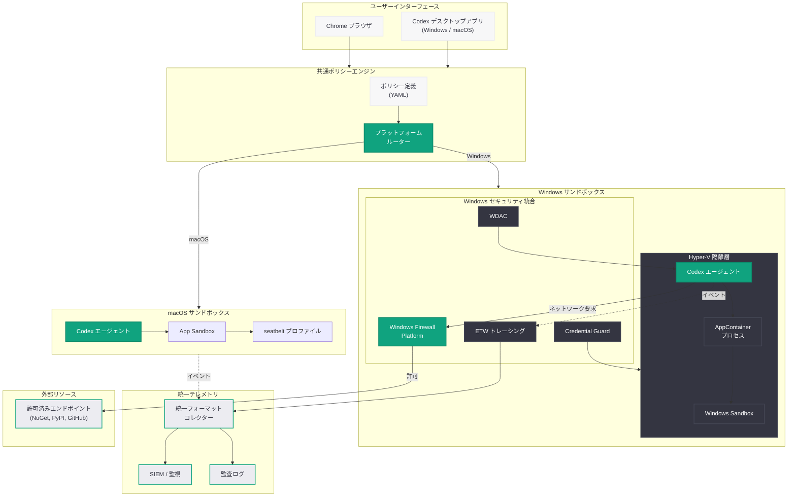

# Windows 向け Codex の安全なサンドボックス構築: セキュアな隔離環境でクロスプラットフォーム対応を実現

## メタデータ

| 項目 | 内容 |
|------|------|
| 発表日 | 2026-05-13 |
| ソース | OpenAI Blog |
| カテゴリ | セキュリティ / Codex |
| 公式リンク | [Building a safe, effective sandbox to enable Codex on Windows](https://openai.com/index/building-safe-sandbox-codex-windows/) |

## 概要

OpenAI は 2026 年 5 月 13 日、Windows プラットフォーム上で Codex エージェントを安全に実行するためのサンドボックス技術に関するブログ記事「Building a safe, effective sandbox to enable Codex on Windows」を公開した。本記事は、2026 年 5 月 8 日に発表された「Running Codex safely」の続編として位置付けられ、前回の記事で解説されたサンドボックス化、承認ワークフロー、ネットワークポリシー、テレメトリの枠組みを Windows 環境に適用するための技術的アプローチを詳述している。

Codex はこれまで主に macOS および Linux 環境での動作を中心に開発されてきたが、エンタープライズ環境では Windows を主要な開発プラットフォームとして使用する組織が多数存在する。本記事では、Windows 固有のセキュリティ機構 (Windows Sandbox、Hyper-V ベースの隔離、AppContainer) を活用し、macOS / Linux と同等以上のセキュリティレベルを Windows 上で実現するアーキテクチャを解説している。これにより、Codex デスクトップアプリは macOS と Windows の両方で利用可能となり、Chrome ブラウザ上での動作も両プラットフォームでサポートされる。

## 主な内容

### Windows サンドボックス技術の選定と設計思想

OpenAI は Windows 上での Codex サンドボックスを構築するにあたり、Windows プラットフォームが提供する複数の隔離技術を評価し、最適な組み合わせを選定した。

- **Windows Sandbox の活用:** Windows 10/11 に組み込まれた軽量仮想化技術である Windows Sandbox をベースレイヤーとして採用。カーネルレベルの隔離を提供し、サンドボックス内のプロセスがホストシステムに影響を与えることを防止する
- **Hyper-V ベースのコンテナ隔離:** エンタープライズ環境向けには Hyper-V isolation を利用した強化隔離モードを提供。ハードウェアレベルの仮想化により、カーネルの脆弱性を突いた脱出攻撃に対しても耐性を持つ
- **AppContainer プロセス隔離:** 個別のプロセスレベルでの権限制御に Windows の AppContainer メカニズムを使用。ファイルシステム、レジストリ、ネットワークへのアクセスを細粒度で制限
- **設計原則 - Defense in Depth:** 単一の隔離メカニズムに依存せず、仮想化、コンテナ、プロセス隔離の多層構造で堅牢なセキュリティを実現

macOS 環境では App Sandbox と seatbelt プロファイルを使用していたのに対し、Windows 環境では上記技術スタックの組み合わせにより同等のセキュリティ保証を実現している。

### macOS / Linux との差異とクロスプラットフォーム統一アーキテクチャ

Codex のサンドボックスアーキテクチャは、プラットフォーム固有の実装レイヤーと共通のポリシーエンジンレイヤーを分離する設計を採用している。

- **共通ポリシーレイヤー:** ネットワークポリシー、ファイルアクセスルール、承認ワークフローの定義はプラットフォーム非依存の共通フォーマットで管理される
- **プラットフォーム固有アダプター:** 共通ポリシーを各 OS のネイティブセキュリティ機構にマッピングするアダプター層を実装
  - macOS: App Sandbox + seatbelt + XPC
  - Linux: seccomp-bpf + namespaces + cgroups
  - Windows: Windows Sandbox + Hyper-V + AppContainer
- **統一テレメトリインターフェース:** プラットフォームに関わらず同一フォーマットのテレメトリデータを出力し、セキュリティ監視の一元化を実現
- **ポリシーの移植性:** macOS で検証済みのポリシー設定を Windows 環境にそのまま適用可能

この設計により、組織が macOS と Windows の混在環境で Codex を運用する場合でも、セキュリティポリシーの一貫性を維持できる。

### Windows 固有のセキュリティ統合

Windows 環境特有のセキュリティ機能との統合が実現されている。

- **Windows Defender Application Control (WDAC):** サンドボックス内で実行可能なバイナリをポリシーで制限し、未署名コードの実行を防止
- **Windows Event Tracing (ETW):** サンドボックス内のイベントを Windows 標準のイベントトレーシング基盤に統合し、既存の SIEM ソリューションとの接続を容易にする
- **Credential Guard との連携:** サンドボックス内からホストの認証情報へのアクセスを完全に遮断し、資格情報の窃取を防止
- **BitLocker 暗号化:** サンドボックスの一時ストレージに BitLocker 暗号化を適用し、物理アクセスによるデータ抽出を防止
- **Windows Firewall Platform (WFP) 統合:** ネットワークポリシーの実施に WFP を使用し、サンドボックスからの通信を OS レベルで制御

### Chrome ブラウザ上での動作サポート

Codex は macOS と Windows の両方で Chrome ブラウザ上での動作をサポートしている。

- **Web ベースのサンドボックス実行:** Chrome の拡張機能またはウェブアプリを通じて Codex のサンドボックス環境を起動・管理可能
- **デスクトップアプリとの連携:** Chrome 上での操作とデスクトップアプリのサンドボックスがシームレスに連携し、ブラウザから直接タスクの発行や結果の確認が可能
- **サイト分離の活用:** Chrome のサイト分離 (Site Isolation) メカニズムと組み合わせ、ブラウザ経由のアクセスにもセキュリティ境界を維持

## 技術的な詳細

### Windows サンドボックスの構成例

Windows 向け Codex サンドボックスの設定は、Windows Sandbox Configuration (.wsb) 形式と OpenAI 独自のポリシー定義の組み合わせで構成される。

```xml
<!-- codex-sandbox.wsb -->
<Configuration>
  <VGpu>Disable</VGpu>
  <Networking>Disable</Networking>
  <MappedFolders>
    <MappedFolder>
      <HostFolder>C:\Projects\target-repo</HostFolder>
      <SandboxFolder>C:\workspace</SandboxFolder>
      <ReadOnly>false</ReadOnly>
    </MappedFolder>
    <MappedFolder>
      <HostFolder>C:\Codex\tools</HostFolder>
      <SandboxFolder>C:\tools</SandboxFolder>
      <ReadOnly>true</ReadOnly>
    </MappedFolder>
  </MappedFolders>
  <LogonCommand>
    <Command>C:\tools\codex-agent-init.exe --policy production</Command>
  </LogonCommand>
  <MemoryInMB>8192</MemoryInMB>
</Configuration>
```

### クロスプラットフォームポリシー定義

プラットフォーム非依存のポリシー定義例を以下に示す。

```yaml
# codex-cross-platform-policy.yaml
apiVersion: codex.openai.com/v1
kind: CrossPlatformSandboxPolicy
metadata:
  name: windows-codex-agent
spec:
  platform:
    windows:
      isolation: hyper-v
      defender_integration: true
      etw_logging: true
      credential_guard: true
    macos:
      isolation: app-sandbox
      seatbelt_profile: codex-strict
    linux:
      isolation: namespace
      seccomp_profile: codex-restricted
  common:
    filesystem:
      workspace_writable: true
      system_readonly: true
      temp_ephemeral: true
      blocked_paths:
        - "*/credentials*"
        - "*/.ssh/*"
        - "*/secrets*"
    network:
      default_policy: deny
      allowed_endpoints:
        - host: "pypi.org"
          port: 443
        - host: "registry.npmjs.org"
          port: 443
        - host: "github.com"
          port: 443
        - host: "nuget.org"
          port: 443
    resources:
      cpu_limit: 4
      memory_limit_gb: 8
      disk_limit_gb: 20
      execution_timeout_minutes: 60
  telemetry:
    format: unified
    export_targets:
      - type: etw  # Windows
      - type: oslog  # macOS
      - type: journald  # Linux
```

### Python SDK によるサンドボックス管理

```python
from openai import OpenAI

client = OpenAI()

# Windows 向けサンドボックスポリシーを指定して Codex タスクを作成
task = client.codex.tasks.create(
    description="Windows プロジェクトの .NET テストカバレッジ改善",
    repository="org/windows-app",
    sandbox_policy={
        "platform": "windows",
        "isolation_level": "hyper-v",
        "mapped_folders": [
            {
                "host_path": "C:\\Projects\\windows-app",
                "sandbox_path": "C:\\workspace",
                "read_only": False
            }
        ],
        "security": {
            "wdac_enabled": True,
            "credential_guard": True,
            "etw_integration": True
        }
    },
    network_policy={
        "default": "deny",
        "allowed_hosts": ["nuget.org", "github.com"],
        "wfp_enforcement": True
    },
    approval_policy={
        "level": "single_reviewer",
        "auto_approve_paths": ["tests/*", "docs/*"]
    }
)

# サンドボックスの状態確認
sandbox_status = client.codex.tasks.get_sandbox_status(task.id)
print(f"プラットフォーム: {sandbox_status.platform}")
print(f"隔離レベル: {sandbox_status.isolation_level}")
print(f"セキュリティ状態: {sandbox_status.security_state}")
print(f"リソース使用量: CPU {sandbox_status.cpu_usage}%, "
      f"メモリ {sandbox_status.memory_usage_mb}MB")
```

## アーキテクチャ



## 開発者への影響

- **Windows 開発者への Codex アクセス拡大:** .NET、C#、PowerShell、Visual Studio を中心に開発を行う Windows ネイティブの開発者が、macOS / Linux 環境のユーザーと同等のセキュリティ保証の下で Codex を利用可能になった。エンタープライズ環境で多数を占める Windows 開発者にとって大きな前進である

- **クロスプラットフォームポリシーの一元管理:** 組織のセキュリティチームは、プラットフォーム非依存のポリシー定義を一度作成するだけで、macOS と Windows の両方に適用可能。運用管理の負荷が大幅に軽減される

- **既存 Windows セキュリティインフラとの統合:** ETW、WDAC、Windows Firewall Platform など Windows 標準のセキュリティ機構との統合により、企業の既存セキュリティ監視基盤 (Microsoft Sentinel、Splunk など) をそのまま活用してエージェントの動作を監視できる

- **Chrome ブラウザ経由のアクセス:** デスクトップアプリのインストールが困難な環境でも、Chrome ブラウザを通じて Codex のサンドボックス機能を利用可能。IT ポリシーが厳格な組織での導入ハードルが下がる

- **段階的な隔離レベルの選択:** AppContainer レベルの軽量隔離から Hyper-V ベースのハードウェア隔離まで、セキュリティ要件とパフォーマンスのトレードオフに応じて隔離レベルを選択可能

- **NuGet エコシステムへのネイティブ対応:** ネットワークポリシーの許可リストに nuget.org が含まれることで、.NET プロジェクトにおけるパッケージ依存関係の解決がサンドボックス内で完結する

## 関連リンク

- [Building a safe, effective sandbox to enable Codex on Windows (公式)](https://openai.com/index/building-safe-sandbox-codex-windows/)
- [Running Codex safely at OpenAI](https://openai.com/index/running-codex-safely)
- [OpenAI Codex](https://openai.com/codex)
- [OpenAI Security](https://openai.com/security)
- [Codex Cloud Environments](https://developers.openai.com/codex/cloud/environments/)
- [関連レポート: Codex の安全な運用 - サンドボックス、承認フロー、ネットワークポリシー](2026-05-08-running-codex-safely.md)
- [関連レポート: Codex Remote Connections](2026-04-22-codex-remote-connections.md)
- [関連レポート: Codex Hooks](2026-03-31-codex-hooks.md)

## まとめ

OpenAI が公開した「Building a safe, effective sandbox to enable Codex on Windows」は、Codex のセキュリティアーキテクチャを Windows プラットフォームに拡張するための技術的アプローチを示した記事である。Windows Sandbox、Hyper-V 隔離、AppContainer といった Windows ネイティブのセキュリティ機構を多層的に組み合わせることで、macOS / Linux と同等のセキュリティ保証を Windows 上で実現している。さらに、プラットフォーム非依存の共通ポリシーエンジンを導入することで、クロスプラットフォーム環境における一貫したセキュリティガバナンスを可能にしている。5 月 8 日の「Running Codex safely」で示された 4 つの柱 (サンドボックス、承認ワークフロー、ネットワークポリシー、テレメトリ) が Windows 固有のセキュリティエコシステムと統合されたことで、エンタープライズにおける Codex の本格的なクロスプラットフォーム展開が現実的なものとなった。
