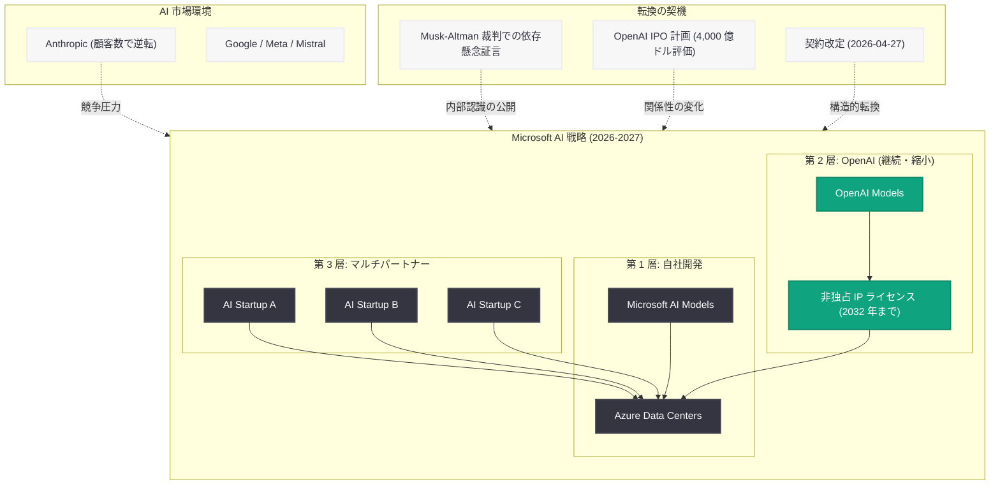

# Microsoft、OpenAI 後を見据えスタートアップとの提携を模索: 1,000 億ドル超投資からの戦略的転換

## メタデータ

| 項目 | 内容 |
|------|------|
| 発表日 | 2026-05-13 |
| ソース | Reuters (Exclusive), CNBC, The Wenatchee World, TechCrunch |
| カテゴリ | ビジネス / パートナーシップ |
| 公式リンク | [Reuters](https://www.reuters.com/), [CNBC](https://www.cnbc.com/), [TechCrunch](https://techcrunch.com/) |

## 概要

Reuters は 2026 年 5 月 13 日、独占報道として「Microsoft eyeing startup deals for life after OpenAI」と題し、Microsoft が OpenAI への依存を脱却するために AI スタートアップとの新たな提携を積極的に模索していることを明らかにした。Microsoft は OpenAI パートナーシップに 1,000 億ドル (約 15 兆円) 以上を投資してきたが、OpenAI の IPO 計画進行や同社との関係構造の変化を受け、「ポスト OpenAI」時代に向けた戦略的な布石を打ち始めている。

この動きは単独のニュースではなく、一連の構造的転換の延長線上にある。4 月 4 日に報じられた Microsoft の自社 AI モデル開発、4 月 27 日の両社パートナーシップ契約改定、そして同日 CNBC が報じた Musk v. Altman 裁判における Microsoft の OpenAI 依存懸念の証言と合わせ、Microsoft が AI 戦略の多角化を加速させていることを示す決定的な証拠である。さらに TechCrunch が同日報じた「Anthropic のビジネス顧客数が OpenAI を上回った」というデータは、Microsoft が代替パートナーを模索する合理性を裏付けている。

## 主な内容

### Reuters 独占報道: スタートアップ提携の模索

Reuters の 5 月 13 日の独占報道によれば、Microsoft は OpenAI 以外の AI スタートアップとの提携機会を積極的に調査・検討している。報道の核心は以下の通りである。

- **ポスト OpenAI 戦略:** Microsoft は OpenAI との関係が永続的ではない可能性を前提に、代替パートナーの確保を戦略的優先事項として位置づけている
- **スタートアップとの提携模索:** 具体的な提携対象として、特定の AI 分野 (推論、マルチモーダル、エージェント等) に強みを持つスタートアップが候補に挙がっている
- **投資と技術獲得の両面:** 提携の形態は少数株式投資から技術ライセンス契約、共同開発まで多岐にわたる可能性がある

この報道は、Microsoft が OpenAI との関係を即座に終了するものではないが、AI エコシステムにおける Microsoft のポジションが「OpenAI に全面的に依存するパートナー」から「複数の AI 企業と戦略的関係を持つプラットフォーム企業」へと移行しつつあることを明確に示している。

### Microsoft の OpenAI 依存懸念: Musk-Altman 裁判での証言

CNBC は同じ 5 月 13 日、Musk v. Altman 裁判の証言において Microsoft が OpenAI への過度な依存を懸念していたことが明らかになったと報じた。

- **社内の懸念表明:** Microsoft の経営陣が内部で OpenAI への依存リスクを認識し、対策を議論していたことが裁判資料から判明した
- **戦略的脆弱性の自覚:** Microsoft の AI 戦略が単一企業のモデルとインフラに過度に依存していることのリスクが、社内で正式に議題として取り上げられていた
- **裁判での意味合い:** この証言は、OpenAI が市場において圧倒的な地位を築いていたことの裏付けであると同時に、営利転換がパートナー企業にも深刻な影響を与えていたことの証拠として提出された

この証言は、Reuters の独占報道と完全に整合する。Microsoft が現在スタートアップとの提携を模索しているのは、以前から内部で認識されていた依存リスクに対する具体的なアクションである。

### 1,000 億ドル超の投資: パートナーシップの規模

The Wenatchee World は 5 月 14 日、Microsoft が OpenAI パートナーシップに 1,000 億ドル以上を投じてきたことを報じた。この金額は、テクノロジー業界における単一パートナーシップへの投資としては前例のない規模である。

- **投資の内訳:** Azure インフラ提供、直接資本投資、データセンター建設、人材確保を含む包括的な投資
- **リターンの構造:** 2026 年 4 月 27 日の契約改定により、OpenAI から Microsoft への収益分配は 2030 年まで上限付きで継続するものの、Microsoft から OpenAI への収益分配は廃止された
- **サンクコストの問題:** 1,000 億ドル超の投資が既に行われている中で、Microsoft が「ポスト OpenAI」を見据えるということは、追加投資の方向性を根本的に再検討していることを意味する

### 競争環境の変化: Anthropic がビジネス顧客数で OpenAI を上回る

TechCrunch は 5 月 13 日、Ramp の支出データに基づき、Anthropic のビジネス顧客数が OpenAI を上回ったと報じた。この報道は Microsoft の戦略転換の背景にある市場環境の変化を象徴している。

- **Ramp データの示唆:** 企業カード支出のデータに基づく分析で、Anthropic に支払いを行う企業数が OpenAI のそれを上回った
- **市場の多極化:** AI モデル市場が OpenAI の一強体制から複数の有力プレイヤーが競合する構造へと移行しつつある
- **Microsoft への示唆:** OpenAI が市場シェアを維持できない場合、Microsoft が OpenAI に全面的にコミットし続けることの合理性が低下する。代替パートナーの価値は市場シェアの分散に比例して増大する

### 戦略的含意: Microsoft の AI 戦略の全体像

Reuters 報道を含む一連の動きを統合すると、Microsoft の AI 戦略は以下の 3 層構造で再構成されつつある。

#### 第 1 層: 自社開発 (内製化)

4 月 4 日に発表された自社 AI モデル 3 種を基盤に、2027 年までに最先端モデルの自社開発を目指す。これにより、基盤技術レベルでの外部依存を解消する。

#### 第 2 層: OpenAI パートナーシップ (継続・縮小)

4 月 27 日に改定された契約に基づき、OpenAI モデルの非独占的ライセンスを 2032 年まで維持。ただし、関係性は「排他的パートナーシップ」から「主要サプライヤーの一社」へと格下げされつつある。

#### 第 3 層: マルチパートナー戦略 (新規拡大)

今回の Reuters 報道が示す通り、複数の AI スタートアップとの提携を通じて、特定分野における技術的優位性を確保する。Azure Marketplace を通じた複数モデルの提供能力を強化する。

## アーキテクチャ

## 開発者への影響

Microsoft の「ポスト OpenAI」戦略は、Azure OpenAI Service やその関連ツールに依存する開発者に対して、中長期的に以下の影響を及ぼす可能性がある。

- **Azure AI プラットフォームのマルチモデル化加速:** Microsoft が複数の AI スタートアップと提携することで、Azure 上で利用可能なモデルの選択肢が増加する。開発者にとっては、ユースケースに最適なモデルを選択できる柔軟性が向上する
- **Azure OpenAI Service の位置づけ変化:** 現在は Azure AI の中核サービスだが、Microsoft の自社モデルや他社モデルの充実に伴い、「複数のモデルプロバイダーの一つ」として相対化される可能性がある
- **API 互換性の課題:** 複数のモデルプロバイダーが Azure 上で共存する場合、各モデルの API インターフェースの統一性が重要になる。Microsoft がどの程度の抽象化レイヤーを提供するかが開発者体験を左右する
- **料金体系の変動可能性:** OpenAI モデルへの依存度低下に伴い、Azure OpenAI Service の料金体系が見直される可能性がある。競合モデルの存在が価格競争を促進する方向に作用しうる
- **マルチプロバイダー対応の設計推奨:** 特定のモデルプロバイダーへの密結合を避け、モデル切り替えが容易なアーキテクチャ設計がますます重要になる。LiteLLM、LangChain、Semantic Kernel 等の抽象化フレームワークの活用が推奨される
- **長期的な API 安定性への懸念:** Microsoft と OpenAI の関係が今後さらに変化した場合、Azure OpenAI Service の API バージョニングポリシーや廃止スケジュールに影響が生じる可能性がある。deprecation policy の注視が必要である

## 関連リンク

- [Reuters Exclusive: Microsoft eyeing startup deals for life after OpenAI](https://www.reuters.com/)
- [CNBC: Microsoft feared being too dependent on OpenAI](https://www.cnbc.com/)
- [TechCrunch: Anthropic now has more business customers than OpenAI](https://techcrunch.com/)
- [前回レポート: Microsoft-OpenAI パートナーシップの次の段階 -- 契約改定で柔軟性・確実性を実現](2026-04-27-microsoft-openai-partnership-amendment.md)
- [関連レポート: Microsoft、自社 AI モデル 3 種を発表 -- OpenAI パートナーシップの構造的転換が加速](2026-04-04-microsoft-in-house-ai-openai-partnership-shift.md)
- [関連レポート: OpenAI の Microsoft 依存リスク、IPO 投資家向け文書に明記](2026-03-23-openai-microsoft-ipo-risk-disclosure.md)
- [関連レポート: OpenAI 社員向け株式売却プログラム -- 評価額 4,000 億ドルに到達](2026-05-11-openai-employee-share-sale-400b.md)
- [関連レポート: Musk 対 Altman 裁判第 3 週 -- 裁判終盤の決定的攻防](2026-05-13-musk-altman-trial-week-3.md)

## まとめ

Reuters の独占報道が明らかにした Microsoft のスタートアップ提携模索は、同社の AI 戦略が根本的な転換点を迎えていることを示す。1,000 億ドル超を投じた OpenAI パートナーシップは依然として継続するが、Microsoft はもはや OpenAI を「唯一無二のパートナー」とは位置づけていない。Musk-Altman 裁判で露呈した依存懸念の証言、4 月の契約改定による非独占化、自社モデル開発の加速、そして Anthropic による市場シェア侵食という複合的な要因が、Microsoft を「ポスト OpenAI」時代への準備に向かわせている。

開発者にとっての最重要メッセージは、Azure AI エコシステムがマルチモデル・マルチプロバイダーの方向へ進化していくことは確実であり、特定のモデルやプロバイダーへの密結合を避ける設計が今後ますます重要になるという点である。Microsoft が新たなスタートアップとの提携を具体化するに従い、Azure 上で利用可能な AI モデルの選択肢は拡大し、開発者にとっては柔軟性の向上というプラスの影響が期待される。
