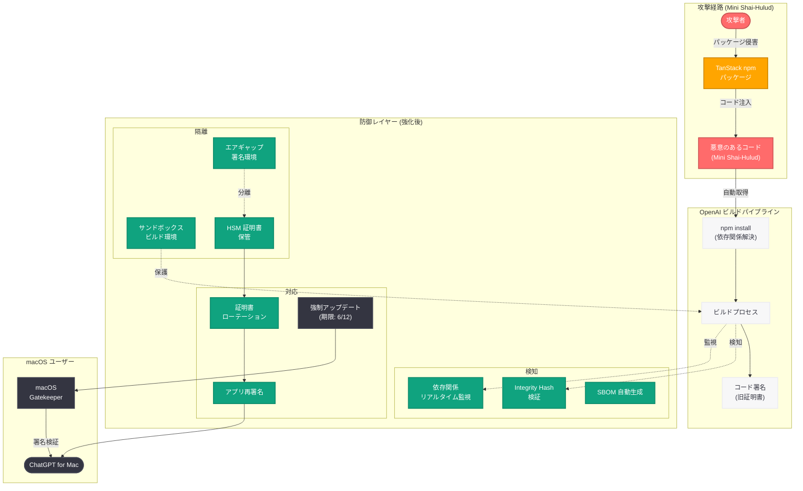

# OpenAI の TanStack npm サプライチェーン攻撃 "Mini Shai-Hulud" への対応 -- 署名証明書の保護と macOS アプリの強制アップデート期限を発表

## メタデータ

| 項目 | 内容 |
|------|------|
| 発表日 | 2026-05-13 |
| ソース | OpenAI News/Blog |
| カテゴリ | セキュリティ |
| 公式リンク | [Our response to the TanStack npm supply chain attack](https://openai.com/index/our-response-to-the-tanstack-npm-supply-chain-attack) |

> **関連レポート:** 本レポートは、2026 年 4 月 10 日に報告された [Axios 開発者ツールのサプライチェーン攻撃](2026-04-10-axios-developer-tool-compromise.md) および 2026 年 4 月 11 日の [Mac ユーザーへのセキュリティ強制アップデート](2026-04-11-openai-mac-security-mandatory-update.md) の続報である。また、2026 年 5 月 8 日の [Running Codex safely](2026-05-08-running-codex-safely.md) で解説されたサンドボックス技術も、サプライチェーンリスク軽減の関連技術として位置づけられる。

## 概要

OpenAI は 2026 年 5 月 13 日、TanStack の npm パッケージを標的としたサプライチェーン攻撃 "Mini Shai-Hulud" に対する同社の対応を詳述する記事を公開した。TanStack は TanStack Query、TanStack Router 等を含む人気のオープンソース JavaScript ライブラリ群であり、数百万の開発者に利用されている。この攻撃により、OpenAI のシステムおよびコード署名証明書に影響が及んだため、OpenAI は証明書の保護措置を講じ、macOS ユーザーに対して 2026 年 6 月 12 日までにアプリの更新を義務づける期限を設定した。

本記事では、攻撃の経緯、OpenAI のシステムへの影響範囲、実施された防御措置、そしてソフトウェアサプライチェーン脅威に対する今後の防御強化策について説明されている。4 月の Axios 開発者ツール侵害に続き、OpenAI が直面した 2 件目の重大なサプライチェーンセキュリティインシデントへの対応として、業界全体のセキュリティ意識向上にも貢献する内容となっている。

## 主な内容

### TanStack サプライチェーン攻撃の概要

TanStack は、React、Vue、Solid、Svelte など複数のフレームワークに対応したデータフェッチング、ルーティング、テーブル管理のためのオープンソースライブラリ群である。npm レジストリ上で数百万の週間ダウンロード数を誇り、エンタープライズアプリケーションからスタートアップまで幅広く採用されている。

今回の攻撃では、TanStack エコシステム内の npm パッケージが侵害され、悪意のあるコードが注入された。攻撃者は TanStack の正規パッケージのパブリッシュプロセスに介入し、マルウェアを含むバージョンを npm レジストリに公開することに成功した。この手法はパッケージの正規性を装うため、通常のインストールプロセスでは検出が極めて困難である。

### "Mini Shai-Hulud" マルウェアの詳細

攻撃で使用されたマルウェアは "Mini Shai-Hulud" と呼称されている。この名称は Frank Herbert の SF 小説「Dune (デューン)」に登場する砂虫 (Shai-Hulud) に由来し、サプライチェーンの深層に潜伏して広範囲に影響を及ぼす性質を比喩的に表現している。

Mini Shai-Hulud の主な特徴は以下の通りである。

| 特徴 | 詳細 |
|------|------|
| 潜伏性 | 正規のパッケージコードに紛れ込み、通常の静的解析では検出困難 |
| 拡散範囲 | 依存関係チェーンを通じて間接的に多数のプロジェクトに波及 |
| 標的型動作 | 特定の環境変数やビルド環境を検出した場合にのみ悪意のある動作を実行 |
| 情報窃取 | ビルド環境の認証情報、署名キー、環境変数等の機密情報を外部に送信 |

### OpenAI システムへの影響

OpenAI のデスクトップアプリケーションのビルドシステムが TanStack パッケージに依存していたため、侵害されたパッケージがビルドパイプラインに取り込まれた。これにより以下の影響が発生した。

- **ビルド環境の露出:** ビルドプロセス中にマルウェアが実行され、ビルド環境の情報が攻撃者に送信された可能性がある
- **コード署名証明書への脅威:** ビルドパイプラインに含まれる署名関連の認証情報が攻撃対象となった
- **配布バイナリの完全性への懸念:** 侵害期間中にビルドされたアプリケーションバイナリの信頼性が損なわれた可能性がある

OpenAI は、ユーザーデータへの直接的なアクセスは確認されていないと述べている。

### 署名証明書の保護措置

OpenAI は、コード署名証明書のセキュリティを確保するために以下の包括的な措置を実施した。

1. **即時の証明書ローテーション:** 影響を受けた可能性のあるすべてのコード署名証明書を失効させ、新しい証明書を発行
2. **署名インフラの隔離強化:** コード署名プロセスをビルドパイプラインからさらに分離し、HSM (Hardware Security Module) ベースの署名に移行
3. **証明書アクセスの監査:** 署名証明書へのアクセスログを遡及的に精査し、不正アクセスの有無を確認
4. **再署名とリリース:** すべての macOS アプリケーションを新しい証明書で再署名し、更新版をリリース

### macOS アプリ強制アップデート期限: 2026 年 6 月 12 日

OpenAI は、すべての macOS ユーザーに対して **2026 年 6 月 12 日** までに OpenAI アプリケーション (ChatGPT for Mac 等) を更新することを義務づけた。

**期限後に発生する影響:**

- 旧バージョンのアプリケーションは起動がブロックされる
- 旧証明書で署名されたバイナリは macOS Gatekeeper により実行拒否される
- アプリケーションの全機能が利用不可能になる

**更新方法:**

- App Store からの自動更新を有効化
- アプリ内の更新通知に従って手動で更新
- OpenAI 公式サイトから最新版をダウンロードしてインストール

この期限は、4 月の Axios 関連インシデントでの「即座の更新推奨」から進展し、具体的な期限を明示することでユーザーの対応を確実にする措置である。

### サプライチェーン防御の強化策

OpenAI は本インシデントを受けて、以下の防御強化策を導入・発表した。

- **依存関係のロックダウン:** すべての npm パッケージに対して完全な integrity hash の検証を導入し、想定外のパッケージ変更を検出
- **ビルド環境の零信頼化:** ビルドパイプラインのネットワークアクセスをデフォルト拒否に設定し、許可されたレジストリのみへの通信を許可
- **SBOM (Software Bill of Materials) の自動生成:** すべてのビルドアーティファクトに対して機械可読な SBOM を生成し、依存関係の透明性を確保
- **リアルタイム依存関係監視:** npm パッケージのバージョン変更をリアルタイムで監視し、異常なパブリッシュパターン (メンテナー変更、大量の差分等) を検出してアラートを生成
- **サンドボックスビルド環境:** 5 月 8 日に公開された [Running Codex safely](2026-05-08-running-codex-safely.md) で解説されたサンドボックス技術をビルドパイプラインにも適用し、マルウェアの実行影響を封じ込め
- **署名プロセスのエアギャップ化:** コード署名を完全に隔離された環境で実施し、ビルドパイプラインの侵害が署名証明書に波及しないアーキテクチャを採用

## 技術的な詳細

### npm サプライチェーン攻撃ベクトル

TanStack パッケージを標的とした攻撃ベクトルは、npm エコシステムの信頼モデルを悪用したものである。

**攻撃の流れ:**

1. **初期侵入:** 攻撃者が TanStack パッケージのメンテナーアカウントまたはパブリッシュ権限を取得
2. **悪意のあるコード注入:** パッケージの postinstall スクリプトまたはランタイムコードにマルウェアを挿入
3. **正規バージョンとしてパブリッシュ:** 侵害されたコードを含むバージョンを npm レジストリに公開
4. **自動取得による拡散:** `npm install` や CI/CD パイプラインの依存関係解決により、自動的に侵害バージョンがダウンロード
5. **ビルド時実行:** postinstall フックまたはビルドプロセス中にマルウェアが実行され、環境情報を窃取

**検出を困難にする手法:**

```javascript
// 概念的な攻撃コード例 (実際のマルウェアではない)
// 環境変数の存在チェックにより CI/CD 環境でのみ動作
if (process.env.CI && process.env.CODE_SIGNING_KEY) {
  // ビルド環境でのみ悪意のある動作を実行
  // 開発者のローカル環境では無害に見える
  const payload = Buffer.from(process.env.CODE_SIGNING_KEY);
  // 外部への送信処理...
}
```

### コード署名証明書のセキュリティ

macOS アプリケーションのコード署名は、Apple Developer Program を通じて発行される証明書に基づいている。

**多層防御アーキテクチャ:**

| レイヤー | 従来の構成 | 強化後の構成 |
|----------|------------|--------------|
| 証明書保管 | ビルドサーバー上のキーチェーン | HSM (Hardware Security Module) |
| 署名プロセス | ビルドパイプライン内で実行 | エアギャップ環境で分離実行 |
| アクセス制御 | CI/CD サービスアカウント | 多要素認証 + 承認ワークフロー |
| 監査 | ログベースの事後確認 | リアルタイム監視 + アラート |
| 失効対応 | 手動による証明書失効 | 自動検知 + 即時ローテーション |

### macOS アプリセキュリティ要件

2026 年 6 月 12 日の期限に向けて、macOS ユーザーが認識すべき技術的要件は以下の通りである。

- **Gatekeeper の検証:** macOS は起動時にアプリケーションの署名を Gatekeeper で検証し、失効した証明書で署名されたアプリの実行を拒否する
- **OCSP チェック:** Online Certificate Status Protocol により、証明書の有効性がリアルタイムで確認される
- **Notarization の必須化:** Apple のノータリゼーション (公証) を通過したアプリケーションのみが Gatekeeper を通過できる
- **自動更新メカニズム:** OpenAI アプリの自動更新機能により、期限前に新バージョンへの移行を促進

## アーキテクチャ



## 開発者への影響

### macOS ユーザーへの必須対応 (ACTION REQUIRED)

- **期限: 2026 年 6 月 12 日まで** に ChatGPT for Mac およびその他の OpenAI macOS アプリケーションを最新バージョンに更新すること。期限後は旧バージョンが起動不可になる
- **自動更新の確認:** macOS の「システム設定 > App Store > 自動アップデート」が有効であることを確認する
- **バージョンの確認:** アプリケーションメニューの「ChatGPT について」から、2026 年 5 月以降にリリースされたバージョンであることを確認する

### npm パッケージ利用者への影響

- **TanStack パッケージのバージョン確認:** プロジェクトで `@tanstack/react-query`、`@tanstack/router` 等を使用している場合、影響を受けたバージョンを使用していないか確認する
- **package-lock.json の精査:** ロックファイル内の TanStack 関連パッケージの integrity hash が正規のものと一致するか検証する
- **npm audit の実行:** `npm audit` コマンドで既知の脆弱性が報告されていないか確認する
- **CI/CD パイプラインの点検:** ビルド環境で機密情報 (署名鍵、API キー等) が環境変数として露出していないか確認し、可能であればシークレット管理ツールへの移行を検討する

### セキュリティ対策の推奨事項

- **依存関係の固定:** `package-lock.json` や `npm shrinkwrap` を活用し、依存関係のバージョンを完全に固定する
- **npm provenance の活用:** npm の provenance 機能を利用して、パッケージのビルド元を検証する
- **postinstall スクリプトの制限:** `--ignore-scripts` オプションの使用や、`allow-scripts` 設定による明示的な許可リスト管理を検討する
- **Socket.dev 等のサプライチェーン監視ツール:** リアルタイムでパッケージの異常を検出するサービスの導入を推奨する
- **ビルド環境のネットワーク制限:** ビルドプロセス中の外部通信を許可リスト方式で制限し、情報漏洩リスクを低減する

## 関連リンク

- [Our response to the TanStack npm supply chain attack (公式)](https://openai.com/index/our-response-to-the-tanstack-npm-supply-chain-attack)
- [関連レポート: Axios 開発者ツールのサプライチェーン攻撃](2026-04-10-axios-developer-tool-compromise.md)
- [関連レポート: Mac ユーザーへのセキュリティ強制アップデート](2026-04-11-openai-mac-security-mandatory-update.md)
- [関連レポート: Running Codex safely at OpenAI](2026-05-08-running-codex-safely.md)
- [OpenAI Security](https://openai.com/security)
- [TanStack GitHub](https://github.com/TanStack)
- [npm Security Advisories](https://github.com/advisories)
- [Apple Developer - Code Signing](https://developer.apple.com/support/code-signing/)

## まとめ

OpenAI は 2026 年 5 月 13 日、TanStack npm パッケージを標的としたサプライチェーン攻撃 "Mini Shai-Hulud" への包括的な対応を公開した。本インシデントでは、TanStack エコシステム内の侵害されたパッケージが OpenAI のビルドパイプラインに取り込まれ、コード署名証明書のセキュリティに影響を与えた。OpenAI は即座に証明書のローテーション、署名インフラの隔離強化、ビルド環境のサンドボックス化など多層的な防御策を実施し、macOS ユーザーに対しては **2026 年 6 月 12 日** までのアプリ更新を義務づけた。

4 月の Axios インシデントに続く 2 件目のサプライチェーン攻撃への対応として、OpenAI は依存関係の integrity 検証、リアルタイム監視、エアギャップ署名環境の導入など、ソフトウェアサプライチェーン全体のセキュリティを抜本的に強化する姿勢を示した。npm エコシステムの広範な利用と攻撃の巧妙さを考慮すると、本インシデントは OpenAI ユーザーのみならず、JavaScript / TypeScript エコシステムを利用するすべての開発者にとってサプライチェーンセキュリティの重要性を再認識する機会となるものである。
