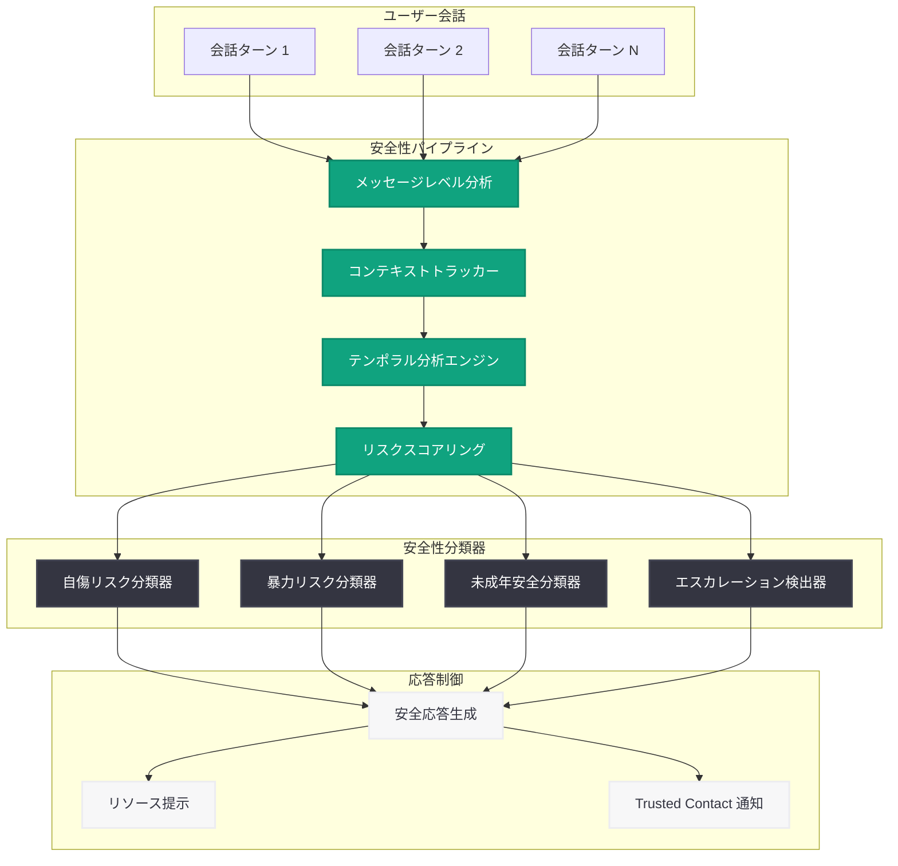

# ChatGPT のセンシティブな会話におけるコンテキスト認識の強化

## メタデータ

| 項目 | 内容 |
|------|------|
| 発表日 | 2026-05-14 |
| ソース | OpenAI News/Blog |
| カテゴリ | Safety |
| 公式リンク | https://openai.com/index/chatgpt-recognize-context-in-sensitive-conversations |

## 概要

OpenAI は、ChatGPT がセンシティブな会話においてコンテキスト (文脈) をより適切に認識できるよう、安全性システムの大幅なアップデートを発表した。従来の安全性検出が個々のメッセージを独立して評価していたのに対し、新システムでは会話全体の流れを分析し、時間経過に伴うリスクの変化を検出する能力を備えている。

この更新は、OpenAI が 2026 年前半に推進してきた一連の安全性強化施策の一環である。3 月の「Teen safety policies」、4 月の「Introducing child safety blueprint」および「Our commitment to community safety」、5 月 7 日の「Introducing Trusted Contact in ChatGPT」に続くものであり、特に会話の中で段階的にリスクが高まるケースへの対応力を向上させることを目的としている。

## 主な内容

### コンテキスト認識型の安全性検出

従来の ChatGPT の安全性システムは、主に個々のメッセージ単位でリスクを評価していた。しかし、実際のユーザーとの会話では、1 つ 1 つのメッセージは無害に見えても、会話全体を通して見るとリスクが段階的に高まるケースが存在する。

新システムでは以下の改善が行われた。

- **会話履歴全体の分析**: 直近のメッセージだけでなく、会話の開始時点からの文脈を考慮してリスク評価を行う
- **文脈依存型の閾値調整**: 会話の文脈に応じて、安全性判定の感度を動的に調整する
- **累積的なリスクシグナルの追跡**: 個別には軽微なシグナルでも、累積的に重大なリスクパターンを形成する場合を検出する

### 時間経過に伴うリスク検出

本アップデートの核心的な技術的進歩は、「temporal risk detection (時間的リスク検出)」の実装である。

- **エスカレーションパターンの認識**: ユーザーが徐々により懸念度の高いトピックへ移行するパターンを検出
- **会話ターンごとのリスクスコアリング**: 各会話ターンにおけるリスクレベルを記録し、上昇傾向を監視
- **閾値超過アラート**: リスクスコアが一定の閾値を超えた場合、適切な安全対応を発動

### 応答安全性の改善

リスクが検出された場合の ChatGPT の応答も改善されている。

- **段階的な対応**: リスクレベルに応じて、やんわりとした方向転換から、明確なリソース提示まで段階的に対応
- **共感的な応答**: ユーザーの状況を否定せず、適切なサポートリソースへの誘導を行う
- **Trusted Contact 機能との連携**: 5 月 7 日に発表された信頼できる連絡先への通知機能と統合し、深刻なケースでは外部サポートへの橋渡しを行う

### センシティブな会話の定義

本システムが対象とする「センシティブな会話」には、以下のようなカテゴリが含まれる。

- **自傷・自殺に関する話題**: 直接的な言及だけでなく、間接的な表現やほのめかしも検出対象
- **暴力的なコンテンツ**: 他者への危害を示唆する会話の流れ
- **精神的な危機状態**: 極度の孤立感、絶望感、無力感を示す会話パターン
- **未成年者の安全に関わるもの**: 子どもに対する潜在的なリスクを含む会話

## 技術的な詳細

### 会話ターン全体にわたるコンテキスト認識の仕組み

新しい安全性システムは、マルチターン会話分析に基づく階層的なアプローチを採用している。

**レイヤー 1 - メッセージレベル分析:**
従来通り、個々のメッセージに対するリスク評価を実施。明示的なポリシー違反を即座に検出する。

**レイヤー 2 - セッションレベル分析:**
会話セッション全体を通じたコンテキストウィンドウを維持し、以下の情報を追跡する。

- トピックの遷移パターン
- 感情的なトーンの変化
- リスク関連キーワードの出現頻度と密度
- ユーザーの応答パターン (回避的、エスカレーション的など)

**レイヤー 3 - テンポラル分析:**
時系列データとしてリスクシグナルを分析し、以下を実行する。

- リスクスコアの時系列トレンド分析
- エスカレーション速度の計測
- 過去の類似パターンとの照合

### 安全性分類器の改善

安全性分類器 (safety classifier) に対して以下の改善が施されている。

- **コンテキストウィンドウの拡張**: 分類器が参照できる会話履歴の範囲を拡大し、より長期的な文脈を考慮可能に
- **マルチシグナル統合**: 単一の指標ではなく、複数のリスクシグナルを統合的に評価するアンサンブル手法の採用
- **偽陽性の削減**: コンテキストを考慮することで、学術的な議論や支援目的の会話を誤検出するケースを削減
- **リアルタイム推論**: 会話の各ターンでリアルタイムにリスク評価を更新し、遅延なく対応を行う

## アーキテクチャ

## 開発者への影響

- **API 経由の安全性動作の変化**: ChatGPT API を利用しているアプリケーションにおいて、マルチターン会話での安全性応答がより文脈依存的になる可能性がある。会話履歴を適切に管理し、システムプロンプトで安全性に関する指示を明確にすることが推奨される
- **安全性フィルタリングの精度向上**: コンテキスト認識により偽陽性が削減されるため、正当な議論 (医療、心理学、安全教育など) がブロックされるケースが減少することが期待される
- **Trusted Contact API との統合検討**: 自社アプリケーションに ChatGPT を組み込んでいる場合、Trusted Contact 機能との連携を検討することで、ユーザー安全性をさらに向上できる
- **会話設計への影響**: チャットボットの会話フローを設計する際、安全性分類器がマルチターンのコンテキストを考慮する点を踏まえ、会話履歴の送信方法に注意が必要
- **ヘルスケア・メンタルヘルス分野への応用**: この安全性向上により、メンタルヘルスサポート系のアプリケーションでの ChatGPT 利用がより安全になり、導入障壁が低下する可能性がある
- **コンテンツポリシーへの影響なし**: 本アップデートは検出精度の向上であり、コンテンツポリシー自体の変更ではない。既存のアプリケーションの動作に大きな破壊的変更は想定されない

## 関連リンク

- [Helping ChatGPT better recognize context in sensitive conversations](https://openai.com/index/chatgpt-recognize-context-in-sensitive-conversations)
- [Introducing Trusted Contact in ChatGPT (2026-05-07)](https://openai.com/index/trusted-contact-in-chatgpt/)
- [Our commitment to community safety (2026-04-28)](https://openai.com/index/our-commitment-to-community-safety/)
- [Introducing child safety blueprint (2026-04-08)](https://openai.com/index/child-safety-blueprint/)
- [Teen safety policies (2026-03-24)](https://openai.com/index/teen-safety-policies/)
- [OpenAI Safety](https://openai.com/safety)

## まとめ

本アップデートは、ChatGPT の安全性システムにおけるパラダイムシフトを示すものである。従来の「個別メッセージ評価」から「会話全体のコンテキストを考慮した動的リスク評価」への進化により、段階的にリスクが高まるケースへの対応力が大幅に向上した。

特に重要なのは、時間経過に伴うリスクの変化 (temporal risk) を検出する能力の実装であり、これにより個別のメッセージでは検出困難だったエスカレーションパターンを早期に発見できるようになった。5 月 7 日に発表された Trusted Contact 機能との統合により、深刻なケースでは外部の信頼できる人物への通知も可能となり、多層的な安全性ネットワークが構築されている。

OpenAI は 2026 年を通じて安全性分野への投資を加速しており、本アップデートはその技術的な成熟を示す重要なマイルストーンである。
