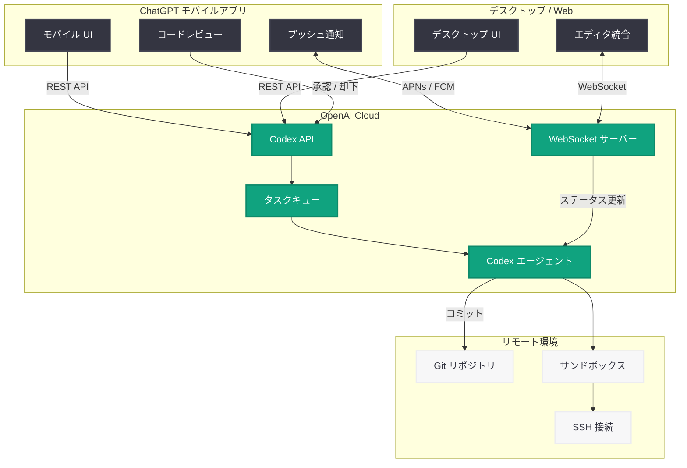

# Codex がモバイルに対応 — どこからでもコーディングタスクを監視・操作可能に

## メタデータ

| 項目 | 内容 |
|------|------|
| 発表日 | 2026-05-14 |
| ソース | OpenAI News/Blog |
| カテゴリ | Product |
| 公式リンク | https://openai.com/index/work-with-codex-from-anywhere |

## 概要

OpenAI は、クラウドベースのコーディングエージェント Codex を ChatGPT モバイルアプリから利用可能にするアップデートを発表した。これにより、開発者はスマートフォンやタブレットから実行中の Codex タスクをリアルタイムで監視し、追加の指示を与え、コード変更を承認できるようになる。

Codex は現在 400 万人以上の週間アクティブユーザー (WAU) を抱えており、本アップデートは「どこからでも Codex を使う」というビジョンの実現に向けた重要なステップである。デスクトップに縛られることなく、移動中や外出先からでも開発ワークフローを継続できる環境が整備された。

## 主な内容

### モバイルアクセス機能

ChatGPT モバイルアプリ (iOS / Android) から Codex の全機能にアクセスできるようになった。主な機能は以下の通り。

- **タスクの開始**: モバイルから新規コーディングタスクを Codex に依頼
- **進行状況の確認**: 実行中のタスクのステータスをリアルタイムで表示
- **コード差分の確認**: 生成されたコード変更をモバイル画面上でレビュー
- **承認・却下**: コード変更の適用を承認または拒否する操作

### リアルタイム監視

Codex タスクの実行状況をリアルタイムで把握するための通知・監視機能が統合された。

- **プッシュ通知**: タスクの完了、エラー発生、承認待ちの状態変更をプッシュ通知で受信
- **ライブステータス**: タスクの進行度合い、現在の処理内容をリアルタイムで確認
- **ログストリーミング**: Codex エージェントが実行しているコマンドや出力をストリームで表示
- **複数タスクの同時監視**: 並行して実行されている複数のタスクを一覧で管理

### タスクのステアリングと承認

モバイルから実行中のタスクに対して介入・指示を行うワークフローが実装された。

- **追加指示の送信**: 実行中のタスクに対して自然言語で追加の指示や修正依頼を送信
- **方向性の変更**: タスクの途中で優先事項やアプローチの変更を指示
- **段階的承認**: 大規模な変更を段階的にレビューし、部分的に承認する機能
- **ロールバック**: 承認済みの変更を取り消し、以前の状態に戻す操作

### クロスデバイス体験

デスクトップとモバイル間でシームレスな作業継続を実現する設計。

- **セッション同期**: デスクトップで開始したタスクをモバイルで継続監視、またはその逆
- **統一されたタスク履歴**: すべてのデバイスで同一のタスク履歴とコンテキストを共有
- **デバイス間ハンドオフ**: 片方のデバイスで中断した操作をもう一方でシームレスに再開
- **通知の一元管理**: どのデバイスで確認しても通知状態が同期

### リモート環境サポート

リモート開発環境との統合により、場所を問わない開発体験を強化。

- **リモートリポジトリ接続**: GitHub、GitLab などのリモートリポジトリと直接連携 (2026 年 4 月 22 日発表の Codex リモート接続機能と連動)
- **クラウド開発環境**: GitHub Codespaces、AWS Cloud9 などのクラウド IDE 環境からタスクを実行
- **SSH 経由の接続**: リモートサーバー上の開発環境に SSH 経由でアクセスし、Codex タスクを実行
- **環境設定の永続化**: リモート環境の設定やカスタマイズがセッション間で保持

## 技術的な詳細

### モバイル統合アーキテクチャ

Codex のモバイル対応は、既存の ChatGPT モバイルアプリの拡張として実装されている。

- **統一 API レイヤー**: デスクトップ版と同一の Codex API エンドポイントを使用し、モバイルクライアントからのリクエストを処理
- **WebSocket 接続**: リアルタイムのタスク状態更新にはWebSocket ベースの双方向通信を採用
- **オフライン対応**: ネットワーク切断時にもタスク状態のキャッシュを保持し、再接続時に同期

### リアルタイム通知

- **APNs / FCM 統合**: iOS の Apple Push Notification service (APNs) および Android の Firebase Cloud Messaging (FCM) を通じてプッシュ通知を配信
- **イベント駆動アーキテクチャ**: タスクのステート変更がイベントとして発行され、登録されたデバイスに即座に通知
- **通知のカスタマイズ**: タスクの種類や重要度に応じて通知の粒度を設定可能

### モバイルでの承認ワークフロー

- **差分ビューアー**: モバイル画面に最適化されたコード差分表示 (行単位ハイライト、スワイプ操作対応)
- **ワンタップ承認**: シンプルな変更は 1 タップで承認可能
- **インライン コメント**: コード変更に対してインラインでコメントを追加し、修正を依頼
- **バッチ承認**: 複数ファイルにまたがる変更をまとめて承認する機能

## アーキテクチャ

## 開発者への影響

- **開発の柔軟性向上**: デスクトップの前にいなくても Codex タスクを管理できるため、移動中や会議の合間にもワークフローを維持できる
- **レビューサイクルの短縮**: モバイルからの即時承認により、コード変更が適用されるまでの待ち時間が大幅に短縮される
- **チーム開発の効率化**: 外出中のメンバーもタスクの承認やフィードバックを即座に行えるため、チーム全体の開発速度が向上する
- **リモートワークとの親和性**: リモート開発環境との統合により、場所やデバイスに依存しない開発体験が実現する
- **CI/CD パイプラインとの連携**: Codex タスクの承認をモバイルから行うことで、デプロイメントパイプラインの承認ゲートを場所を問わず通過できる
- **Windows サンドボックスとの組み合わせ**: 2026 年 5 月 13 日に発表された Windows サンドボックスサポートと組み合わせることで、あらゆるプラットフォームでの安全なコード実行が可能に

## 関連リンク

- [Work with Codex from anywhere (公式発表)](https://openai.com/index/work-with-codex-from-anywhere)
- [Codex remote connections (2026-04-22)](https://openai.com/index/codex-remote-connections)
- [Codex for almost everything (2026-04-16)](https://openai.com/index/codex-for-almost-everything)
- [Codex Windows sandbox support (2026-05-13)](https://openai.com/index/codex-windows-sandbox)
- [OpenAI News](https://openai.com/news)
- [ChatGPT モバイルアプリ (iOS)](https://apps.apple.com/app/chatgpt/id6448311069)
- [ChatGPT モバイルアプリ (Android)](https://play.google.com/store/apps/details?id=com.openai.chatgpt)

## まとめ

OpenAI は Codex のモバイル対応により、「どこからでもコーディング」という開発者体験の新たな段階を実現した。400 万人以上の WAU を持つ Codex がモバイルからも完全に操作可能になったことで、開発者はデスクトップに縛られることなく、リアルタイムでタスクを監視し、方向性を調整し、コード変更を承認できる。

この機能は、4 月 22 日のリモート接続機能、4 月 16 日の汎用化アップデート、5 月 13 日の Windows サンドボックスサポートと合わせて、Codex を場所やデバイス、プラットフォームに依存しないユニバーサルな開発アシスタントへと進化させる一連の取り組みの一環である。開発チームにとっては、レビューサイクルの短縮とワークフローの継続性向上という具体的なメリットをもたらす重要なアップデートである。
