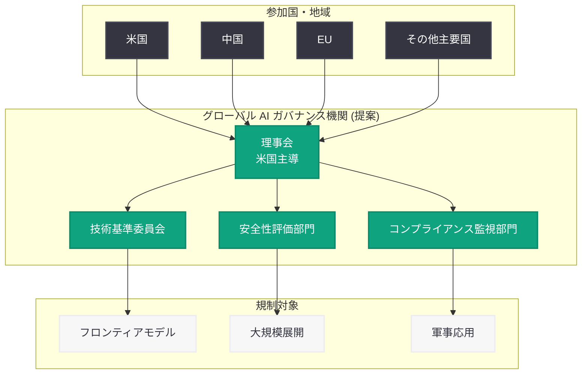

# OpenAI、米国主導のグローバル AI ガバナンス機関の創設を支持 — 中国の参加も含む

## メタデータ

| 項目 | 内容 |
|------|------|
| 発表日 | 2026-05-14 |
| ソース | Bloomberg, Fox Business, CNBC TV18, Let's Data Science |
| カテゴリ | ポリシー / ガバナンス |
| 公式リンク | https://openai.com/news |

## 概要

OpenAI は、米国が主導するグローバル AI ガバナンス機関の創設を提案し、その構成メンバーに中国を含めるべきだと主張している。この提案は、AI 技術の急速な発展に伴う国際的な規制枠組みの必要性を反映したものであり、従来の対立的な地政学的姿勢からの転換を示唆する重要な動きである。

国際原子力機関 (IAEA) をモデルとした機関の設立を念頭に置いており、AI の安全性と利益を国際的に管理するための枠組みを構築することを目指している。OpenAI は 2026 年に入ってから政策分野で積極的な活動を展開しており、本提案はその一連の取り組みの中で最も国際的な影響力を持つものと位置づけられる。

## 主な内容

### 提案の詳細

OpenAI が構想するグローバル AI ガバナンス機関は、以下の特徴を持つ。

- **米国主導の組織設計**: 米国がリーダーシップを発揮し、機関の方向性を定める
- **包括的なメンバーシップ**: 中国を含む主要 AI 開発国が参加
- **IAEA モデルの踏襲**: 核エネルギー管理で実績のある国際機関の枠組みを AI に応用
- **安全性基準の国際標準化**: AI モデルの開発・展開に関する共通ルールの策定
- **監視・検証メカニズム**: AI システムの能力と安全性に関する国際的な評価体制

この提案は、OpenAI が 2026 年 3 月 31 日に発表した「Accelerating the next phase of AI」や、4 月 6 日の「Industrial policy intelligence age」、4 月 26 日の「Our principles」、4 月 29 日の「Cybersecurity intelligence age」といった一連の政策提言の延長線上にある。

### 中国参加の意義

中国の参加を明示的に含める点は、本提案の最も注目すべき要素である。

- **地政学的転換**: AI を巡る米中対立の構図から、協調的なガバナンスへの移行を志向
- **技術的現実の認識**: 中国が AI 研究開発において世界的なリーダーの一つであることを前提とした枠組み
- **安全性の国際化**: AI の安全性問題は一国では解決できないという認識に基づく
- **先例への準拠**: 核不拡散条約 (NPT) や IAEA が核保有国を含む枠組みとして機能した実績

従来、米国の AI 政策は中国を競争相手として位置づけ、半導体輸出規制などの対立的措置を講じてきた。OpenAI の提案は、競争と協調を並立させる新たなアプローチを示している。

### 既存の枠組みとの比較

現在、AI ガバナンスに関する国際的な取り組みは複数存在するが、いずれも拘束力や包括性に課題がある。

| 既存枠組み | 特徴 | 限界 |
|-----------|------|------|
| AI Safety Summit (英国主導) | 各国の自主的参加 | 拘束力なし |
| EU AI Act | 法的拘束力あり | EU 域内のみ適用 |
| G7 広島 AI プロセス | 先進国間の協調 | 中国・グローバルサウス不参加 |
| OECD AI 原則 | 加盟国のガイドライン | 実施メカニズムが弱い |
| 国連 AI 諮問機関 | 包括的な参加 | 勧告のみ、実行力なし |

OpenAI の提案は、IAEA のように査察権限と技術標準の策定権限を持つ、実効性のある機関を目指している点で既存枠組みとは異なる。

### 地政学的コンテキスト

本提案は、以下の国際情勢を背景としている。

- **Musk v Altman 裁判の進行中**: OpenAI の組織構造と使命に関する法的紛争が継続しており、OpenAI は公益性を示す必要性に迫られている
- **AI 軍拡競争の懸念**: 各国が AI の軍事応用を加速させる中、国際的な管理体制の必要性が高まっている
- **米中半導体規制**: 米国による対中半導体輸出規制が続く中、AI 分野での協調の余地を探る動き
- **OpenAI の営利化転換**: OpenAI が完全営利企業への転換を進める中、社会的責任を示す戦略的意図

## アーキテクチャ

## 開発者への影響

グローバル AI ガバナンス機関が実現した場合、AI 開発者・企業に対して以下の影響が想定される。

- **国際安全性基準への準拠**: フロンティアモデルの開発に際し、国際的な安全性基準を満たすことが求められる可能性がある。これにより、モデルのリリース前に国際的な評価プロセスを経る必要が生じる
- **API アクセスの地域制限の変化**: 統一的なガバナンス枠組みが確立されれば、現在の地域ごとに異なる規制による API アクセス制限が整理され、より一貫した国際基準に基づくアクセス管理が実現する可能性がある
- **コンプライアンスコストの増加**: 国際的な報告義務、監査対応、安全性テストの実施など、新たなコンプライアンス負担が発生する可能性
- **オープンソース AI への影響**: ガバナンス機関がオープンソースモデルの配布にも基準を設ける場合、オープンソース AI コミュニティの活動に制約が加わる可能性
- **研究開発の透明性要件**: フロンティアモデルの能力に関する情報開示が求められ、研究開発プロセスの透明性が必要になる可能性
- **国際共同研究の促進**: 共通のガバナンス枠組みにより、国際的な AI 研究協力が促進される側面もある

## 関連リンク

- [OpenAI News](https://openai.com/news)
- [OpenAI - Our Principles](https://openai.com/index/our-principles/)
- [OpenAI - Industrial Policy Intelligence Age](https://openai.com/index/industrial-policy-intelligence-age/)
- [OpenAI - Cybersecurity Intelligence Age](https://openai.com/index/cybersecurity-intelligence-age/)
- [OpenAI - Accelerating the Next Phase of AI](https://openai.com/index/accelerating-the-next-phase-of-ai/)
- [Bloomberg - OpenAI Floats Idea of Global AI Governance Body](https://www.bloomberg.com/news/)
- [IAEA - International Atomic Energy Agency](https://www.iaea.org/)

## まとめ

OpenAI によるグローバル AI ガバナンス機関の創設提案は、AI 技術の国際管理に関する重要な転換点を示している。米国主導でありながら中国の参加を含めるという枠組みは、IAEA モデルを AI 分野に応用する試みであり、従来の対立的な地政学的姿勢からの脱却を意味する。

この提案は、OpenAI が 2026 年前半に展開してきた一連の政策活動の集大成であり、営利化転換と並行して社会的責任を示す戦略的な動きでもある。開発者にとっては、将来的な国際基準への準拠が求められる可能性があり、コンプライアンス対応の準備が重要になる。

実現には各国の政治的合意が必要であり、特に米中関係の動向や、既存の国際枠組みとの整合性が課題となる。しかし、AI のフロンティアモデルが社会に与える影響が増大する中、何らかの国際的な管理体制の構築は避けられない方向にあり、OpenAI の提案はその議論を加速させる触媒となることが期待される。
